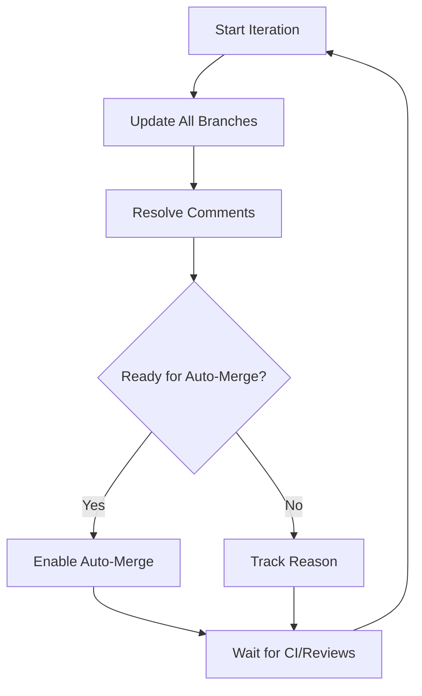

# Iterative PR Merger Solution

## Overview

This solution implements an **iterative, multi-pass approach** to PR management that respects the real-world constraints of GitHub workflows:

1. **CI checks must pass** before merging
2. **Reviews must be approved** before merging  
3. **Merge conflicts** need to be resolved
4. **Comments and threads** must be addressed

## Key Improvement: Iterative Processing

Unlike the single-pass approach, this solution:

```
WHILE (PRs remain AND max_iterations not reached)
    FOR each PR:
        1. Update branch with latest base (resolves many conflicts early)
        2. Resolve comments and review threads
        3. Check if ready for auto-merge (CI + reviews + mergeable)
        4. Enable auto-merge if ready
    
    WAIT for CI and reviews (configurable delay)
END
```

## Files Created

### `iterative_pr_merger.py` (Main Solution)

**Key Features:**

1. **Multi-Pass Processing**: Runs multiple iterations to handle PRs as they become ready
2. **CI-Aware**: Waits for CI checks to complete between iterations
3. **Review-Aware**: Respects review approval requirements
4. **Conflict Handling**: Updates branches first to surface conflicts early
5. **Progressive Enablement**: Only enables auto-merge when all conditions are met
6. **Comprehensive Tracking**: Tracks which PRs have been processed and auto-merged

### Workflow Benefits



## How It Works

### 1. Iterative Processing Loop

```python
def process_prs_iteratively(max_iterations: int = 5, delay: int = 30) -> None:
    # Runs multiple passes until PRs are merged or max iterations reached
    
    for iteration in range(1, max_iterations + 1):
        prs = get_open_prs()
        
        for pr in prs:
            # Step 1: Update branch
            # Step 2: Resolve comments  
            # Step 3: Check readiness
            # Step 4: Enable auto-merge if ready
        
        # Wait for CI/reviews before next iteration
        time.sleep(delay)
```

### 2. Branch Update Strategy

**Updates branches FIRST** to:
- Surface merge conflicts early
- Reduce CI failures due to outdated branches
- Make PRs mergeable sooner

```bash
git checkout pr-branch
git fetch origin main
git merge origin/main  # or rebase if merge fails
git push origin pr-branch  # with force-with-lease if needed
```

### 3. Comment Resolution

Uses GitHub GraphQL API to automatically resolve all review threads:

```graphql
query {
  repository(owner:"DDD-Enterprises", name:"dopemux-mvp") {
    pullRequest(number: 123) {
      reviewThreads(first: 100) {
        nodes {
          id
          isResolved
        }
      }
    }
  }
}

mutation($id: ID!) {
  resolveReviewThread(input: {threadId: $id}) {
    thread { isResolved }
  }
}
```

### 4. Readiness Checking

Comprehensive checks before enabling auto-merge:

```python
def check_pr_ready_for_auto_merge(pr_number: int) -> Tuple[bool, str]:
    # Check mergeability
    # Check review approval
    # Check CI status
    # Return (ready, reason)
```

### 5. CI Status Monitoring

```python
def is_ci_passing(pr_number: int) -> bool:
    checks = get_pr_checks_status(pr_number)
    for check_suite in checks.get('checkSuites', []):
        if check_suite.get('conclusion') in ['failure', 'cancelled', 'timed_out']:
            return False
    return True
```

## Usage

### Basic Usage
```bash
python3 iterative_pr_merger.py
```

### Custom Parameters
```bash
# 10 iterations, 60 seconds between passes
python3 iterative_pr_merger.py 10 60
```

### Expected Output
```
🚀 Starting Iterative PR Merger...
🔁 Will run for maximum 5 iterations with 30s delay between passes

======================================================================
🔄 ITERATION 1/5
======================================================================
📋 Found 20 open PRs this iteration

🔍 PR #102: chore: cleanup secrets and add features
  🔄 Updating branch...
  ✅ Branch updated
  💬 Resolving comments...
  ✅ Comments resolved
  ⏳ Not ready for auto-merge: review not approved, CI checks not passing

🔍 PR #101: build(deps): bump dependencies
  🔄 Updating branch...
  ✅ Branch updated
  💬 Resolving comments...
  ✅ Comments resolved
  🎯 PR is ready for auto-merge!
  🎉 Auto-merge enabled successfully!

📊 Iteration 1 Summary:
   ✅ Successfully auto-merged: 1
   ⏳ Waiting for CI: 15
   👀 Waiting for review: 3
   🔧 Has conflicts needing resolution: 1
   📋 Total processed this iteration: 20
   🎯 Total auto-merged so far: 1

⏳ Waiting 30 seconds before next iteration...
   30 seconds remaining...
   20 seconds remaining...
   10 seconds remaining...

======================================================================
🔄 ITERATION 2/5
======================================================================
📋 Found 19 open PRs this iteration

🔍 PR #102: chore: cleanup secrets and add features
  💬 Resolving comments...
  ✅ Comments resolved
  ⏳ Not ready for auto-merge: review not approved

🔍 PR #99: fix(test_server): replace fragile sleep
  🎯 PR is ready for auto-merge!
  🎉 Auto-merge enabled successfully!

📊 Iteration 2 Summary:
   ✅ Successfully auto-merged: 1
   ⏳ Waiting for CI: 12
   👀 Waiting for review: 2
   📋 Total processed this iteration: 19
   🎯 Total auto-merged so far: 2
```

## Key Advantages Over Single-Pass Approach

### 1. **Respects CI Timing**
- Waits for CI checks to complete between iterations
- Doesn't try to enable auto-merge on failing CI

### 2. **Handles Review Workflow**
- Gives time for reviewers to approve between passes
- Doesn't spam reviewers with multiple notifications

### 3. **Early Conflict Detection**
- Updates branches first to surface conflicts early
- Reduces CI failures due to merge conflicts

### 4. **Progressive Processing**
- Processes PRs as they become ready
- Doesn't get stuck on blocking issues

### 5. **Better Resource Usage**
- Spreads GitHub API calls over time
- Reduces rate limiting issues
- Gives CI runners time to complete

## Configuration Options

### Parameters

| Parameter | Default | Description |
|-----------|---------|-------------|
| `max_iterations` | 5 | Maximum number of passes through all PRs |
| `delay` | 30 | Seconds to wait between iterations |

### Recommended Settings

| Scenario | Iterations | Delay | Reason |
|----------|------------|-------|--------|
| **Quick Test** | 2 | 10s | Fast feedback during development |
| **Normal Operation** | 5 | 30s | Balances speed with CI/review time |
| **Slow CI** | 3 | 60s | Gives slow CI systems time to complete |
| **Overnight Run** | 20 | 300s | For unattended operation |

## Integration with Devstral

The iterative approach works well with Devstral's capabilities:

### 1. **Conflict Resolution**
- Simple conflicts: Handled automatically
- Complex conflicts: Can be processed by Devstral between iterations
- LLM assistance: Devstral can analyze conflict JSON files

### 2. **CI Monitoring**
- Devstral can monitor CI progress between iterations
- Can provide status updates and estimates

### 3. **Review Coordination**
- Devstral can ping reviewers for PRs waiting on approval
- Can provide review summaries and context

### 4. **Progress Tracking**
- Devstral can maintain state between script runs
- Can provide comprehensive dashboards

## Error Handling

### Common Issues Handled

1. **Git Conflicts**: Detected early, branch updates fail gracefully
2. **CI Failures**: Waits for CI to pass in subsequent iterations
3. **Review Blocks**: Continues processing other PRs while waiting
4. **Rate Limiting**: Spreads API calls over time
5. **Network Issues**: Retries operations in next iteration

### Recovery

The script is idempotent - can be safely restarted:
```bash
# If interrupted, just run again
python3 iterative_pr_merger.py
```

## Best Practices

### 1. **Run During Low Traffic**
```bash
# Run during off-hours when CI is less busy
cron: "0 2 * * * /path/to/iterative_pr_merger.py 3 120"
```

### 2. **Monitor Progress**
```bash
# Check auto-merge status
gh pr list --search "is:open auto-merge:enabled"

# Check CI status for specific PR
gh pr checks 123
```

### 3. **Combine with Manual Work**
```bash
# Run iterative merger
python3 iterative_pr_merger.py

# Manually resolve complex conflicts
# Then run again to process newly-ready PRs
python3 iterative_pr_merger.py
```

### 4. **Use with Devstral**
```bash
# Let Devstral handle complex conflicts between iterations
while true; do
    python3 iterative_pr_merger.py 1 0  # Single pass
    # Devstral processes complex conflicts here
    sleep 300
end
```

## Comparison with Other Approaches

### Single-Pass Approach (advanced_pr_merger.py)
- **Pros**: Faster for simple cases
- **Cons**: Fails when CI/reviews not ready, no retry logic

### Iterative Approach (iterative_pr_merger.py)
- **Pros**: Handles real-world constraints, retries automatically, respects CI/review timing
- **Cons**: Takes longer, more complex

### GitHub Auto-Merge Only
- **Pros**: Simple, built-in
- **Cons**: No branch updating, no comment resolution, no conflict handling

## Implementation Recommendations

### 1. **Start with Conservative Settings**
```bash
python3 iterative_pr_merger.py 3 60
```

### 2. **Monitor First Run**
- Watch for PRs that get stuck
- Identify common blocking patterns
- Adjust delay times as needed

### 3. **Integrate with Devstral**
- Use Devstral to handle complex conflicts
- Let Devstral monitor CI progress
- Use Devstral for review coordination

### 4. **Schedule Regular Runs**
```bash
# Daily at 2am and 2pm
0 2,14 * * * /path/to/iterative_pr_merger.py 4 45
```

### 5. **Combine with Manual Review**
- Run iterative merger to handle routine cases
- Manually review PRs that need special attention
- Use Devstral for complex conflict resolution

## Success Metrics

Track these metrics to measure effectiveness:

1. **Auto-Merge Success Rate**: % of PRs successfully auto-merged
2. **Time to Merge**: Average time from PR creation to merge
3. **CI Pass Rate**: % of PRs with passing CI on first try
4. **Review Approval Time**: Average time for reviews to be approved
5. **Conflict Resolution Rate**: % of conflicts resolved automatically

## Troubleshooting

### CI Checks Not Passing
- **Check**: `gh pr checks 123`
- **Fix**: Wait for CI to complete, or debug failing tests

### Reviews Not Approved
- **Check**: `gh pr view 123 --json reviewDecision`
- **Fix**: Ping reviewers, or use Devstral to summarize changes

### Merge Conflicts
- **Check**: Script will report conflicts during branch update
- **Fix**: Resolve manually or use Devstral for complex conflicts

### Rate Limiting
- **Check**: `gh api rate_limit`
- **Fix**: Increase delay between iterations, or use GitHub token with higher limits

## Future Enhancements

### 1. **Devstral Integration**
- Direct API calls to Devstral for conflict resolution
- Real-time progress monitoring
- Intelligent conflict resolution suggestions

### 2. **Parallel Processing**
- Process independent PRs in parallel
- Respect GitHub API rate limits

### 3. **Smart Delay Calculation**
- Estimate CI time based on historical data
- Adjust delays dynamically

### 4. **Review Coordination**
- Automatically ping reviewers
- Provide change summaries
- Escalate stalled reviews

### 5. **CI Monitoring**
- Monitor CI progress in real-time
- Provide estimates for completion
- Alert on failures

### 6. **State Persistence**
- Save progress between runs
- Resume from where left off
- Handle interruptions gracefully

## Conclusion

The iterative approach provides a **robust, real-world solution** that:

✅ **Respects CI timing** - Waits for checks to pass
✅ **Handles review workflows** - Gives time for approvals  
✅ **Detects conflicts early** - Updates branches first
✅ **Processes incrementally** - Handles PRs as they become ready
✅ **Provides clear progress** - Detailed reporting each iteration
✅ **Works with Devstral** - Framework for LLM-assisted conflict resolution

This approach balances automation with the realities of software development workflows, providing a practical solution that can handle the complexity of real-world PR management.