# Prompt 4 Benchmark System Architecture

## 1. Executive summary

This document defines the implementation architecture for the Repo Truth Extractor benchmark system that should follow Prompt 3.5.

The canonical unit remains `benchmark_case_attempt`. The canonical proof store is an immutable evidence bundle per benchmark run plus per-attempt evidence manifests. The canonical query layer is a relational index over those immutable bundles. Profile synthesis stays archetype-first, surface-isolated, and control-anchor-relative. Production promotion stays human-reviewed.

| Decision | Design status | Governance | Evidence class | Implementation consequence |
|---|---|---|---|---|
| `benchmark_case_attempt` is the primary benchmark unit | `RECOMMENDED` | `AUTO` | `BENCHMARK_DERIVED` | All scoring, comparison, and explainability start from attempt records |
| Rollups remain `case attempt -> case-set -> archetype -> profile -> portfolio view` | `RECOMMENDED` | `AUTO` | `BENCHMARK_DERIVED` | Derived rollups never replace attempt evidence |
| Runtime-v5 and contract-v4 remain separate fields everywhere | `RECOMMENDED` | `AUTO` | `MIXED_EVIDENCE` | No rollup may mix attempts from different runtime or contract snapshots |
| Surface isolation stays mandatory across direct, routed, chat, and local/open-weight lanes | `RECOMMENDED` | `AUTO` | `MIXED_EVIDENCE` | Control anchors, rollups, and recommendations are keyed by surface class |
| Metadata remains intake/governance support, not suitability proof | `RECOMMENDED` | `AUTO` | `METADATA_ONLY` | Metadata can admit a candidate to smoke, but cannot place it into a production profile |
| Production promotion remains operator-reviewed | `RECOMMENDED` | `HUMAN_REVIEW_REQUIRED` | `MIXED_EVIDENCE` | Synthesis emits recommendations for review, not self-executing promotions |
| Local/open-weight routes remain confined to `experimental_lab` | `RECOMMENDED` | `NEVER_AUTO` | `MIXED_EVIDENCE` | Even strong benchmark evidence cannot auto-promote them beyond experimental status |
| OpenClaw remains reviewer/propose-only by default | `RECOMMENDED` | `HUMAN_REVIEW_REQUIRED` | `GOVERNANCE_DERIVED` | Overlay support is optional and non-authoritative |

## 2. System goals and non-goals

### Goals

| Goal | Design status | Evidence class | Notes |
|---|---|---|---|
| Add a new model or route quickly without changing benchmark logic | `RECOMMENDED` | `MIXED_EVIDENCE` | Achieved through versioned route records, intake records, and reusable case-sets |
| Run fixed benchmark cases against pinned routes and pinned contracts | `RECOMMENDED` | `BENCHMARK_DERIVED` | Case inputs, contract snapshots, and retry policy are frozen per attempt |
| Measure contract validity, task success, cost, latency, stability, and governance posture separately | `RECOMMENDED` | `MIXED_EVIDENCE` | No blended score may hide structural failure |
| Store durable, explainable evidence for every recommendation and rejection | `RECOMMENDED` | `MIXED_EVIDENCE` | Evidence bundles are immutable and hash-addressed |
| Compare candidates against fixed control anchors per archetype and surface | `RECOMMENDED` | `BENCHMARK_DERIVED` | `openai/gpt-4.1-mini` and `openai/gpt-4.1` stay first-class anchors |
| Synthesize profile recommendations by archetype | `RECOMMENDED` | `MIXED_EVIDENCE` | Output is a profile-fit matrix, not a universal winner table |
| Preserve operator control and explicit governance gates | `RECOMMENDED` | `GOVERNANCE_DERIVED` | Promotion, policy changes, and local/open graduation remain gated |

### Non-goals

| Non-goal | Design status | Reason |
|---|---|---|
| Re-running Prompt 1, Prompt 2, Prompt 3, or Prompt 3.5 | `NOT_RECOMMENDED` | Those decisions are already part of the authority stack |
| Rebuilding the model registry | `NOT_RECOMMENDED` | The benchmark system imports registry truth and tracks candidate intake separately |
| Selecting a single best model overall | `NOT_RECOMMENDED` | Contradicts the archetype-first design and surface isolation |
| Treating whole-repo runs as the primary benchmark unit | `NOT_RECOMMENDED` | Too many confounders collapse together |
| Mixing chat/subscription results with API results in the same family | `NOT_RECOMMENDED` | Violates surface isolation |
| Letting operational modifiers override contract failure | `NOT_RECOMMENDED` | Violates gate-first scoring |
| Treating legacy prompt trees as equal benchmark surfaces | `NOT_RECOMMENDED` | Legacy remains migration-debt and invocation-truth context only |

## 3. Benchmark harness architecture

### 3.1 Top-level component graph

```mermaid
flowchart LR
  A["Case Registry"] --> B["Case-Set Runner"]
  B --> C["Attempt Executor Adapters"]
  C --> D["Validator Suite"]
  D --> E["Attempt Scorer"]
  E --> F["Evidence Bundle Writer"]
  F --> G["Rollup Engine"]
  G --> H["Regression Comparator"]
  H --> I["Profile Synthesis Engine"]
  I --> J["Governance Packet"]
```



### 3.2 Harness components

| Component | Design status | Canonical writer? | Evidence class | Responsibilities |
|---|---|---|---|---|
| Case registry | `RECOMMENDED` | yes | `MIXED_EVIDENCE` | Stores frozen case definitions, prompt-inventory references, input bundles, golden evaluators, surface bindings, and case-set membership |
| Case-set runner | `RECOMMENDED` | yes | `BENCHMARK_DERIVED` | Expands a requested benchmark stage into concrete candidate + control attempts |
| Attempt executor adapters | `RECOMMENDED` | yes | `BENCHMARK_DERIVED` | Invoke prescan, runtime-v5 phase cases, `phase_s`, and FL_INT through pinned executors |
| Validator suite | `RECOMMENDED` | yes | `BENCHMARK_DERIVED` | Applies the right contract validator set per case and records validator strength |
| Scoring pipeline | `RECOMMENDED` | yes | `BENCHMARK_DERIVED` | Computes contract gate, archetype task score, operational modifiers, and control deltas |
| Evidence bundle writer | `RECOMMENDED` | yes | `MIXED_EVIDENCE` | Persists immutable manifests, hashes, route traces, validator results, outputs, and explanations |
| Rollup engine | `RECOMMENDED` | derived only | `BENCHMARK_DERIVED` | Produces case-set, archetype, profile, and portfolio rollups from attempts |
| Regression comparator | `RECOMMENDED` | derived only | `BENCHMARK_DERIVED` | Compares fresh rollups to prior fresh baselines and control anchors |
| Profile synthesis engine | `RECOMMENDED` | derived only | `MIXED_EVIDENCE` | Produces archetype-scoped profile-fit results and recommendation packets |
| Governance packet builder | `RECOMMENDED` | yes | `MIXED_EVIDENCE` | Packages candidate recommendation, failed gates, caveats, and required review actions |

### 3.3 Recommended module layout

| Path | Design status | Purpose |
|---|---|---|
| `services/repo-truth-extractor/benchmarking/registry/` | `RECOMMENDED` | Case manifests, case-set manifests, archetype policies, profile policies, retry policies |
| `services/repo-truth-extractor/benchmarking/executors/` | `RECOMMENDED` | Adapters for `run_prescan.py`, `run_extraction_v5.py`, `phase_s`, and `run_fl_int.py` |
| `services/repo-truth-extractor/benchmarking/validators/` | `RECOMMENDED` | Validator-suite wrappers, packaging validators, phase-s partial validators |
| `services/repo-truth-extractor/benchmarking/scoring/` | `RECOMMENDED` | Contract gate evaluation, archetype rubrics, operational modifier calculators, control-delta logic |
| `services/repo-truth-extractor/benchmarking/storage/` | `RECOMMENDED` | SQLite index writer, bundle manifest writer, hash utilities |
| `services/repo-truth-extractor/benchmarking/synthesis/` | `RECOMMENDED` | Profile-fit matrix, recommendation state engine, regression comparison |
| `services/repo-truth-extractor/benchmarking/reporting/` | `RECOMMENDED` | Operator JSON/Markdown views and evidence-link rendering |

### 3.4 Execution flow

| Step | Design status | Governance | Output |
|---|---|---|---|
| Resolve benchmark stage to one or more case-sets | `RECOMMENDED` | `AUTO` | `CASESET_PLAN.json` |
| Expand each case-set into candidate routes plus required control anchors | `RECOMMENDED` | `AUTO` | `ATTEMPT_PLAN.json` |
| Snapshot runtime, contract, route, validator, and policy versions | `RECOMMENDED` | `AUTO` | `SNAPSHOT_MANIFEST.json` |
| Execute each attempt through the surface-specific adapter | `RECOMMENDED` | `AUTO` | raw output refs plus `ROUTE_TRACE.json` |
| Run validator suite and golden evaluator | `RECOMMENDED` | `AUTO` | `VALIDATOR_RESULTS.json`, `TASK_EVAL.json` |
| Score the attempt and compute control deltas | `RECOMMENDED` | `AUTO` | `ATTEMPT_SUMMARY.json`, `CONTROL_DELTA.json` |
| Write immutable evidence bundle | `RECOMMENDED` | `AUTO` | `EVIDENCE_MANIFEST.json` |
| Generate rollups and regression comparisons | `RECOMMENDED` | `AUTO` | rollup artifacts under `rollups/` |
| Synthesize profile-fit outputs and governance packets | `RECOMMENDED` | `SEMI_AUTO` | `PROFILE_FIT_MATRIX.json`, `PROMOTION_RECOMMENDATIONS.json` |

### 3.5 Runtime-v5 / contract-v4 separation

| Requirement | Design status | Implementation rule |
|---|---|---|
| Store runtime version separately from contract version | `RECOMMENDED` | Every attempt stores `runtime_version`, `contract_version`, `contract_snapshot_id`, and `validator_suite_id` |
| Prevent mixed rollups across runtime/contract snapshots | `RECOMMENDED` | Rollup grouping key includes runtime version, contract snapshot hash, validator suite hash, case-set version, and retry policy |
| Preserve the current runtime authority | `RECOMMENDED` | Runtime-phase attempts call `run_extraction_v5.py` or extracted execution helpers rather than parallel shadow logic |
| Preserve contract-v4 authority | `RECOMMENDED` | Contract snapshots include hashes of `promptset.yaml`, `artifacts.yaml`, `model_map.yaml`, and relevant registries/schemas |

### 3.6 Retry policy

| Rule | Design status | Governance | Notes |
|---|---|---|---|
| Retry policy is versioned and stored explicitly per attempt | `RECOMMENDED` | `AUTO` | No hidden executor defaults |
| Comparative runs must use the same retry policy for candidate and anchors | `RECOMMENDED` | `AUTO` | Required for fair deltas |
| Structural failures should prefer route escalation over same-route repetition | `RECOMMENDED` | `AUTO` | Mirrors current ladder behavior in `run_extraction_v5.py` |
| Same-route retries are limited to transient transport failures and must be counted separately | `RECOMMENDED_WITH_CAVEAT` | `AUTO` | Useful for latency and provider degradation measurement |
| Retry sensitivity must be benchmarkable as a policy variant | `RECOMMENDED` | `SEMI_AUTO` | Separate case-set families can run `max_attempts=1` vs `2` |

Recommended default retry policy seed:

| Policy field | Recommended value |
|---|---|
| `policy_id` | `retry_ladder_structural_fail_closed_v1` |
| `same_route_retry_on_invalid_json` | `false` |
| `same_route_retry_on_schema_missing_key` | `false` |
| `same_route_retry_on_timeout` | `true_once` |
| `escalate_to_next_route_on_structural_failure` | `true` |
| `max_route_hops` | from route ladder / surface registry |
| `count_repair_and_sidefill_separately` | `true` |

### 3.7 Fixed controls

| Rule | Design status | Governance | Notes |
|---|---|---|---|
| `openai/gpt-4.1-mini` and `openai/gpt-4.1` remain mandatory control anchors | `RECOMMENDED` | `AUTO` | From Prompt 1 and Prompt 2 |
| Controls are route records, not only model ids | `RECOMMENDED` | `AUTO` | Same model on direct API and OpenRouter is a different control surface |
| Comparative runs require same-surface control anchors | `RECOMMENDED` | `AUTO` | No cross-surface anchor substitution in production recommendations |
| Missing same-surface control anchor blocks production recommendation | `RECOMMENDED` | `AUTO` | Candidate may remain benchmarked but cannot be promoted |

### 3.8 Surface isolation

| Surface class | Design status | Rules |
|---|---|---|
| `direct_provider_api` | `RECOMMENDED` | Pinned endpoint, pinned provider, pinned model id, API-executor only |
| `openrouter_routed` | `RECOMMENDED` | Pinned OpenRouter route only; no random/free pool routing in measurement-grade benchmarks |
| `chat_or_subscription_surface` | `RECOMMENDED_WITH_CAVEAT` | Separate benchmark families only; never mixed with API lanes |
| `local_or_open_weight` | `RECOMMENDED` | Confined to `experimental_lab` until future operator policy changes |

### 3.9 Route/provider metadata and benchmark-only unknowns

| Data type | Design status | Evidence class | Use in harness |
|---|---|---|---|
| Declared pricing, context length, tool claims, lifecycle notes | `RECOMMENDED` | `METADATA_ONLY` | Intake filters, scheduling hints, governance notes |
| Measured cost, latency, contract pass, repair rate, stability | `RECOMMENDED` | `BENCHMARK_DERIVED` | Scoring, deltas, recommendations |
| Unresolved benchmark-only unknowns | `RECOMMENDED` | `MIXED_EVIDENCE` | Stored as explicit `unknowns_open` flags that can block promotion |

Benchmark-only unknown handling:

| Unknown type | Harness behavior |
|---|---|
| Not measured in the active case-set | `unknowns_open += <token>` and recommendation is capped below production |
| Measured but unstable | mark `stability_risk` and require wider comparative rerun |
| Conflicted by metadata vs measurement | measurement wins for suitability; metadata remains in governance notes |

## 4. Storage and data model

### 4.1 Storage model

| Layer | Design status | Canonical? | Notes |
|---|---|---|---|
| Immutable filesystem evidence bundles | `RECOMMENDED` | yes | Canonical proof and artifact retention layer |
| SQLite benchmark index | `RECOMMENDED` | yes for metadata/querying | Canonical query layer with foreign keys into bundles |
| Rollup tables/views | `RECOMMENDED` | derived only | Rebuildable from attempts and evidence bundles |
| Markdown summaries | `OPTIONAL` | no | Human convenience only |

### 4.2 Recommended filesystem layout

```text
extraction/repo-truth-extractor/benchmarks/
  index/
    benchmark_catalog.sqlite
  runs/
    <BENCHMARK_RUN_ID>/
      BENCHMARK_RUN_MANIFEST.json
      SNAPSHOT_MANIFEST.json
      registry_snapshots/
        promptset.yaml
        artifacts.yaml
        model_map.yaml
        prompt_inventory_manifest.md
        phase_s_registry.json
        phase_fl_int_registry.json
        scoring_policy.json
        profile_policy.json
      case_sets/
        <CASE_SET_ID>/
          CASESET_MANIFEST.json
          attempts/
            <CASE_ATTEMPT_ID>/
              ATTEMPT_SUMMARY.json
              ROUTE_TRACE.json
              VALIDATOR_RESULTS.json
              TASK_EVAL.json
              CONTROL_DELTA.json
              EXECUTOR_LINKS.json
              EVIDENCE_MANIFEST.json
              outputs/
                ...
      rollups/
        CASESET_ROLLUP__*.json
        ARCHETYPE_ROLLUP__*.json
        PROFILE_FIT__*.json
        PORTFOLIO_VIEW.json
      recommendations/
        PROFILE_FIT_MATRIX.json
        PROMOTION_RECOMMENDATIONS.json
      governance/
        GOVERNANCE_PACKET__*.json
        GOVERNANCE_DECISIONS.json
```

### 4.3 Registry and definition entities

| Entity | Key fields | Evidence class | Notes |
|---|---|---|---|
| `provider_surface` | `surface_id`, `surface_class`, `provider_name`, `transport_kind`, `endpoint_ref`, `logging_posture`, `residency_posture`, `surface_hash` | `METADATA_ONLY` | Captures the surface boundary and governance posture |
| `model` | `model_key`, `display_name`, `family`, `source_registry_ref`, `registry_class`, `lifecycle_status` | `METADATA_ONLY` | Imports Prompt 1 model identity without replacing it |
| `route` | `route_id`, `surface_id`, `model_key`, `provider_model_id`, `api_key_ref`, `route_pin`, `strict_json_schema_declared`, `strict_passthrough_verified`, `route_hash` | `MIXED_EVIDENCE` | Route is the candidate unit for benchmarking and recommendation |
| `validator_suite` | `validator_suite_id`, `surface_scope`, `validators`, `strength_class`, `version_hash` | `MIXED_EVIDENCE` | Strength differs across runtime, prescan, `phase_s`, and FL_INT |
| `contract_snapshot` | `contract_snapshot_id`, `runtime_version`, `contract_version`, `source_files`, `content_hashes`, `strict_schema_expected`, `snapshot_hash` | `MIXED_EVIDENCE` | Required for the runtime-v5 / contract-v4 split |
| `control_anchor_group` | `anchor_group_id`, `surface_class`, `archetype_id`, `route_ids`, `required` | `GOVERNANCE_DERIVED` | Holds the ordered control anchor set for fair comparison |
| `archetype` | `archetype_id`, `description`, `phase_families`, `success_rubric_id`, `promotion_policy_id` | `GOVERNANCE_DERIVED` | Six fixed archetypes from Prompt 3.5 |
| `profile` | `profile_id`, `allowed_surfaces`, `allowed_archetypes`, `policy_bounds`, `is_production_profile` | `GOVERNANCE_DERIVED` | Five fixed core profiles from Prompt 3.5 |
| `retry_policy` | `retry_policy_id`, `same_route_rules`, `escalation_rules`, `max_hops`, `policy_hash` | `GOVERNANCE_DERIVED` | Must be frozen per attempt |
| `scoring_policy` | `scoring_policy_id`, `archetype_id`, `dimension_defs`, `modifier_caps`, `threshold_placeholders`, `policy_hash` | `GOVERNANCE_DERIVED` | Versioned and operator-reviewable |

### 4.4 Benchmark definition entities

| Entity | Key fields | Evidence class | Notes |
|---|---|---|---|
| `benchmark_case` | `case_id`, `case_version`, `archetype_id`, `phase_or_step_family`, `prompt_inventory_refs`, `surface_scope`, `executor_kind`, `validator_suite_id`, `golden_evaluator_id`, `input_bundle_id`, `contract_snapshot_id` | `MIXED_EVIDENCE` | Canonical case definition |
| `case_input_bundle` | `input_bundle_id`, `fixture_ref`, `content_hash`, `selection_manifest`, `determinism_notes` | `BENCHMARK_DERIVED` | Frozen inputs only; never live mutable repo state |
| `benchmark_case_set` | `case_set_id`, `case_set_version`, `archetype_id`, `benchmark_stage`, `case_ids`, `control_anchor_group_id`, `schedule_class` | `GOVERNANCE_DERIVED` | Admission, regression, comparative, or promotion scope |
| `route_intake` | `intake_id`, `route_id`, `intake_source`, `registry_class`, `surface_classification`, `metadata_claims`, `watchlist_flags` | `METADATA_ONLY` | Separate from registry truth; does not rewrite canonical registry |

### 4.5 Execution and evidence entities

| Entity | Key fields | Evidence class | Notes |
|---|---|---|---|
| `benchmark_run` | `benchmark_run_id`, `run_type`, `trigger_type`, `trigger_ref`, `git_commit`, `runtime_version`, `contract_snapshot_ids`, `status`, `started_at`, `finished_at` | `BENCHMARK_DERIVED` | One benchmark invocation |
| `benchmark_case_attempt` | primary unit; see 4.8 | `BENCHMARK_DERIVED` | One candidate/route/profile execution of one fixed case |
| `attempt_hop` | `case_attempt_id`, `hop_index`, `route_id`, `provider`, `model_id`, `failure_type`, `escalation_trigger`, `escalation_class`, `ok` | `BENCHMARK_DERIVED` | Mirrors ladder behavior and retry trace |
| `validator_result` | `validator_result_id`, `case_attempt_id`, `validator_suite_id`, `validator_name`, `pass`, `strength_class`, `failure_reason`, `details_ref` | `BENCHMARK_DERIVED` | Keeps structural gates explainable |
| `attempt_metric` | `case_attempt_id`, `metric_name`, `metric_value`, `metric_unit`, `metric_kind` | `BENCHMARK_DERIVED` | Optional narrow table if metrics are not kept inline |
| `control_delta` | `control_delta_id`, `candidate_attempt_id`, `anchor_attempt_id`, `metric_name`, `candidate_value`, `anchor_value`, `delta_value`, `delta_state` | `BENCHMARK_DERIVED` | Only valid when case, surface, contract, and retry policy match |
| `regression_comparison` | `regression_id`, `subject_id`, `baseline_ref`, `fresh_ref`, `metric_name`, `delta_state`, `gate_impact` | `BENCHMARK_DERIVED` | Derived but persisted for auditability |
| `evidence_bundle` | `bundle_id`, `bundle_type`, `root_path`, `manifest_hash`, `artifact_hashes`, `retention_class` | `MIXED_EVIDENCE` | Immutable proof object referenced by attempts and recommendations |

### 4.6 Rollup and decision entities

| Entity | Key fields | Evidence class | Notes |
|---|---|---|---|
| `case_set_rollup` | `rollup_id`, `case_set_id`, `route_id`, `surface_id`, `runtime_version`, `contract_snapshot_id`, `sample_n`, `gate_rates`, `operational_summary` | `BENCHMARK_DERIVED` | First aggregation layer |
| `archetype_rollup` | `rollup_id`, `archetype_id`, `route_id`, `surface_id`, `profile_id`, `case_set_rollup_ids`, `fit_state` | `BENCHMARK_DERIVED` | Aggregates only within one archetype and one surface |
| `profile_fit` | `profile_fit_id`, `profile_id`, `archetype_id`, `surface_id`, `route_id`, `status`, `reason_codes`, `control_delta_summary` | `MIXED_EVIDENCE` | Not a universal profile score; one row per archetype/surface/route |
| `portfolio_view` | `portfolio_view_id`, `as_of`, `profile_fit_ids`, `freshness_state` | `MIXED_EVIDENCE` | Operator summary only |
| `promotion_recommendation` | `recommendation_id`, `route_id`, `surface_id`, `archetype_id`, `profile_id`, `recommendation_state`, `failed_gates`, `evidence_bundle_ids`, `requires_review` | `MIXED_EVIDENCE` | What goes to governance review |
| `governance_decision` | `decision_id`, `recommendation_id`, `decision_type`, `decision_outcome`, `actor`, `timestamp`, `reason`, `supersedes_decision_id` | `GOVERNANCE_DERIVED` | Append-only operator record |

### 4.7 Common versioning and provenance fields

Every mutable entity version should carry:

| Field | Requirement |
|---|---|
| `version` or `*_version` | required |
| `content_hash` or `policy_hash` | required |
| `source_ref` | required |
| `created_at_utc` | required |
| `created_by` | recommended |
| `supersedes_id` | recommended for policies and governance decisions |
| `notes` | optional |

### 4.8 Canonical `benchmark_case_attempt` schema

```json
{
  "case_attempt_id": "bca_<opaque>",
  "benchmark_run_id": "br_<opaque>",
  "case_id": "strict_extract_conflicting_evidence_v1",
  "case_version": 1,
  "case_set_id": "strict_extract_weekly_v1",
  "archetype_id": "strict_evidence_extraction",
  "phase_or_step_family": "D_C_G_X",
  "surface_class": "openrouter_routed",
  "surface_id": "surface_openrouter_api_v1",
  "profile_id": "balanced_production",
  "route_id": "route_openrouter_openai_gpt_5_4_v1",
  "control_anchor_group_id": "anchor_openrouter_strict_v1",
  "runtime_version": "v5",
  "contract_version": "promptsets/v4",
  "contract_snapshot_id": "contract_<hash>",
  "schema_id": "REPO_ENTITY_LIST@v1",
  "strict_schema_expected": true,
  "validator_suite_id": "validators_runtime_strict_json_v1",
  "attempt_number": 1,
  "retry_policy_id": "retry_ladder_structural_fail_closed_v1",
  "temperature_or_equivalent": 0,
  "max_tokens_or_budget": 8192,
  "tool_mode": "disabled",
  "batch_mode": "sync",
  "contract_gate_pass": true,
  "contract_gate_strength": "strong",
  "contract_fail_reason": null,
  "validator_pass": true,
  "task_success_score": 0.91,
  "task_score_breakdown": {
    "completeness_score": 0.94,
    "evidence_score": 0.93,
    "stability_score": 0.86
  },
  "operational_metrics": {
    "latency_ms": 4280,
    "tokens_input": 9621,
    "tokens_output": 1517,
    "cost_estimate_usd": 0.084,
    "route_hop_total": 1,
    "repair_invocations": 0,
    "request_error_rate": 0.0
  },
  "unknowns_open": [],
  "output_artifact_ref": "outputs/REPO_ENTITY_LIST.json",
  "golden_eval_ref": "TASK_EVAL.json",
  "control_delta_ref": "CONTROL_DELTA.json",
  "evidence_bundle_id": "bundle_<opaque>",
  "timestamp_utc": "2026-04-10T00:00:00Z"
}
```

## 5. Scoring and rollup design

### 5.1 Scoring pipeline

| Stage | Design status | Output | Rule |
|---|---|---|---|
| Contract gate | `RECOMMENDED` | `contract_gate_pass`, `contract_gate_strength`, `contract_fail_reason` | Structural validity first; failure stops success scoring |
| Archetype task score | `RECOMMENDED` | `task_success_score`, `score_breakdown` | Computed only when contract gate passes |
| Operational modifiers | `RECOMMENDED` | `operational_modifier_summary` | Cost, latency, retry, and stability adjust fit only after success |
| Control-anchor deltas | `RECOMMENDED` | `control_delta_summary` | Same-case, same-surface, same-policy comparison only |
| Promotion readiness | `RECOMMENDED` | `eligibility_state`, `profile_fit_state`, `recommendation_state` | Separate from raw task score |

### 5.2 Contract gate design

| Surface family | Design status | Gate input | Pass rule | Caveat |
|---|---|---|---|---|
| Promptset/v4 strict JSON steps | `RECOMMENDED` | runtime validator plus schema validation | all required validators pass | fail-closed |
| Prescan | `RECOMMENDED_WITH_CAVEAT` | `BatchResponseValidator` plus case-specific top-level-key checks | top-level structure valid and case sanity checks pass | validator strength is weaker |
| FL_INT | `RECOMMENDED` | per-step schema validation | schema-valid payload required | fail-closed |
| `phase_s` | `RECOMMENDED_WITH_CAVEAT` | registry structure plus case-specific packaging validator | required sections/sidecars present | policy-sensitive and weaker than FL_INT |
| Mixed markdown/json shaping | `RECOMMENDED_WITH_CAVEAT` | packaging validator plus required sidecar/meta checks | operator-facing shape present without dropping machine truth | weaker than strict JSON |

Contract gate result fields:

| Field | Meaning |
|---|---|
| `contract_gate_pass` | Boolean hard gate |
| `contract_gate_strength` | `strong`, `moderate`, or `weak` |
| `first_pass_valid` | Whether the initial attempt passed before repair/escalation |
| `validator_pass` | Whether the validator suite passed |
| `contract_fail_reason` | Enumerated failure reason |
| `repair_invocations` | Count of repair passes used |
| `sidefill_invocations` | Count of sidefill passes used |

### 5.3 Archetype task scoring

The benchmark system should use a versioned rubric per archetype. Exact weights remain configurable per archetype, but the dimension set should be fixed and versioned.

There is no single global promotion threshold. Every promotion floor is defined in archetype-scoped policy and stored as part of the relevant `scoring_policy`.

| Archetype | Required dimensions | Design status | Notes |
|---|---|---|---|
| `routing_classification` | `classification_accuracy`, `bounded_recommendation_quality`, `top_level_shape_integrity` | `RECOMMENDED` | Covers prescan and inventory-style routing cases |
| `strict_evidence_extraction` | `completeness_score`, `evidence_score`, `unsupported_inference_penalty` | `RECOMMENDED` | Contract-critical family |
| `repair_and_merge_qa` | `repair_success_rate`, `merge_consistency`, `escalation_correctness` | `RECOMMENDED` | Separate from first-pass extraction by design |
| `cross_source_adjudication` | `contradiction_precision`, `uncertainty_preservation`, `resolution_trace_quality` | `RECOMMENDED` | Premium-lane family |
| `output_shaping_packaging` | `required_section_completeness`, `truth_preservation`, `operator_usability` | `RECOMMENDED_WITH_CAVEAT` | Covers mixed markdown/json and `phase_s` packaging work |
| `tool_aware_repo_reasoning` | `repo_grounding`, `tool_plan_correctness`, `boundedness` | `RECOMMENDED_WITH_CAVEAT` | Keep distinct while tool-aware behavior is materially different |

Recommended formula shape:

```text
if contract_gate_pass == false:
    task_success_score = null
else:
    task_success_score = sum(archetype_weight_i * dimension_score_i)
```

### 5.4 Operational modifiers

| Modifier family | Computed per attempt? | Rolled up? | Rule |
|---|---|---|---|
| Cost | yes | yes | Used for profile fit, never for structural pass/fail |
| Latency | yes | yes | Use median and tail metrics, not only mean |
| Stability | yes | yes | Includes route hop count, retry burden, error rate, variance |
| Quota consumption | yes where applicable | yes | Especially relevant for free/cheap lanes |
| Batch timing | yes when batch case-set used | yes | Only valid inside batch overlay case-sets |

Modifier rule:

```text
effective_profile_fit = task_success_score + operational_modifier
only when contract_gate_pass == true
```

Operational modifiers must be capped by profile policy so that low cost cannot hide low success and fast latency cannot hide contract weakness.

### 5.5 Control-anchor deltas

| Rule | Design status | Notes |
|---|---|---|
| Delta comparisons require identical `case_id`, `surface_class`, `runtime_version`, `contract_snapshot_id`, `validator_suite_id`, and `retry_policy_id` | `RECOMMENDED` | Prevents false fairness |
| Controls are stored as attempt pairs, not rollup-only comparisons | `RECOMMENDED` | Keeps explainability concrete |
| Missing anchor attempt yields `delta_state=not_comparable` | `RECOMMENDED` | Blocks production recommendation |
| Delta metrics include contract pass, task score, cost-per-success, latency, and stability | `RECOMMENDED` | No single delta is sufficient alone |

### 5.6 Promotion readiness and quarantine logic

| Condition | State | Governance | Action |
|---|---|---|---|
| Repeated contract gate failure beyond archetype policy | `quarantined` | `AUTO` | Remove from production comparisons until reviewed |
| Missing same-surface control anchor | `ineligible` | `AUTO` | Candidate may remain benchmarked but cannot be recommended |
| Out-of-registry candidate with enough evidence | `experimental_only` | `SEMI_AUTO` | Can receive experimental recommendation only |
| Local/open-weight candidate with enough evidence | `experimental_only` | `NEVER_AUTO` for graduation | Never promoted outside `experimental_lab` automatically |
| Lifecycle dispute or stale watchlist flag | `stale_disputed` | `AUTO` to flag, `HUMAN_REVIEW_REQUIRED` to clear | Requires explicit operator clearance |
| Passes all gates, has fresh evidence, and beats or matches controls within policy | `eligible` or `recommended` | `SEMI_AUTO` | Recommendation still requires human review for production promotion |

### 5.7 Rollups by level

| Rollup level | Grouping key | Required metrics | Must not collapse |
|---|---|---|---|
| Case attempt | `case_attempt_id` | full attempt record | nothing; this is the atomic proof unit |
| Case-set | `case_set_id + route_id + surface_id + runtime + contract + retry_policy` | pass rate, task score distribution, cost/latency/stability summaries, control-delta coverage | different surfaces, different contract snapshots, different retry policies |
| Archetype | `archetype_id + route_id + surface_id + profile_id + policy versions` | case-set rollup summary, control-delta summary, freshness, fit state | multiple archetypes, weak and strong validator families, production and experimental profiles |
| Profile | `profile_id + archetype_id + surface_id + route_id` | fit state, recommendation state, control-relative standing | multiple archetypes into one universal scalar |
| Portfolio view | `as_of + profile catalog` | operator matrix of recommended, eligible, quarantined, experimental, stale/disputed routes | any global best-model score |

### 5.8 What must never be collapsed into one universal score

| Forbidden collapse | Design status | Reason |
|---|---|---|
| Multiple surface classes | `NOT_RECOMMENDED` | Same model on different surfaces is not the same benchmarked unit |
| Contract pass and operational economics | `NOT_RECOMMENDED` | Cheap invalid output is still invalid |
| Different archetypes | `NOT_RECOMMENDED` | Workload families have different success definitions |
| Fresh and stale evidence | `NOT_RECOMMENDED` | Stale evidence must remain visible |
| Benchmark evidence and metadata claims | `NOT_RECOMMENDED` | Metadata is not proof of suitability |

## 6. Routing/profile synthesis design

### 6.1 Synthesis principles

| Principle | Design status | Notes |
|---|---|---|
| Archetype-first, not model-first | `RECOMMENDED` | Output is keyed by archetype and surface |
| Surface isolation preserved in synthesis | `RECOMMENDED` | Same candidate can have different fit per surface |
| Control-anchor-relative, not market-average-relative | `RECOMMENDED` | Anchors remain the baseline |
| Governance gates separate from scoring | `RECOMMENDED` | Suitability and permission are not the same thing |
| No pick-the-best-model-overall logic | `NOT_RECOMMENDED` | Explicitly out of scope |

### 6.2 Candidate state model

Store state as orthogonal fields so the system can distinguish the required operator-facing categories without overloading one enum.

| Field | Allowed values | Evidence class |
|---|---|---|
| `registry_class` | `current_state_authority`, `out_of_registry_candidate`, `benchmark_only_unknown`, `stale_disputed_watchlist` | `METADATA_ONLY` |
| `eligibility_state` | `eligible`, `ineligible`, `quarantined` | `BENCHMARK_DERIVED` |
| `profile_state` | `recommended`, `not_recommended`, `experimental_only` | `MIXED_EVIDENCE` |
| `freshness_state` | `fresh`, `stale` | `BENCHMARK_DERIVED` |
| `dispute_state` | `none`, `disputed` | `GOVERNANCE_DERIVED` |

Operator views must render the following labels from those fields:

| Required operator label | Derived when |
|---|---|
| `eligible` | `eligibility_state=eligible` and `profile_state != recommended` |
| `recommended` | `eligibility_state=eligible` and `profile_state=recommended` |
| `quarantined` | `eligibility_state=quarantined` |
| `out-of-registry` | `registry_class=out_of_registry_candidate` |
| `experimental-only` | `profile_state=experimental_only` |
| `stale/disputed` | `freshness_state=stale` or `dispute_state=disputed` |

### 6.3 Profile rules

| Profile | Allowed surface classes | Allowed archetypes | Design status | Notes |
|---|---|---|---|---|
| `control_anchor` | direct and routed anchor lanes only | all | `RECOMMENDED` | Baseline only, not a target for promotion |
| `premium_reliability` | `direct_provider_api`, `openrouter_routed` | strict extraction, repair, adjudication, selected shaping | `RECOMMENDED` | Requires strong or explicitly reviewed moderate contract surfaces |
| `balanced_production` | `direct_provider_api`, `openrouter_routed` | all six archetypes, with `phase_s` caveats | `RECOMMENDED` | Default production target |
| `low_cost_bounded` | `direct_provider_api`, `openrouter_routed` | routing, bounded extraction, bounded helper work | `RECOMMENDED_WITH_CAVEAT` | No silent spillover into contract-critical work |
| `experimental_lab` | all surfaces | all six archetypes | `RECOMMENDED` | Required for local/open-weight and out-of-registry candidates |

Execution overlays:

| Overlay | Design status | Governance | Rule |
|---|---|---|---|
| `batch_capable` | `OPTIONAL` | `SEMI_AUTO` | Requires dedicated batch case-sets and batch timing evidence |
| `agent_reviewer` | `OPTIONAL` | `HUMAN_REVIEW_REQUIRED` | Reviewer/propose-only by default |
| `local_open_overlay` | `OPTIONAL` | `NEVER_AUTO` outside experimental | Local/open-weight only |

### 6.4 Synthesis algorithm

| Step | Design status | Output |
|---|---|---|
| Partition fresh archetype rollups by `surface_class` and `archetype_id` | `RECOMMENDED` | comparable candidate groups |
| Attach same-surface control anchor rollups | `RECOMMENDED` | control-relative evaluation set |
| Apply hard exclusions first | `RECOMMENDED` | quarantine, stale/disputed, surface-policy blocks |
| Evaluate profile eligibility rules | `RECOMMENDED` | `eligible` or `ineligible` per profile/archetype/surface |
| Rank only within `(profile, archetype, surface_class)` | `RECOMMENDED` | no cross-archetype ranking |
| Emit one or more `recommended` routes only when evidence is fresh and controls are satisfied | `RECOMMENDED` | `PROMOTION_RECOMMENDATIONS.json` |
| Emit alternates as `eligible` when they pass but are not preferred | `RECOMMENDED` | preserves operator choice |

Preferred ranking order inside a comparable bucket:

1. Contract gate reliability
2. Archetype task success
3. Stability and retry burden
4. Control-anchor deltas
5. Cost and latency fit for the target profile
6. Governance caveats

### 6.5 Output shape

The primary synthesis artifact should be a profile-fit matrix, not a leaderboard.

```json
{
  "profile_id": "balanced_production",
  "surface_class": "openrouter_routed",
  "archetype_id": "strict_evidence_extraction",
  "control_anchor_group_id": "anchor_openrouter_strict_v1",
  "recommended_routes": ["route_openrouter_openai_gpt_5_4_v1"],
  "eligible_routes": ["route_openrouter_openai_gpt_5_3_codex_v1"],
  "quarantined_routes": ["route_openrouter_candidate_x_v1"],
  "experimental_only_routes": [],
  "stale_disputed_routes": [],
  "evidence_bundle_ids": ["bundle_<opaque>"]
}
```

## 7. Model/route onboarding workflow

| Stage | Design status | Governance | Evidence class | Actions | Output |
|---|---|---|---|---|---|
| 0. Intake | `RECOMMENDED` | `AUTO` | `METADATA_ONLY` | Create `model`, `route`, `provider_surface`, and `route_intake` records; classify surface; mark registry/watchlist posture | intake record |
| 1. Admission smoke | `RECOMMENDED` | `AUTO` | `BENCHMARK_DERIVED` | Run one or two fixed cases per relevant archetype with control anchors and contract sanity checks | smoke run + attempt bundles |
| 2. Comparative benchmark | `RECOMMENDED` | `SEMI_AUTO` | `BENCHMARK_DERIVED` | Run the relevant full case-set against same-surface controls | case-set and archetype rollups |
| 3. Control comparison | `RECOMMENDED` | `SEMI_AUTO` | `BENCHMARK_DERIVED` | Compute control deltas and verify freshness, sample coverage, and stability | control-delta summaries |
| 4. Candidate profile recommendation | `RECOMMENDED` | `SEMI_AUTO` | `MIXED_EVIDENCE` | Emit `eligible`, `recommended`, `experimental_only`, or `quarantined` outputs per archetype/profile/surface | recommendation packet |
| 5. Governance review | `RECOMMENDED` | `HUMAN_REVIEW_REQUIRED` | `MIXED_EVIDENCE` | Operator accepts, rejects, demotes, or quarantines | governance decision |
| 6. Ongoing monitoring | `RECOMMENDED` | `AUTO` for reruns, `HUMAN_REVIEW_REQUIRED` for promotions/demotions | `MIXED_EVIDENCE` | Weekly or monthly reruns, targeted regression, recommendation invalidation | updated rollups and decision prompts |

Onboarding rules:

| Rule | Design status |
|---|---|
| New candidate routes must be pinned before measurement-grade benchmarking | `RECOMMENDED` |
| Random free-pool routes may only be used for ad-hoc smoke, not comparative benchmark records | `RECOMMENDED` |
| Out-of-registry candidates are stored separately from current-state authority candidates | `RECOMMENDED` |
| Local/open-weight candidates stay in `experimental_lab` regardless of strong early results | `RECOMMENDED` |
| `phase_s` recommendations require stricter human review than FL_INT recommendations | `RECOMMENDED` |

## 8. Governance and review gates

### 8.1 Governance matrix

| Action | Design status | Governance | Notes |
|---|---|---|---|
| Register candidate metadata and classify surface | `RECOMMENDED` | `AUTO` | No production impact |
| Run admission smoke | `RECOMMENDED` | `AUTO` | Safe falsification only |
| Quarantine on repeated contract failure | `RECOMMENDED` | `AUTO` | Fail-closed default |
| Mark candidate `eligible` after comparative evidence | `RECOMMENDED` | `SEMI_AUTO` | Recommendation output only |
| Mark candidate `recommended` for a production profile | `RECOMMENDED` | `SEMI_AUTO` | Still requires operator acceptance |
| Promote into `balanced_production` or `premium_reliability` | `RECOMMENDED` | `HUMAN_REVIEW_REQUIRED` | Must write a governance decision |
| Demote or unquarantine a production candidate | `RECOMMENDED` | `HUMAN_REVIEW_REQUIRED` | Audit trail required |
| Change scoring weights, thresholds, archetype definitions, or profile rules | `RECOMMENDED` | `HUMAN_REVIEW_REQUIRED` | Policy change, not routine data refresh |
| Allow local/open-weight routes outside `experimental_lab` | `RECOMMENDED` | `NEVER_AUTO` | Explicitly preserved from Prompt 3.5 |
| Allow OpenClaw direct operator-visible writes by default | `NOT_RECOMMENDED` | `NEVER_AUTO` | Reviewer/propose-only remains default |

### 8.2 Required governance packet fields

| Field | Requirement |
|---|---|
| `recommendation_id` | required |
| `route_id` | required |
| `surface_class` | required |
| `archetype_id` | required |
| `profile_id` | required |
| `control_anchor_group_id` | required |
| `evidence_bundle_ids` | required |
| `failed_gates` | required, empty array allowed |
| `unknowns_open` | required |
| `review_required_reason` | required for production recommendations |
| `operator_notes` | optional |

### 8.3 Phase-sensitive governance rules

| Surface/family | Rule | Governance |
|---|---|---|
| Prescan `P4` optimize | recommendation affects downstream routing policy; require review on policy changes | `HUMAN_REVIEW_REQUIRED` |
| `phase_s` | weaker contract posture and policy-sensitive outputs; no silent reuse after contract or prompt drift | `HUMAN_REVIEW_REQUIRED` |
| FL_INT | schema-backed and stronger than `phase_s`, but still synthesis-heavy | `SEMI_AUTO` for recommendation, `HUMAN_REVIEW_REQUIRED` for production promotion |
| Strict extraction and repair | repeated contract failure auto-quarantines | `AUTO` |

## 9. Explainability and evidence design

### 9.1 Minimum evidence bundle per attempt

| Artifact | Design status | Evidence class | Requirement |
|---|---|---|---|
| `ATTEMPT_SUMMARY.json` | `RECOMMENDED` | `BENCHMARK_DERIVED` | canonical summary of the atomic benchmark unit |
| `ROUTE_TRACE.json` | `RECOMMENDED` | `BENCHMARK_DERIVED` | every hop, escalation reason, and final route |
| `VALIDATOR_RESULTS.json` | `RECOMMENDED` | `BENCHMARK_DERIVED` | all validators run and their pass/fail states |
| `TASK_EVAL.json` | `RECOMMENDED` | `BENCHMARK_DERIVED` | archetype rubric outcome and notes |
| `CONTROL_DELTA.json` | `RECOMMENDED` | `BENCHMARK_DERIVED` | candidate vs anchor comparisons |
| `EXECUTOR_LINKS.json` | `RECOMMENDED` | `MIXED_EVIDENCE` | links or copied refs to raw outputs, spend ledger extracts, and run manifests |
| `EVIDENCE_MANIFEST.json` | `RECOMMENDED` | `MIXED_EVIDENCE` | hashes, versions, and file list |

### 9.2 Minimum explainability per recommendation

| Requirement | Design status | Evidence class | Notes |
|---|---|---|---|
| Every recommendation names the archetype, surface, profile, and control anchors used | `RECOMMENDED` | `MIXED_EVIDENCE` | No anonymous routing decisions |
| Every rejection or quarantine names the exact failed gate or failed metric family | `RECOMMENDED` | `MIXED_EVIDENCE` | Contract failure, missing anchors, stale evidence, governance block, or instability |
| Every operator-visible recommendation cites exact evidence bundle ids and attempt ids | `RECOMMENDED` | `BENCHMARK_DERIVED` | Traceable to atomic proof |
| Metadata-derived notes stay separate from benchmark-derived findings | `RECOMMENDED` | `MIXED_EVIDENCE` | Prevents evidence laundering |

### 9.3 Recommendation explanation payload

```json
{
  "recommendation_id": "rec_<opaque>",
  "route_id": "route_openrouter_openai_gpt_5_4_v1",
  "surface_class": "openrouter_routed",
  "archetype_id": "strict_evidence_extraction",
  "profile_id": "balanced_production",
  "recommendation_state": "recommended",
  "evidence_class": "MIXED_EVIDENCE",
  "because": [
    "contract gate passed on all required strict cases",
    "task success met current archetype floor",
    "same-surface control anchors were matched and deltas were non-negative"
  ],
  "failed_gates": [],
  "unknowns_open": [],
  "case_attempt_ids": ["bca_<opaque_1>", "bca_<opaque_2>"],
  "control_anchor_attempt_ids": ["bca_<anchor_1>", "bca_<anchor_2>"],
  "evidence_bundle_ids": ["bundle_<opaque_1>", "bundle_<opaque_2>"],
  "governance_required": "HUMAN_REVIEW_REQUIRED"
}
```

## 10. Update cadence and invalidation rules

### 10.1 Trigger matrix

| Trigger | Design status | Governance | Result |
|---|---|---|---|
| New route intake or transport change | `RECOMMENDED` | `AUTO` | Admission smoke |
| New surface classification | `RECOMMENDED` | `AUTO` | Admission smoke plus same-surface control validation |
| `promptset.yaml`, `artifacts.yaml`, `model_map.yaml`, `phase_contract_map.py`, or `structured_output_contracts.py` change | `RECOMMENDED` | `AUTO` | Targeted regression on affected archetypes |
| `grok_passes.py`, `provider_catalog.py`, or `lib/prescan/schemas.py` change | `RECOMMENDED` | `AUTO` | Targeted regression for `routing_classification` |
| `prompts/phase_fl_int/registry.json` or FL_INT schemas change | `RECOMMENDED` | `AUTO` | Targeted regression for `cross_source_adjudication` |
| `prompts/phase_s/registry.json` or `phase_s` packaging validators change | `RECOMMENDED` | `HUMAN_REVIEW_REQUIRED` before reuse | Targeted regression plus recommendation invalidation |
| Weekly production schedule | `RECOMMENDED_WITH_CAVEAT` | `AUTO` | Comparative production sweep for active recommended and eligible candidates |
| Monthly experimental schedule | `RECOMMENDED_WITH_CAVEAT` | `AUTO` | Experimental-lab sweep |

### 10.2 Archetype targeting rules

| Change class | Impacted archetypes |
|---|---|
| Prescan prompt or schema changes | `routing_classification` |
| `D/C/G/X` prompt, contract, or validator changes | `strict_evidence_extraction` |
| `Q` and merge/QA helper changes | `repair_and_merge_qa` |
| `R` or FL_INT changes | `cross_source_adjudication` |
| `T/Z` and `phase_s` packaging changes | `output_shaping_packaging` |
| `E/W` helper logic changes | `tool_aware_repo_reasoning` |

### 10.3 Recommendation invalidation rules

Invalidate prior profile recommendations when any of the following changes:

| Invalidation trigger | Design status | Effect |
|---|---|---|
| `runtime_version` changes | `RECOMMENDED` | recommendation becomes stale |
| `contract_snapshot_id` changes | `RECOMMENDED` | recommendation becomes stale |
| `validator_suite_id` changes | `RECOMMENDED` | recommendation becomes stale |
| `route_hash` or `surface_hash` changes | `RECOMMENDED` | rerun smoke and comparative benchmark |
| `retry_policy_id` changes | `RECOMMENDED` | prior deltas are not comparable |
| `scoring_policy_id` or profile policy changes | `RECOMMENDED` | human review required before reuse |
| control anchor group changes | `RECOMMENDED` | fresh control comparison required |
| evidence age exceeds freshness window | `RECOMMENDED` | mark stale |
| governance dispute or lifecycle watchlist status appears | `RECOMMENDED` | mark stale/disputed immediately |

### 10.4 Human-review-before-reuse rules

| Change | Governance |
|---|---|
| Any policy change to weights, thresholds, archetype definitions, profile rules | `HUMAN_REVIEW_REQUIRED` |
| Any `phase_s` recommendation reuse after prompt, registry, or validator drift | `HUMAN_REVIEW_REQUIRED` |
| Any production promotion or demotion | `HUMAN_REVIEW_REQUIRED` |
| Any attempt to move local/open-weight beyond `experimental_lab` | `NEVER_AUTO` |

## 11. Implementation phases

### M0. Schema and evidence model

| Deliverable | Design status | Notes |
|---|---|---|
| SQLite schema for registry, attempts, deltas, rollups, recommendations, and governance decisions | `RECOMMENDED` | Create append-only decision table and immutable bundle refs |
| Evidence bundle manifest format | `RECOMMENDED` | Define hashes, file list, and required artifacts |
| Versioned policy files for profiles, archetypes, scoring, and retry | `RECOMMENDED` | Seed with Prompt 3.5 defaults and operator placeholders |

### M1. Case registry and runner

| Deliverable | Design status | Notes |
|---|---|---|
| Case and case-set manifest loaders | `RECOMMENDED` | Cases bind archetype, surface, validator suite, and fixture inputs |
| Executor adapters for prescan, runtime-v5 phase cases, `phase_s`, and FL_INT | `RECOMMENDED` | Reuse current runtime surfaces instead of shadowing them |
| Control-anchor injection logic | `RECOMMENDED` | Same-surface anchor expansion is mandatory |
| Benchmark CLI | `RECOMMENDED` | `benchmark run --stage admission_smoke --candidate route_x` style entrypoint |

### M2. Validator and scoring pipeline

| Deliverable | Design status | Notes |
|---|---|---|
| Validator-suite wrappers | `RECOMMENDED` | Runtime strict, prescan weak, FL_INT strong, `phase_s` partial |
| Attempt scoring engine | `RECOMMENDED` | Contract gate, archetype task score, operational metrics |
| Control-delta computation | `RECOMMENDED` | Requires same-case and same-policy pairing |
| Regression comparison engine | `RECOMMENDED` | Compare against prior fresh rollups and current anchors |

### M3. Profile synthesis and governance gates

| Deliverable | Design status | Notes |
|---|---|---|
| Candidate state engine | `RECOMMENDED` | Orthogonal state fields for registry, eligibility, freshness, dispute, and profile state |
| Profile-fit matrix generator | `RECOMMENDED` | One row per `(profile, archetype, surface, route)` |
| Promotion recommendation writer | `RECOMMENDED` | Emits explicit failed gates and caveats |
| Governance decision workflow | `RECOMMENDED` | Append-only operator action record |

### M4. Reporting and explainability layer

| Deliverable | Design status | Notes |
|---|---|---|
| Operator JSON views | `RECOMMENDED` | `PORTFOLIO_VIEW.json`, `PROFILE_FIT_MATRIX.json`, `PROMOTION_RECOMMENDATIONS.json` |
| Optional Markdown summaries | `OPTIONAL` | Convenience only; JSON remains authoritative |
| Evidence link renderer | `RECOMMENDED` | Recommendation and rejection traces point to exact attempt bundles |
| Freshness and invalidation reports | `RECOMMENDED` | Make stale/disputed state explicit |

### M5. Optional OpenClaw overlay integration

| Deliverable | Design status | Governance | Notes |
|---|---|---|---|
| Reviewer/propose-only overlay benchmark cases | `OPTIONAL` | `HUMAN_REVIEW_REQUIRED` | Start with prescan optimize, `R`, `S`, and FL_INT reviewer roles |
| Overlay-specific fit flags | `OPTIONAL` | `HUMAN_REVIEW_REQUIRED` | Separate from core profiles |
| Direct operator-visible writes | `NOT_RECOMMENDED` | `NEVER_AUTO` | Not part of the default architecture |

## 12. Risks and failure modes

| Risk | Design status | Failure mode | Mitigation |
|---|---|---|---|
| Weak-validator surfaces produce false confidence | `RECOMMENDED_WITH_CAVEAT` | Prescan or `phase_s` looks good without strong falsifiability | carry `contract_gate_strength`, require stricter review, and keep policies separate |
| Surface collapse | `NOT_RECOMMENDED` | Same model benchmarked on different surfaces is treated as equivalent | key every rollup by surface class and surface id |
| Control-anchor drift | `RECOMMENDED` | Candidate looks better only because anchors changed | store anchor groups as versioned records and invalidate on change |
| Metadata laundering | `NOT_RECOMMENDED` | Declared pricing or tool support is treated as benchmark truth | keep metadata and benchmark fields separate in storage and reporting |
| Retry-policy drift | `RECOMMENDED` | Deltas become incomparable | include retry policy in grouping keys and invalidation logic |
| Stale recommendation reuse | `RECOMMENDED` | Old evidence drives current routing | freshness windows plus explicit invalidation |
| Benchmark harness diverges from real runtime | `RECOMMENDED` | Good benchmark result does not reflect operator reality | reuse runtime executors and snapshot runtime/contract files |
| Batch overlay mismeasurement | `RECOMMENDED_WITH_CAVEAT` | Async timing or deferred artifacts skew cost/latency | batch overlay requires dedicated case-sets and separate fit flags |

## 13. Open questions requiring operator choice

| Question | Default if unanswered | Why it remains open |
|---|---|---|
| Exact promotion thresholds per archetype | implement config placeholders and require explicit operator values before production promotion | Prompt 3.5 marked this as live-data-dependent |
| Weekly and monthly budget caps | keep the preserved cadence defaults, but do not auto-scale candidate count beyond explicit budget | Cost tolerance is operator policy, not repo truth |
| Whether `phase_s` may ever become an automatically reusable production recommendation lane before stronger contracts exist | default to stricter human review and no silent reuse | `phase_s` remains weaker than FL_INT contract-wise |
| Whether any local/open-weight route may graduate beyond `experimental_lab` in the near term | default to no | Preserved Prompt 3.5 boundary |
| Whether OpenClaw may ever write operator-visible outputs directly rather than reviewer/propose-only | default to reviewer/propose-only | Governance policy, not benchmark evidence, decides this |

## 14. Anti-patterns to avoid

| Anti-pattern | Design status | Why it is dangerous |
|---|---|---|
| Universal leaderboard or best-model-overall output | `NOT_RECOMMENDED` | Hides workload and surface differences |
| Cross-surface comparison with one shared anchor | `NOT_RECOMMENDED` | Breaks surface isolation |
| Auto-promoting after one good comparative run | `NOT_RECOMMENDED` | Unsafe and non-auditable |
| Blending contract failure into a high operational score | `NOT_RECOMMENDED` | Violates gate-first scoring |
| Treating metadata as a substitute for benchmark evidence | `NOT_RECOMMENDED` | Directly contradicts Prompt 1 and Prompt 2 |
| Reusing stale evidence after runtime, contract, route, or policy drift | `NOT_RECOMMENDED` | Produces silent routing debt |
| Treating legacy prompt trees as active benchmark families without invocation proof | `NOT_RECOMMENDED` | Reopens already-bounded scope |
| Allowing random free-pool routing in measurement-grade runs | `NOT_RECOMMENDED` | Produces non-repeatable results |
