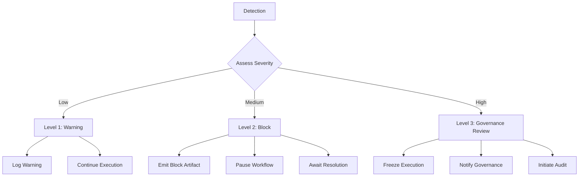

# PR-MERGE-SPECIALIST Escalation Rules

## Purpose

Define the canonical escalation protocol for pr-merge-specialist to handle errors, conflicts, and exceptional conditions consistently across all execution contexts.

## Core Principles

### 1. Predictable Escalation Path
- Clear, deterministic escalation levels
- Consistent triggers and thresholds
- Uniform response procedures

### 2. Governance Integration
- All escalations logged and auditable
- Proof bundles emitted at each level
- Chain of custody maintained

### 3. Context Independence
- Identical escalation behavior across all contexts
- Context-specific adaptations only in presentation
- Uniform decision logic and thresholds

### 4. Recovery Orientation
- Focus on returning to normal workflow
- Clear remediation paths
- Documented recovery procedures

## Escalation Levels

### Level 1 - Warning (INFO)
**Severity**: Low
**Impact**: Non-blocking, informational
**Response**: Log and continue

#### Triggers
- Minor validation warnings
- Non-critical artifact inconsistencies
- Performance degradation below thresholds
- Deprecation notices
- Configuration recommendations

#### Response Procedure
1. Log warning with context
2. Emit warning artifact
3. Continue normal execution
4. Document in proof bundle
5. Suggest remediation (non-blocking)

#### Artifact Emission
```json
{
  "escalation_level": "WARNING",
  "trigger": "<trigger_description>",
  "context": {},
  "recommended_action": "<action>",
  "timestamp": "<iso8601_timestamp>"
}
```

### Level 2 - Block (MEDIUM)
**Severity**: Medium
**Impact**: Blocking, requires intervention
**Response**: Pause and await resolution

#### Triggers
- Critical artifact missing
- Validation gate failure
- Governance rule violation
- CI failure detection
- Merge conflict identification
- Readiness criteria not met
- Chain of custody break

#### Response Procedure
1. Log block with full context
2. Emit block artifact
3. Pause workflow execution
4. Notify operator (context-appropriate)
5. Document recovery requirements
6. Await manual resolution

#### Artifact Emission
```json
{
  "escalation_level": "BLOCK",
  "trigger": "<trigger_description>",
  "blocking_reason": "<reason>",
  "required_action": "<action>",
  "recovery_procedure": "<procedure>",
  "context": {},
  "timestamp": "<iso8601_timestamp>"
}
```

### Level 3 - Governance Review (HIGH)
**Severity**: High
**Impact**: Contract breach, requires governance intervention
**Response**: Full audit and governance review

#### Triggers
- Decision inconsistency detected
- Artifact tampering suspected
- Security policy violation
- Compliance audit failure
- Repeated block escalations
- Workflow contract violation
- Chain of custody corruption

#### Response Procedure
1. Log security incident
2. Emit governance review artifact
3. Freeze all workflow execution
4. Notify governance team
5. Initiate full audit
6. Preserve all evidence
7. Await governance decision

#### Artifact Emission
```json
{
  "escalation_level": "GOVERNANCE_REVIEW",
  "trigger": "<trigger_description>",
  "evidence_preserved": <boolean>,
  "audit_required": <boolean>,
  "governance_notified": <boolean>,
  "context": {},
  "timestamp": "<iso8601_timestamp>"
}
```

## Specific Escalation Scenarios

### Handoff Validation Failure
**Trigger**: Invalid handoff bundle from PR-PREP-SPECIALIST
**Level**: BLOCK
**Response**:
1. Validate bundle structure
2. Identify missing artifacts
3. Check chain of custody
4. Emit validation failure artifact
5. Notify PR-PREP-SPECIALIST
6. Await corrected handoff

### CI Status Detection Failure
**Trigger**: Unable to determine CI status
**Level**: BLOCK
**Response**:
1. Retry with exponential backoff
2. Check GitHub API status
3. Emit detection failure artifact
4. Escalate to manual review
5. Document workaround path

### Conflict Analysis Failure
**Trigger**: Unable to classify conflict type
**Level**: WARNING (first occurrence), BLOCK (repeated)
**Response**:
1. Log conflict data
2. Classify as UNKNOWN
3. Emit analysis warning
4. Continue with conservative strategy
5. Flag for manual review

### Readiness Gate Inconsistency
**Trigger**: Different readiness decisions for same inputs
**Level**: GOVERNANCE_REVIEW
**Response**:
1. Freeze execution
2. Preserve all inputs and outputs
3. Emit inconsistency artifact
4. Notify governance team
5. Initiate decision audit

### Artifact Emission Failure
**Trigger**: Unable to write proof artifacts
**Level**: BLOCK
**Response**:
1. Check storage permissions
2. Retry with backup location
3. Emit emission failure artifact
4. Preserve artifacts in memory
5. Await storage recovery

### Chain of Custody Break
**Trigger**: Invalid or missing parent bundle references
**Level**: GOVERNANCE_REVIEW
**Response**:
1. Freeze execution immediately
2. Preserve all current state
3. Emit custody break artifact
4. Notify governance team
5. Initiate provenance audit

## Escalation Workflow



## Recovery Procedures

### From Warning State
1. **Automatic Recovery**: Continue normal execution
2. **Documentation**: Warning logged in proof bundle
3. **Follow-up**: Optional manual review
4. **Prevention**: Configuration update recommended

### From Block State
1. **Manual Intervention**: Operator resolves root cause
2. **Validation**: Verify resolution completeness
3. **Resume**: Continue workflow from blocked step
4. **Documentation**: Recovery logged in proof bundle
5. **Prevention**: Update governance rules if needed

### From Governance Review State
1. **Audit Completion**: Governance team approves resolution
2. **Evidence Review**: Verify all requirements met
3. **Workflow Resume**: Restart from safe checkpoint
4. **Documentation**: Full audit trail preserved
5. **Prevention**: Policy update and retraining

## Governance Integration

### Compliance Monitoring
- Automated escalation detection
- Threshold compliance checking
- Escalation pattern analysis
- Governance rule enforcement

### Reporting Requirements
- Real-time escalation alerts
- Daily escalation summaries
- Weekly trend analysis
- Monthly governance reports
- Quarterly audit reviews

### Audit Trail Requirements
- Complete escalation history
- All artifacts preserved
- Timestamps and signatures
- Operator actions logged
- Recovery procedures documented

## Context-Specific Adaptations

### CLI Context
- **Notification**: Console output with color coding
- **Interaction**: Prompt for manual input
- **Logging**: Structured JSON logs
- **Recovery**: Interactive prompts

### API Context
- **Notification**: Webhook callbacks
- **Interaction**: API response with status
- **Logging**: Structured API logs
- **Recovery**: Status endpoint updates

### Interactive Context
- **Notification**: Rich UI notifications
- **Interaction**: Wizard-driven resolution
- **Logging**: User action audit trail
- **Recovery**: Guided recovery workflow

## Validation Gates

### Escalation Consistency
- ✅ Identical triggers across contexts
- ✅ Uniform severity assessment
- ✅ Consistent response procedures
- ✅ Standardized artifact emission

### Recovery Validation
- ✅ Root cause addressed
- ✅ Prevention measures documented
- ✅ Workflow integrity maintained
- ✅ Proof bundle completeness

## Implementation Requirements

### Detection Mechanisms
- Automated trigger monitoring
- Threshold configuration
- Context-aware detection
- Real-time alerting

### Response Templates
- Standardized artifact structures
- Context-specific notifications
- Recovery procedure documentation
- Escalation workflow definitions

### Recovery Procedures
- Checkpoint/restore functionality
- State preservation mechanisms
- Rollback capabilities
- Manual override paths

### Documentation
- Escalation trigger catalog
- Response procedure manual
- Recovery procedure guide
- Governance integration documentation

## Exit Criteria

Escalation protocol implementation complete when:
1. ✅ All escalation levels defined
2. ✅ Detection mechanisms implemented
3. ✅ Response procedures documented
4. ✅ Recovery procedures validated
5. ✅ Cross-context consistency verified
6. ✅ Governance integration complete
7. ✅ Audit trail requirements met
8. ✅ Compliance monitoring operational

## Compliance Statement

By implementing this escalation protocol, all pr-merge-specialist instances agree to:
- Follow canonical escalation levels and triggers
- Maintain consistent response procedures across contexts
- Emit standardized escalation artifacts
- Preserve complete audit trails
- Submit to governance review when required
- Document all escalations and recoveries
- Participate in compliance monitoring and reporting

**This protocol is binding and enforceable under governance rules.**
