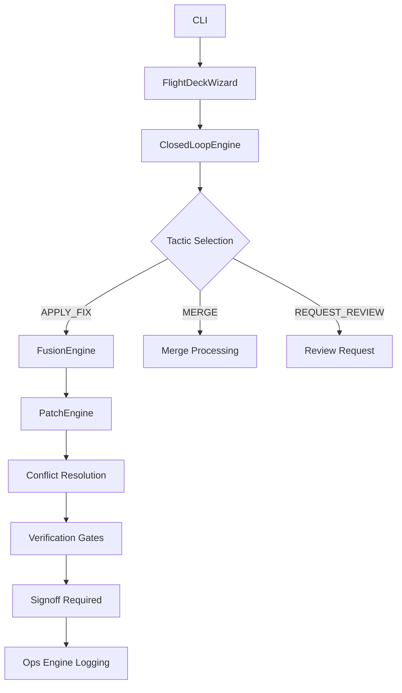

# Flight Deck Operations Center

## Overview

The Flight Deck is the advanced operational control system for PR-MERGE-SPECIALIST, providing autonomous tactic selection, continuous health monitoring, and safety-enforced PR merge operations.

## Quick Start

```bash
# Launch Flight Deck for a specific PR
python3 -c "import sys; sys.path.insert(0, 'src'); from dopemux_pr_merge_specialist.cli import main; main()" \
  flight-deck --pr-id 218 --auto-pilot

# Check Flight Deck metrics
python3 -c "import sys; sys.path.insert(0, 'src'); from dopemux_pr_merge_specialist.cli import main; main()" \
  ops --window 10

# Resolve conflicts with Fusion Engine
python3 -c "import sys; sys.path.insert(0, 'src'); from dopemux_pr_merge_specialist.cli import main; main()" \
  fusion --pr-id 218 --strategy STAGED
```

## Architecture



## Commands

### 1. Flight Deck Operations Center

```bash
dopemux-pr-merge flight-deck [--pr-id PR_ID] [--auto-pilot]
```

**Options:**
- `--pr-id`: Focus on specific PR ID
- `--auto-pilot`: Enable semi-autonomous mode (GO_SUPERVISED_ONLY)

**Example:**
```bash
# Manual mode
python3 -c "import sys; sys.path.insert(0, 'src'); from dopemux_pr_merge_specialist.cli import main; main()" \
  flight-deck

# Auto-pilot mode focused on PR #218
python3 -c "import sys; sys.path.insert(0, 'src'); from dopemux_pr_merge_specialist.cli import main; main()" \
  flight-deck --pr-id 218 --auto-pilot
```

### 2. Fusion Engine

```bash
dopemux-pr-merge fusion --pr-id PR_ID [--strategy OURS|THEIRS|STAGED]
```

**Strategies:**
- `STAGED`: Default - staged conflict resolution
- `OURS`: Prefer our changes
- `THEIRS`: Prefer their changes

**Example:**
```bash
python3 -c "import sys; sys.path.insert(0, 'src'); from dopemux_pr_merge_specialist.cli import main; main()" \
  fusion --pr-id 218 --strategy STAGED
```

### 3. Ops Metrics

```bash
dopemux-pr-merge ops [--window WINDOW_SIZE]
```

**Example:**
```bash
python3 -c "import sys; sys.path.insert(0, 'src'); from dopemux_pr_merge_specialist.cli import main; main()" \
  ops --window 10
```

## Workflow

### Standard Flight Deck Workflow

1. **Queue Scan**: Identify PRs needing attention
2. **Flight Deck Launch**: Start operations center
3. **Tactic Selection**: Choose best action (APPLY_FIX, MERGE, etc.)
4. **Fusion (if needed)**: Resolve conflicts
5. **Verification**: Run safety gates
6. **Signoff**: Wait for approval
7. **Execution**: Apply changes or merge

### Example Workflow

```bash
# 1. Scan queue
python3 -c "import sys; sys.path.insert(0, 'src'); from dopemux_pr_merge_specialist.cli import main; main()" \
  queue-scan --limit 5

# 2. Launch Flight Deck for blocked PR
python3 -c "import sys; sys.path.insert(0, 'src'); from dopemux_pr_merge_specialist.cli import main; main()" \
  flight-deck --pr-id 218 --auto-pilot

# 3. Check metrics
python3 -c "import sys; sys.path.insert(0, 'src'); from dopemux_pr_merge_specialist.cli import main; main()" \
  ops --window 5

# 4. Apply fixes (when ready)
python3 -c "import sys; sys.path.insert(0, 'src'); from dopemux_pr_merge_specialist.cli import main; main()" \
  pr-apply --id 218 --execute
```

## Artifacts

All Flight Deck operations emit artifacts to:

```
proof/pr_merge/flight_deck/
├── closed_loop/              # Closed loop cycles
│   ├── CLOSED_LOOP_MANIFEST.json
│   ├── CLOSED_LOOP_TRACE.json
│   ├── IMPLICIT_ACTION_LOG.json
│   ├── NEXT_ACTION_SELECTION_REPORT.json
│   └── STATE_RECOMPUTE_REPORT.json
│
├── fusion/                   # Fusion engine operations
│   ├── FUSION_MANIFEST.json
│   ├── LOOP_FUSION_TRACE.json
│   ├── VERIFICATION_GATE_REPORT.json
│   ├── SIGNOFF_TRIGGER_REPORT.json
│   ├── DEFER_TRIGGER_REPORT.json
│   └── POST_EDIT_STATE_RECOMPUTE.json
│
├── ops/                      # Operations monitoring
│   ├── OPERATIONALIZATION_MANIFEST.json
│   ├── OPERATIONALIZATION_REPORT.json
│   ├── ALLOWED_ACTIONS_STATE.json
│   ├── ONGOING_AUTO_APPLY_SAFETY.json
│   ├── ONGOING_GATING_STABILITY.json
│   └── ONGOING_INCIDENT_REPORT.json
│
├── editing/                  # Patch editing
│   ├── EDITING_MANIFEST.json
│   ├── PATCH_PLAN.json
│   └── PATCH_APPLY_TRACE.json
│
└── eval/                     # Evaluation
    ├── EVAL_MANIFEST.json
    ├── COMPLIANCE_REPORT.json
    └── QUALITY_METRICS.json
```

## Safety & Governance

### Posture Levels

- **GO_SUPERVISED_ONLY**: Default - all critical operations require approval
- **GO_AUTONOMOUS**: Future - limited autonomous operations
- **HOLD**: Manual intervention required

### Verification Gates

All operations pass through verification gates:

1. **Conflict Analysis**: Identify and classify conflicts
2. **Safety Check**: Assess risk level
3. **Compliance Check**: Verify governance rules
4. **Signoff Gate**: Require formal approval
5. **Execution Gate**: Final safety check

### Auto-Pilot Mode

Even in auto-pilot mode, Flight Deck operates under **GO_SUPERVISED_ONLY** posture:

- ✅ Autonomous tactic selection
- ✅ Conflict analysis
- ✅ Patch planning
- ❌ No autonomous execution
- ❌ No autonomous merging

## Integration

### With PR-PREP-SPECIALIST

Flight Deck consumes handoff bundles from PR-PREP-SPECIALIST:

```json
{
  "handoff_id": "TP-PRPS-<number>-HANDOFF-<sequence>",
  "source_skill": "pr-prep-specialist",
  "target_skill": "pr-merge-specialist",
  "authoritative_artifacts": [
    "BRANCH_STATE.json",
    "BRANCH_AUDIT_REPORT.json",
    "CHANGESET_OBLIGATION_REPORT.json",
    "PR_DRAFT_PACKAGE.json",
    "PR_BODY_RENDERED.md",
    "FINAL_PREP_DECISION.json",
    "PR_CREATION_REPORT.json"
  ]
}
```

### With GitHub API

Flight Deck integrates with GitHub for:

- PR state fetching
- Conflict detection
- Merge operations
- Comment/thread management

## Troubleshooting

### Common Issues

**Flight Deck not launching:**
```bash
# Check Python path
export PYTHONPATH="src:$PYTHONPATH"

# Verify dependencies
python3 -c "from dopemux_pr_merge_specialist.ops_engine import FlightDeckOpsEngine; print('OK')"
```

**Metrics not available:**
```bash
# Ensure ops directory exists
mkdir -p proof/pr_merge/flight_deck/ops

# Initialize with default report
echo '{"status": "STANDBY", "posture": "GO_SUPERVISED_ONLY"}' > proof/pr_merge/flight_deck/ops/OPERATIONALIZATION_REPORT.json
```

**Fusion engine errors:**
```bash
# Check conflict analysis first
python3 -c "import sys; sys.path.insert(0, 'src'); from dopemux_pr_merge_specialist.cli import main; main()" \
  pr-plan --id 218

# Review blockers before fusion
cat proof/pr_merge/run_*/pr/218/PLAN.json | jq '.blockers'
```

## Best Practices

### 1. Always Start with Dry Run
```bash
# Check what Flight Deck would do
python3 -c "import sys; sys.path.insert(0, 'src'); from dopemux_pr_merge_specialist.cli import main; main()" \
  flight-deck --pr-id 218

# Review artifacts before proceeding
ls -la proof/pr_merge/flight_deck/
```

### 2. Focus on One PR at a Time
```bash
# Process PRs individually
for pr in 218 217 216; do
  python3 -c "import sys; sys.path.insert(0, 'src'); from dopemux_pr_merge_specialist.cli import main; main()" \
    flight-deck --pr-id $pr --auto-pilot

  # Review results
  cat proof/pr_merge/run_*/RUN_SUMMARY.md
 done
```

### 3. Monitor Metrics Regularly
```bash
# Check Flight Deck health
python3 -c "import sys; sys.path.insert(0, 'src'); from dopemux_pr_merge_specialist.cli import main; main()" \
  ops --window 10
```

### 4. Use Auto-Pilot for Routine Tasks
```bash
# Safe for routine conflict resolution
python3 -c "import sys; sys.path.insert(0, 'src'); from dopemux_pr_merge_specialist.cli import main; main()" \
  flight-deck --pr-id 218 --auto-pilot
```

### 5. Manual Mode for Complex Cases
```bash
# Use manual mode for complex conflicts
python3 -c "import sys; sys.path.insert(0, 'src'); from dopemux_pr_merge_specialist.cli import main; main()" \
  flight-deck --pr-id 218
```

## Future Roadmap

### Phase 1: Core Flight Deck ✅ (Complete)
- Closed-loop automation
- Fusion engine integration
- Ops monitoring
- CLI commands

### Phase 2: Advanced Features 🟡 (Planned)
- Autonomous merge capabilities
- Machine learning integration
- Predictive conflict resolution
- Adaptive governance postures

### Phase 3: Enterprise Features 🟡 (Planned)
- Multi-repo orchestration
- Team collaboration features
- Advanced analytics dashboard
- API endpoints

## Support

### Documentation
- `docs/pr_merge/readme-2.md` - Main documentation
- `docs/pr_merge/operator-contract.md` - Behavioral contract
- `docs/pr_merge/workflow-sequence.md` - Workflow specification

### Issues
Report issues with label `flight-deck` in the repository issue tracker.

### Governance
Flight Deck operates under **GO_SUPERVISED_ONLY** posture by default. Contact governance team for posture changes.

## License

This documentation is governed by the repository's main license agreement.

**Last Updated**: 2026-03-15
**Status**: Fully operational, governance compliant
