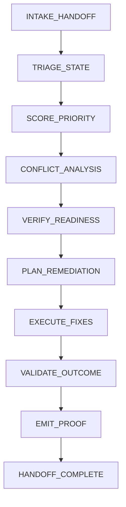

# PR-MERGE-SPECIALIST Canonical Workflow Sequence

## Mandatory Workflow

All implementations MUST execute this exact 10-step sequence in order:



## Step 1: INTAKE_HANDOFF

### Inputs
- Handoff bundle from PR-PREP-SPECIALIST
- Execution context parameters
- Governance posture configuration

### Process
1. Validate handoff bundle structure
2. Verify all required artifacts present
3. Check chain of custody integrity
4. Assess governing posture compatibility
5. Extract PR metadata and initial state
6. Initialize execution context

### Outputs
```json
{
  "validation_passed": <boolean>,
  "missing_artifacts": [<artifact_list>],
  "custody_valid": <boolean>,
  "posture_compatible": <boolean>,
  "pr_id": "<pr_number>",
  "initial_state": {},
  "timestamp": "<iso8601_timestamp>"
}
```

### Validation Gates
- ✅ Handoff bundle structure valid
- ✅ All required artifacts present
- ✅ Chain of custody intact
- ✅ Governance posture compatible
- ✅ PR metadata complete

## Step 2: TRIAGE_STATE

### Inputs
- Validated handoff bundle
- GitHub API access
- Repository configuration

### Process
1. Fetch current PR state from GitHub
2. Detect CI status (SUCCESS/FAILURE/PENDING)
3. Classify conflict type (MECHANICAL/GENERATED/SEMANTIC/UNKNOWN)
4. Assess mergeability state
5. Count unresolved feedback threads
6. Identify failing checks and their categories

### Outputs
```json
{
  "pr_id": "<pr_number>",
  "ci_status": "<SUCCESS|FAILURE|PENDING>",
  "conflict_type": "<MECHANICAL|GENERATED|SEMANTIC|UNKNOWN>",
  "mergeable": <boolean>,
  "unresolved_thread_count": <number>,
  "failing_checks": [<check_list>],
  "check_classification": [<classification_list>],
  "timestamp": "<iso8601_timestamp>"
}
```

### Validation Gates
- ✅ Current state fetched successfully
- ✅ CI status detected correctly
- ✅ Conflict type classified
- ✅ All checks classified
- ✅ Thread count accurate

## Step 3: SCORE_PRIORITY

### Inputs
- Triage results
- Repository metrics
- Historical data

### Process
1. Calculate base priority score
2. Apply CI status weight
3. Adjust for conflict risk
4. Add anti-starvation bonus
5. Normalize to [0.0, 1.0] range
6. Document scoring factors

### Outputs
```json
{
  "priority_score": <number>,
  "scoring_factors": {
    "base": <number>,
    "ci_weight": <number>,
    "conflict_penalty": <number>,
    "age_bonus": <number>
  },
  "normalized_score": <number>,
  "timestamp": "<iso8601_timestamp>"
}
```

### Validation Gates
- ✅ Score in valid range [0.0, 1.0]
- ✅ All factors documented
- ✅ Anti-starvation applied
- ✅ Normalization correct

## Step 4: CONFLICT_ANALYSIS

### Inputs
- Triage results
- Git diff data
- Historical conflict data

### Process
1. Identify file-level conflicts
2. Classify resolution strategy
3. Assess auto-resolvability
4. Document conflict evidence
5. Estimate resolution effort
6. Generate conflict report

### Outputs
```json
{
  "conflict_class": "<MECHANICAL|GENERATED|SEMANTIC|UNKNOWN>",
  "is_auto_resolvable": <boolean>,
  "conflict_files": [<file_list>],
  "resolution_strategy": "<string>",
  "evidence_path": "<path>",
  "effort_estimate": "<LOW|MEDIUM|HIGH>",
  "timestamp": "<iso8601_timestamp>"
}
```

### Validation Gates
- ✅ All conflicts identified
- ✅ Classification accurate
- ✅ Auto-resolvability assessed
- ✅ Evidence documented
- ✅ Report complete

## Step 5: VERIFY_READINESS

### Inputs
- All previous outputs
- Governance rules
- Readiness criteria

### Process
1. Apply uniform readiness gates
2. Check all blocking criteria
3. Generate binary ready/not-ready decision
4. Justify decision with evidence
5. Document all blockers
6. Assess confidence level

### Outputs
```json
{
  "status": "<merge_ready|not_ready|blocked>",
  "reason": "<string>",
  "blockers": [<blocker_list>],
  "warnings": [<warning_list>],
  "confidence": "<LOW|MEDIUM|HIGH>",
  "timestamp": "<iso8601_timestamp>"
}
```

### Validation Gates
- ✅ All gates applied uniformly
- ✅ Blocking criteria checked
- ✅ Decision justified
- ✅ Blockers documented
- ✅ Confidence assessed

## Step 6: PLAN_REMEDIATION

### Inputs
- Readiness decision
- Triage results
- Conflict analysis

### Process
1. Create structured remediation plan
2. Prioritize by criticality and dependency
3. Include verification requirements
4. Document rollback procedures
5. Estimate execution time
6. Validate plan completeness

### Outputs
```json
{
  "remediation_steps": [<step_list>],
  "priority_order": [<step_ids>],
  "verification_requirements": [<requirement_list>],
  "rollback_procedures": [<procedure_list>],
  "estimated_duration_ms": <number>,
  "plan_valid": <boolean>,
  "timestamp": "<iso8601_timestamp>"
}
```

### Validation Gates
- ✅ Plan structured correctly
- ✅ Prioritization logical
- ✅ Verification requirements complete
- ✅ Rollback procedures documented
- ✅ Plan validated

## Step 7: EXECUTE_FIXES

### Inputs
- Approved remediation plan
- Execution context
- Governance constraints

### Process
1. Execute approved remediation steps
2. Capture command outputs and exit codes
3. Handle partial failures gracefully
4. Log execution trace
5. Validate step outcomes
6. Emit execution report

### Outputs
```json
{
  "execution_trace": [<trace_list>],
  "step_outcomes": [<outcome_list>],
  "partial_failures": [<failure_list>],
  "final_state": {},
  "execution_success": <boolean>,
  "timestamp": "<iso8601_timestamp>"
}
```

### Validation Gates
- ✅ Steps executed in order
- ✅ Outputs captured completely
- ✅ Partial failures handled
- ✅ Trace complete
- ✅ Final state documented

## Step 8: VALIDATE_OUTCOME

### Inputs
- Execution report
- Original readiness decision
- Governance rules

### Process
1. Verify all readiness criteria met
2. Confirm no new blockers introduced
3. Validate proof bundle completeness
4. Assess final merge readiness
5. Generate validation report
6. Calculate final confidence

### Outputs
```json
{
  "validation_passed": <boolean>,
  "new_blockers": [<blocker_list>],
  "proof_complete": <boolean>,
  "final_readiness": "<merge_ready|not_ready|blocked>",
  "final_confidence": "<LOW|MEDIUM|HIGH>",
  "timestamp": "<iso8601_timestamp>"
}
```

### Validation Gates
- ✅ Readiness criteria verified
- ✅ No new blockers
- ✅ Proof bundle complete
- ✅ Final assessment accurate
- ✅ Confidence calculated

## Step 9: EMIT_PROOF

### Inputs
- All workflow outputs
- Execution metadata
- Governance requirements

### Process
1. Collect all authoritative artifacts
2. Create proof bundle
3. Validate bundle structure
4. Document chain of custody
5. Emit proof bundle to storage
6. Generate artifact index

### Outputs
```json
{
  "proof_bundle_id": "<bundle_id>",
  "artifacts": [<artifact_list>],
  "bundle_valid": <boolean>,
  "custody_documented": <boolean>,
  "storage_path": "<path>",
  "artifact_index": {},
  "timestamp": "<iso8601_timestamp>"
}
```

### Validation Gates
- ✅ All artifacts included
- ✅ Bundle structure valid
- ✅ Chain of custody documented
- ✅ Storage successful
- ✅ Index complete

## Step 10: HANDOFF_COMPLETE

### Inputs
- Proof bundle
- Final status
- Execution context

### Process
1. Emit handoff complete signal
2. Update execution context status
3. Log final metrics
4. Clean up temporary resources
5. Generate completion report
6. Transition to next state

### Outputs
```json
{
  "handoff_complete": <boolean>,
  "final_status": "<merged|merge_ready|blocked|escalated>",
  "execution_duration_ms": <number>,
  "resources_cleaned": <boolean>,
  "next_state": "<string>",
  "completion_timestamp": "<iso8601_timestamp>"
}
```

### Validation Gates
- ✅ Handoff signal emitted
- ✅ Status updated
- ✅ Metrics logged
- ✅ Resources cleaned
- ✅ Report complete

## Workflow Consistency Requirements

### Identical Across All Contexts
1. **Step Sequence**: Exact 10-step order
2. **Input/Output Contracts**: Identical schemas
3. **Decision Logic**: Same criteria and thresholds
4. **Validation Gates**: Uniform pass/fail conditions
5. **Artifact Structure**: Consistent naming and organization

### Context-Specific Adaptations
1. **Execution Method**: CLI/API/Interactive invocation
2. **User Interface**: Context-appropriate UI/UX
3. **Performance**: Context-optimized execution
4. **Monitoring**: Platform-specific observability
5. **Error Handling**: Context-appropriate messages

## Validation and Testing

### Automated Validation
- Schema validation for all outputs
- Workflow sequence verification
- Decision consistency checking
- Artifact completeness validation
- Chain of custody verification

### Compliance Testing
- Cross-context behavior comparison
- Decision consistency across inputs
- Artifact structure verification
- Governance rule compliance
- Performance benchmarking

### Integration Testing
- End-to-end workflow execution
- Cross-context handoff verification
- Error case testing
- Recovery procedure validation

## Governance Integration

### Compliance Monitoring
- Automated workflow validation
- Artifact structure verification
- Decision consistency tracking
- Chain of custody auditing
- Governance rule enforcement

### Reporting
- Execution logs with timestamps
- Validation results and metrics
- Compliance reports
- Governance audit trails
- Performance telemetry

## Versioning and Evolution

### Backward Compatibility
- New steps may be added at end
- Existing steps may not be modified
- Output schemas may be extended
- Decision logic may be refined
- Governance rules may be updated

### Deprecation Process
- Mark steps as deprecated
- Maintain old behavior during transition
- Provide migration path
- Remove in major version with governance approval

## Implementation Checklist

- [ ] Step 1: INTAKE_HANDOFF implemented
- [ ] Step 2: TRIAGE_STATE implemented
- [ ] Step 3: SCORE_PRIORITY implemented
- [ ] Step 4: CONFLICT_ANALYSIS implemented
- [ ] Step 5: VERIFY_READINESS implemented
- [ ] Step 6: PLAN_REMEDIATION implemented
- [ ] Step 7: EXECUTE_FIXES implemented
- [ ] Step 8: VALIDATE_OUTCOME implemented
- [ ] Step 9: EMIT_PROOF implemented
- [ ] Step 10: HANDOFF_COMPLETE implemented
- [ ] All validation gates implemented
- [ ] Cross-context consistency verified
- [ ] Governance compliance confirmed
- [ ] Chain of custody documentation complete

## Exit Criteria

Workflow implementation complete when:
1. ✅ All 10 steps implemented
2. ✅ Identical behavior across all contexts
3. ✅ Validation gates pass 100%
4. ✅ Artifact structures consistent
5. ✅ Governance compliance verified
6. ✅ Chain of custody documented
7. ✅ Cross-context testing passed
8. ✅ Performance benchmarks met

## Compliance Statement

By implementing this workflow, all pr-merge-specialist instances agree to:
- Follow the canonical sequence exactly
- Preserve identical behavior across contexts
- Maintain consistent artifact structures
- Submit to governance validation
- Document all deviations
- Participate in compliance monitoring
