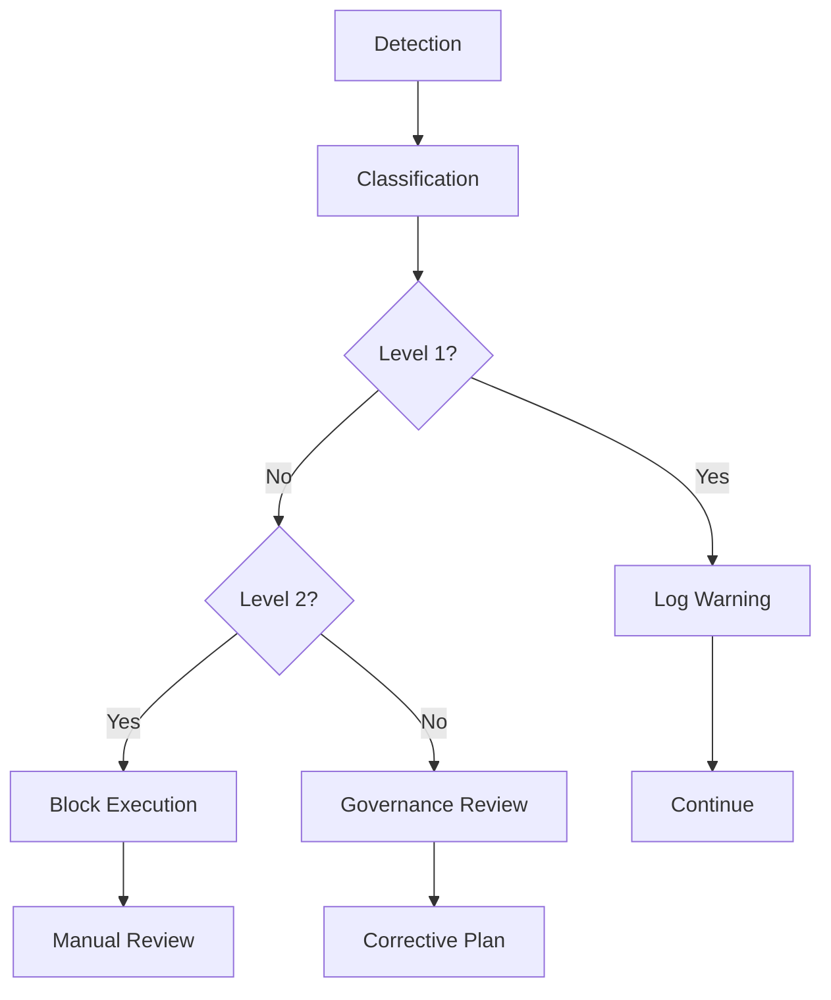

# PR-PREP-SPECIALIST Escalation Rules

## Purpose

Define escalation protocols for handling exceptions, violations, and edge cases while maintaining contract compliance.

## Escalation Levels

### Level 1 - Warning (Minor Issues)
**Trigger**: First offense, minor contract violation

**Examples**:
- Missing optional metadata field
- Non-critical validation warning
- Formatting inconsistency
- Minor documentation issue

**Response**:
- Log warning in execution log
- Continue execution
- Notify operator
- No governance intervention required

**Resolution Timeframe**: 24 hours

### Level 2 - Block (Moderate Issues)
**Trigger**: Repeat offense, moderate contract violation

**Examples**:
- Missing required output field
- Validation gate failure
- Handoff structure inconsistency
- Decision logic deviation

**Response**:
- Block further execution
- Log detailed error report
- Notify governance team
- Require manual review

**Resolution Timeframe**: 48 hours

### Level 3 - Governance Review (Severe Issues)
**Trigger**: Severe contract violation, repeated blocks

**Examples**:
- Workflow sequence modification
- Handoff contract breach
- Data integrity violation
- Security policy violation

**Response**:
- Immediate execution halt
- Full governance review
- Corrective action plan required
- Documentation in conflict ledger

**Resolution Timeframe**: 7 days

## Escalation Process



## Detection Mechanisms

### Automated Detection
1. **Schema Validation**: JSON Schema validation on all outputs
2. **Workflow Monitor**: Step sequence verification
3. **Decision Auditor**: Consistency checking
4. **Handoff Validator**: Structure verification
5. **Artifact Checker**: Completeness validation

### Manual Detection
1. **Code Review**: Governance team review
2. **Incident Reports**: User-reported issues
3. **Audit Findings**: Scheduled audits
4. **Compliance Checks**: Random sampling

## Classification Rules

### Severity Matrix

| Issue Type | First Offense | Repeat Offense | Pattern |
|------------|---------------|-----------------|---------|
| Missing metadata | Warning | Warning | Level 1 |
| Formatting issue | Warning | Warning | Level 1 |
| Missing optional field | Warning | Block | Level 1→2 |
| Validation warning | Warning | Block | Level 1→2 |
| Missing required field | Block | Governance | Level 2→3 |
| Workflow deviation | Block | Governance | Level 2→3 |
| Handoff breach | Governance | Governance | Level 3 |
| Security violation | Governance | Governance | Level 3 |

## Response Protocols

### Level 1 Response
```json
{
  "escalation_level": "WARNING",
  "issue_type": "<issue_type>",
  "severity": "MINOR",
  "detected_at": "<timestamp>",
  "context": {
    "step": "<step_name>",
    "artifact": "<artifact_name>",
    "field": "<field_name>"
  },
  "action_taken": "LOGGED",
  "notification": "OPERATOR_NOTIFIED",
  "resolution_timeframe": "24h",
  "status": "OPEN"
}
```

### Level 2 Response
```json
{
  "escalation_level": "BLOCK",
  "issue_type": "<issue_type>",
  "severity": "MODERATE",
  "detected_at": "<timestamp>",
  "context": {
    "step": "<step_name>",
    "artifact": "<artifact_name>",
    "expected": "<expected_value>",
    "actual": "<actual_value>"
  },
  "action_taken": "EXECUTION_BLOCKED",
  "notification": "GOVERNANCE_NOTIFIED",
  "resolution_timeframe": "48h",
  "status": "BLOCKED",
  "block_id": "<unique_id>"
}
```

### Level 3 Response
```json
{
  "escalation_level": "GOVERNANCE_REVIEW",
  "issue_type": "<issue_type>",
  "severity": "SEVERE",
  "detected_at": "<timestamp>",
  "context": {
    "step": "<step_name>",
    "artifact": "<artifact_name>",
    "violation": "<violation_description>",
    "impact": "<impact_assessment>"
  },
  "action_taken": "EXECUTION_HALTED",
  "notification": "GOVERNANCE_ESCALATED",
  "resolution_timeframe": "7d",
  "status": "UNDER_REVIEW",
  "review_id": "<unique_id>",
  "corrective_plan_required": true
}
```

## Resolution Workflow

### Level 1 Resolution
1. **Acknowledge**: Operator acknowledges warning
2. **Investigate**: Root cause analysis
3. **Fix**: Implement correction
4. **Verify**: Confirm issue resolved
5. **Close**: Mark as resolved in logs

### Level 2 Resolution
1. **Acknowledge**: Governance team acknowledges block
2. **Investigate**: Detailed root cause analysis
3. **Plan**: Create remediation plan
4. **Implement**: Apply fixes
5. **Validate**: Governance validation
6. **Unblock**: Resume execution
7. **Document**: Update conflict ledger

### Level 3 Resolution
1. **Acknowledge**: Governance team acknowledges review
2. **Investigate**: Comprehensive analysis
3. **Plan**: Formal corrective action plan
4. **Approve**: Governance approval
5. **Implement**: Apply corrections
6. **Validate**: Full validation suite
7. **Document**: Conflict ledger update
8. **Monitor**: Post-resolution monitoring

## Conflict Ledger Integration

All escalations Level 2 and above MUST be recorded in the conflict ledger:

```markdown
## Escalation <escalation_id>

**Date**: <date>
**Level**: <WARNING|BLOCK|GOVERNANCE_REVIEW>
**Issue Type**: <issue_type>
**Severity**: <MINOR|MODERATE|SEVERE>
**Status**: <OPEN|RESOLVED|MONITORING>

### Context
- **Step**: <step_name>
- **Artifact**: <artifact_name>
- **Platform**: <platform_name>
- **Version**: <version>

### Details
<detailed_description>

### Impact
<impact_assessment>

### Resolution
- **Action Taken**: <action>
- **Resolved By**: <resolver>
- **Resolved At**: <timestamp>
- **Verification**: <verification_method>

### Follow-up
<follow_up_actions>
```

## Escalation Examples

### Example 1: Missing Optional Field (Level 1)
**Detection**: Schema validation warning
**Classification**: Level 1 - Warning
**Response**: Log warning, continue execution
**Resolution**: Add missing field in next iteration

### Example 2: Missing Required Field (Level 2)
**Detection**: Validation gate failure
**Classification**: Level 2 - Block
**Response**: Block execution, notify governance
**Resolution**: Add field, validate, unblock

### Example 3: Workflow Deviation (Level 3)
**Detection**: Workflow monitor alert
**Classification**: Level 3 - Governance Review
**Response**: Halt execution, full review
**Resolution**: Correct workflow, validate, document

## Prevention Strategies

### Proactive Measures
1. **Pre-flight Checks**: Validate before execution
2. **Schema Validation**: Real-time validation
3. **Workflow Monitoring**: Continuous sequence verification
4. **Decision Auditing**: Consistency checking
5. **Handoff Verification**: Structure validation

### Continuous Improvement
1. **Pattern Analysis**: Identify common issues
2. **Training**: Operator education
3. **Documentation**: Clear guidelines
4. **Tooling**: Better validation tools
5. **Feedback Loop**: Learn from escalations

## Governance Oversight

### Monitoring
- Weekly escalation reports
- Monthly trend analysis
- Quarterly governance reviews
- Annual policy updates

### Reporting
- Escalation dashboard
- Conflict ledger updates
- Compliance reports
- Improvement recommendations

## Compliance Requirements

### For Implementations
1. Implement all detection mechanisms
2. Follow escalation protocols
3. Document all escalations
4. Participate in resolution
5. Submit to governance oversight

### For Governance
1. Maintain escalation policies
2. Monitor escalation patterns
3. Review severe cases
4. Update policies as needed
5. Report on compliance

## Exit Criteria

Escalation framework complete when:
1. ✅ All detection mechanisms implemented
2. ✅ Escalation protocols documented
3. ✅ Response templates created
4. ✅ Conflict ledger integration working
5. ✅ Prevention strategies in place
6. ✅ Governance oversight established
7. ✅ Compliance monitoring active

## Implementation Checklist

- [ ] Level 1 escalation protocol
- [ ] Level 2 escalation protocol
- [ ] Level 3 escalation protocol
- [ ] Detection mechanisms
- [ ] Classification rules
- [ ] Response templates
- [ ] Conflict ledger integration
- [ ] Prevention strategies
- [ ] Governance oversight
- [ ] Compliance monitoring
