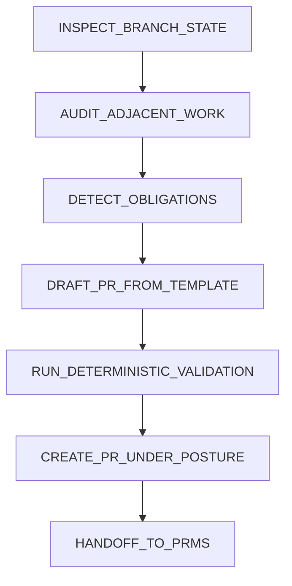

# PR-PREP-SPECIALIST Canonical Workflow Sequence

## Mandatory Workflow

All implementations MUST execute this exact 7-step sequence in order:



## Step 1: INSPECT_BRANCH_STATE

### Inputs
- Current repository state
- Git branch information
- Configuration files

### Process
1. Detect current branch name
2. Identify base branch
3. Count commits since divergence
4. List changed files
5. Classify branch type (feature/hotfix/bugfix)
6. Validate branch naming convention

### Outputs
```json
{
  "branch_name": "<current_branch>",
  "base_branch": "<base_branch>",
  "commit_count": <number>,
  "changed_files": [<file_list>],
  "branch_type": "<feature|hotfix|bugfix>",
  "naming_valid": <boolean>,
  "timestamp": "<iso8601_timestamp>"
}
```

### Validation Gates
- ✅ Branch name follows convention
- ✅ Base branch exists
- ✅ Commit count is reasonable (< 1000)
- ✅ Changed files list complete

## Step 2: AUDIT_ADJACENT_WORK

### Inputs
- BRANCH_STATE.json
- GitHub API access
- Repository configuration

### Process
1. Query open PRs targeting base branch
2. Check for overlapping file changes
3. Assess merge conflict risk
4. Identify related work
5. Detect potential dependencies

### Outputs
```json
{
  "open_prs": [<pr_list>],
  "overlapping_files": [<file_list>],
  "conflict_risk": "<low|medium|high>",
  "related_work": [<pr_list>],
  "dependencies": [<pr_list>],
  "timestamp": "<iso8601_timestamp>"
}
```

### Validation Gates
- ✅ All open PRs checked
- ✅ Overlap detection complete
- ✅ Conflict risk assessed
- ✅ No false negatives

## Step 3: DETECT_OBLIGATIONS

### Inputs
- BRANCH_STATE.json
- BRANCH_AUDIT_REPORT.json
- Repository configuration

### Process
1. Check for changelog updates needed
2. Detect documentation updates needed
3. Identify test updates needed
4. Determine version bump required
5. Check for breaking changes
6. Validate all obligations

### Outputs
```json
{
  "changelog_required": <boolean>,
  "documentation_required": <boolean>,
  "tests_required": <boolean>,
  "version_bump": "<major|minor|patch|none>",
  "breaking_changes": <boolean>,
  "obligations_valid": <boolean>,
  "timestamp": "<iso8601_timestamp>"
}
```

### Validation Gates
- ✅ All obligation types checked
- ✅ Version bump logic correct
- ✅ Breaking changes detected
- ✅ No false positives/negatives

## Step 4: DRAFT_PR_FROM_TEMPLATE

### Inputs
- CHANGESET_OBLIGATION_REPORT.json
- PR templates
- Repository configuration

### Process
1. Select appropriate PR template
2. Populate template with branch data
3. Include all detected obligations
4. Generate PR title
5. Create PR body
6. Validate PR content

### Outputs
```json
{
  "pr_title": "<generated_title>",
  "pr_body": "<generated_body>",
  "template_used": "<template_name>",
  "obligations_included": <boolean>,
  "validation_passed": <boolean>,
  "timestamp": "<iso8601_timestamp>"
}
```

And rendered markdown:
```markdown
# <PR Title>

## Description
<Generated description>

## Changes
- Change 1
- Change 2

## Obligations
- ✅ Changelog updated
- ✅ Documentation updated
- ✅ Tests added

## Related Work
- #123
- #456
```

### Validation Gates
- ✅ Template correctly selected
- ✅ All obligations included
- ✅ PR title follows convention
- ✅ PR body complete
- ✅ Validation passes

## Step 5: RUN_DETERMINISTIC_VALIDATION

### Inputs
- All previous outputs
- Validation rules
- Repository configuration

### Process
1. Validate workflow sequence
2. Check output completeness
3. Verify decision consistency
4. Apply blocking criteria
5. Generate final decision

### Outputs
```json
{
  "workflow_valid": <boolean>,
  "outputs_complete": <boolean>,
  "decisions_consistent": <boolean>,
  "blocking_issues": [<issue_list>],
  "warnings": [<warning_list>],
  "final_decision": "<APPROVE|REJECT|BLOCK>",
  "timestamp": "<iso8601_timestamp>"
}
```

### Validation Gates
- ✅ Workflow sequence correct
- ✅ All outputs present
- ✅ Decisions consistent
- ✅ Blocking criteria applied
- ✅ Final decision justified

## Step 6: CREATE_PR_UNDER_POSTURE

### Inputs
- FINAL_PREP_DECISION.json
- PR_DRAFT_PACKAGE.json
- GitHub API access

### Process
1. Check governing posture
2. Create PR with exact content
3. Handle GitHub API requirements
4. Validate PR creation
5. Generate creation report

### Outputs
```json
{
  "governing_posture": "<GO_DRAFT_FIRST|GO_DIRECT|AWAIT_REVIEW>",
  "pr_created": <boolean>,
  "pr_number": <number>,
  "pr_url": "<url>",
  "creation_success": <boolean>,
  "timestamp": "<iso8601_timestamp>"
}
```

### Validation Gates
- ✅ Posture respected
- ✅ PR content exact
- ✅ GitHub API handled
- ✅ Creation successful
- ✅ Report complete

## Step 7: HANDOFF_TO_PRMS

### Inputs
- All previous outputs
- Handoff contract template

### Process
1. Collect all authoritative artifacts
2. Create handoff bundle
3. Validate bundle structure
4. Document chain of custody
5. Emit handoff bundle

### Outputs
```json
{
  "handoff_id": "TP-PRPS-<number>-HANDOFF-<sequence>",
  "source_skill": "pr-prep-specialist",
  "target_skill": "pr-merge-specialist",
  "run_id": "<skill>-<yyyymmdd>-<sequence>",
  "repo": "<repository_name>",
  "branch": "<branch_name>",
  "base_branch": "<base_branch>",
  "pr_number": <pr_number>,
  "governing_posture": "<GO_DRAFT_FIRST|GO_DIRECT|AWAIT_REVIEW>",
  "recommended_next_step": "<AWAIT_REVIEW|MERGE_READY|BLOCKED>",
  "authoritative_artifacts": [
    "BRANCH_STATE.json",
    "BRANCH_AUDIT_REPORT.json",
    "CHANGESET_OBLIGATION_REPORT.json",
    "PR_DRAFT_PACKAGE.json",
    "PR_BODY_RENDERED.md",
    "FINAL_PREP_DECISION.json",
    "PR_CREATION_REPORT.json"
  ],
  "supporting_artifacts": [],
  "warnings": [],
  "blocking_reasons": [],
  "chain_of_custody": {
    "parent_bundle_ids": [],
    "created_at": "<iso8601_timestamp>",
    "skill_version": "<version>"
  }
}
```

### Validation Gates
- ✅ All artifacts included
- ✅ Bundle structure valid
- ✅ Chain of custody documented
- ✅ Handoff complete

## Workflow Consistency Requirements

### Identical Across All Platforms
1. **Step Sequence**: Exact 7-step order
2. **Input/Output Contracts**: Identical schemas
3. **Decision Logic**: Same criteria and thresholds
4. **Validation Gates**: Uniform pass/fail conditions
5. **Handoff Structure**: Identical bundle format

### Platform-Specific Adaptations
1. **Instruction Format**: Tool-optimized syntax
2. **Invocation Method**: Platform-native approach
3. **Metadata**: Tool-specific fields
4. **Error Handling**: Platform-appropriate messages
5. **Performance**: Tool-optimized execution

## Validation and Testing

### Automated Validation
- Schema validation for all outputs
- Workflow sequence verification
- Decision consistency checking
- Handoff structure validation

### Compliance Testing
- Cross-platform behavior comparison
- Decision consistency across inputs
- Artifact completeness verification
- Chain of custody validation

### Performance Testing
- Execution time benchmarks
- Resource utilization monitoring
- Platform-specific optimizations

## Governance Integration

### Compliance Monitoring
- Automated workflow validation
- Handoff structure verification
- Decision consistency tracking
- Artifact completeness checking

### Reporting
- Workflow execution logs
- Validation results
- Compliance reports
- Performance metrics

## Versioning and Evolution

### Backward Compatibility
- New steps may be added at end
- Existing steps may not be modified
- Output schemas may be extended
- Decision logic may be refined

### Deprecation Process
- Mark steps as deprecated
- Maintain old behavior
- Provide migration path
- Remove in major version

## Implementation Checklist

- [ ] Step 1: INSPECT_BRANCH_STATE implemented
- [ ] Step 2: AUDIT_ADJACENT_WORK implemented
- [ ] Step 3: DETECT_OBLIGATIONS implemented
- [ ] Step 4: DRAFT_PR_FROM_TEMPLATE implemented
- [ ] Step 5: RUN_DETERMINISTIC_VALIDATION implemented
- [ ] Step 6: CREATE_PR_UNDER_POSTURE implemented
- [ ] Step 7: HANDOFF_TO_PRMS implemented
- [ ] All validation gates implemented
- [ ] Cross-platform consistency verified
- [ ] Governance compliance confirmed

## Exit Criteria

Workflow implementation complete when:
1. ✅ All 7 steps implemented
2. ✅ Identical behavior across platforms
3. ✅ Validation gates pass 100%
4. ✅ Handoff contract identical
5. ✅ Governance compliance verified
6. ✅ Chain of custody documented
