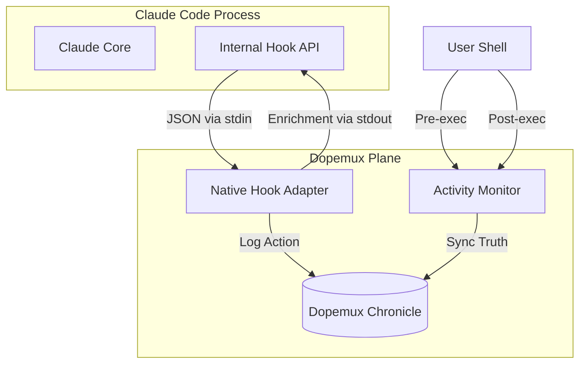

# Dopemux Hook System: The Cognitive Nervous System

Dopemux integrates with Claude Code through a sophisticated, deterministic hook system. This architecture ensures that Dopemux intelligence is present throughout the entire development lifecycle, acting as a "Cognitive Nervous System" that perceives and reacts to every action.

## 1. High-Level Architecture

The hook system is split into **Native Internal Hooks** (deep integration) and **External Shell Hooks** (environment monitoring).



---

## 2. Native Internal Hooks (The Deep Dive)

These hooks are the most powerful integration point. They allow Dopemux to "think" alongside Claude by intercepting events before and after inference.

### The Verified Lifecycle

Dopemux implements the following 10 lifecycle events:

| Event | Logic Tier | Dopemux Strategy |
| :--- | :--- | :--- |
| `SessionStart` | **Wisdom** | Injects the "Mental Map" and active project goals. |
| `UserPromptSubmit` | **Context** | Performs semantic recall to ground the prompt in repo truth. |
| `PreToolUse` | **Guardrail** | Validates tool parameters against security and complexity policies. |
| `PermissionRequest` | **Automation** | Auto-approves safe actions based on the active persona. |
| `PostToolUse` | **Memory** | Captures successful edits/commands into the permanent log. |
| `PostToolUseFailure` | **Repair** | Analyzes errors to suggest automated remediation paths. |
| `Stop` | **Analysis** | Records the completion of a thought cycle. |
| `SubagentStop` | **Analysis** | Tracks sub-agent efficiency and context handoffs. |
| `PreCompact` | **Optimization** | Prunes the context window to preserve critical logic. |
| `SessionEnd` | **Persistence** | Flushes all local instance state to the global ConPort graph. |

### The "White Box" Trace
Every hook execution is logged. You can see exactly what Dopemux is injecting by tailing the instance logs:
```bash
tail -f ~/.dopemux/instances/A/logs/actions.jsonl
```

---

## 3. External Shell & File Hooks

While native hooks see what *Claude* does, shell hooks see what *you* do.

*   **Dopemux Daemon**: A background process (`monitor_daemon.py`) that watches for file changes using `watchdog`.
*   **Idempotent Sourcing**: The installer wires `preexec` and `precmd` into your shell RC. These hooks detect when you run `claude` and ensure the Dopemux environment is ready before the first prompt appears.

## 4. Safety & Redaction (INV-MEM-005)

**Dopemux never leaks secrets.**
All hook data passes through a multi-pass redaction engine before injection:
1.  **Regex Scrubber**: Removes high-entropy strings matching API key patterns.
2.  **Key-Value Masker**: Redacts known environment variables (e.g. `ANTHROPIC_API_KEY`).
3.  **Fail-Closed Gate**: If the masker detects an un-maskable high-risk pattern, the hook exits with code `2`, blocking the prompt from being sent to the LLM.

---

## 5. Summary: Why This Matters
For ADHD developers, the biggest risk is **Context Leakage**—forgetting why a change was made or what the "big picture" goal is. By wiring into every lifecycle event, Dopemux ensures that the "Why" is always present, automatically preserved, and ready to be recalled.

🧠 **Stay focused. The system has your back.**
