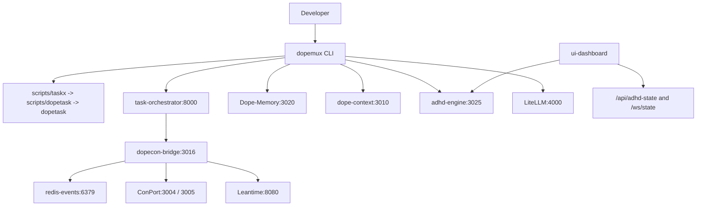

# Dopemux MVP - Full Codebase Explainer

This explainer is grounded in active runtime code and config in this checkout, especially `pyproject.toml`, `compose.yml`, `services/registry.yaml`, `src/dopemux/pm/writes.py`, `scripts/taskx`, `scripts/dopetask`, `services/task-orchestrator/app/main.py`, `services/dopecon-bridge/dopecon_bridge/routes.py`, `services/working-memory-assistant/dope_memory_main.py`, `ui-dashboard/package.json`, and `ui-dashboard/src/App.tsx`.

Older docs in this repo drift. Where authority is unresolved, this document keeps the ambiguity explicit instead of flattening the system into a single neat architecture.

## What Is It?

Dopemux is an ADHD-aware developer operations stack. Its core idea is that flow breaks when terminal state, project state, memory, AI tooling, and attention signals live in separate places. Dopemux tries to keep those surfaces coordinated.

It is not one application. It is a composed workspace of cooperating systems with separate authority domains:

- the `dopemux` CLI is the operator control surface
- task execution is delegated to an external `dopetask` binary
- workflow and PM writes are split across multiple systems
- memory, context retrieval, routing, and UI each have their own runtime surfaces

## Technology Stack

| Layer | Technology |
| --- | --- |
| CLI / core library | Python 3.11+, Click, Rich |
| Services | FastAPI-based Python services |
| Dashboard UI | React, TypeScript, Vite, Material UI, `lucide-react` |
| Structured graph / decision store | PostgreSQL with Apache AGE |
| Vector search | Qdrant |
| Event and cache layers | Redis (`redis-events` on `6379`, `redis-primary` on `6380`) |
| AI proxy | LiteLLM |
| PM surfaces | Leantime, task-orchestrator, ConPort, dope-memory mirror receipts |
| Runtime orchestration | Docker Compose via canonical `compose.yml` |
| Testing and quality | pytest, mypy, Black, isort, flake8 |
| External task execution | `dopetask`, pinned in this repo at `0.5.1` via `.dopetask-pin` |

## Repository Structure

```text
dopemux-mvp/
├── src/dopemux/            # Core CLI, PM layer, ADHD modules, tmux/UI helpers
├── services/               # Service apps, MCP servers, adapters, and related runtimes
├── ui-dashboard/           # React/TypeScript dashboard
├── ui-dashboard-backend/   # Dashboard backend support code
├── docker/                 # Container build contexts and runtime support
├── scripts/                # Operational wrappers and helper scripts
├── tests/                  # Pytest suite for core package behavior
├── docs/                   # Diataxis documentation tree
├── compose.yml             # Canonical Docker Compose runtime
└── services/registry.yaml  # Service ports, health endpoints, compose names
```

## The 9 Core Systems

### 1. `dopemux` CLI (`src/dopemux/`)

This is the operator-facing control plane. It is a Click CLI with Rich output and ADHD-oriented session helpers.

Observed responsibilities in code include:

- workspace and service startup through `dopemux start`
- session/health/status surfaces such as `status`, `dashboard`, `doctor`, and `truth`
- ADHD tracking through `src/dopemux/adhd/`
- PM normalization through `src/dopemux/pm/`
- MCP management through `src/dopemux/mcp/`
- tmux integration through `src/dopemux/tmux/`
- Claude and tool configuration through `src/dopemux/claude/` and `src/dopemux/claude_tools/`

Important subpackages visible in this checkout:

- `adhd/`
- `pm/`
- `mcp/`
- `tmux/`
- `ui/`
- `claude/`
- `roles/`
- `worktree`-related helpers across `cli.py`, `cli_worktree_enhanced.py`, and related modules

### 2. `dopetask` wrapper surface (`scripts/taskx`, `scripts/dopetask`)

Task execution is not implemented directly in this repo. The runtime chain is:

```text
dopemux -> scripts/taskx -> scripts/dopetask -> external dopetask binary
```

Repo truth here:

- `scripts/taskx` is a compatibility shim only
- `scripts/dopetask` manages a dedicated virtualenv and installs the pinned binary
- `.dopetask-pin` in this checkout pins `dopetask==0.5.1`

### 3. task-orchestrator (`services/task-orchestrator/`, port `8000`)

This is the workflow coordination surface. The intended FastAPI runtime entrypoint is `services/task-orchestrator/app/main.py`.

Observed responsibilities include:

- workflow/coordination APIs
- idea and epic CRUD
- workflow transition and audit surfaces
- project workflow state routes
- MCP tool exposure through its own server wiring

Within the PM split, this is the intended authority for workflow-significant transitions. That matches `src/dopemux/pm/writes.py`, which routes transition writes to the orchestrator path.

### 4. ConPort (`conport-http` on `3004`, `conport-mcp` on `3005`)

ConPort is the structured context, decision, and progress surface. `services/registry.yaml` distinguishes:

- HTTP API on `3004`
- MCP/SSE surface on `3005`

In practice it is used for:

- decisions
- progress records
- custom data
- structured project context

Its backing infrastructure is PostgreSQL with AGE. In the PM plane, it is the canonical decision/progress logging target, not the workflow transition authority.

### 5. Dope-Memory / working-memory-assistant naming surface (`services/working-memory-assistant/`, port `3020`)

The active HTTP runtime for the chronicle service lives in `services/working-memory-assistant/dope_memory_main.py`, which exposes a FastAPI app on port `3020`.

Observed responsibilities include:

- temporal chronicle capture
- canonical SQLite ledger management
- work log and reflection storage
- memory receipt and history surfaces
- MCP server support in `services/working-memory-assistant/mcp/server.py`

Important caveat: naming and directory authority drift here. This repo has both `services/working-memory-assistant/` and `services/dope-memory/`. The runtime and tests show a canonical SQLite chronicle ledger model, but the directory story is not perfectly unified.

### 6. dope-context (`services/dope-context/`, port `3010`)

Dope-context is the semantic code and document retrieval service.

Observed responsibilities include:

- code search and document search via MCP
- Qdrant-backed retrieval and reranking
- embeddings, contextual enrichment, and token-budgeted search responses
- attention-aware result shaping tied to ADHD signals

The active MCP surface in this checkout is visible in `services/dope-context/src/mcp/simple_server.py`, which defaults to port `3010`. It is a derived indexer and retrieval plane, not a source-of-truth owner.

### 7. dopecon-bridge (`services/dopecon-bridge/`, port `3016`)

Dopecon-bridge is an adapter and routing layer.

The most important truth statement is in `services/dopecon-bridge/dopecon_bridge/routes.py` itself:

- it is an adapter and proxy layer
- it must not act as canonical task, workflow, decision, or progress authority

Observed roles include:

- PM route normalization
- event publishing
- ConPort proxying
- compatibility routing for legacy callers

It also has an alternate port entry in `services/registry.yaml` (`3000` -> `3016`), which reinforces that the bridge should be treated as plumbing, not authority.

### 8. ADHD engine and Serena (`services/adhd_engine/`, `services/serena/`; ports `3025` and `3006`)

These are the cognitive support surfaces.

Observed ADHD-engine responsibilities include:

- attention and energy state events
- break recommendation signals
- hyperfocus detection support
- integration hooks for other services

Observed Serena responsibilities include:

- focus-state management
- break reminders and hyperfocus protection
- MCP-oriented developer assistance
- navigation and code-intelligence support

`services/registry.yaml` maps:

- `adhd-engine` to port `3025`
- `serena` to port `3006`

### 9. repo-truth-extractor (`services/repo-truth-extractor/`)

This is the audit and repo-truth extraction subsystem. The canonical runner named by repo instructions is:

- `services/repo-truth-extractor/run_extraction_v5.py`

It exists to generate evidence-backed reports about the current repo and to detect doc/runtime drift instead of hand-waving it away.

## Infrastructure Services

| Service | Port | Purpose |
| --- | --- | --- |
| PostgreSQL + AGE | `5432` | Decision graph / structured storage |
| Redis Events | `6379` | Event streaming / PubSub |
| Redis Primary | `6380` | Cache layer |
| Qdrant | `6333` | Vector search backend |
| LiteLLM | `4000` | Model proxy |
| Leantime | `8080` | PM entity store / UI |

## How The Systems Connect



This is a coordination map, not a claim that every edge is canonical authority. Authority is split intentionally and, in a few places, imperfectly.

## PM Plane: How Project Management Is Split

The PM layer is divided by write type, not by a single backend. `src/dopemux/pm/writes.py` is the relevant code authority here.

| Write type | Authority |
| --- | --- |
| Passive metadata such as title, description, assignee, labels | Leantime via `pm_update_work_item()` |
| Workflow-significant transitions | task-orchestrator via `pm_transition_work_item()` |
| Decisions and progress logging | ConPort via `pm_log_progress()` |
| Historical receipts / chronicle mirror | dope-memory memory receipts |

The routing logic is explicit:

- `classify_pm_write()` separates metadata fields from workflow-significant fields
- workflow-significant keys fail closed into the orchestrator path
- mirror receipts are tracked explicitly instead of hidden

## UX Surfaces

### Terminal first

The primary operator experience is still terminal-centric:

- Rich-rendered status and health views
- tmux-aware session handling
- ADHD metrics via `AttentionMonitor`
- task and context helpers via `TaskDecomposer` and `ContextManager`
- CLI health, truth, dashboard, extraction, and diagnostic commands

### Web dashboard

The dashboard is a React/TypeScript Vite app in `ui-dashboard/`.

Observed frontend facts:

- dependencies include Material UI and `lucide-react`
- `ui-dashboard/src/App.tsx` calls `.../api/adhd-state`
- it opens a WebSocket to `.../ws/state`
- it renders Energy Level, Attention Focus, Cognitive Load, and a 15-minute prediction
- it includes a `Live Signal Feed`
- layout behavior changes when cognitive load becomes critical

### MCP and AI-assistant surface

This repo exposes multiple MCP-facing systems that can be used by external coding assistants:

- ConPort
- dope-context
- Serena
- task-orchestrator MCP tools
- additional MCP services listed in `services/registry.yaml`, including PAL

The important boundary is that these tools expose retrieval, logging, or assistance surfaces. They do not collapse PM truth, workflow truth, and memory truth into one shared authority.

## Known Fragmentation and Honest Caveats

- `dopetask` is pinned at `0.5.1` in this checkout, so older `0.2.x` references are stale.
- `scripts/taskx` is a compatibility shim, not a separate runtime.
- task-orchestrator runtime authority is still not perfectly clean across code, packaging, and Docker wiring.
- ConPort is exposed on both `3004` and `3005`, depending on whether callers want HTTP or MCP/SSE.
- dope-memory naming and directory layout drift across `services/working-memory-assistant/` and `services/dope-memory/`.
- agent-system authority remains unresolved across multiple families in this repo; there is no single verified agent architecture to document as canonical.
- dopecon-bridge is broad and tempting to treat as a control plane, but its active routes explicitly mark it as adapter-only.
- Older architecture prose in the repo should be treated as advisory until confirmed against code, config, and tests.

## Bottom Line

Dopemux is best understood as a terminal-first operator shell over a split system:

- CLI control and developer ritual management in `src/dopemux/`
- external task execution through `dopetask`
- workflow coordination through task-orchestrator
- decision/progress context through ConPort
- temporal memory through dope-memory
- semantic retrieval through dope-context
- cognitive accommodations through ADHD engine and Serena
- runtime composition through `compose.yml`

That split is not a defect by itself. The risk is pretending the split does not exist. The safest mental model for this repo is a composed workspace with explicit authority boundaries, some intentional and some still drifting.
