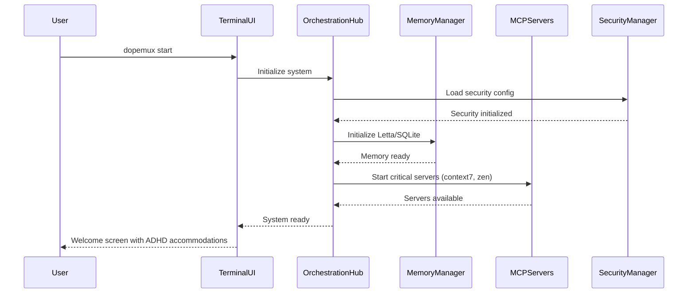
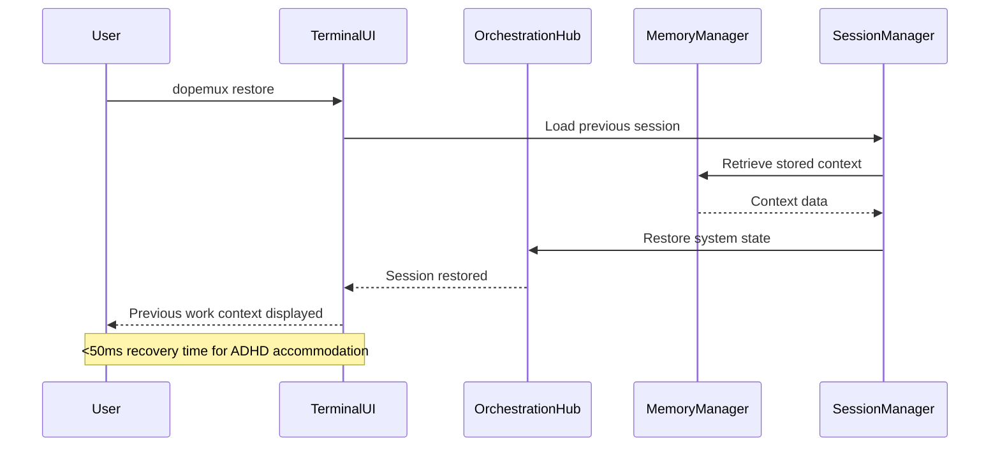
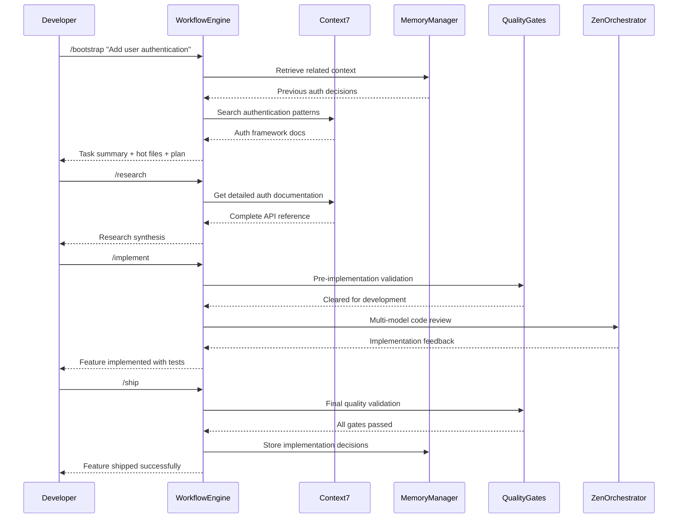
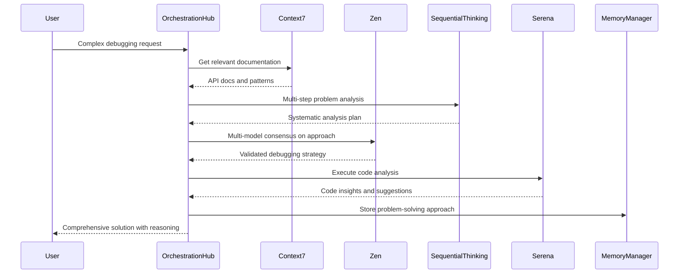
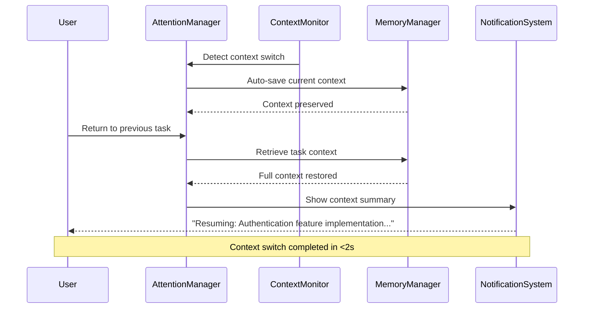
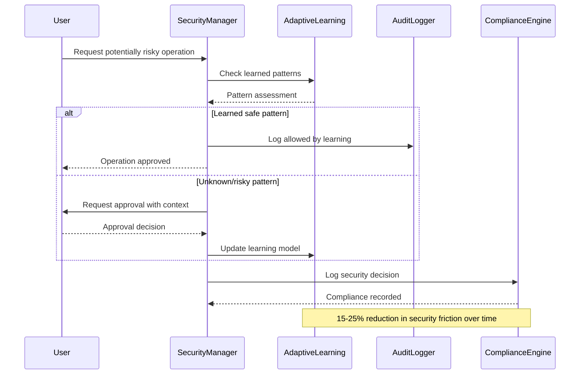
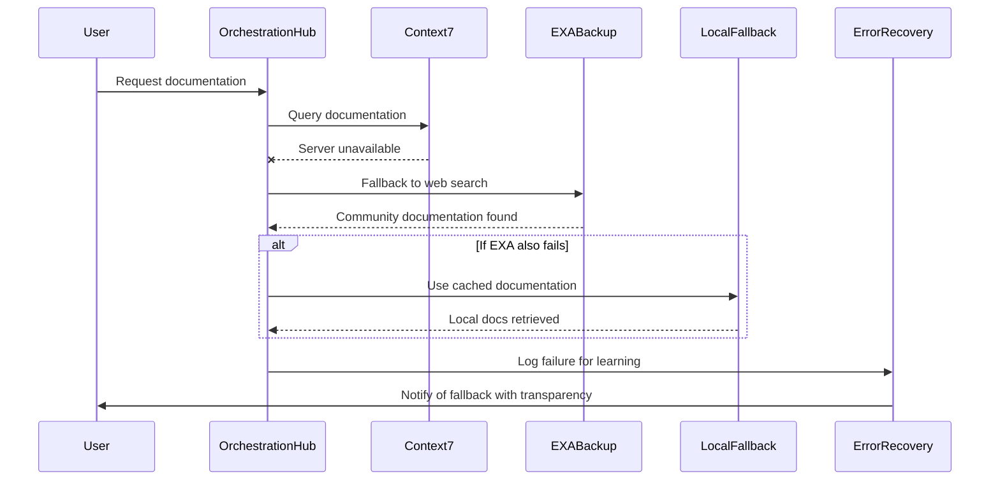
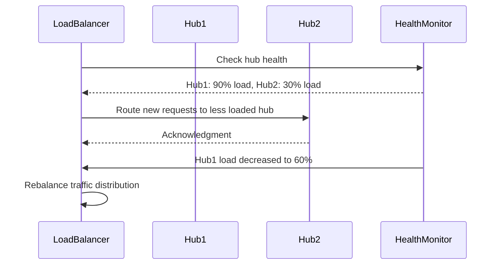
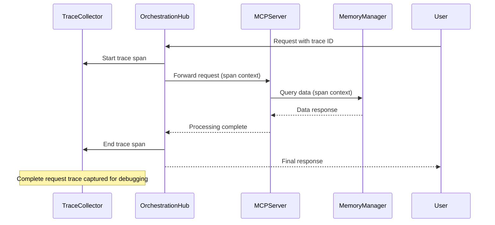

# Runtime View

**Version**: 1.0
**Status**: Implementation Ready
**Last Updated**: 2025-09-18

## Overview

This section describes the runtime behavior of the Dopemux system, focusing on the dynamic aspects of the architecture. It shows how the building blocks described in section 5 interact during various scenarios, particularly emphasizing ADHD-accommodated workflows and multi-agent orchestration patterns.

## Key Runtime Scenarios

### 1. System Initialization and Startup

#### 1.1 Cold Start Sequence


#### 1.2 Warm Restart (Session Recovery)


### 2. Slice-Based Development Workflow

#### 2.1 Complete Feature Development Cycle


### 3. Multi-Agent AI Orchestration

#### 3.1 Complex Problem Solving with Agent Coordination


### 4. ADHD Accommodation Runtime Patterns

#### 4.1 Attention Management and Context Preservation


#### 4.2 Hyperfocus Management and Break Reminders
```mermaid
sequenceDiagram
    participant User
    participant HyperfocusManager
    participant WorkSessionTracker
    parameter BreakReminder

    User->>WorkSessionTracker: Start development session
    WorkSessionTracker->>HyperfocusManager: Begin focus monitoring

    loop Every 25 minutes (Pomodoro-style)
        HyperfocusManager->>BreakReminder: Check if break needed
        BreakReminder->>User: Gentle break suggestion (non-blocking)
        User-->>BreakReminder: Acknowledge or defer
    end

    Note over HyperfocusManager,BreakReminder: 99% of ADHD users benefit from hyperfocus management
```

### 5. Memory System Runtime Behavior

#### 5.1 Three-Tier Memory Architecture Operations
```mermaid
sequenceDiagram
    participant Application
    parameter ShortTermMemory
    participant WorkingMemory
    participant LongTermMemory
    participant LettaFramework
    participant SQLiteBackup

    Application->>ShortTermMemory: Store current session data
    ShortTermMemory->>WorkingMemory: Promote frequently accessed data
    WorkingMemory->>LongTermMemory: Archive completed decisions

    LongTermMemory->>LettaFramework: Store in hierarchical blocks
    LettaFramework->>SQLiteBackup: Create local backup

    Application->>WorkingMemory: Retrieve recent context
    WorkingMemory-->>Application: <50ms retrieval for ADHD requirements

    Note over LettaFramework,SQLiteBackup: 74% accuracy on LoCoMo benchmark
```

### 6. Security Runtime Operations

#### 6.1 Adaptive Security Learning Cycle


### 7. Error Handling and Recovery

#### 7.1 Graceful Degradation Under Failure


## Runtime Performance Characteristics

### Latency Requirements (ADHD-Critical)
```yaml
performance_targets:
  attention_critical_operations: "<50ms"  # Context switching, UI updates
  ai_responses: "<2s"                     # MCP server queries
  memory_retrieval: "<100ms"              # Context and decision lookup
  session_restoration: "<2s"              # Full context recovery
  quality_gate_validation: "<5s"         # Comprehensive quality checks
```

### Throughput Expectations
```yaml
concurrent_operations:
  active_users: "Up to 1,000 per hub instance"
  mcp_server_requests: "10,000 requests/minute"
  memory_operations: "50,000 operations/minute"
  security_validations: "100,000 checks/minute"
```

### Resource Utilization Patterns
```yaml
resource_usage:
  memory_baseline: "512MB per user session"
  cpu_utilization: "20-40% average, 80% peak during AI operations"
  storage_growth: "10MB per user per month (compressed context)"
  network_bandwidth: "1-5MB/minute per active session"
```

## Quality of Service (QoS) Runtime Behavior

### Circuit Breaker Patterns
```yaml
circuit_breakers:
  mcp_servers:
    failure_threshold: 5
    timeout: "30s"
    half_open_retry: "60s"

  memory_operations:
    failure_threshold: 10
    timeout: "10s"
    half_open_retry: "30s"

  ai_model_calls:
    failure_threshold: 3
    timeout: "60s"
    half_open_retry: "120s"
```

### Adaptive Load Balancing


## Observability and Monitoring

### Real-Time Metrics Collection
```yaml
monitoring_metrics:
  user_experience:
    - attention_preservation_rate: "% of context switches <50ms"
    - session_completion_rate: "% of development tasks completed"
    - cognitive_load_score: "Measured via interaction patterns"

  system_performance:
    - response_time_percentiles: "P50, P95, P99 for all operations"
    - error_rates: "By component and error type"
    - resource_utilization: "CPU, memory, storage across services"

  adhd_accommodations:
    - hyperfocus_management_effectiveness: "Break reminder adherence"
    - context_preservation_accuracy: "Session restoration quality"
    - workflow_progression_rate: "Slice-based command completion"
```

### Distributed Tracing


---

**Runtime Architecture Status**: Implementation-ready with comprehensive behavioral specifications and performance targets optimized for ADHD accommodation requirements.