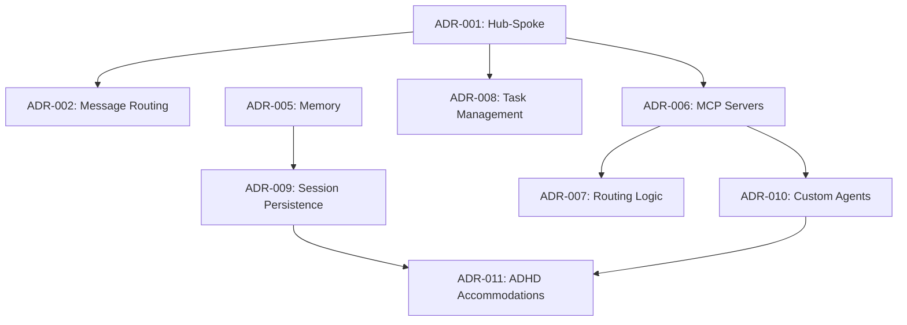

# Architecture Decision Records (ADR) Index

## Overview

This document provides a comprehensive index of all architectural decisions for the Dopemux platform. Each ADR documents a significant architectural decision, its context, rationale, and consequences.

## ADR Status Legend

- **✅ Accepted**: Decision has been approved and is being implemented
- **🔄 Proposed**: Decision is under review
- **📚 Superseded**: Decision has been replaced by a newer ADR
- **❌ Rejected**: Decision was considered but not adopted

## Core Architecture Decisions (ADR-001 to ADR-005)

| ADR | Title | Status | Summary |
|-----|-------|---------|---------|
| [ADR-001](./ADR-001-hub-and-spoke-architecture.md) | Hub-and-Spoke Architecture | ✅ Accepted | Central orchestration hub with specialized spoke services for scalability and maintainability |
| [ADR-002](./ADR-002-message-routing-async.md) | Message Routing and Async Communication | ✅ Accepted | Event-driven message routing with async patterns for responsive ADHD-accommodated interactions |
| [ADR-003](./ADR-003-editor-implementation.md) | Editor Implementation | ✅ Accepted | Helix editor fork with custom AI integration layer and tree-sitter AST support |
| [ADR-004](./ADR-004-visual-workflow-ui.md) | Visual Workflow UI | ✅ Accepted | ASCII art pipeline visualization in terminal for workflow representation |
| [ADR-005](./ADR-005-memory-architecture.md) | Memory Architecture | ✅ Accepted | Letta Framework as primary memory system with SQLite fallback |

## Integration and Infrastructure (ADR-006 to ADR-009)

| ADR | Title | Status | Summary |
|-----|-------|---------|---------|
| [ADR-006](./ADR-006-mcp-server-selection.md) | MCP Server Selection and Priority | ✅ Accepted | zen-mcp primary orchestrator with context7, serena, sequential-thinking support |
| [ADR-007](./ADR-007-routing-logic-architecture.md) | Routing Logic Architecture | ✅ Accepted | Provider-agnostic routing with adaptive fallback across Claude, OpenRouter, and alternatives |
| [ADR-008](./ADR-008-task-management-integration.md) | Task Management Integration | ✅ Accepted | Leantime + Claude-Task-Master integration via MCP for AI-enhanced project management |
| [ADR-009](./ADR-009-session-management-persistence.md) | Session Management and Persistence | ✅ Accepted | Multi-tiered memory architecture with Letta Framework and Redis for context preservation |

## Advanced Features and Specialization (ADR-010 to ADR-011)

| ADR | Title | Status | Summary |
|-----|-------|---------|---------|
| [ADR-010](./ADR-010-custom-agent-rnd-strategy.md) | Custom Agent R&D Strategy | ✅ Accepted | Hybrid approach: Claude-flow today with gradual migration to custom agent system |
| [ADR-011](./ADR-011-adhd-accommodation-technical-decisions.md) | ADHD Accommodation Technical Decisions | ✅ Accepted | Comprehensive ADHD support through terminal-optimized accommodations and AI assistance |

## Decision Categories

### 🏗️ System Architecture
- **ADR-001**: Hub-and-Spoke Architecture
- **ADR-002**: Message Routing and Async Communication
- **ADR-007**: Routing Logic Architecture
- **ADR-009**: Session Management and Persistence

### 🤖 AI and Agent Systems
- **ADR-006**: MCP Server Selection and Priority
- **ADR-010**: Custom Agent R&D Strategy

### 🔧 Development Tools
- **ADR-003**: Editor Implementation
- **ADR-004**: Visual Workflow UI
- **ADR-008**: Task Management Integration

### 🧠 Memory and Context
- **ADR-005**: Memory Architecture
- **ADR-009**: Session Management and Persistence

### ♿ ADHD Accommodations
- **ADR-011**: ADHD Accommodation Technical Decisions
- **ADR-002**: Message Routing (ADHD latency requirements)
- **ADR-009**: Session Management (context preservation)

## Decision Timeline

### Phase 1: Foundation Architecture (Weeks 1-8)
- **ADR-001**: Hub-and-Spoke Architecture
- **ADR-002**: Message Routing and Async Communication
- **ADR-005**: Memory Architecture

### Phase 2: Editor and AI Integration (Weeks 9-16)
- **ADR-003**: Editor Implementation
- **ADR-006**: MCP Server Selection
- **ADR-007**: Routing Logic Architecture

### Phase 3: Advanced Features (Weeks 17-24)
- **ADR-004**: Visual Workflow UI
- **ADR-008**: Task Management Integration
- **ADR-009**: Session Management and Persistence

### Phase 4: Specialization and Optimization (Weeks 25-32)
- **ADR-010**: Custom Agent R&D Strategy
- **ADR-011**: ADHD Accommodation Technical Decisions

## Cross-Decision Dependencies

### Strong Dependencies

### Weak Dependencies
- **ADR-003** (Editor) influences **ADR-004** (Visual UI) - shared terminal interface
- **ADR-007** (Routing) supports **ADR-011** (ADHD) - response time optimization
- **ADR-008** (Task Management) enhances **ADR-011** (ADHD) - executive function support

## Implementation Priority Matrix

### High Priority (Critical Path)
1. **ADR-001**: Hub-and-Spoke Architecture - Foundation for all other decisions
2. **ADR-005**: Memory Architecture - Required for context preservation
3. **ADR-006**: MCP Server Selection - Enables AI integration
4. **ADR-009**: Session Management - Critical for ADHD accommodations

### Medium Priority (Supporting Infrastructure)
5. **ADR-002**: Message Routing - Supports async communication
6. **ADR-007**: Routing Logic - Enables provider flexibility
7. **ADR-011**: ADHD Accommodations - Core platform value

### Lower Priority (Enhancement Features)
8. **ADR-003**: Editor Implementation - Can use external editor initially
9. **ADR-008**: Task Management - Can use external tools initially
10. **ADR-004**: Visual Workflow UI - Enhancement over basic interface
11. **ADR-010**: Custom Agents - Long-term strategic initiative

## Quality Attributes Addressed

### Performance
- **ADR-002**: <50ms latency for ADHD-critical operations
- **ADR-007**: Provider-specific routing for optimal response times
- **ADR-009**: Multi-tier memory for performance optimization

### Reliability
- **ADR-001**: Hub-and-spoke provides failure isolation
- **ADR-007**: Automatic failover between providers
- **ADR-009**: Session state preservation and recovery

### Scalability
- **ADR-001**: Spoke services scale independently
- **ADR-006**: Multiple MCP servers for load distribution
- **ADR-010**: Agent scaling from 1 to 64+ agents

### Security
- **ADR-007**: Provider isolation and access control
- **ADR-008**: OAuth 2.0 integration with task management
- **ADR-009**: Encrypted storage and data protection

### Usability (ADHD Focus)
- **ADR-011**: Comprehensive ADHD accommodations
- **ADR-002**: Responsive interactions prevent attention loss
- **ADR-009**: Context preservation reduces cognitive load

## Decision Rationale Summary

### Technical Excellence
- **Standards-Based**: MCP protocol, OAuth 2.0, JSON-RPC
- **Performance-Focused**: Sub-50ms latencies for attention preservation
- **Scalable Design**: Hub-and-spoke with independent scaling
- **Fault-Tolerant**: Circuit breakers and graceful degradation

### ADHD Accommodation
- **Evidence-Based**: Grounded in academic research (d = 1.62-2.03 deficits)
- **Comprehensive**: Addresses working memory, executive function, time blindness
- **Terminal-Optimized**: Purpose-built for command-line development
- **User-Centered**: Continuous learning and adaptation

### Strategic Positioning
- **Vendor Independence**: Multi-provider routing and fallbacks
- **Future-Proof**: Extensible architecture for emerging AI capabilities
- **Open Standards**: Interoperable with existing development tools
- **Competitive Advantage**: First comprehensively ADHD-accommodated platform

## Documentation Standards

### ADR Format
All ADRs follow the standard format:
1. **Status**: Current state of the decision
2. **Context**: Problem and constraints
3. **Decision**: What was decided
4. **Rationale**: Why this decision was made
5. **Consequences**: Positive, negative, and risk implications
6. **Related Decisions**: Cross-references to other ADRs

### Review Process
- All ADRs undergo technical review before acceptance
- ADHD accommodation decisions include user validation
- Performance decisions include benchmark validation
- Security decisions include threat model review

## Future ADR Candidates

### Identified for Future Development
- **ADR-012**: Monitoring and Observability Strategy
- **ADR-013**: Security Architecture and Compliance
- **ADR-014**: Testing Strategy and Quality Assurance
- **ADR-015**: Deployment and DevOps Architecture
- **ADR-016**: API Design and Versioning Strategy
- **ADR-017**: Documentation and Help System
- **ADR-018**: Plugin and Extension Architecture

### Triggers for New ADRs
- Major technology changes (new AI models, protocols)
- Performance or scalability challenges
- New ADHD accommodation research
- Security or compliance requirements
- User feedback requiring architectural changes

---

**Document Maintenance**: This index is updated whenever new ADRs are created or existing ADRs change status. Last updated: Phase 2 completion.

**Contact**: For questions about architectural decisions, refer to the individual ADR documents or the implementation roadmap.