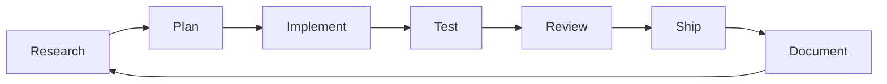

# 🧠 Dopemux ADHD-Optimized MCP Architecture

## Executive Summary

A comprehensive, Docker-based MCP orchestration system designed from the ground up for ADHD developers and creators. This architecture seamlessly integrates development, content creation, health, finance, and social life management with deep neurodivergent support features.

## Core Design Principles

### ADHD-First Design
- **Reduce cognitive load** at every decision point
- **Preserve context** across interruptions
- **Gentle time awareness** without anxiety triggers
- **Dopamine-driven feedback** for task completion
- **Automatic transitions** between work phases
- **Visual progress indicators** everywhere

## System Architecture

### Layer 1: Infrastructure (Docker-Based)

```yaml
# Core services providing persistent storage and caching
services:
  postgres:       # Telemetry, ConPort data, session state
  redis:          # Fast caching, temporary state
  milvus:         # Vector DB for semantic search
  etcd:           # Configuration management
  minio:          # Object storage for artifacts
```

### Layer 2: MCP Server Ecosystem

```yaml
# Containerized MCP servers with specific responsibilities
mcp_servers:
  # Memory & Context
  conport:              # Project memory & knowledge graph
  openmemory:           # Cross-session persistence

  # Intelligence
  zen:                  # Multi-model orchestration (Gemini, GPT, Claude)
  mas-sequential:       # Deep sequential thinking

  # Development
  claude-context:       # Semantic code search
  morphllm:            # Fast code editing
  context7:            # Documentation retrieval
  github:              # Repository integration

  # Task Management
  task-master:         # Intelligent task decomposition
  leantime:           # Agile/Scrum support

  # Integration
  desktop-commander:   # UI automation
  calendar-sync:      # iCal integration
  exa:               # Web search
```

### Layer 3: Orchestration & Intelligence

```yaml
orchestration:
  metamcp:            # Dynamic tool loading (<10k tokens)
  role_manager:       # Context-based role switching
  session_orchestrator: # Automated session management
  workflow_engine:    # Natural phase transitions
  context_predictor:  # ML-based next context prediction
  time_awareness:     # Gentle time tracking
```

### Layer 4: User Interface

```yaml
interfaces:
  terminal:          # Primary interface (tmux-enhanced)
  notifications:     # macOS native + terminal
  dashboard:         # Visual status overview
  cli:              # dopemux command interface
```

## ADHD-Specific Features

### 1. Context Preservation System

```python
class ContextPreservation:
    """Never lose your place again"""

    features = {
        'automatic_bookmarks': 'Save exact position on context switch',
        'visual_breadcrumbs': 'Trail of where you've been',
        'interrupt_recovery': '5-second context restoration',
        'session_persistence': 'Survive terminal crashes',
        'thought_capture': 'Save incomplete thoughts for later'
    }
```

### 2. Time Awareness Without Anxiety

```python
class GentleTimeAwareness:
    """Know where you are without panic"""

    strategies = {
        'relative_time': 'about 45 minutes' instead of '44:37',
        'progress_focus': 'Show progress, not time remaining',
        'gentle_nudges': 'Soft reminders, not alarms',
        'buffer_time': 'Automatic padding for transitions',
        'no_red_zones': 'Never use anxiety-triggering colors'
    }
```

### 3. Intelligent Task Chunking

```python
class TaskDecomposition:
    """Make everything manageable"""

    modes = {
        'pomodoro': '25-minute focused chunks',
        'hyperfocus': '2-4 hour deep work blocks',
        'scatter': '5-minute micro-tasks for low energy',
        'momentum': 'Chain easy wins to build energy'
    }
```

### 4. Beautiful Notifications

```python
class ADHDNotifications:
    """Information that doesn't overwhelm"""

    styles = {
        'peripheral': 'Corner glow during focus',
        'gentle_escalation': 'Gradually increasing visibility',
        'celebration': 'Dopamine hits for achievements',
        'context_aware': 'Different styles for different modes'
    }
```

## Role-Based Tool Management

### Defined Roles

| Role | Purpose | Active Tools | Token Budget |
|------|---------|--------------|--------------|
| **researcher** | Information gathering | exa, context7, sequential-thinking | 8,000 |
| **implementer** | Code writing | morphllm, claude-context, conport | 10,000 |
| **reviewer** | Quality assurance | zen-codereview, github | 9,000 |
| **architect** | System design | zen-planner, sequential-thinking | 10,000 |
| **debugger** | Problem solving | zen-debug, desktop-commander | 8,000 |
| **documenter** | Documentation | context7, conport | 7,000 |
| **product_manager** | Planning | task-master, leantime | 8,000 |
| **session_orchestrator** | Automation | conport, openmemory | 5,000 |

### Automatic Role Transitions



## Life Domain Integration

### Supported Domains

#### 1. Software Development
- Full SDLC support
- Agile ceremonies automation
- Code review workflows
- CI/CD integration

#### 2. Content Creation
- Content calendar management
- Script organization
- Publishing workflows
- Social media scheduling

#### 3. Health & Fitness
- Workout scheduling
- Minimal interruptions during exercise
- Progress tracking
- Nutrition logging

#### 4. Finance & Trading
- Time-boxed analysis sessions
- Risk management
- Market hours awareness
- Portfolio tracking

#### 5. Social & Personal
- Calendar coordination
- Event reminders
- Relationship management
- Personal task tracking

## Workflow Automation

### Development Workflow Example

```yaml
workflow: development
phases:
  brainstorm:
    tools: [zen-planner, task-master]
    duration: flexible
    transition: "when ideas >= 5"

  planning:
    tools: [leantime, conport]
    duration: 30-60min
    transition: "when tasks defined"

  implementation:
    tools: [morphllm, claude-context]
    duration: 25min-4hours
    transition: "when tests passing"

  review:
    tools: [zen-codereview, github]
    duration: 15-30min
    transition: "when approved"

  ship:
    tools: [github, conport]
    duration: 10min
    transition: "when deployed"
```

## Terminal Integration

### Tmux Configuration

```bash
# ADHD-optimized tmux status bar
status_left: "🧠 Role: {current_role} | Context: {current_context}"
status_right: "Progress: {visual_progress} | Time: {gentle_time} | Next: {next_task}"

# Quick key bindings
bind-key f: "dopemux focus"      # Enter focus mode
bind-key s: "dopemux scatter"    # Switch to exploration
bind-key c: "dopemux checkpoint" # Save state
bind-key b: "dopemux break"      # Take a break
```

### CLI Commands

```bash
# Context Management
dopemux context         # Show current context
dopemux switch <domain> # Switch life domain
dopemux checkpoint      # Save current state
dopemux restore         # Restore from checkpoint

# Time & Tasks
dopemux time           # Show time awareness
dopemux tasks          # List current tasks
dopemux estimate       # Get time estimates
dopemux deadline       # Check deadlines

# Focus Modes
dopemux focus          # Deep work mode
dopemux scatter        # Exploration mode
dopemux break          # Take a break

# Calendar
dopemux cal            # Show calendar
dopemux cal sync       # Sync with iCal
dopemux cal add        # Quick add event
```

## Calendar Integration (iCal/CalDAV)

### Bidirectional Sync

```python
class CalendarIntegration:
    """Seamless calendar sync"""

    features = {
        'auto_time_blocking': 'Reserve focus time',
        'task_to_event': 'Tasks become calendar events',
        'conflict_detection': 'Prevent double-booking',
        'buffer_time': 'Add transition time between events',
        'color_coding': 'Visual task categorization'
    }
```

## Session Orchestrator

### Automated Session Management

```python
class SessionOrchestrator:
    """Runs automatically to manage your session"""

    triggers = {
        'on_start': 'Initialize context, load tools',
        'every_25_min': 'Checkpoint, suggest break',
        'on_context_switch': 'Save state, load new tools',
        'on_interrupt': 'Create bookmark, preserve thought',
        'on_resume': 'Restore context, show breadcrumbs'
    }

    async def on_session_start(self):
        await self.load_previous_context()
        await self.check_calendar()
        await self.suggest_starting_task()
        await self.set_initial_role()
```

## Telemetry & Learning

### Pattern Recognition

```sql
-- Track patterns for ML optimization
CREATE TABLE user_patterns (
    timestamp TIMESTAMP,
    context TEXT,
    role TEXT,
    task_type TEXT,
    estimated_time INTEGER,
    actual_time INTEGER,
    completion_rate FLOAT,
    energy_level TEXT,
    focus_quality TEXT
);
```

### Continuous Improvement

The system learns:
- Your best times for different task types
- Accurate time estimates based on your history
- Context switching patterns
- Energy and focus cycles

## Implementation Phases

### Phase 1: Core Infrastructure (Week 1)
- [ ] Docker setup
- [ ] ConPort deployment
- [ ] Basic orchestration

### Phase 2: ADHD Features (Week 2)
- [ ] Time awareness
- [ ] Notification system
- [ ] Context preservation

### Phase 3: Integration (Week 3)
- [ ] Calendar sync
- [ ] Task management
- [ ] External APIs

### Phase 4: Intelligence (Week 4)
- [ ] ML predictions
- [ ] Workflow automation
- [ ] Pattern learning

### Phase 5: Polish (Week 5)
- [ ] Performance optimization
- [ ] UI refinement
- [ ] Documentation

## Success Metrics

| Metric | Target | Measurement |
|--------|--------|-------------|
| Context Switch Time | <5 seconds | Time to restore full context |
| Token Usage | <10k active | Maximum tokens loaded |
| Deadline Success | >95% | On-time completion rate |
| Focus Duration | +25% | Increase in sustained focus |
| Task Completion | +40% | More tasks completed |
| Cognitive Load | -50% | Subjective ease rating |

## Configuration Files

### dopemux.yaml
```yaml
adhd:
  checkpoint_interval: 25m
  break_duration: 5m
  hyperfocus_max: 4h
  notification_style: gentle
  time_display: relative

orchestration:
  max_tokens: 10000
  default_role: researcher
  auto_transitions: true

integrations:
  calendar: ical
  task_manager: leantime
  repository: github
```

## Getting Started

1. **Install Docker** and Docker Compose
2. **Clone the repository** with all configurations
3. **Set environment variables** for API keys
4. **Run** `docker-compose up -d`
5. **Initialize** with `dopemux init`
6. **Start working** with `dopemux start`

## Support & Community

- **Documentation**: `/docs`
- **Discord**: For ADHD developers
- **Issues**: GitHub issue tracker
- **Telemetry**: Optional, privacy-focused

---

*Built with ❤️ for the ADHD community by developers who understand the struggle.*