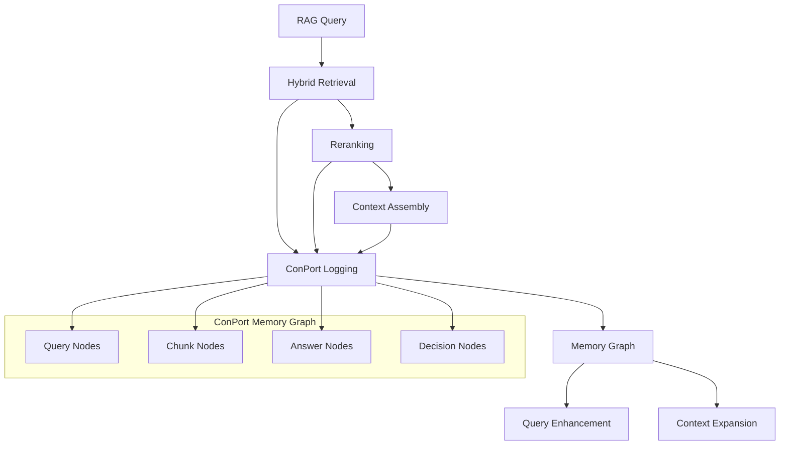

# ConPort Memory Integration Guide

## Overview

This guide explains how to integrate ConPort's project memory graph with the Dopemux RAG system. ConPort captures retrieval operations, query patterns, and decisions to build a persistent knowledge graph that enhances future retrievals.

## Integration Architecture



## Graph Schema Implementation

### Node Types

#### Query Node
```python
@dataclass
class QueryNode:
    id: str
    query_text: str
    role: str
    task: str
    session_id: str
    workspace_id: str
    timestamp: int

    def to_conport_data(self) -> Dict[str, Any]:
        return {
            "query_text": self.query_text,
            "role": self.role,
            "task": self.task,
            "session_id": self.session_id,
            "timestamp": self.timestamp
        }
```

#### Chunk Nodes
```python
@dataclass
class ChunkNode:
    id: str
    title: str
    source: str
    text_preview: str  # First 200 chars
    chunk_type: str    # "DocumentChunk" or "CodeChunk"
    workspace_id: str
    embedding_hash: str

    def to_conport_data(self) -> Dict[str, Any]:
        return {
            "title": self.title,
            "source": self.source,
            "text_preview": self.text_preview,
            "embedding_hash": self.embedding_hash
        }
```

#### Answer Node
```python
@dataclass
class AnswerNode:
    id: str
    answer_text: str
    confidence_score: float
    workspace_id: str
    timestamp: int

    def to_conport_data(self) -> Dict[str, Any]:
        return {
            "answer_text": self.answer_text,
            "confidence_score": self.confidence_score,
            "timestamp": self.timestamp
        }
```

### Edge Types

#### Retrieval Relationships
```python
@dataclass
class RetrievalEdge:
    from_id: str      # Query ID
    to_id: str        # Chunk ID
    stage: str        # "initial" or "rerank"
    rank: int
    score: float
    dense_score: float
    sparse_score: float
    rerank_score: Optional[float] = None

    def to_conport_attributes(self) -> Dict[str, Any]:
        attrs = {
            "stage": self.stage,
            "rank": self.rank,
            "score": self.score,
            "dense_score": self.dense_score,
            "sparse_score": self.sparse_score
        }
        if self.rerank_score is not None:
            attrs["rerank_score"] = self.rerank_score
        return attrs
```

## ConPort Integration Implementation

### Memory Logger Class

```python
# src/rag/memory_logger.py
import time
import logging
import json
import hashlib
from typing import Dict, List, Any, Optional
from dataclasses import dataclass
from concurrent.futures import ThreadPoolExecutor
import requests

class ConPortMemoryLogger:
    def __init__(self, conport_url: str = "http://localhost:8080",
                 max_workers: int = 4, buffer_size: int = 1000):
        self.conport_url = conport_url
        self.session = requests.Session()
        self.logger = logging.getLogger(__name__)

        # Async operation handling
        self.executor = ThreadPoolExecutor(max_workers=max_workers)

        # Buffer for offline operations
        self.operation_buffer = []
        self.max_buffer_size = buffer_size

    def log_query_async(self, query: str, role: str, task: str,
                       session_id: str, workspace_id: str) -> str:
        """Log query asynchronously and return query ID immediately."""

        query_id = f"query_{int(time.time() * 1000)}_{hash(query) % 10000}"

        # Submit async operation
        future = self.executor.submit(
            self._log_query_sync, query_id, query, role, task, session_id, workspace_id
        )

        # Don't block - handle errors in background
        future.add_done_callback(self._handle_operation_result)

        return query_id

    def _log_query_sync(self, query_id: str, query: str, role: str, task: str,
                       session_id: str, workspace_id: str):
        """Internal sync method for logging query."""

        try:
            response = self.session.post(
                f"{self.conport_url}/api/memory/upsert",
                json={
                    "id": query_id,
                    "type": "Query",
                    "data": {
                        "query_text": query,
                        "role": role,
                        "task": task,
                        "session_id": session_id,
                        "timestamp": int(time.time())
                    },
                    "workspace_id": workspace_id
                },
                timeout=5
            )
            response.raise_for_status()

        except Exception as e:
            self._buffer_operation("log_query", {
                "query_id": query_id, "query": query, "role": role,
                "task": task, "session_id": session_id, "workspace_id": workspace_id
            })
            self.logger.debug(f"Buffered query logging: {e}")

    def log_retrieval_batch(self, query_id: str, results: List[Any],
                           stage: str, workspace_id: str):
        """Log batch of retrieval results."""

        # Submit async batch operation
        future = self.executor.submit(
            self._log_retrieval_batch_sync, query_id, results, stage, workspace_id
        )
        future.add_done_callback(self._handle_operation_result)

    def _log_retrieval_batch_sync(self, query_id: str, results: List[Any],
                                 stage: str, workspace_id: str):
        """Internal sync method for batch retrieval logging."""

        try:
            # Batch upsert chunk nodes
            chunk_operations = []
            link_operations = []

            for i, result in enumerate(results):
                # Determine chunk type
                chunk_type = self._determine_chunk_type(result.source)

                # Prepare chunk node operation
                chunk_operations.append({
                    "id": result.id,
                    "type": chunk_type,
                    "data": {
                        "title": result.title,
                        "source": result.source,
                        "text_preview": result.text[:200] + "..." if len(result.text) > 200 else result.text
                    },
                    "workspace_id": workspace_id
                })

                # Prepare link operation
                link_attrs = {
                    "stage": stage,
                    "rank": i + 1,
                    "score": result.score,
                    "dense_score": result.dense_score,
                    "sparse_score": result.sparse_score
                }

                if hasattr(result, 'rerank_score') and result.rerank_score is not None:
                    link_attrs["rerank_score"] = result.rerank_score

                link_operations.append({
                    "from_id": query_id,
                    "to_id": result.id,
                    "type": "retrieved",
                    "attributes": link_attrs,
                    "workspace_id": workspace_id
                })

            # Execute batch operations
            if chunk_operations:
                self.session.post(
                    f"{self.conport_url}/api/memory/batch/upsert",
                    json={"operations": chunk_operations},
                    timeout=10
                )

            if link_operations:
                self.session.post(
                    f"{self.conport_url}/api/memory/batch/link",
                    json={"operations": link_operations},
                    timeout=10
                )

        except Exception as e:
            self._buffer_operation("log_retrieval_batch", {
                "query_id": query_id, "results": [
                    {"id": r.id, "title": r.title, "source": r.source, "score": r.score}
                    for r in results
                ], "stage": stage, "workspace_id": workspace_id
            })
            self.logger.debug(f"Buffered retrieval batch logging: {e}")

    def log_context_usage(self, query_id: str, used_chunk_ids: List[str], workspace_id: str):
        """Log which chunks were used in final context."""

        future = self.executor.submit(
            self._log_context_usage_sync, query_id, used_chunk_ids, workspace_id
        )
        future.add_done_callback(self._handle_operation_result)

    def _log_context_usage_sync(self, query_id: str, used_chunk_ids: List[str], workspace_id: str):
        """Internal sync method for context usage logging."""

        try:
            link_operations = []
            for chunk_id in used_chunk_ids:
                link_operations.append({
                    "from_id": query_id,
                    "to_id": chunk_id,
                    "type": "context_used",
                    "attributes": {"timestamp": int(time.time())},
                    "workspace_id": workspace_id
                })

            if link_operations:
                self.session.post(
                    f"{self.conport_url}/api/memory/batch/link",
                    json={"operations": link_operations},
                    timeout=5
                )

        except Exception as e:
            self._buffer_operation("log_context_usage", {
                "query_id": query_id, "used_chunk_ids": used_chunk_ids, "workspace_id": workspace_id
            })
            self.logger.debug(f"Buffered context usage logging: {e}")

    def log_answer(self, query_id: str, answer_text: str, used_chunk_ids: List[str],
                  workspace_id: str, confidence_score: float = 0.8) -> str:
        """Log generated answer and create relationships."""

        answer_id = f"answer_{int(time.time() * 1000)}_{hash(answer_text) % 10000}"

        future = self.executor.submit(
            self._log_answer_sync, query_id, answer_id, answer_text,
            used_chunk_ids, workspace_id, confidence_score
        )
        future.add_done_callback(self._handle_operation_result)

        return answer_id

    def _log_answer_sync(self, query_id: str, answer_id: str, answer_text: str,
                        used_chunk_ids: List[str], workspace_id: str, confidence_score: float):
        """Internal sync method for answer logging."""

        try:
            # Create answer node
            self.session.post(
                f"{self.conport_url}/api/memory/upsert",
                json={
                    "id": answer_id,
                    "type": "Answer",
                    "data": {
                        "answer_text": answer_text,
                        "confidence_score": confidence_score,
                        "timestamp": int(time.time())
                    },
                    "workspace_id": workspace_id
                },
                timeout=5
            )

            # Create relationships
            link_operations = [
                {
                    "from_id": query_id,
                    "to_id": answer_id,
                    "type": "answer_to",
                    "attributes": {},
                    "workspace_id": workspace_id
                }
            ]

            # Link to supporting chunks
            for chunk_id in used_chunk_ids:
                link_operations.append({
                    "from_id": answer_id,
                    "to_id": chunk_id,
                    "type": "supported_by",
                    "attributes": {"support_score": 1.0},
                    "workspace_id": workspace_id
                })

            self.session.post(
                f"{self.conport_url}/api/memory/batch/link",
                json={"operations": link_operations},
                timeout=10
            )

        except Exception as e:
            self._buffer_operation("log_answer", {
                "query_id": query_id, "answer_id": answer_id, "answer_text": answer_text,
                "used_chunk_ids": used_chunk_ids, "workspace_id": workspace_id,
                "confidence_score": confidence_score
            })
            self.logger.debug(f"Buffered answer logging: {e}")

    def log_decision(self, description: str, context: Dict[str, Any],
                    workspace_id: str, tags: List[str] = None) -> str:
        """Log important decisions discovered during conversation."""

        decision_id = f"decision_{int(time.time() * 1000)}_{hash(description) % 10000}"

        future = self.executor.submit(
            self._log_decision_sync, decision_id, description, context, workspace_id, tags or []
        )
        future.add_done_callback(self._handle_operation_result)

        return decision_id

    def _log_decision_sync(self, decision_id: str, description: str, context: Dict[str, Any],
                          workspace_id: str, tags: List[str]):
        """Internal sync method for decision logging."""

        try:
            self.session.post(
                f"{self.conport_url}/api/memory/upsert",
                json={
                    "id": decision_id,
                    "type": "Decision",
                    "data": {
                        "description": description,
                        "context": context,
                        "tags": tags,
                        "timestamp": int(time.time())
                    },
                    "workspace_id": workspace_id
                },
                timeout=5
            )

        except Exception as e:
            self._buffer_operation("log_decision", {
                "decision_id": decision_id, "description": description,
                "context": context, "workspace_id": workspace_id, "tags": tags
            })
            self.logger.debug(f"Buffered decision logging: {e}")

    def query_memory_graph(self, query_text: str, workspace_id: str,
                          max_hops: int = 2) -> List[Dict[str, Any]]:
        """Query the memory graph for related content."""

        try:
            response = self.session.post(
                f"{self.conport_url}/api/memory/query",
                json={
                    "query_text": query_text,
                    "workspace_id": workspace_id,
                    "max_hops": max_hops,
                    "node_types": ["DocumentChunk", "CodeChunk", "Decision"],
                    "relationship_types": ["retrieved", "context_used", "supported_by"]
                },
                timeout=10
            )

            if response.status_code == 200:
                return response.json().get("results", [])
            else:
                self.logger.warning(f"Memory query failed: {response.status_code}")
                return []

        except Exception as e:
            self.logger.debug(f"Memory query failed: {e}")
            return []

    def get_query_history(self, session_id: str, workspace_id: str,
                         limit: int = 20) -> List[Dict[str, Any]]:
        """Get recent queries from the same session."""

        try:
            response = self.session.get(
                f"{self.conport_url}/api/memory/history",
                params={
                    "session_id": session_id,
                    "workspace_id": workspace_id,
                    "node_type": "Query",
                    "limit": limit
                },
                timeout=5
            )

            if response.status_code == 200:
                return response.json().get("queries", [])
            else:
                return []

        except Exception as e:
            self.logger.debug(f"Query history failed: {e}")
            return []

    def _determine_chunk_type(self, source: str) -> str:
        """Determine chunk type based on source file extension."""

        code_extensions = {'.py', '.js', '.ts', '.java', '.go', '.rs', '.cpp', '.c', '.h'}

        for ext in code_extensions:
            if source.endswith(ext):
                return "CodeChunk"

        return "DocumentChunk"

    def _buffer_operation(self, operation_type: str, data: Dict[str, Any]):
        """Buffer operation for later retry."""

        if len(self.operation_buffer) >= self.max_buffer_size:
            # Remove oldest operation
            self.operation_buffer.pop(0)

        self.operation_buffer.append({
            "type": operation_type,
            "data": data,
            "timestamp": time.time()
        })

    def _handle_operation_result(self, future):
        """Handle async operation completion."""

        try:
            future.result()  # This will raise exception if operation failed
        except Exception as e:
            self.logger.debug(f"Async memory operation failed: {e}")

    def retry_buffered_operations(self, max_retries: int = 100):
        """Retry buffered operations."""

        if not self.operation_buffer:
            return

        successful_operations = []
        retry_count = 0

        for operation in self.operation_buffer[:max_retries]:
            try:
                op_type = operation["type"]
                data = operation["data"]

                if op_type == "log_query":
                    self._log_query_sync(**data)
                elif op_type == "log_retrieval_batch":
                    # Note: Need to reconstruct result objects for retry
                    pass  # Skip complex reconstructions for now
                elif op_type == "log_context_usage":
                    self._log_context_usage_sync(**data)
                elif op_type == "log_answer":
                    self._log_answer_sync(**data)
                elif op_type == "log_decision":
                    self._log_decision_sync(**data)

                successful_operations.append(operation)
                retry_count += 1

            except Exception as e:
                self.logger.debug(f"Retry failed for {operation['type']}: {e}")

        # Remove successful operations
        for op in successful_operations:
            if op in self.operation_buffer:
                self.operation_buffer.remove(op)

        if retry_count > 0:
            self.logger.info(f"Successfully retried {retry_count} buffered operations")

    def get_buffer_status(self) -> Dict[str, Any]:
        """Get status of buffered operations."""

        return {
            "buffered_count": len(self.operation_buffer),
            "buffer_capacity": self.max_buffer_size,
            "oldest_buffered": min(op["timestamp"] for op in self.operation_buffer) if self.operation_buffer else None,
            "buffer_types": {
                op_type: sum(1 for op in self.operation_buffer if op["type"] == op_type)
                for op_type in set(op["type"] for op in self.operation_buffer)
            }
        }

    def shutdown(self):
        """Gracefully shutdown the memory logger."""

        # Wait for pending operations
        self.executor.shutdown(wait=True)

        # Log buffer status
        status = self.get_buffer_status()
        if status["buffered_count"] > 0:
            self.logger.warning(f"Shutting down with {status['buffered_count']} buffered operations")
```

## Enhanced Retrieval with Memory

### Memory-Aware Retrieval Class

```python
# src/rag/memory_retrieval.py
from typing import List, Tuple, Dict, Any, Optional
from src.rag.retrieval import HybridRetriever, RetrievalResult
from src.rag.memory_logger import ConPortMemoryLogger

class MemoryAwareRetriever(HybridRetriever):
    def __init__(self, voyage_api_key: str, policy_config_path: str,
                 conport_url: str = "http://localhost:8080"):
        super().__init__(voyage_api_key, policy_config_path)

        self.memory = ConPortMemoryLogger(conport_url)

    def search_with_memory(self, query: str, role: str, task: str,
                          session_id: str = "default", workspace_id: str = "default") -> Tuple[List[RetrievalResult], str]:
        """Execute search with full memory integration and enhancement."""

        # Step 1: Check for similar previous queries
        memory_context = self.memory.query_memory_graph(query, workspace_id)

        # Step 2: Get session history for context
        query_history = self.memory.get_query_history(session_id, workspace_id)

        # Step 3: Enhance query with memory context
        enhanced_query = self._enhance_query_with_memory(query, memory_context, query_history)

        # Step 4: Log the query
        query_id = self.memory.log_query_async(enhanced_query, role, task, session_id, workspace_id)

        # Step 5: Execute retrieval
        policy = self.get_policy(role, task)

        # Stage 1: Hybrid search with enhanced query
        stage1_candidates = self.hybrid_search(enhanced_query, policy, workspace_id)

        # Log Stage 1 results
        self.memory.log_retrieval_batch(query_id, stage1_candidates, "initial", workspace_id)

        # Step 6: Memory-enhanced candidate filtering
        filtered_candidates = self._filter_with_memory_insights(stage1_candidates, memory_context)

        # Stage 2: Reranking
        final_results = self.rerank_candidates(enhanced_query, filtered_candidates, policy)

        # Log Stage 2 results
        self.memory.log_retrieval_batch(query_id, final_results, "rerank", workspace_id)

        # Step 7: Log context usage
        used_chunk_ids = [result.id for result in final_results]
        self.memory.log_context_usage(query_id, used_chunk_ids, workspace_id)

        # Step 8: Retry any buffered operations
        self.memory.retry_buffered_operations()

        return final_results, query_id

    def _enhance_query_with_memory(self, original_query: str, memory_context: List[Dict],
                                 query_history: List[Dict]) -> str:
        """Enhance query using memory graph insights."""

        # Extract relevant terms from memory context
        memory_terms = set()
        for item in memory_context:
            if item.get("type") in ["DocumentChunk", "CodeChunk"]:
                # Extract key terms from title
                title_terms = item.get("data", {}).get("title", "").lower().split()
                memory_terms.update(title_terms)

        # Extract session context terms
        session_terms = set()
        for query in query_history[-5:]:  # Last 5 queries
            query_text = query.get("data", {}).get("query_text", "")
            session_terms.update(query_text.lower().split())

        # Simple enhancement: append relevant terms
        enhancement_terms = (memory_terms | session_terms) - set(original_query.lower().split())
        enhancement_terms = list(enhancement_terms)[:3]  # Max 3 additional terms

        if enhancement_terms:
            enhanced_query = f"{original_query} {' '.join(enhancement_terms)}"
            return enhanced_query

        return original_query

    def _filter_with_memory_insights(self, candidates: List[RetrievalResult],
                                   memory_context: List[Dict]) -> List[RetrievalResult]:
        """Filter candidates using memory graph insights."""

        # Extract high-confidence chunks from memory
        trusted_chunks = set()
        for item in memory_context:
            # Boost chunks that were previously used successfully
            if item.get("relationship_type") == "context_used":
                trusted_chunks.add(item.get("to_id"))

        # Boost scores for trusted chunks
        for candidate in candidates:
            if candidate.id in trusted_chunks:
                candidate.score *= 1.1  # 10% boost

        return candidates

    def log_answer_with_memory(self, query_id: str, answer_text: str,
                             used_results: List[RetrievalResult], workspace_id: str,
                             confidence_score: float = 0.8) -> str:
        """Log answer with memory integration."""

        used_chunk_ids = [result.id for result in used_results]
        answer_id = self.memory.log_answer(query_id, answer_text, used_chunk_ids, workspace_id, confidence_score)

        return answer_id

    def promote_decision_to_memory(self, decision_text: str, related_query_id: str,
                                 workspace_id: str, tags: List[str] = None) -> str:
        """Promote important decisions to persistent memory."""

        context = {
            "related_query": related_query_id,
            "source": "conversation_promotion"
        }

        decision_id = self.memory.log_decision(decision_text, context, workspace_id, tags or [])

        return decision_id

    def get_memory_status(self) -> Dict[str, Any]:
        """Get memory system status."""

        return self.memory.get_buffer_status()
```

## Usage Examples

### Basic Integration

```python
# Example: Basic retrieval with memory
retriever = MemoryAwareRetriever(
    voyage_api_key=os.getenv("VOYAGE_API_KEY"),
    policy_config_path="config/rag/role-policies.json",
    conport_url="http://localhost:8080"
)

# Execute search with memory logging
results, query_id = retriever.search_with_memory(
    query="How does token caching work?",
    role="Developer",
    task="CodeImplementation",
    session_id="dev_session_123",
    workspace_id="auth_service_project"
)

# Log the answer
answer_id = retriever.log_answer_with_memory(
    query_id=query_id,
    answer_text="Token caching uses Redis with 1-hour TTL...",
    used_results=results,
    workspace_id="auth_service_project",
    confidence_score=0.9
)
```

### Decision Promotion

```python
# Example: Promote conversation insights to memory
decision_id = retriever.promote_decision_to_memory(
    decision_text="We decided to use Redis for session storage due to its TTL support",
    related_query_id=query_id,
    workspace_id="auth_service_project",
    tags=["architecture", "caching", "redis"]
)
```

### Memory Status Monitoring

```python
# Check memory system status
status = retriever.get_memory_status()
print(f"Buffered operations: {status['buffered_count']}")
print(f"Buffer types: {status['buffer_types']}")
```

## Configuration

### ConPort Service Configuration

```yaml
# config/conport/rag-integration.yaml
conport:
  database:
    type: sqlite
    path: /data/conport/rag-memory.db

  api:
    host: "0.0.0.0"
    port: 8080
    max_connections: 100

  memory:
    max_nodes_per_workspace: 100000
    max_edges_per_workspace: 500000
    cleanup_interval: 86400  # 24 hours

  batch_operations:
    max_batch_size: 100
    timeout_seconds: 30
```

### Memory Logger Configuration

```python
# Configuration for memory logger
MEMORY_CONFIG = {
    "conport_url": "http://localhost:8080",
    "max_workers": 4,
    "buffer_size": 1000,
    "retry_interval": 300,  # 5 minutes
    "batch_size": 50
}
```

## Monitoring and Troubleshooting

### Health Checks

```python
# scripts/check_memory_health.py
import requests
import json

def check_memory_health():
    """Check ConPort memory system health."""

    try:
        # Check ConPort API
        response = requests.get("http://localhost:8080/health", timeout=5)
        if response.status_code == 200:
            print("✅ ConPort API healthy")
        else:
            print(f"❌ ConPort API unhealthy: {response.status_code}")
            return False

        # Check memory statistics
        stats_response = requests.get("http://localhost:8080/api/memory/stats", timeout=5)
        if stats_response.status_code == 200:
            stats = stats_response.json()
            print(f"📊 Memory nodes: {stats.get('total_nodes', 0)}")
            print(f"📊 Memory edges: {stats.get('total_edges', 0)}")
            print(f"📊 Workspaces: {len(stats.get('workspaces', []))}")

        return True

    except Exception as e:
        print(f"❌ Memory health check failed: {e}")
        return False

if __name__ == "__main__":
    check_memory_health()
```

### Buffer Monitoring

```python
# Monitor buffer status
def monitor_buffer_status(memory_logger):
    """Monitor memory buffer status."""

    status = memory_logger.get_buffer_status()

    if status["buffered_count"] > 100:
        print(f"⚠️ High buffer usage: {status['buffered_count']} operations")

    if status["oldest_buffered"]:
        age_seconds = time.time() - status["oldest_buffered"]
        if age_seconds > 3600:  # 1 hour
            print(f"⚠️ Old buffered operations: {age_seconds/3600:.1f} hours old")
```

## Related Documentation

- **[RAG System Overview](../../94-architecture/rag/rag-system-overview.md)** - Complete system architecture
- **[Setup Guide](./setup-rag-pipeline.md)** - Implementation instructions
- **[ADR-505: ConPort Integration](../../90-adr/505-conport-integration.md)** - Integration decision
- **[Operations Runbook](../../92-runbooks/rag/rag-operations-runbook.md)** - Production operations

---

**Status**: Integration Guide Complete
**Last Updated**: 2025-09-23
**Version**: 1.0