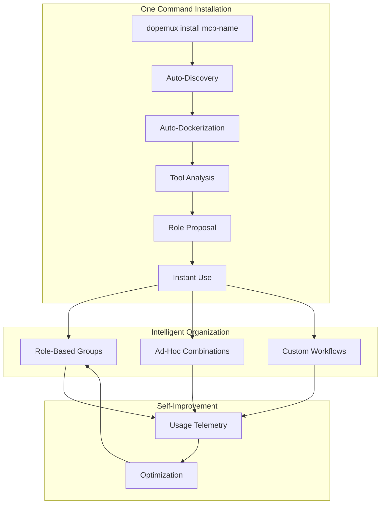

# 🔮 MCP Dynamic Discovery & Installation System

## Executive Summary

A revolutionary approach to MCP server management that eliminates manual configuration through automatic discovery, intelligent analysis, and self-organization. Install any MCP server with one command and have it automatically dockerized, analyzed, and integrated into your role-based system.

## The Problem

Current MCP server installation requires:
- Manual Dockerfile creation for each server
- Hardcoded tool lists in configurations
- Manual role mapping decisions
- Constant maintenance as servers update
- No way to discover new servers
- Painful integration process

## The Solution: Self-Configuring MCP Orchestration

### Core Innovation



## System Architecture

### 1. Universal MCP Installer

**Purpose**: Install any MCP server from any source with zero configuration

**Supported Sources**:
- **NPM**: `dopemux install npm:package-name`
- **GitHub**: `dopemux install github:owner/repo`
- **PyPI**: `dopemux install pip:package-name`
- **Local**: `dopemux install local:/path/to/server`
- **Docker Hub**: `dopemux install docker:image-name`
- **URL**: `dopemux install https://example.com/mcp-server`

**Process**:
1. Detect source type
2. Generate appropriate Dockerfile
3. Build container automatically
4. Configure networking and volumes
5. Start with health checks
6. Discover capabilities

### 2. Intelligent Tool Discovery

**Automatic Discovery Process**:

```yaml
discovery_pipeline:
  1_connect:
    action: "Establish MCP connection"
    timeout: 30s
    retry: 3

  2_introspect:
    action: "Query server capabilities"
    methods:
      - list_tools
      - get_schemas
      - describe_capabilities

  3_analyze:
    action: "AI analysis of each tool"
    determines:
      - purpose
      - complexity
      - token_usage
      - adhd_suitability
      - role_suggestions

  4_test:
    action: "Test tool functionality"
    validates:
      - basic_operation
      - error_handling
      - performance

  5_catalog:
    action: "Add to tool registry"
    stores:
      - tool_metadata
      - usage_examples
      - compatibility_matrix
```

### 3. AI-Powered Tool Analysis

**For each discovered tool, AI analyzes**:

```python
tool_analysis = {
    'identification': {
        'name': 'search_code',
        'server': 'github-mcp',
        'version': '1.2.3'
    },

    'purpose_classification': {
        'primary': 'code_search',
        'secondary': ['repository_analysis', 'pattern_finding'],
        'domain': 'development'
    },

    'complexity_assessment': {
        'complexity_score': 0.6,  # 0-1 scale
        'requires_context': True,
        'stateful': False,
        'idempotent': True
    },

    'resource_profile': {
        'estimated_tokens': 800,
        'execution_time': 'fast',  # fast/moderate/slow
        'memory_usage': 'low'
    },

    'adhd_compatibility': {
        'focus_requirement': 'low',  # low/medium/high
        'interruptible': True,
        'cognitive_load': 0.3,  # 0-1 scale
        'resumable': True
    },

    'role_affinity': {
        'researcher': 0.95,
        'implementer': 0.60,
        'reviewer': 0.40,
        'debugger': 0.70
    },

    'usage_patterns': {
        'common_workflows': ['find_implementation', 'check_usage'],
        'prerequisites': [],
        'common_next_tools': ['get_file', 'edit_file']
    }
}
```

### 4. Intelligent Role Proposal System

**Clustering Algorithm**:

```yaml
role_clustering:
  input: "All discovered tools with analysis"

  clustering_factors:
    - purpose_similarity: 0.4
    - workflow_cohesion: 0.3
    - token_budget_fit: 0.2
    - adhd_compatibility: 0.1

  constraints:
    - max_tokens_per_role: 10000
    - max_tools_per_role: 15
    - min_cohesion_score: 0.7

  output_proposals:
    - role_name: "suggested name"
      confidence: 0.0-1.0
      tools: [list]
      rationale: "explanation"
      token_budget: total
```

**Example Proposal**:

```yaml
proposed_role_assignment:
  server: "github-mcp"

  proposals:
    - role: "researcher"
      tools:
        - search_code
        - search_issues
        - get_readme
      confidence: 0.92
      rationale: "These tools support exploration and discovery workflows"

    - role: "reviewer"
      tools:
        - get_pr
        - create_review
        - add_comment
      confidence: 0.88
      rationale: "These tools support code review workflows"

    - role: "developer"
      tools:
        - create_branch
        - commit
        - push
      confidence: 0.85
      rationale: "These tools support development workflows"
```

### 5. Dynamic Role Registry

**Registry Structure**:

```yaml
registry:
  discovered_roles:
    researcher:
      tools:
        - server: "exa-mcp"
          tool: "search"
        - server: "github-mcp"
          tool: "search_code"
        - server: "context7-mcp"
          tool: "get_docs"
      token_budget: 8000
      last_optimized: "2024-01-15"

  custom_roles:
    my_research_role:
      based_on: "researcher"
      additions: ["perplexity:search"]
      removals: ["exa:search"]

  adhoc_combinations:
    - id: "adhoc_a3f2"
      tools: ["github:search_code", "morphllm:edit"]
      created: "2024-01-15T10:30:00"
      ttl: 3600

  tool_catalog:
    total_tools: 127
    servers: 23
    last_discovery: "2024-01-15T10:00:00"
```

### 6. Installation Flow Examples

#### Example 1: Installing a New NPM Package

```bash
$ dopemux install npm:spotify-mcp

🔍 Discovering spotify-mcp...
📦 Found npm package version 2.1.0
🐳 Building Docker container...
  Using template: Node.js Alpine
  Installing package globally
  Configuring health checks
✅ Container built: dopemux-mcp-spotify

🔧 Discovering tools...
⚡ Connected to MCP server
📋 Found 8 tools:
  - search_tracks
  - get_playlist
  - create_playlist
  - add_to_queue
  - get_currently_playing
  - control_playback
  - get_recommendations
  - get_audio_features

🧠 Analyzing tools with AI...

📊 Analysis Summary:
┌──────────────────┬──────────┬────────┬─────────┐
│ Tool             │ Purpose  │ Tokens │ ADHD    │
├──────────────────┼──────────┼────────┼─────────┤
│ search_tracks    │ Search   │ 500    │ Good    │
│ get_playlist     │ Retrieve │ 400    │ Good    │
│ create_playlist  │ Create   │ 600    │ Moderate│
│ control_playback │ Control  │ 300    │ Great   │
└──────────────────┴──────────┴────────┴─────────┘

🎯 Proposed Role Assignments:

┌─────────────┬──────────────────────┬────────────┐
│ Role        │ Tools                │ Confidence │
├─────────────┼──────────────────────┼────────────┤
│ content     │ search, playlist ops │ 94%        │
│ automation  │ control, queue       │ 87%        │
│ analysis    │ audio_features       │ 78%        │
└─────────────┴──────────────────────┴────────────┘

Accept proposals? (Y/n/custom/test): Y

✅ Successfully integrated spotify-mcp!
   - Added to 3 roles
   - Total new tools: 8
   - Ready to use immediately
```

#### Example 2: Installing from GitHub

```bash
$ dopemux install github:anthropics/mcp-server-puppeteer

🔍 Cloning repository...
📝 Detected: TypeScript project
🐳 Building Docker container...
  Installing dependencies
  Compiling TypeScript
  Installing Chromium
✅ Container built: dopemux-mcp-puppeteer

🔧 Tool discovery found:
  - navigate
  - click
  - type
  - screenshot
  - evaluate
  - wait_for_selector

🧠 AI Analysis suggests:
  Role: "browser_automation" (new role)
  Purpose: Web automation and testing
  ADHD Note: Requires focus, not easily interruptible

Create new role "browser_automation"? (Y/n): Y
✅ New role created with puppeteer tools
```

### 7. Ad-Hoc Combination System

**Flexible Tool Combinations**:

```bash
# Create temporary combination
$ dopemux adhoc github:search_code morphllm:edit exa:search

🎯 Ad-hoc combination created:
   ID: adhoc_7f3a
   Tools: 3 from different servers
   Tokens: ~2,500
   TTL: 1 hour

# Use specific tools from different servers
$ dopemux tools --pick

  Available Tools (127 total):
  🔍 Search & Discovery
  ├─ [1] exa:search
  ├─ [2] github:search_code
  ├─ [3] context7:resolve_library
  └─ [4] perplexity:web_search

  ✏️ Editing & Creation
  ├─ [5] morphllm:edit_file
  ├─ [6] github:create_file
  └─ [7] aider:refactor

  Select tools (comma-separated): 2,5

✅ Loaded: github:search_code, morphllm:edit_file
```

### 8. Discovery Hub Integration

**Community Sharing**:

```yaml
discovery_hub:
  url: "https://hub.dopemux.dev"

  features:
    - browse_servers: "Discover new MCP servers"
    - share_configs: "Share your role configurations"
    - download_roles: "Get community-optimized roles"
    - compatibility_matrix: "See what works together"
    - usage_analytics: "Learn from community patterns"

  contribution:
    - automatic: "Share anonymous usage data"
    - manual: "Publish your custom roles"
    - ratings: "Rate tool combinations"
```

### 9. Self-Optimization System

**Continuous Improvement**:

```python
optimization_engine:
  monitors:
    - tool_usage_frequency
    - error_rates
    - execution_times
    - token_consumption
    - user_satisfaction

  optimizations:
    remove_unused_tools:
      trigger: "Tool unused for 30 days"
      action: "Remove from role"

    rebalance_tokens:
      trigger: "Role exceeds budget >50% of time"
      action: "Redistribute tools"

    suggest_alternatives:
      trigger: "Tool has >10% error rate"
      action: "Find and suggest replacement"

    merge_similar_roles:
      trigger: "Roles have >80% overlap"
      action: "Propose consolidation"
```

### 10. CLI Commands

**Complete CLI Interface**:

```bash
# Discovery Commands
dopemux discover                    # List all available MCP servers
dopemux discover --source npm       # Search NPM for MCP servers
dopemux discover --installed        # Show installed servers
dopemux discover --updates          # Check for updates

# Installation Commands
dopemux install <spec>              # Install any MCP server
dopemux install --dry-run <spec>   # Preview what would happen
dopemux install --no-analyze       # Skip AI analysis
dopemux install --custom-role      # Define custom role mapping

# Management Commands
dopemux servers                    # List all installed servers
dopemux tools                      # List all available tools
dopemux roles                      # Show role configurations
dopemux optimize                   # Run optimization engine

# Usage Commands
dopemux role <name>                # Load a role
dopemux adhoc <tools...>           # Create ad-hoc combination
dopemux pick                       # Interactive tool picker
dopemux test <tool>                # Test a specific tool

# Hub Commands
dopemux hub search <query>         # Search the hub
dopemux hub publish <role>         # Share your role
dopemux hub install <role-id>      # Install community role
```

## Configuration

### Main Configuration

```yaml
# config/discovery.yaml

discovery:
  # Automatic analysis
  auto_analyze: true
  ai_model: "gpt-4"

  # Role proposals
  propose_roles: true
  min_confidence: 0.75

  # Resource limits
  max_container_memory: "512m"
  max_container_cpu: "0.5"

  # Network
  network: "dopemux-net"

optimization:
  # When to optimize
  schedule: "daily"

  # Thresholds
  unused_tool_days: 30
  high_error_rate: 0.10
  token_overflow_rate: 0.20

  # Actions
  auto_remove_unused: false
  auto_rebalance: true
  suggest_only: true

hub:
  # Community features
  enabled: true
  share_telemetry: true
  auto_update_roles: false

  # Privacy
  anonymize_data: true
  exclude_patterns: []
```

### ADHD-Specific Settings

```yaml
# config/discovery-adhd.yaml

adhd_optimizations:
  # Tool selection
  prefer_simple_tools: true
  avoid_complex_workflows: true

  # Cognitive load
  max_tools_per_session: 10
  warn_on_context_switch: true

  # Interruption handling
  prefer_resumable_tools: true
  avoid_stateful_tools: false

  # Time awareness
  estimate_completion_time: true
  suggest_break_points: true

  # Discovery process
  interactive_mode: true
  show_progress_bars: true
  celebrate_completions: true
```

## Benefits

### For Users

1. **Zero Configuration**: Install any MCP server with one command
2. **Intelligent Organization**: AI automatically organizes tools into roles
3. **Perfect Flexibility**: Use roles or ad-hoc combinations
4. **Always Up-to-Date**: Automatic updates and optimization
5. **Community Powered**: Learn from other users' patterns

### For ADHD Users

1. **Reduced Cognitive Load**: System handles all configuration
2. **Smart Defaults**: AI picks ADHD-friendly arrangements
3. **Visual Feedback**: Progress bars and celebrations
4. **Interruption Resilient**: Stateless tools preferred
5. **Time Aware**: Estimates and break suggestions

### For Developers

1. **Easy Integration**: Publish MCP server, users can install immediately
2. **No Documentation Needed**: AI analyzes and explains tools
3. **Usage Analytics**: See how your tools are used
4. **Community Feedback**: Ratings and suggestions
5. **Automatic Updates**: Users get updates automatically

## Implementation Phases

### Phase 1: Core Discovery (Week 1)
- Universal dockerizer
- Basic tool discovery
- Simple installation flow

### Phase 2: AI Analysis (Week 2)
- Tool analysis engine
- Role proposal system
- Clustering algorithm

### Phase 3: Dynamic Registry (Week 3)
- Role management
- Ad-hoc combinations
- Configuration persistence

### Phase 4: Hub Integration (Week 4)
- Community discovery
- Sharing mechanisms
- Update system

### Phase 5: Optimization (Week 5)
- Telemetry collection
- Auto-optimization
- Performance tuning

## Success Metrics

| Metric | Target | Measurement |
|--------|--------|-------------|
| Installation Time | <60 seconds | Time from command to ready |
| Discovery Accuracy | >90% | Correct tool categorization |
| Role Proposal Accept Rate | >80% | User accepts AI proposals |
| Tool Discovery Rate | 100% | All tools discovered |
| Container Success Rate | >95% | Successful dockerization |

## Technical Architecture

### Microservices

```yaml
services:
  discovery_engine:
    purpose: "Find and analyze MCP servers"
    tech: "Python + FastAPI"

  dockerizer:
    purpose: "Create containers automatically"
    tech: "Python + Docker SDK"

  analyzer:
    purpose: "AI analysis of tools"
    tech: "Python + OpenAI"

  registry:
    purpose: "Manage roles and tools"
    tech: "PostgreSQL + Redis"

  hub_connector:
    purpose: "Community integration"
    tech: "REST + GraphQL"

  optimizer:
    purpose: "Continuous improvement"
    tech: "Python + ML"
```

## Security Considerations

1. **Container Isolation**: Each MCP server in separate container
2. **Network Segmentation**: Internal network for MCP communication
3. **Resource Limits**: Memory and CPU limits enforced
4. **Permission Model**: Tools require explicit permission
5. **Audit Logging**: All operations logged

## Future Enhancements

1. **Marketplace**: Full MCP server marketplace
2. **Visual Designer**: Drag-and-drop role creation
3. **AI Workflows**: Complete workflow automation
4. **Team Sync**: Share configurations across team
5. **Cloud Hosting**: Hosted MCP servers

---

*With this system, installing and managing MCP servers becomes truly magical - one command and everything just works!*