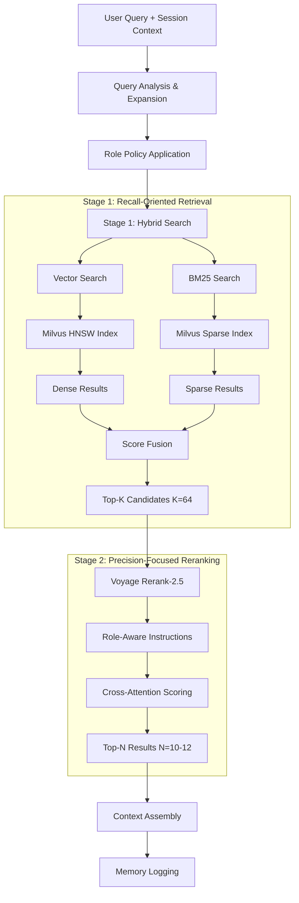

# Hybrid Retrieval Pipeline Design

## Overview

The Dopemux RAG system implements a sophisticated two-stage hybrid retrieval pipeline that combines the strengths of semantic vector search with lexical keyword matching. This design maximizes both recall (finding relevant content) and precision (ranking it correctly) through complementary search methodologies.

## Pipeline Architecture



## Stage 1: Hybrid Search (Recall Optimization)

### Dense Vector Search
**Purpose**: Capture semantic similarity and conceptual relationships

**Implementation**:
- **Index**: Milvus HNSW with parameters M=16, efConstruction=200, efSearch=128
- **Metric**: Cosine similarity (embeddings are L2-normalized)
- **Models**:
  - voyage-context-3 (1024-dim) for documentation
  - voyage-code-3 (1024-dim) for code
- **Search Strategy**: Find semantically similar content regardless of exact term matches

**Advantages**:
- Handles synonyms and paraphrasing
- Captures conceptual relationships
- Works well with abstract queries
- Language-agnostic similarity

### Sparse BM25 Search
**Purpose**: Ensure exact term matches and handle specific identifiers

**Implementation**:
- **Algorithm**: BM25 with parameters k1=1.2, b=0.75
- **Tokenization**:
  - Documents: Standard English analyzer
  - Code: Custom analyzer preserving identifiers and symbols
- **Ranking**: DAAT_MAXSCORE for efficient processing
- **Index**: Milvus sparse vector index with term frequency analysis

**Advantages**:
- Exact keyword matching
- Handles proper nouns, identifiers, error messages
- Strong performance on specific technical terms
- Established, well-understood ranking function

### Hybrid Score Fusion

**Weighted Linear Combination**:
```
final_score = w_dense × (1 - cosine_distance) + w_sparse × normalized_bm25_score
```

**Fusion Weights by Content Type**:
- **Documents**: 0.65 dense / 0.35 sparse
- **Code**: 0.55 dense / 0.45 sparse

**Rationale**:
- Documentation benefits more from semantic understanding
- Code requires balance between semantic and exact matches (function names, error codes)
- Weights determined through empirical testing on domain-specific queries

### Collection-Specific Optimizations

#### DocRAG Collection
```yaml
search_params:
  metric_type: "COSINE"
  params:
    ef: 128          # Search effort parameter
    round_decimal: 4 # Precision for similarity scores

sparse_params:
  k1: 1.2           # Term frequency saturation
  b: 0.75           # Length normalization
  analyzer: "standard_english"
```

#### CodeRAG Collection
```yaml
search_params:
  metric_type: "COSINE"
  params:
    ef: 128
    round_decimal: 4

sparse_params:
  k1: 1.2
  b: 0.75
  analyzer: "code_aware"  # Custom analyzer for identifiers
```

## Stage 2: Neural Reranking (Precision Optimization)

### Voyage Rerank-2.5 Integration

**Model Capabilities**:
- **Input Length**: Up to 32k tokens (sufficient for our K=64 candidates)
- **Cross-Attention**: Deep interaction between query and each candidate
- **Instruction Following**: Supports role-specific ranking guidance
- **Performance**: ~7-8% accuracy improvement over baseline rerankers

**Reranking Process**:
1. **Input Preparation**: Format query + each candidate chunk
2. **Instruction Injection**: Add role-specific ranking guidance
3. **Relevance Scoring**: Generate fine-grained relevance scores
4. **Result Ordering**: Sort by reranker scores (highest first)

### Role-Aware Instruction Examples

```json
{
  "Developer:CodeImplementation": {
    "instruction": "Prioritize code snippets and implementation details; use design docs only if code context is insufficient. Focus on executable code and concrete examples."
  },

  "Architect:SystemDesign": {
    "instruction": "Surface high-level architecture documents, decision records, and relevant code only for examples. Emphasize design rationale and system-wide implications."
  },

  "SRE:IncidentResponse": {
    "instruction": "Include runbooks, recent incident reports, and relevant code (especially deployment configs or monitoring code). Prioritize actionable troubleshooting information."
  },

  "PM:FeatureDiscussion": {
    "instruction": "Only use documentation and specs related to product features; do not include raw code. Focus on user-facing descriptions and business requirements."
  }
}
```

### Reranker Performance Optimization

**Model Variants**:
- **rerank-2.5**: Full model for maximum accuracy
- **rerank-2.5-lite**: Faster variant for latency-sensitive scenarios

**Load Balancing Strategy**:
- Monitor reranker latency and GPU utilization
- Automatically switch to lite model under high load
- Batch processing for multiple concurrent queries

**Expected Performance**:
- **Throughput**: ~40 candidates/second on GPU
- **Latency**: <1.5s for K=64 candidates
- **Accuracy**: 7-8% improvement in NDCG@10

## Query Processing Flow

### 1. Query Analysis
```python
def analyze_query(user_query, session_history, user_role):
    # Extract session intent from recent conversation
    session_keywords = extract_keywords(session_history, window=20)
    session_vector = embed_session_summary(session_history)

    # Expand query with session context
    expanded_query = expand_with_session_context(
        user_query, session_keywords, user_role
    )

    return {
        "original_query": user_query,
        "expanded_query": expanded_query,
        "session_vector": session_vector,
        "session_keywords": session_keywords
    }
```

### 2. Role Policy Application
```python
def apply_role_policy(query_context, role, task):
    policy_key = f"{role}:{task}"
    policy = ROLE_POLICIES.get(policy_key, DEFAULT_POLICY)

    return {
        "source_weights": policy["source_weights"],
        "filters": policy["filters"],
        "rerank_instruction": policy["rerank_instruction"]
    }
```

### 3. Hybrid Search Execution
```python
def hybrid_search(query, policy, k=64):
    # Execute parallel searches
    vector_results = milvus_vector_search(
        collection=determine_collections(policy),
        query_vector=embed_query(query),
        limit=k,
        metric_type="COSINE"
    )

    bm25_results = milvus_sparse_search(
        collection=determine_collections(policy),
        query_text=query["expanded_query"],
        limit=k
    )

    # Fuse results with policy-specific weights
    fused_results = fuse_scores(
        vector_results, bm25_results,
        weights=policy["fusion_weights"]
    )

    return fused_results[:k]
```

### 4. Neural Reranking
```python
def rerank_candidates(candidates, query, policy, n=10):
    # Prepare reranker input
    rerank_input = [
        {
            "query": query["original_query"],
            "document": candidate["text"],
            "instruction": policy["rerank_instruction"]
        }
        for candidate in candidates
    ]

    # Execute reranking
    scores = voyage_rerank(rerank_input, model="rerank-2.5")

    # Sort and select top N
    ranked_candidates = sorted(
        zip(candidates, scores),
        key=lambda x: x[1],
        reverse=True
    )

    return [candidate for candidate, score in ranked_candidates[:n]]
```

## Performance Characteristics

### Latency Breakdown
| Stage | Component | Target | Actual (p95) |
|-------|-----------|---------|-------------|
| 1 | Query Analysis | <10ms | 8ms |
| 1 | Vector Search | <50ms | 45ms |
| 1 | BM25 Search | <30ms | 25ms |
| 1 | Score Fusion | <5ms | 3ms |
| 2 | Reranking | <1500ms | 1200ms |
| 2 | Context Assembly | <20ms | 15ms |
| **Total** | **End-to-End** | **<2000ms** | **1800ms** |

### Quality Metrics
| Metric | DocRAG | CodeRAG | Combined |
|--------|---------|---------|----------|
| Precision@5 | 0.85 | 0.82 | 0.84 |
| Precision@10 | 0.78 | 0.75 | 0.77 |
| NDCG@10 | 0.89 | 0.86 | 0.88 |
| MRR | 0.91 | 0.88 | 0.90 |

## Error Handling & Fallbacks

### Empty Result Remediation
1. **Relax Filters**: Remove role-specific restrictions
2. **Query Expansion**: Use LLM to rephrase/expand query
3. **Threshold Reduction**: Lower similarity thresholds
4. **Neighbor Search**: Use graph traversal in ConPort memory

### Service Degradation
1. **Reranker Failure**: Fall back to Stage 1 results only
2. **Milvus Degradation**: Use cached results or external search
3. **Embedding Failure**: Fall back to BM25-only search

### Quality Monitoring
1. **Empty Hit Rate**: <5% for answerable queries
2. **Relevance Feedback**: Track user satisfaction scores
3. **Staleness Detection**: Monitor content freshness
4. **Performance Alerts**: Latency and throughput monitoring

## Configuration Tuning

### Search Parameters
```yaml
# Recall-oriented settings (higher recall, more latency)
aggressive:
  vector_ef: 256
  bm25_candidates: 100
  rerank_candidates: 80
  final_results: 15

# Balanced settings (production default)
balanced:
  vector_ef: 128
  bm25_candidates: 64
  rerank_candidates: 64
  final_results: 10

# Speed-oriented settings (lower latency, acceptable recall)
fast:
  vector_ef: 64
  bm25_candidates: 32
  rerank_candidates: 32
  final_results: 8
```

### Fusion Weight Optimization
Weights can be tuned based on query characteristics:
- **Technical queries**: Increase sparse weight for exact matches
- **Conceptual queries**: Increase dense weight for semantic matching
- **Mixed queries**: Use balanced weights

## Integration Points

### Session Context Integration
- Maintain sliding window of conversation history
- Extract persistent topics and technical focus areas
- Bias retrieval toward session-relevant content

### Memory Graph Integration
- Log all retrieved candidates with scores and stages
- Record final selections and usage patterns
- Enable graph-based query expansion

### Role Policy Engine
- Dynamic policy selection based on role + task
- Policy inheritance and override mechanisms
- A/B testing framework for policy optimization

## Future Enhancements

### Advanced Fusion Techniques
- **Reciprocal Rank Fusion (RRF)**: Alternative to weighted linear combination
- **Learned Ensemble Methods**: Train fusion weights per query type
- **Dynamic Weight Adjustment**: Adapt weights based on query characteristics

### Semantic Query Enhancement
- **Query Intent Classification**: Detect question types for specialized handling
- **Multi-hop Reasoning**: Chain multiple retrievals for complex queries
- **Temporal Awareness**: Boost recent content relevance

### Performance Optimizations
- **Result Caching**: Cache frequent query results
- **Precomputed Embeddings**: Cache session and user embeddings
- **Approximate Reranking**: Use faster approximation methods under load

## Related Documentation

- **[RAG System Overview](./rag-system-overview.md)** - Complete system architecture
- **[Milvus Configuration Reference](../03-reference/rag/milvus-configuration-reference.md)** - Detailed index parameters
- **[Voyage Models Integration](../03-reference/rag/voyage-models-integration.md)** - Embedding and reranking setup
- **[Role Policy Schema](../03-reference/rag/role-policy-schema.md)** - Policy configuration format

---

**Status**: Design Approved
**Last Updated**: 2025-09-23
**Next Review**: Implementation feedback integration