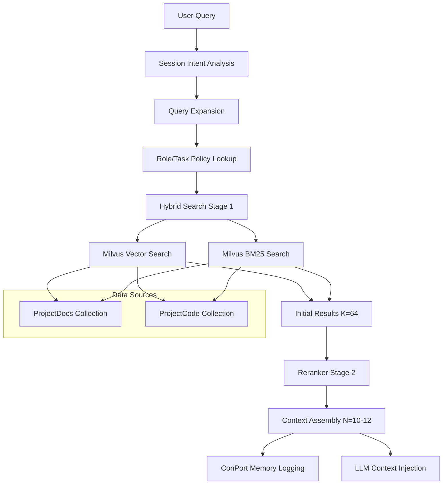

# Dopemux RAG System Architecture Overview

## Executive Summary

Dopemux's Retrieval-Augmented Generation (RAG) system provides high-quality context retrieval across documentation and code through a sophisticated two-stage hybrid pipeline. The system combines dense semantic search with BM25 keyword matching, followed by advanced reranking to maximize precision and relevance for AI-powered development workflows.

## System Goals

### Primary Objectives
- **High-Quality Context**: Surface the most relevant information for AI assistants
- **Dual Content Types**: Handle both documentation (DocRAG) and code (CodeRAG) effectively
- **Role Adaptation**: Tailor retrieval based on user role (Developer, Architect, SRE, PM)
- **Memory Integration**: Automatically build project knowledge graphs
- **ADHD Accommodation**: Reduce cognitive load with intelligent, contextual suggestions

### Quality Targets
- **Precision@10**: >0.8 for answerable queries
- **Response Time**: p95 < 2 seconds end-to-end
- **Context Relevance**: 90%+ of injected context directly supports answers
- **Memory Integration**: 100% of retrieved content automatically logged to ConPort

## System Architecture



## Core Components

### 1. Ingestion Pipeline
- **Document Processing**: Chunk docs into ~400-token segments with contextual preludes
- **Code Processing**: Segment code by AST/functions with optional comment preludes
- **Embedding Generation**: Voyage-context-3 for docs, Voyage-code-3 for code
- **Index Storage**: Milvus HNSW + BM25 hybrid indices

### 2. Retrieval Pipeline
- **Stage 1**: Hybrid search combining vector similarity (cosine) and BM25 lexical matching
- **Stage 2**: Voyage rerank-2.5 with role-specific instructions
- **Context Assembly**: Top N=10-12 results formatted for LLM injection

### 3. Memory Integration
- **ConPort Logging**: All retrieved content automatically captured in project graph
- **Session Tracking**: Query intent and context usage patterns
- **Decision Recording**: Promote important conversation outcomes to persistent memory

### 4. Role-Based Adaptation
- **Policy Engine**: JSON-configured retrieval behavior per role/task combination
- **Source Weighting**: Different code/docs balance (Developer: 60/40, PM: 10/90)
- **Filter Application**: Include/exclude content types based on role needs

## Pipeline Flow Detail

### Ingestion (Offline)
1. **Content Chunking**: Split documents and code into semantic units
2. **Contextualization**: Generate preludes (50-100 tokens for docs, 20-60 for code)
3. **Embedding**: Create vector representations using specialized Voyage models
4. **Index Updates**: Upsert to Milvus collections with both vector and sparse indices

### Query Processing (Runtime)
1. **Intent Analysis**: Extract session context from recent conversation (last ~20 turns)
2. **Query Expansion**: Augment with session keywords and role-specific terms
3. **Policy Application**: Apply role/task-specific weights and filters
4. **Hybrid Search**: Execute parallel vector and BM25 queries (K=64 initial results)
5. **Reranking**: Use Voyage rerank-2.5 with role-aware instructions
6. **Assembly**: Format top N=10-12 results with metadata and citations
7. **Memory Logging**: Record all operations in ConPort project graph

## Configuration Differences: DocRAG vs CodeRAG

### DocRAG Configuration
- **Collection**: `ProjectDocs`
- **Chunk Size**: 300-500 tokens + prelude
- **Embedding Model**: voyage-context-3 (1024-dim)
- **Hybrid Weights**: 0.65 vector / 0.35 BM25 (favor semantic matching)
- **Preludes**: Always generated via LLM summarization
- **Analyzer**: Standard English with stopword removal

### CodeRAG Configuration
- **Collection**: `ProjectCode`
- **Chunk Size**: Function/class boundaries, ~100-line blocks
- **Embedding Model**: voyage-code-3 (1024-dim)
- **Hybrid Weights**: 0.55 vector / 0.45 BM25 (balance semantic + lexical)
- **Preludes**: Optional, only for complex code without comments
- **Analyzer**: Code-aware tokenization (preserve identifiers, minimal stopword removal)

## Milvus Index Configuration

### Vector Index (Both Collections)
- **Type**: HNSW (Hierarchical Navigable Small World)
- **Parameters**: M=16, efConstruction=200, efSearch=128
- **Metric**: COSINE (normalized embeddings)
- **Shards**: 2 for parallel indexing

### Sparse Index (BM25)
- **Parameters**: k1=1.2, b=0.75 (standard BM25)
- **Algorithm**: DAAT_MAXSCORE for efficiency
- **Language**: English analyzer for docs, code-aware for code

## Role Policy Examples

```json
{
  "Developer:CodeImplementation": {
    "source_weights": { "ProjectCode": 0.6, "ProjectDocs": 0.4 },
    "rerank_instruction": "Prioritize code snippets and implementation details",
    "filters": { "include_modules": ["src/", "lib/"] }
  },
  "PM:FeatureDiscussion": {
    "source_weights": { "ProjectDocs": 0.9, "ProjectCode": 0.1 },
    "rerank_instruction": "Focus on user-facing descriptions and requirements",
    "filters": { "include_doc_types": ["Spec", "Requirement"], "exclude_modules": ["src/"] }
  }
}
```

## Context Header Format

Each retrieved item includes:
- **Title**: Document/function name with clear identification
- **Lane**: Source type (Doc/Code/Decision) for LLM understanding
- **Why Tag**: Explanation of relevance ("Contains auth logic", "Design rationale")
- **Content**: Actual text/code with formatting preservation
- **Citation**: Trackable reference for source attribution

## Memory Graph Schema

### Node Types
- **DocumentChunk**: id, doc_id, title, text, source, workspace_id
- **CodeChunk**: id, file_path, func_sig, code, workspace_id
- **Query**: query_text, session_id, role, timestamp
- **Answer**: answer_text, timestamp
- **Decision**: description, tags, timestamp

### Edge Types
- **retrieved**: Query → Chunk (with scores and stages)
- **context_used**: Query → Chunk (actual usage)
- **supported_by**: Answer → Chunk (provenance)
- **derived_from**: Answer → multiple Chunks

## Performance Characteristics

### Latency Targets
- **Stage 1 Retrieval**: <100ms (Milvus query)
- **Stage 2 Reranking**: <1.5s (64 candidates on GPU)
- **Context Assembly**: <50ms (formatting and metadata)
- **Total Pipeline**: p95 < 2s

### Throughput Capacity
- **Concurrent Queries**: 10-20/second sustainable
- **Index Size**: Supports 1M+ document chunks, 500K+ code chunks
- **Memory Usage**: ~8GB for full index in memory

## Integration Points

### With Dopemux Core
- **Session Context**: Integration with chat memory for intent awareness
- **Role Detection**: Uses Dopemux role/task identification
- **Multi-Instance**: Supports project isolation via workspace_id

### With ConPort
- **Real-time Logging**: mem.upsert() and graph.link() operations
- **Query Interface**: Neighborhood traversal for query expansion
- **Decision Capture**: Automatic promotion of chat insights to persistent memory

### With Existing Systems
- **Claude-Context MCP**: Complementary code search capabilities
- **Milvus Cluster**: Shared vector database infrastructure
- **Voyage AI**: External API for embedding and reranking

## Operational Considerations

### Health Monitoring
- **Service Health**: Milvus, ConPort, Voyage API availability
- **Performance**: Query latency, reranker throughput, memory usage
- **Quality**: Empty-hit rates, staleness detection, accuracy metrics

### Maintenance Tasks
- **Index Updates**: Incremental refresh on code/doc changes
- **Cache Management**: Prelude cache invalidation and refresh
- **Memory Reconciliation**: ConPort consistency checks and repairs

## Related Documentation

- **[ADR-501: Milvus Selection](../90-adr/501-vector-database-milvus.md)** - Strategic database choice
- **[ADR-505: ConPort Integration](../90-adr/505-conport-integration.md)** - Memory system integration
- **[Hybrid Retrieval Design](./hybrid-retrieval-design.md)** - Detailed pipeline architecture
- **[Setup Guide](../02-how-to/rag/setup-rag-pipeline.md)** - Implementation instructions
- **[Operations Runbook](../92-runbooks/rag/rag-operations-runbook.md)** - Production procedures

## Next Steps

1. **Implementation**: Follow setup guide for initial deployment
2. **Configuration**: Customize role policies for team needs
3. **Evaluation**: Run benchmarks and tune performance parameters
4. **Integration**: Connect with existing Dopemux workflows
5. **Monitoring**: Deploy observability and alerting systems

---

**Status**: Architecture Approved
**Last Updated**: 2025-09-23
**Next Review**: Q1 2025