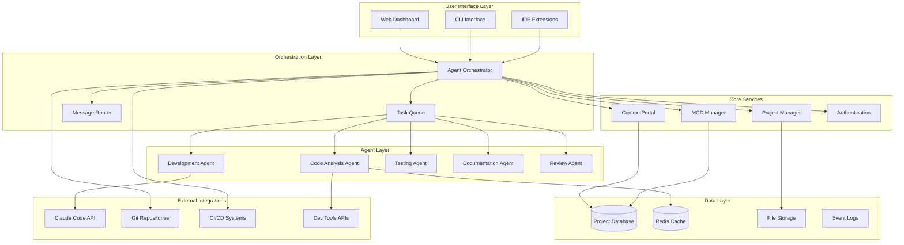
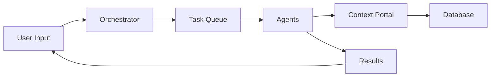

# Main Context Document (MCD)
## Dopemux - Multi-Agent Development Platform

> This document serves as the complete blueprint for AI collaboration, treating the Dopemux application like a "book" that can be read, understood, and translated into executable code by AI agents.

**Generated:** 2025-09-08  
**Project Type:** Multi-Agent Development Platform  
**Repository:** /Users/hue/dmpx  

---

## 1. Overview & Goals

### Project Purpose
Dopemux is an innovative multi-agent development platform that orchestrates multiple AI agents to collaboratively develop, analyze, and maintain software projects. It addresses the growing complexity of software development by enabling AI agents to work together with human developers, each bringing specialized capabilities to create a more efficient and intelligent development workflow.

### Target Users
- **Software Development Teams** seeking to accelerate development with AI assistance
- **Solo Developers** wanting AI pair programming and automated development tasks
- **Enterprise Organizations** looking to scale development capabilities with AI integration
- **AI Researchers and Engineers** experimenting with multi-agent software development paradigms

### Key Features
- **Multi-Agent Orchestration**: Coordinate specialized AI agents for different development tasks
- **Claude Code Integration**: Deep integration with Anthropic's Claude Code for advanced AI assistance
- **MCD-Driven Development**: Use Main Context Documents as the foundation for AI-human collaboration
- **Intelligent Task Distribution**: Automatically assign tasks to the most appropriate agents
- **Context Portal Management**: Maintain shared context across all agents and human team members
- **Real-time Collaboration**: Enable seamless interaction between AI agents and human developers

### Success Criteria
- Enable 3+ AI agents to collaboratively work on a single project with minimal conflicts
- Achieve 60%+ reduction in development time for common software engineering tasks
- Maintain code quality standards equal to or better than human-only development
- Provide intuitive interface that requires minimal learning curve for adoption
- Support integration with existing development tools and workflows

### Key Performance Indicators
- **Agent Coordination Efficiency**: Measure successful task handoffs between agents
- **Development Velocity**: Track story points or features completed per sprint
- **Code Quality Metrics**: Monitor test coverage, bug rates, and code review scores
- **User Adoption Rate**: Track active users and feature engagement
- **AI-Human Collaboration Score**: Measure effectiveness of hybrid development workflows

---

## 2. Technical Architecture

### Architecture Pattern
**Multi-Agent Microservices with Event-Driven Communication**

Dopemux employs a distributed architecture where specialized AI agents operate as independent services, communicating through a central orchestration layer. This enables scalable, fault-tolerant operation while maintaining clear separation of concerns.

### System Architecture Diagram


### Technology Stack

#### Backend Services
- **Runtime**: Node.js 18+
- **Framework**: Express.js with TypeScript
- **API Style**: REST + WebSocket for real-time communication
- **Message Queue**: Bull (Redis-based) for agent task distribution
- **Authentication**: JWT with refresh tokens

#### Agent Implementation
- **Agent Framework**: Custom agent framework built on Node.js
- **AI Integration**: Anthropic Claude API, OpenAI GPT-4 (fallback)
- **Code Analysis**: Tree-sitter for syntax parsing, ESLint/TSLint integration
- **Communication**: gRPC for inter-agent communication

#### Database & Storage
- **Primary Database**: PostgreSQL for structured data (projects, users, tasks)
- **Caching**: Redis for session management and real-time data
- **File Storage**: Local filesystem with optional S3 integration
- **Search**: Elasticsearch for code and context search

#### Frontend
- **Framework**: React 18 with TypeScript
- **State Management**: Redux Toolkit with RTK Query
- **UI Library**: Material-UI (MUI) with custom design system
- **Real-time Updates**: Socket.io client for live collaboration

#### Infrastructure
- **Containerization**: Docker with Docker Compose for development
- **Orchestration**: Kubernetes for production deployment
- **Monitoring**: Prometheus + Grafana for metrics, structured logging
- **CI/CD**: GitHub Actions with automated testing and deployment

---

## 3. Implementation Specifications

### API Design
**RESTful API with WebSocket Extensions**

#### Core API Endpoints
```typescript
// Project Management
POST   /api/v1/projects
GET    /api/v1/projects/:id
PUT    /api/v1/projects/:id
DELETE /api/v1/projects/:id

// Agent Management
POST   /api/v1/agents/spawn
GET    /api/v1/agents/status
POST   /api/v1/agents/:id/tasks
GET    /api/v1/agents/:id/logs

// MCD Management
POST   /api/v1/mcd/generate
GET    /api/v1/mcd/:projectId
PUT    /api/v1/mcd/:projectId
POST   /api/v1/mcd/:projectId/validate

// Context Portal
GET    /api/v1/context/:projectId
POST   /api/v1/context/:projectId/update
WS     /ws/context/:projectId (real-time updates)
```

### Core Entities/Models

#### Project Model
```typescript
interface Project {
  id: string;
  name: string;
  description: string;
  repository: GitRepository;
  mcd: MCD;
  activeAgents: Agent[];
  settings: ProjectSettings;
  createdAt: Date;
  updatedAt: Date;
}
```

#### Agent Model
```typescript
interface Agent {
  id: string;
  type: AgentType;
  status: AgentStatus;
  capabilities: string[];
  currentTask?: Task;
  projectId: string;
  configuration: AgentConfig;
  metadata: AgentMetadata;
}
```

#### Task Model
```typescript
interface Task {
  id: string;
  type: TaskType;
  priority: Priority;
  status: TaskStatus;
  assignedAgent?: string;
  dependencies: string[];
  context: TaskContext;
  result?: TaskResult;
  createdAt: Date;
  completedAt?: Date;
}
```

#### MCD (Main Context Document) Model
```typescript
interface MCD {
  id: string;
  projectId: string;
  sections: MCDSection[];
  version: number;
  lastUpdated: Date;
  generatedBy: 'human' | 'ai' | 'hybrid';
  validationStatus: ValidationStatus;
}
```

### Business Logic Areas

#### Agent Orchestration Engine
- **Task Queue Management**: Distribute tasks across available agents based on capabilities and load
- **Agent Lifecycle Management**: Spawn, monitor, and terminate agents as needed
- **Conflict Resolution**: Handle conflicting actions or decisions between agents
- **Resource Allocation**: Manage compute resources and rate limits across agents

#### Context Management System
- **Shared Context Maintenance**: Keep all agents and humans synchronized with project state
- **Context Versioning**: Track changes to context and enable rollback capabilities
- **Context Filtering**: Provide relevant context subsets to different agents based on their tasks
- **Real-time Context Updates**: Propagate context changes instantly across the system

#### MCD Processing Pipeline
- **Automatic Generation**: Create MCDs from existing codebases using the integrated generator
- **Interactive Creation**: Guide users through MCD creation for new projects
- **Validation and Quality Assurance**: Ensure MCDs meet standards for AI collaboration
- **Version Management**: Track MCD evolution and maintain history

#### Code Analysis and Understanding
- **Static Code Analysis**: Parse and understand code structure, dependencies, and patterns
- **Semantic Code Search**: Enable natural language queries against codebases
- **Change Impact Analysis**: Understand how code changes affect the broader system
- **Quality Metrics Calculation**: Assess code quality, test coverage, and technical debt

---

## 4. File Structure & Organization

### Structure Type
**Domain-Driven Design with Microservices Architecture**

The project is organized around business domains while maintaining clear service boundaries for scalability and maintainability.

### Directory Structure
```
dopemux/
├── research/                    # Research and analysis documents
│   ├── architecture/           # Architecture proposals and decisions
│   ├── integrations/          # Integration research (Claude Code, etc.)
│   ├── findings/              # Research findings and insights
│   └── patterns/              # Identified patterns and optimizations
│
├── src/                        # Main application source code
│   ├── core/                  # Core domain logic
│   │   ├── agents/           # Agent management and orchestration
│   │   ├── projects/         # Project management domain
│   │   ├── tasks/            # Task management and queuing
│   │   └── context/          # Context portal and management
│   │
│   ├── agents/                # Individual agent implementations
│   │   ├── code-analysis/    # Code analysis agent
│   │   ├── development/      # Development agent
│   │   ├── testing/          # Testing agent
│   │   ├── documentation/    # Documentation agent
│   │   └── review/           # Code review agent
│   │
│   ├── integrations/          # External service integrations
│   │   ├── claude/           # Claude Code integration
│   │   ├── git/              # Git repository management
│   │   ├── ci-cd/            # CI/CD pipeline integration
│   │   └── tools/            # Development tools integration
│   │
│   ├── ui/                    # User interface components
│   │   ├── components/       # Reusable React components
│   │   ├── pages/            # Page-level components
│   │   ├── hooks/            # Custom React hooks
│   │   └── store/            # Redux store and slices
│   │
│   └── api/                   # API layer
│       ├── routes/           # Express.js route definitions
│       ├── controllers/      # Request handlers
│       ├── middleware/       # Express middleware
│       └── validators/       # Request validation schemas
│
├── tools/                      # Development tools and utilities
│   ├── mcd-generator/         # MCD Generator (implemented)
│   ├── dev-utils/            # Development utilities
│   └── automation-scripts/   # Automation and deployment scripts
│
├── tests/                      # Test suites
│   ├── unit/                 # Unit tests
│   ├── integration/          # Integration tests
│   ├── e2e/                  # End-to-end tests
│   └── tools/                # Tool-specific tests
│
├── config/                     # Configuration files
│   ├── development/          # Development environment config
│   ├── staging/              # Staging environment config
│   └── production/           # Production environment config
│
├── docs/                       # Project documentation
│   ├── architecture/         # System architecture documentation
│   ├── api/                  # API documentation
│   ├── user-guides/          # User documentation
│   └── development/          # Development guides
│
├── scripts/                    # Build and deployment scripts
├── .github/                    # GitHub workflows and templates
└── context_portal/            # Context portal implementation (existing)
```

### Module Responsibilities

#### Core Modules
- **`src/core/agents/`**: Agent lifecycle management, capability discovery, task assignment
- **`src/core/projects/`**: Project creation, configuration, and metadata management
- **`src/core/tasks/`**: Task queue management, dependency resolution, status tracking
- **`src/core/context/`**: Shared context maintenance and synchronization

#### Agent Modules
- **`src/agents/code-analysis/`**: Static analysis, dependency mapping, architecture inference
- **`src/agents/development/`**: Code generation, refactoring, feature implementation
- **`src/agents/testing/`**: Test generation, execution, coverage analysis
- **`src/agents/documentation/`**: Documentation generation, MCD maintenance
- **`src/agents/review/`**: Code review, quality assessment, best practice enforcement

---

## 5. Task Breakdown & Implementation Plan

### Development Phases

#### Phase 1: Foundation (4-6 weeks)
**Core Infrastructure and Basic Agent Framework**

**Sprint 1 (Weeks 1-2): Core Infrastructure**
- Set up project structure and development environment
- Implement basic Express.js API server with TypeScript
- Set up PostgreSQL database with initial schemas
- Create Docker development environment
- Implement authentication and authorization system

**Sprint 2 (Weeks 3-4): Agent Framework**  
- Design and implement base Agent class and interfaces
- Create agent registration and discovery system
- Implement basic task queue with Bull/Redis
- Create agent communication protocol
- Build agent lifecycle management (spawn, monitor, terminate)

**Sprint 3 (Weeks 5-6): MCD Integration**
- Integrate existing MCD generator into main application
- Create MCD management API endpoints
- Implement MCD validation and quality checks
- Build MCD-to-agent context translation layer
- Create basic web UI for MCD viewing and editing

#### Phase 2: Core Agents (6-8 weeks)
**Essential Agent Implementations**

**Sprint 4 (Weeks 7-8): Code Analysis Agent**
- Implement static code analysis using Tree-sitter
- Create dependency mapping and architecture inference
- Build code quality assessment capabilities
- Integrate with existing development tools (ESLint, etc.)
- Create code search and query functionality

**Sprint 5 (Weeks 9-10): Development Agent**
- Implement Claude Code integration
- Create code generation and modification capabilities
- Build refactoring and optimization features
- Implement change tracking and conflict resolution
- Create development task execution framework

**Sprint 6 (Weeks 11-12): Testing Agent**
- Build automated test generation capabilities
- Implement test execution and result analysis
- Create coverage analysis and reporting
- Build test maintenance and optimization features
- Integrate with popular testing frameworks

**Sprint 7 (Weeks 13-14): Context Portal**
- Implement real-time context synchronization
- Create context filtering and scoping mechanisms
- Build context history and versioning
- Implement context-aware notifications
- Create collaborative editing capabilities

#### Phase 3: Advanced Features (4-6 weeks)
**Multi-Agent Coordination and Advanced Capabilities**

**Sprint 8 (Weeks 15-16): Agent Orchestration**
- Implement complex task dependency resolution
- Create agent collaboration protocols
- Build conflict detection and resolution mechanisms
- Implement load balancing across agents
- Create agent performance monitoring

**Sprint 9 (Weeks 17-18): Documentation & Review Agents**
- Implement documentation generation agent
- Create automated code review capabilities
- Build documentation maintenance and updating
- Implement review comment generation and tracking
- Create documentation quality assessment

**Sprint 10 (Weeks 19-20): Integration & Polish**
- Integrate with Git repositories and workflows
- Create CI/CD pipeline integrations
- Implement monitoring and observability
- Build comprehensive error handling and recovery
- Create admin tools and dashboards

#### Phase 4: Production Readiness (3-4 weeks)
**Security, Performance, and Deployment**

**Sprint 11 (Weeks 21-22): Security & Performance**
- Implement comprehensive security measures
- Create performance optimization and caching
- Build rate limiting and resource management
- Implement audit logging and compliance features
- Create backup and disaster recovery procedures

**Sprint 12 (Weeks 23-24): Deployment & Monitoring**
- Create Kubernetes deployment configurations
- Implement comprehensive monitoring and alerting
- Build automated deployment pipelines
- Create load testing and performance validation
- Implement user onboarding and documentation

### Key Milestones

1. **Week 6**: Core agent framework operational
2. **Week 12**: First complete multi-agent workflow demonstration
3. **Week 18**: Full feature set implemented and tested
4. **Week 24**: Production-ready deployment

### Resource Requirements

#### Development Team
- **1 Senior Full-Stack Developer** (Project lead, architecture)
- **1 AI/ML Engineer** (Agent implementation, Claude integration)
- **1 Frontend Developer** (React UI, user experience)
- **1 DevOps Engineer** (Infrastructure, deployment, monitoring)

#### Infrastructure
- **Development Environment**: Local Docker setup, staging server
- **External Services**: Claude API access, GitHub/GitLab integration
- **Production Infrastructure**: Kubernetes cluster, monitoring stack

---

## 6. Integration & Dependencies

### External Services

#### Primary Integrations
- **Anthropic Claude Code**: Core AI capabilities for code analysis and generation
- **Git Providers**: GitHub, GitLab, Bitbucket for repository management
- **CI/CD Systems**: GitHub Actions, GitLab CI, Jenkins for pipeline integration
- **Development Tools**: ESLint, Prettier, various language-specific tooling

#### Authentication & Authorization
- **OAuth Providers**: GitHub, GitLab, Google for user authentication
- **JWT Tokens**: Stateless authentication with refresh token rotation
- **Role-Based Access Control**: Project-level permissions and agent access controls

### Key Libraries/Frameworks

#### Backend Dependencies
```json
{
  "express": "^4.18.0",
  "typescript": "^5.0.0", 
  "@types/node": "^20.0.0",
  "bull": "^4.10.0",
  "pg": "^8.8.0",
  "redis": "^4.3.0",
  "socket.io": "^4.7.0",
  "jsonwebtoken": "^9.0.0",
  "bcrypt": "^5.1.0",
  "joi": "^17.9.0",
  "winston": "^3.8.0"
}
```

#### Frontend Dependencies
```json
{
  "react": "^18.2.0",
  "@reduxjs/toolkit": "^1.9.0",
  "@mui/material": "^5.11.0",
  "socket.io-client": "^4.7.0",
  "axios": "^1.3.0",
  "react-router-dom": "^6.8.0",
  "@monaco-editor/react": "^4.4.0"
}
```

#### Agent-Specific Dependencies
```json
{
  "tree-sitter": "^0.20.0",
  "@anthropic-ai/sdk": "^0.6.0",
  "openai": "^4.0.0",
  "simple-git": "^3.16.0",
  "eslint": "^8.36.0",
  "prettier": "^2.8.0"
}
```

### Internal Dependencies

#### Service Dependencies
- **Agent Orchestrator** → **Task Queue Service** → **Individual Agents**
- **Context Portal** → **Database Service** → **Real-time Sync Service**
- **MCD Manager** → **Validation Service** → **Template Engine**
- **Project Manager** → **Git Integration** → **File System Service**

#### Data Flow Dependencies


### Configuration Management

#### Environment-Specific Settings
- **Development**: Local services, debug logging, hot reload
- **Staging**: Simulated production environment, integration testing
- **Production**: Optimized performance, security hardening, monitoring

#### External Service Configuration
```yaml
claude:
  api_key: ${CLAUDE_API_KEY}
  model: "claude-3-sonnet"
  rate_limit: 100

git:
  providers:
    github:
      client_id: ${GITHUB_CLIENT_ID}
      webhook_secret: ${GITHUB_WEBHOOK_SECRET}
    
database:
  host: ${DB_HOST}
  port: ${DB_PORT}
  name: ${DB_NAME}
  credentials: ${DB_CREDENTIALS}
```

---

## 7. Testing & Validation Strategy

### Testing Levels

#### Unit Tests
- **Coverage Target**: 85% code coverage
- **Framework**: Jest with TypeScript support
- **Focus Areas**: Core business logic, agent capabilities, utility functions
- **Mocking Strategy**: Mock external services, database connections, and file system operations

#### Integration Tests  
- **Framework**: Jest with Supertest for API testing
- **Database Testing**: Test containers with PostgreSQL
- **Agent Communication**: Test inter-agent messaging and task handoffs
- **External Service Integration**: Test Claude API integration with mock responses

#### End-to-End Tests
- **Framework**: Playwright for full application workflows
- **Scenarios**: Complete user journeys from project creation to agent collaboration
- **Environment**: Staging environment with real integrations
- **Data Management**: Automated test data setup and cleanup

#### Performance Tests
- **Framework**: k6 for load testing
- **Metrics**: Response times, throughput, resource utilization
- **Scenarios**: Agent coordination under load, concurrent user sessions
- **Thresholds**: 95th percentile response times under 500ms

### Testing Tools

#### Primary Testing Stack
- **Jest**: Unit and integration testing framework
- **Playwright**: End-to-end browser testing
- **Supertest**: HTTP API testing
- **k6**: Load and performance testing
- **Test Containers**: Isolated database testing

#### Code Quality Tools
- **ESLint**: Code linting and style enforcement
- **Prettier**: Code formatting
- **Husky**: Git hooks for pre-commit validation
- **SonarQube**: Code quality analysis and technical debt tracking

### Coverage Goals

#### Quantitative Targets
- **Overall Code Coverage**: 85%
- **Critical Path Coverage**: 95% (agent orchestration, core APIs)
- **Branch Coverage**: 80%
- **Function Coverage**: 90%

#### Qualitative Standards
- **All Public APIs**: Fully tested with positive and negative scenarios
- **Error Handling**: All error paths tested and documented
- **Edge Cases**: Boundary conditions and exceptional scenarios covered
- **Integration Points**: All external service integrations tested

### Quality Gates

#### Pre-Commit Gates
- All unit tests pass
- Code coverage meets minimum thresholds
- No ESLint errors or warnings
- Code formatting with Prettier
- No TypeScript compilation errors

#### Pull Request Gates
- All tests pass (unit, integration, affected e2e)
- Code review approval from at least one team member
- SonarQube quality gate passes
- Documentation updated for API changes
- Performance impact assessment for critical paths

#### Release Gates
- Full test suite passes (including e2e and performance)
- Security vulnerability scan passes
- Load testing validates performance under expected traffic
- Staging deployment successful with smoke tests
- All critical bugs resolved

#### Production Deployment Gates
- Canary deployment successful with monitoring
- Health checks pass for all services
- Performance metrics within acceptable ranges
- Rollback plan validated and ready
- Monitoring and alerting configured

### Continuous Testing Strategy

#### Automated Testing Pipeline
```yaml
stages:
  - lint_and_format
  - unit_tests
  - integration_tests
  - build_and_package
  - e2e_tests
  - performance_tests
  - security_scan
  - deploy_staging
  - smoke_tests
  - deploy_production
```

#### Testing in Development
- **Test-Driven Development**: Write tests before implementation for critical components
- **Local Testing**: Full test suite runs in under 5 minutes locally
- **Watch Mode**: Automatic test execution on file changes during development
- **Mock Services**: Local development environment with mocked external dependencies

---

## 8. Deployment & Operations

### Deployment Target
**Cloud-Native Kubernetes with Multi-Environment Support**

Dopemux is designed for cloud deployment with support for multiple environments and automatic scaling based on demand.

### Deployment Method
**Containerized Microservices with Kubernetes Orchestration**

Each component (API server, agents, UI) is containerized and deployed as independent services that can be scaled and updated independently.

### Infrastructure Architecture

#### Production Environment
```yaml
# Kubernetes Cluster Configuration
apiVersion: v1
kind: ConfigMap
metadata:
  name: dopemux-config
data:
  NODE_ENV: "production"
  LOG_LEVEL: "info"
  CLUSTER_SIZE: "5"
  
---
apiVersion: apps/v1
kind: Deployment
metadata:
  name: dopemux-api
spec:
  replicas: 3
  selector:
    matchLabels:
      app: dopemux-api
  template:
    spec:
      containers:
      - name: api
        image: dopemux/api:latest
        ports:
        - containerPort: 3000
        env:
        - name: DATABASE_URL
          valueFrom:
            secretKeyRef:
              name: dopemux-secrets
              key: database-url
```

#### Service Architecture
- **API Gateway**: Traefik for request routing and load balancing
- **Application Services**: Multiple API server instances behind load balancer
- **Agent Pool**: Dynamically scaled agent containers based on workload
- **Database**: PostgreSQL with read replicas and automated backups
- **Cache Layer**: Redis cluster for session storage and real-time data
- **File Storage**: S3-compatible storage for project files and artifacts

### Environment Configuration

#### Development Environment
- **Local Docker Compose**: Single-node setup for development
- **Hot Reload**: Automatic code reloading for faster iteration
- **Debug Mode**: Detailed logging and error reporting
- **Mock Services**: Local mocks for external dependencies

#### Staging Environment  
- **Kubernetes Minikube**: Production-like setup for testing
- **Integration Testing**: Real external service connections
- **Performance Testing**: Load testing against staging environment
- **Security Scanning**: Automated vulnerability assessment

#### Production Environment
- **Multi-Zone Deployment**: High availability across availability zones
- **Auto-Scaling**: Horizontal pod autoscaling based on CPU/memory metrics
- **Health Checks**: Kubernetes liveness and readiness probes
- **Resource Limits**: CPU and memory constraints for stability

### Monitoring

#### Application Monitoring
- **Metrics Collection**: Prometheus for application and system metrics
- **Visualization**: Grafana dashboards for operational insights
- **Alerting**: PagerDuty integration for critical issues
- **Log Aggregation**: ELK stack (Elasticsearch, Logstash, Kibana) for centralized logging

#### Key Metrics Dashboard
```
Dopemux Operations Dashboard
├── System Health
│   ├── Service Uptime (99.9% SLA target)
│   ├── Response Times (p95 < 500ms)
│   └── Error Rates (< 0.1%)
├── Agent Performance  
│   ├── Task Completion Rate
│   ├── Agent Utilization
│   └── Inter-Agent Communication Latency
├── Business Metrics
│   ├── Active Projects
│   ├── Daily Task Volume
│   └── User Engagement
└── Infrastructure
    ├── Resource Utilization
    ├── Database Performance
    └── Queue Health
```

#### Alerting Rules
- **Critical**: Service downtime, database connectivity loss
- **Warning**: High error rates, performance degradation
- **Info**: Deployment events, scaling activities

### Security & Compliance

#### Security Measures
- **API Security**: Rate limiting, input validation, JWT authentication
- **Network Security**: Private networking, TLS encryption, service mesh
- **Data Security**: Encryption at rest and in transit, secure secrets management
- **Access Control**: RBAC for Kubernetes, audit logging for all operations

#### Compliance Considerations
- **GDPR**: User data privacy controls, right to deletion
- **SOC 2**: Security controls and audit trail requirements
- **Data Residency**: Geographic data storage controls if required

### Maintenance & Operations

#### Automated Operations
- **Deployment**: GitOps workflow with ArgoCD for declarative deployments
- **Backup**: Automated database backups with point-in-time recovery
- **Updates**: Rolling updates with zero-downtime deployment
- **Scaling**: Automatic scaling based on workload metrics

#### Manual Operations Procedures
- **Incident Response**: Documented procedures for service restoration
- **Data Recovery**: Step-by-step recovery procedures for various failure scenarios
- **Performance Tuning**: Guidelines for optimizing system performance
- **Security Response**: Procedures for handling security incidents

#### Maintenance Schedule
- **Daily**: Automated health checks and backup verification
- **Weekly**: Performance review and capacity planning
- **Monthly**: Security updates and dependency upgrades
- **Quarterly**: Full disaster recovery testing and security audit

### Disaster Recovery

#### Backup Strategy
- **Database**: Continuous WAL-E backups with 30-day retention
- **File Storage**: Cross-region replication with versioning
- **Configuration**: Infrastructure as Code in version control
- **Recovery Time Objective**: < 4 hours for full system restoration
- **Recovery Point Objective**: < 15 minutes data loss maximum

#### Business Continuity
- **Multi-Region**: Primary and secondary deployment regions
- **Failover**: Automated DNS failover for critical service continuity
- **Data Sync**: Real-time data replication between regions
- **Communication**: Status page and user notification systems

---

## Implementation Notes

This MCD was generated as the first real-world test of the MCD Generator system and serves as both documentation and validation of the methodology. The comprehensive nature of this document demonstrates the AI-readable blueprint concept that enables multiple AI agents to collaborate effectively on the Dopemux platform.

### Next Steps

1. **Validate and Refine**: Review this MCD with development team and stakeholders
2. **Technical Validation**: Run through MCD validation framework
3. **Implementation Planning**: Use task breakdown section to create development sprints
4. **Agent Testing**: Use this MCD to test multi-agent collaboration capabilities
5. **Living Document**: Maintain and update as the project evolves

### Cross-References

- **Research Foundation**: See `/research/` directory for underlying analysis
- **MCD Generator**: See `/tools/mcd-generator/` for the tool that created this document
- **Architecture Decisions**: Track decisions using the ConPort system integration
- **Project Context**: Maintain in Context Portal for agent collaboration

---

*Generated by MCD Generator v1.0 - First Production Use*  
*This document serves as the foundation for AI-human collaborative development of Dopemux*
