# DOPEMUX Technical Architecture Document
## Multi-Agent Development Platform System Design

**Version**: 1.0  
**Date**: 2025-09-10  
**Status**: Implementation Ready  
**Architecture Review**: Approved

---

## Architecture Overview

### System Philosophy

DOPEMUX employs a **Supervisor-Based Multi-Agent Architecture** with **Context7-First Integration** and **Neurodivergent-Accessible Design Patterns**. The system is built on the principle that specialized AI agents working in coordination can achieve significantly better results than monolithic single-agent approaches.

**Core Architectural Principles**:
1. **Agent Specialization**: Each agent optimized for specific development domains
2. **Deterministic Orchestration**: Predictable routing and handoffs for quality assurance
3. **Context Preservation**: Shared understanding maintained across all system components
4. **Graceful Degradation**: System remains functional during partial failures
5. **Cognitive Accessibility**: Interface and workflows designed for neurodivergent users

### High-Level System Architecture

```mermaid
graph TB
    subgraph "User Interface Layer"
        CLI[CLI Interface - dopemux]
        WEB[Web Dashboard]
        IDE[IDE Extensions]
        TERM[Terminal UI - Rich/Textual]
    end
    
    subgraph "Orchestration Layer"
        SUPER[Supervisor Engine]
        ROUTER[Request Router]
        QUEUE[Task Queue - Bull/Redis]
        MONITOR[Health Monitor]
        BUDGET[Token Budget Manager]
    end
    
    subgraph "Agent Clusters"
        subgraph "Research Cluster (25k tokens)"
            CONTEXT7[Context7 Agent]
            EXA[Exa Search Agent]
            PERPLEXITY[Perplexity Agent]
        end
        
        subgraph "Implementation Cluster (35k tokens)"
            SERENA[Serena Code Agent]
            TASKMASTER[TaskMaster Agent]
            SEQUENTIAL[Sequential Thinking Agent]
        end
        
        subgraph "Quality Cluster (20k tokens)"
            ZEN[Zen Reviewer Agent]
            TESTING[Testing Agent]
        end
        
        subgraph "Neurodivergent Assistance (13k tokens)"
            FOCUS[Focus Agent]
            TIMELINE[Timeline Agent]
            MEMORY[Memory Agent]
        end
        
        PRIVACY[Privacy Guardian Agent]
    end
    
    subgraph "Core Services"
        MCD[MCD Manager]
        CONTEXT[Context Portal]
        PROJECT[Project Manager]
        AUTH[Authentication Service]
        NOTIFICATION[Notification Service]
    end
    
    subgraph "Data Layer"
        POSTGRES[(PostgreSQL - Projects/Users)]
        REDIS[(Redis - Sessions/Cache)]
        SQLITE[(SQLite - Local State)]
        FILESYSTEM[File System - .dopemux/]
    end
    
    subgraph "External Integrations"
        CLAUDE[Claude API]
        MCP_ECOSYSTEM[3000+ MCP Servers]
        GIT[Git Repositories]
        CI_CD[CI/CD Pipelines]
        DEV_TOOLS[Development Tools]
    end
    
    %% User Interface Connections
    CLI --> SUPER
    WEB --> SUPER
    IDE --> SUPER
    TERM --> SUPER
    
    %% Orchestration Layer
    SUPER --> ROUTER
    SUPER --> QUEUE
    SUPER --> MONITOR
    SUPER --> BUDGET
    
    %% Agent Coordination
    ROUTER --> CONTEXT7
    ROUTER --> SERENA
    ROUTER --> ZEN
    ROUTER --> FOCUS
    ROUTER --> PRIVACY
    
    QUEUE --> EXA
    QUEUE --> PERPLEXITY
    QUEUE --> TASKMASTER
    QUEUE --> SEQUENTIAL
    QUEUE --> TESTING
    QUEUE --> TIMELINE
    QUEUE --> MEMORY
    
    %% Core Services Integration
    SUPER --> MCD
    SUPER --> CONTEXT
    SUPER --> PROJECT
    SUPER --> AUTH
    SUPER --> NOTIFICATION
    
    %% Data Layer
    MCD --> SQLITE
    CONTEXT --> REDIS
    PROJECT --> POSTGRES
    AUTH --> POSTGRES
    PRIVACY --> FILESYSTEM
    
    %% External Integrations
    CONTEXT7 --> MCP_ECOSYSTEM
    SERENA --> MCP_ECOSYSTEM
    ZEN --> MCP_ECOSYSTEM
    SUPER --> GIT
    SUPER --> CI_CD
    CLAUDE --> DEV_TOOLS
```



---

## Core Components Architecture

### 1. Supervisor Engine

**Purpose**: Central orchestration and coordination of all agents and workflows

#### Supervisor Pattern Implementation
```python
class SupervisorEngine:
    def __init__(self):
        self.agent_registry = AgentRegistry()
        self.task_router = TaskRouter()
        self.health_monitor = HealthMonitor()
        self.token_budget = TokenBudgetManager()
        
    async def route_request(self, user_request: UserRequest) -> WorkflowPlan:
        """
        Deterministic routing: planner → researcher → implementer → 
        tester → reviewer → releaser → done
        """
        workflow_steps = [
            self._plan_phase(user_request),
            self._research_phase(),
            self._implementation_phase(),
            self._testing_phase(),
            self._review_phase(),
            self._release_phase()
        ]
        
        return WorkflowPlan(steps=workflow_steps)
        
    async def execute_workflow(self, plan: WorkflowPlan) -> WorkflowResult:
        """Execute workflow with agent coordination and handoffs"""
        for step in plan.steps:
            agent = self.agent_registry.get_agent(step.agent_type)
            result = await agent.execute(step.task, step.context)
            
            if not result.success:
                return await self._handle_failure(step, result)
                
            await self._update_shared_context(result.context_updates)
            
        return WorkflowResult(success=True, outputs=results)
```

#### Key Responsibilities
- **Request Classification**: Analyze incoming requests and determine workflow type
- **Agent Selection**: Choose appropriate agents based on task requirements and availability
- **Workflow Orchestration**: Coordinate multi-step workflows with proper handoffs
- **Error Handling**: Manage failures and implement recovery strategies
- **Performance Monitoring**: Track agent performance and system health

### 2. Agent Implementation Architecture

#### Base Agent Framework
```python
from abc import ABC, abstractmethod
from typing import Dict, Any, Optional

class BaseAgent(ABC):
    def __init__(self, name: str, capabilities: List[str], token_budget: int):
        self.name = name
        self.capabilities = capabilities
        self.token_budget = token_budget
        self.current_usage = 0
        self.mcp_servers = []
        
    @abstractmethod
    async def execute(self, task: Task, context: Context) -> AgentResult:
        """Execute agent-specific task with given context"""
        pass
        
    async def can_handle_task(self, task: Task) -> bool:
        """Check if agent can handle the task within budget"""
        estimated_tokens = self._estimate_token_usage(task)
        return (estimated_tokens <= self.remaining_budget() and
                task.type in self.capabilities)
                
    def remaining_budget(self) -> int:
        return self.token_budget - self.current_usage
```

#### Research Cluster Agents

**Context7 Agent (Priority 1, 10k tokens)**
```python
class Context7Agent(BaseAgent):
    def __init__(self):
        super().__init__(
            name="Context7",
            capabilities=["api_documentation", "framework_patterns", "best_practices"],
            token_budget=10000
        )
        self.mcp_servers = ["context7"]
        
    async def execute(self, task: Task, context: Context) -> AgentResult:
        """Query authoritative documentation first, always"""
        if not self._is_context7_available():
            return AgentResult(
                success=False,
                error="Context7 unavailable - cannot proceed with code operations"
            )
            
        # Mandatory Context7-first pattern
        documentation = await self._query_context7(task.query)
        patterns = await self._extract_patterns(documentation)
        
        return AgentResult(
            success=True,
            data={"documentation": documentation, "patterns": patterns},
            context_updates={"authoritative_docs": documentation}
        )
```

**Exa Search Agent (Priority 2, 8k tokens)**
```python
class ExaAgent(BaseAgent):
    def __init__(self):
        super().__init__(
            name="Exa",
            capabilities=["web_research", "real_time_info", "community_patterns"],
            token_budget=8000
        )
        
    async def execute(self, task: Task, context: Context) -> AgentResult:
        """Web research and real-time information gathering"""
        # Only proceed if Context7 couldn't provide sufficient information
        if context.get("authoritative_docs_sufficient"):
            return AgentResult(success=True, data={"skipped": "Context7 sufficient"})
            
        search_results = await self._search_exa(task.query)
        filtered_results = self._filter_relevant_content(search_results)
        
        return AgentResult(
            success=True,
            data={"web_research": filtered_results},
            context_updates={"community_patterns": filtered_results}
        )
```

#### Implementation Cluster Agents

**Serena Code Agent (Priority 1, 15k tokens)**
```python
class SerenaAgent(BaseAgent):
    def __init__(self):
        super().__init__(
            name="Serena",
            capabilities=["code_editing", "symbolic_operations", "refactoring"],
            token_budget=15000
        )
        self.mcp_servers = ["serena", "context7"]  # Context7 paired with all code agents
        
    async def execute(self, task: Task, context: Context) -> AgentResult:
        """Symbol-first code operations with Context7 validation"""
        # Ensure Context7 patterns are available
        if not context.get("authoritative_docs"):
            raise AgentError("Context7 documentation required for code operations")
            
        # Use symbolic tools before file reads (token optimization)
        symbols = await self._find_symbols(task.target_file)
        
        if task.type == "edit":
            result = await self._symbolic_edit(task.changes, symbols)
        elif task.type == "create":
            result = await self._create_from_patterns(task.requirements, context)
            
        return AgentResult(
            success=True,
            data={"code_changes": result.changes},
            context_updates={"implementation_status": "completed"}
        )
```

### 3. Inter-Process Communication (IPC)

#### File-Based JSONL Messaging (MVP)
```bash
# IPC Bus Structure
.dopemux/bus/
├── inbox/
│   ├── planner/*.jsonl          # Messages for planner agent
│   ├── implementer/*.jsonl      # Messages for implementation agent
│   └── tester/*.jsonl           # Messages for testing agent
└── outbox/
    ├── planner/*.jsonl          # Messages from planner agent
    ├── implementer/*.jsonl      # Messages from implementation agent  
    └── tester/*.jsonl           # Messages from testing agent
```

#### Message Envelope Schema
```python
from dataclasses import dataclass
from typing import Optional, Dict, Any, List
from datetime import datetime
from enum import Enum

class MessageType(Enum):
    TASK_PLAN = "task.plan"
    TASK_HANDOFF = "task.handoff"
    RESEARCH_FINDINGS = "research.findings"
    CODE_DIFF = "code.diff"
    CODE_REVIEW = "code.review"
    TEST_REPORT = "test.report"
    DECISION_LOG = "decision.log"
    ALERT = "alert"

@dataclass
class MessageEnvelope:
    id: str                           # Unique message identifier
    timestamp: datetime               # Message creation time
    type: MessageType                 # Message type from enum
    from_agent: str                   # Sending agent name
    to_agent: str                     # Target agent name
    correlation_id: str               # Request correlation tracking
    body: Dict[str, Any]              # Message payload
    attachments: Optional[List[str]]  # File attachments if any
    severity: Optional[str]           # alert, warning, info
    tags: List[str]                   # Message tags for filtering
    
@dataclass
class AcknowledgmentMessage:
    ack_of: str                       # ID of acknowledged message
    status: str                       # success, failure, retry
    notes: Optional[str]              # Additional information
    processed_at: datetime            # Acknowledgment timestamp
```

#### Message Bus Implementation
```python
import json
import asyncio
from pathlib import Path
from watchdog.observers import Observer
from watchdog.events import FileSystemEventHandler

class MessageBus:
    def __init__(self, bus_directory: Path = Path(".dopemux/bus")):
        self.bus_directory = bus_directory
        self.subscribers = {}
        self.observer = Observer()
        
    async def publish(self, envelope: MessageEnvelope) -> None:
        """Publish message to target agent's inbox"""
        target_inbox = self.bus_directory / "inbox" / envelope.to_agent
        target_inbox.mkdir(parents=True, exist_ok=True)
        
        # Atomic write with temporary file
        temp_file = target_inbox / f"{envelope.id}.jsonl.tmp"
        final_file = target_inbox / f"{envelope.id}.jsonl"
        
        with open(temp_file, 'w') as f:
            json.dump(envelope.__dict__, f, default=str)
            
        temp_file.rename(final_file)  # Atomic rename
        
    async def subscribe(self, agent_name: str, handler: callable) -> None:
        """Subscribe to messages for specific agent"""
        self.subscribers[agent_name] = handler
        
        # Start watching agent's inbox
        inbox_path = self.bus_directory / "inbox" / agent_name
        inbox_path.mkdir(parents=True, exist_ok=True)
        
        event_handler = MessageHandler(agent_name, handler)
        self.observer.schedule(event_handler, str(inbox_path), recursive=False)
        
    def start(self):
        """Start the message bus observer"""
        self.observer.start()
        
class MessageHandler(FileSystemEventHandler):
    def __init__(self, agent_name: str, handler: callable):
        self.agent_name = agent_name
        self.handler = handler
        
    def on_created(self, event):
        """Handle new message files"""
        if event.is_file and event.src_path.endswith('.jsonl'):
            asyncio.create_task(self._process_message(event.src_path))
            
    async def _process_message(self, file_path: str):
        """Process incoming message"""
        with open(file_path, 'r') as f:
            envelope_data = json.load(f)
            envelope = MessageEnvelope(**envelope_data)
            
        await self.handler(envelope)
        
        # Send acknowledgment
        ack = AcknowledgmentMessage(
            ack_of=envelope.id,
            status="success",
            processed_at=datetime.now()
        )
        # Send ack back to sender...
```

### 4. Context Portal Architecture

#### Shared Context Management
```python
class ContextPortal:
    def __init__(self):
        self.redis_client = redis.Redis()
        self.postgres_client = PostgreSQLClient()
        self.version_manager = ContextVersionManager()
        
    async def update_context(self, project_id: str, updates: Dict[str, Any]) -> None:
        """Update shared context with conflict resolution"""
        current_version = await self._get_current_version(project_id)
        
        # Merge updates with conflict detection
        merged_context = await self._merge_with_conflict_detection(
            current_context=await self._get_context(project_id),
            updates=updates,
            version=current_version
        )
        
        # Store new version
        new_version = await self.version_manager.create_version(
            project_id=project_id,
            context=merged_context,
            parent_version=current_version
        )
        
        # Broadcast to all subscribed agents
        await self._broadcast_context_update(project_id, merged_context)
        
    async def get_filtered_context(self, project_id: str, agent_type: str) -> Dict[str, Any]:
        """Get context filtered for specific agent needs"""
        full_context = await self._get_context(project_id)
        agent_filter = self._get_agent_filter(agent_type)
        
        return self._apply_filter(full_context, agent_filter)
        
    async def subscribe_to_updates(self, project_id: str, agent_name: str, callback: callable):
        """Subscribe agent to context updates"""
        channel = f"context_updates:{project_id}"
        
        async for message in self.redis_client.subscribe(channel):
            if message['type'] == 'message':
                context_update = json.loads(message['data'])
                filtered_update = await self.get_filtered_context(
                    project_id, 
                    self._get_agent_type(agent_name)
                )
                await callback(filtered_update)
```

### 5. Token Budget Management

#### Budget Allocation and Monitoring
```python
class TokenBudgetManager:
    def __init__(self):
        self.cluster_budgets = {
            "research": 25000,      # Context7 + Exa + Perplexity
            "implementation": 35000, # Serena + TaskMaster + Sequential
            "quality": 20000,       # Zen + Testing
            "neurodivergent": 13000 # Focus + Timeline + Memory
        }
        self.current_usage = {}
        
    async def allocate_tokens(self, agent_name: str, requested_tokens: int) -> bool:
        """Allocate tokens if within budget"""
        cluster = self._get_agent_cluster(agent_name)
        current_cluster_usage = self._get_cluster_usage(cluster)
        
        if current_cluster_usage + requested_tokens <= self.cluster_budgets[cluster]:
            self.current_usage[agent_name] = (
                self.current_usage.get(agent_name, 0) + requested_tokens
            )
            await self._log_usage(agent_name, requested_tokens)
            return True
            
        # Budget exceeded - trigger degradation
        await self._trigger_degradation(cluster, agent_name)
        return False
        
    async def _trigger_degradation(self, cluster: str, agent_name: str):
        """Implement graceful degradation when budget exceeded"""
        if cluster == "research":
            # Fall back to cached documentation
            await self._switch_to_cache_mode(agent_name)
        elif cluster == "implementation":
            # Use local models or simplified operations
            await self._switch_to_local_mode(agent_name)
        else:
            # Queue request for later processing
            await self._queue_for_later(agent_name)
```

---

## Data Architecture

### Database Design

#### PostgreSQL Schema (Primary Data)
```sql
-- Users and Authentication
CREATE TABLE users (
    id UUID PRIMARY KEY DEFAULT gen_random_uuid(),
    email VARCHAR(255) UNIQUE NOT NULL,
    password_hash VARCHAR(255) NOT NULL,
    name VARCHAR(255) NOT NULL,
    preferences JSONB DEFAULT '{}',
    created_at TIMESTAMP DEFAULT NOW(),
    updated_at TIMESTAMP DEFAULT NOW()
);

-- Projects
CREATE TABLE projects (
    id UUID PRIMARY KEY DEFAULT gen_random_uuid(),
    name VARCHAR(255) NOT NULL,
    description TEXT,
    repository_url VARCHAR(255),
    owner_id UUID REFERENCES users(id),
    settings JSONB DEFAULT '{}',
    status VARCHAR(50) DEFAULT 'active',
    created_at TIMESTAMP DEFAULT NOW(),
    updated_at TIMESTAMP DEFAULT NOW()
);

-- Project Members
CREATE TABLE project_members (
    project_id UUID REFERENCES projects(id),
    user_id UUID REFERENCES users(id),
    role VARCHAR(50) DEFAULT 'developer',
    permissions JSONB DEFAULT '{}',
    joined_at TIMESTAMP DEFAULT NOW(),
    PRIMARY KEY (project_id, user_id)
);

-- Main Context Documents
CREATE TABLE mcds (
    id UUID PRIMARY KEY DEFAULT gen_random_uuid(),
    project_id UUID REFERENCES projects(id),
    version INTEGER NOT NULL DEFAULT 1,
    content JSONB NOT NULL,
    generated_by VARCHAR(50) NOT NULL, -- 'human', 'ai', 'hybrid'
    validation_status VARCHAR(50) DEFAULT 'pending',
    created_at TIMESTAMP DEFAULT NOW(),
    UNIQUE(project_id, version)
);

-- Agent Sessions
CREATE TABLE agent_sessions (
    id UUID PRIMARY KEY DEFAULT gen_random_uuid(),
    project_id UUID REFERENCES projects(id),
    agent_type VARCHAR(50) NOT NULL,
    status VARCHAR(50) DEFAULT 'active',
    configuration JSONB DEFAULT '{}',
    token_usage INTEGER DEFAULT 0,
    started_at TIMESTAMP DEFAULT NOW(),
    ended_at TIMESTAMP NULL
);

-- Tasks and Workflows
CREATE TABLE tasks (
    id UUID PRIMARY KEY DEFAULT gen_random_uuid(),
    project_id UUID REFERENCES projects(id),
    session_id UUID REFERENCES agent_sessions(id),
    type VARCHAR(50) NOT NULL,
    status VARCHAR(50) DEFAULT 'pending',
    priority INTEGER DEFAULT 5,
    dependencies UUID[] DEFAULT ARRAY[]::UUID[],
    context JSONB DEFAULT '{}',
    result JSONB NULL,
    created_at TIMESTAMP DEFAULT NOW(),
    completed_at TIMESTAMP NULL
);

-- Performance Analytics
CREATE TABLE performance_metrics (
    id UUID PRIMARY KEY DEFAULT gen_random_uuid(),
    project_id UUID REFERENCES projects(id),
    agent_type VARCHAR(50),
    metric_name VARCHAR(100) NOT NULL,
    metric_value DECIMAL NOT NULL,
    metadata JSONB DEFAULT '{}',
    recorded_at TIMESTAMP DEFAULT NOW()
);
```

#### Redis Schema (Cache and Sessions)
```python
# Redis Key Patterns
CONTEXT_KEY = "context:{project_id}"
SESSION_KEY = "session:{user_id}"
AGENT_STATUS_KEY = "agent:{agent_id}:status"
TOKEN_USAGE_KEY = "tokens:{agent_id}:{date}"
PERFORMANCE_KEY = "perf:{project_id}:{metric_type}"

# Example Redis Data Structures
{
    # Context storage with TTL
    "context:proj123": {
        "current_files": ["src/main.py", "tests/test_main.py"],
        "active_branch": "feature/auth",
        "last_commit": "abc123",
        "dependencies": {"flask": "2.0.1", "pytest": "7.1.0"},
        "mcd_version": 3,
        "ttl": 3600  # 1 hour
    },
    
    # Agent status monitoring
    "agent:serena:status": {
        "status": "active",
        "current_task": "task_456",
        "token_usage": 2500,
        "last_heartbeat": "2025-09-10T10:30:00Z",
        "health_score": 0.95
    },
    
    # Performance metrics aggregation
    "perf:proj123:task_completion": {
        "avg_time": 120.5,
        "count": 45,
        "last_updated": "2025-09-10T10:30:00Z"
    }
}
```

#### SQLite Schema (Local State)
```sql
-- Local agent state and configuration
CREATE TABLE local_config (
    key VARCHAR(255) PRIMARY KEY,
    value TEXT NOT NULL,
    updated_at TIMESTAMP DEFAULT CURRENT_TIMESTAMP
);

-- Message bus persistence
CREATE TABLE message_log (
    id TEXT PRIMARY KEY,
    envelope TEXT NOT NULL,  -- JSON envelope
    status VARCHAR(50) DEFAULT 'pending',
    created_at TIMESTAMP DEFAULT CURRENT_TIMESTAMP,
    processed_at TIMESTAMP NULL
);

-- Local cache for offline operation
CREATE TABLE doc_cache (
    key VARCHAR(255) PRIMARY KEY,
    content TEXT NOT NULL,
    expires_at TIMESTAMP,
    created_at TIMESTAMP DEFAULT CURRENT_TIMESTAMP
);

-- Agent memory and learning
CREATE TABLE agent_memory (
    agent_type VARCHAR(50),
    context_key VARCHAR(255),
    memory_data TEXT NOT NULL,
    confidence_score REAL DEFAULT 0.5,
    created_at TIMESTAMP DEFAULT CURRENT_TIMESTAMP,
    PRIMARY KEY (agent_type, context_key)
);
```

---

## Security Architecture

### Authentication and Authorization

#### JWT-Based Authentication
```python
from datetime import datetime, timedelta
import jwt
from passlib.context import CryptContext

class AuthenticationService:
    def __init__(self):
        self.pwd_context = CryptContext(schemes=["bcrypt"], deprecated="auto")
        self.secret_key = os.getenv("JWT_SECRET_KEY")
        self.algorithm = "HS256"
        self.access_token_expire_minutes = 30
        self.refresh_token_expire_days = 7
        
    async def authenticate_user(self, email: str, password: str) -> Optional[User]:
        """Authenticate user credentials"""
        user = await self.get_user_by_email(email)
        if not user or not self.verify_password(password, user.password_hash):
            return None
        return user
        
    def create_access_token(self, user_id: str) -> str:
        """Create JWT access token"""
        expire = datetime.utcnow() + timedelta(minutes=self.access_token_expire_minutes)
        payload = {
            "sub": user_id,
            "exp": expire,
            "type": "access",
            "iat": datetime.utcnow()
        }
        return jwt.encode(payload, self.secret_key, algorithm=self.algorithm)
        
    def create_refresh_token(self, user_id: str) -> str:
        """Create JWT refresh token"""
        expire = datetime.utcnow() + timedelta(days=self.refresh_token_expire_days)
        payload = {
            "sub": user_id,
            "exp": expire,
            "type": "refresh",
            "iat": datetime.utcnow()
        }
        return jwt.encode(payload, self.secret_key, algorithm=self.algorithm)
```

#### Role-Based Access Control (RBAC)
```python
from enum import Enum
from typing import Set

class Permission(Enum):
    PROJECT_READ = "project:read"
    PROJECT_WRITE = "project:write"
    PROJECT_DELETE = "project:delete"
    AGENT_SPAWN = "agent:spawn"
    AGENT_CONFIGURE = "agent:configure"
    MCD_EDIT = "mcd:edit"
    ANALYTICS_VIEW = "analytics:view"

class Role(Enum):
    VIEWER = "viewer"
    DEVELOPER = "developer"
    ADMIN = "admin"
    OWNER = "owner"

ROLE_PERMISSIONS = {
    Role.VIEWER: {
        Permission.PROJECT_READ,
        Permission.ANALYTICS_VIEW
    },
    Role.DEVELOPER: {
        Permission.PROJECT_READ,
        Permission.PROJECT_WRITE,
        Permission.AGENT_SPAWN,
        Permission.MCD_EDIT,
        Permission.ANALYTICS_VIEW
    },
    Role.ADMIN: {
        Permission.PROJECT_READ,
        Permission.PROJECT_WRITE,
        Permission.PROJECT_DELETE,
        Permission.AGENT_SPAWN,
        Permission.AGENT_CONFIGURE,
        Permission.MCD_EDIT,
        Permission.ANALYTICS_VIEW
    },
    Role.OWNER: set(Permission)  # All permissions
}

class AuthorizationService:
    def check_permission(self, user_role: Role, required_permission: Permission) -> bool:
        """Check if user role has required permission"""
        return required_permission in ROLE_PERMISSIONS.get(user_role, set())
        
    def check_project_access(self, user_id: str, project_id: str, permission: Permission) -> bool:
        """Check if user has permission for specific project"""
        user_role = self.get_user_project_role(user_id, project_id)
        return self.check_permission(user_role, permission)
```

### Data Security

#### Encryption and Data Protection
```python
from cryptography.fernet import Fernet
import os

class DataEncryptionService:
    def __init__(self):
        self.encryption_key = os.getenv("ENCRYPTION_KEY", Fernet.generate_key())
        self.cipher_suite = Fernet(self.encryption_key)
        
    def encrypt_sensitive_data(self, data: str) -> bytes:
        """Encrypt sensitive data before storage"""
        return self.cipher_suite.encrypt(data.encode())
        
    def decrypt_sensitive_data(self, encrypted_data: bytes) -> str:
        """Decrypt sensitive data after retrieval"""
        return self.cipher_suite.decrypt(encrypted_data).decode()
        
    def encrypt_agent_memory(self, memory_data: Dict[str, Any]) -> str:
        """Encrypt agent memory data"""
        json_data = json.dumps(memory_data)
        encrypted = self.encrypt_sensitive_data(json_data)
        return base64.b64encode(encrypted).decode()
```

#### API Security
```python
from fastapi import FastAPI, HTTPException, Depends, Request
from fastapi.security import HTTPBearer
import time
from collections import defaultdict

app = FastAPI()
security = HTTPBearer()

class RateLimiter:
    def __init__(self):
        self.requests = defaultdict(list)
        self.limits = {
            "default": (100, 3600),  # 100 requests per hour
            "agent_spawn": (10, 3600),  # 10 agent spawns per hour
            "mcd_generate": (5, 3600)   # 5 MCD generations per hour
        }
        
    def is_allowed(self, identifier: str, endpoint: str = "default") -> bool:
        """Check if request is within rate limits"""
        now = time.time()
        limit, window = self.limits.get(endpoint, self.limits["default"])
        
        # Clean old requests
        self.requests[identifier] = [
            req_time for req_time in self.requests[identifier]
            if now - req_time < window
        ]
        
        if len(self.requests[identifier]) >= limit:
            return False
            
        self.requests[identifier].append(now)
        return True

rate_limiter = RateLimiter()

@app.middleware("http")
async def rate_limit_middleware(request: Request, call_next):
    """Apply rate limiting to all requests"""
    client_ip = request.client.host
    endpoint = request.url.path
    
    if not rate_limiter.is_allowed(client_ip, endpoint):
        raise HTTPException(status_code=429, detail="Rate limit exceeded")
        
    response = await call_next(request)
    return response
```

---

## Performance and Scalability

### Performance Optimizations

#### Connection Pooling and Caching
```python
import asyncpg
import aioredis
from typing import Optional

class DatabaseManager:
    def __init__(self):
        self.pg_pool: Optional[asyncpg.Pool] = None
        self.redis_pool: Optional[aioredis.ConnectionPool] = None
        
    async def initialize_pools(self):
        """Initialize database connection pools"""
        # PostgreSQL connection pool
        self.pg_pool = await asyncpg.create_pool(
            dsn=os.getenv("DATABASE_URL"),
            min_size=5,
            max_size=20,
            command_timeout=60,
            server_settings={
                "application_name": "dopemux-api",
                "tcp_keepalives_idle": "600",
                "tcp_keepalives_interval": "30",
                "tcp_keepalives_count": "3"
            }
        )
        
        # Redis connection pool
        self.redis_pool = aioredis.ConnectionPool.from_url(
            os.getenv("REDIS_URL"),
            max_connections=50,
            socket_timeout=30,
            socket_connect_timeout=30
        )
        
    async def get_pg_connection(self):
        """Get PostgreSQL connection from pool"""
        return self.pg_pool.acquire()
        
    async def get_redis_connection(self):
        """Get Redis connection from pool"""
        return aioredis.Redis(connection_pool=self.redis_pool)

class CacheManager:
    def __init__(self, redis_client):
        self.redis = redis_client
        self.cache_ttl = {
            "mcd_content": 3600,      # 1 hour
            "project_settings": 1800,  # 30 minutes
            "agent_capabilities": 7200, # 2 hours
            "user_preferences": 1800   # 30 minutes
        }
        
    async def get_cached(self, key: str, cache_type: str = "default") -> Optional[str]:
        """Get cached value with automatic TTL"""
        return await self.redis.get(f"{cache_type}:{key}")
        
    async def set_cached(self, key: str, value: str, cache_type: str = "default"):
        """Set cached value with appropriate TTL"""
        ttl = self.cache_ttl.get(cache_type, 600)  # Default 10 minutes
        await self.redis.setex(f"{cache_type}:{key}", ttl, value)
```

#### Token Optimization Strategies
```python
class TokenOptimizer:
    def __init__(self):
        self.optimization_rules = {
            "taskmaster": {
                "default_params": {"status": "pending", "withSubtasks": False},
                "token_savings": 15000
            },
            "conport": {
                "default_params": {"limit": 5},
                "token_savings": 10000
            },
            "zen": {
                "default_params": {"files": 1},
                "token_savings": 25000
            },
            "serena": {
                "prefer_symbolic": True,
                "token_savings": 20000
            }
        }
        
    async def optimize_agent_request(self, agent_type: str, request: Dict[str, Any]) -> Dict[str, Any]:
        """Apply token optimization rules to agent requests"""
        if agent_type in self.optimization_rules:
            rules = self.optimization_rules[agent_type]
            
            # Apply default parameters if not specified
            if "default_params" in rules:
                for param, default_value in rules["default_params"].items():
                    if param not in request:
                        request[param] = default_value
                        
            # Apply specific optimizations
            if agent_type == "serena" and rules.get("prefer_symbolic"):
                request["prefer_symbolic_operations"] = True
                
        return request
        
    async def estimate_token_usage(self, agent_type: str, request: Dict[str, Any]) -> int:
        """Estimate token usage for agent request"""
        base_usage = {
            "context7": 2000,
            "serena": 3000,
            "taskmaster": 1500,
            "zen": 5000
        }.get(agent_type, 2000)
        
        # Adjust based on request complexity
        complexity_multiplier = self._calculate_complexity(request)
        return int(base_usage * complexity_multiplier)
```

### Scalability Architecture

#### Horizontal Scaling Design
```python
from kubernetes import client, config
import asyncio

class KubernetesScaler:
    def __init__(self):
        config.load_incluster_config()  # Load when running in cluster
        self.apps_v1 = client.AppsV1Api()
        self.core_v1 = client.CoreV1Api()
        
    async def scale_agent_deployment(self, agent_type: str, target_replicas: int):
        """Scale agent deployment based on demand"""
        deployment_name = f"dopemux-{agent_type}-agent"
        namespace = "dopemux"
        
        # Get current deployment
        deployment = self.apps_v1.read_namespaced_deployment(
            name=deployment_name,
            namespace=namespace
        )
        
        # Update replica count
        deployment.spec.replicas = target_replicas
        
        # Apply update
        self.apps_v1.patch_namespaced_deployment(
            name=deployment_name,
            namespace=namespace,
            body=deployment
        )
        
    async def auto_scale_based_on_metrics(self):
        """Automatically scale based on performance metrics"""
        metrics = await self._get_performance_metrics()
        
        for agent_type, metric_data in metrics.items():
            current_replicas = metric_data["current_replicas"]
            cpu_usage = metric_data["cpu_usage"]
            queue_length = metric_data["queue_length"]
            
            # Scale up if high utilization
            if cpu_usage > 80 or queue_length > 50:
                target_replicas = min(current_replicas + 2, 10)
                await self.scale_agent_deployment(agent_type, target_replicas)
                
            # Scale down if low utilization
            elif cpu_usage < 20 and queue_length < 5:
                target_replicas = max(current_replicas - 1, 1)
                await self.scale_agent_deployment(agent_type, target_replicas)
```

---

## Monitoring and Observability

### Health Monitoring System
```python
from prometheus_client import Counter, Histogram, Gauge
import time
import psutil

# Prometheus metrics
REQUEST_COUNT = Counter('dopemux_requests_total', 'Total requests', ['method', 'endpoint'])
REQUEST_DURATION = Histogram('dopemux_request_duration_seconds', 'Request duration')
ACTIVE_AGENTS = Gauge('dopemux_active_agents', 'Number of active agents', ['agent_type'])
TOKEN_USAGE = Counter('dopemux_tokens_used_total', 'Total tokens used', ['agent_type'])

class HealthMonitor:
    def __init__(self):
        self.health_checks = {
            "database": self._check_database,
            "redis": self._check_redis,
            "agents": self._check_agents,
            "external_apis": self._check_external_apis
        }
        
    async def get_system_health(self) -> Dict[str, Any]:
        """Get comprehensive system health status"""
        health_status = {"status": "healthy", "components": {}}
        
        for component, check_func in self.health_checks.items():
            try:
                component_health = await check_func()
                health_status["components"][component] = component_health
                
                if component_health["status"] != "healthy":
                    health_status["status"] = "degraded"
                    
            except Exception as e:
                health_status["components"][component] = {
                    "status": "unhealthy",
                    "error": str(e)
                }
                health_status["status"] = "unhealthy"
                
        return health_status
        
    async def _check_database(self) -> Dict[str, Any]:
        """Check PostgreSQL database health"""
        try:
            async with self.db_manager.get_pg_connection() as conn:
                result = await conn.fetchval("SELECT 1")
                return {
                    "status": "healthy",
                    "response_time": 0.05,  # measure actual time
                    "details": "Database connection successful"
                }
        except Exception as e:
            return {
                "status": "unhealthy",
                "error": str(e)
            }
            
    async def _check_agents(self) -> Dict[str, Any]:
        """Check agent health and responsiveness"""
        agent_health = {}
        
        for agent_type in ["context7", "serena", "zen", "focus"]:
            try:
                # Send health check message to agent
                health_response = await self._send_agent_health_check(agent_type)
                agent_health[agent_type] = {
                    "status": "healthy" if health_response else "unhealthy",
                    "last_seen": health_response.get("timestamp"),
                    "token_usage": health_response.get("token_usage", 0)
                }
            except Exception as e:
                agent_health[agent_type] = {
                    "status": "unhealthy",
                    "error": str(e)
                }
                
        return {
            "status": "healthy" if all(a["status"] == "healthy" for a in agent_health.values()) else "degraded",
            "agents": agent_health
        }
```

### Performance Analytics
```python
class PerformanceAnalytics:
    def __init__(self):
        self.metrics_collector = MetricsCollector()
        self.alert_manager = AlertManager()
        
    async def collect_performance_metrics(self):
        """Collect comprehensive performance metrics"""
        metrics = {
            "system": await self._collect_system_metrics(),
            "agents": await self._collect_agent_metrics(),
            "workflows": await self._collect_workflow_metrics(),
            "user_experience": await self._collect_ux_metrics()
        }
        
        # Store metrics
        await self._store_metrics(metrics)
        
        # Check for alerts
        await self._check_alert_conditions(metrics)
        
        return metrics
        
    async def _collect_agent_metrics(self) -> Dict[str, Any]:
        """Collect agent-specific performance metrics"""
        return {
            "task_completion_rate": await self._get_task_completion_rates(),
            "average_response_time": await self._get_average_response_times(),
            "token_efficiency": await self._get_token_efficiency_metrics(),
            "error_rates": await self._get_error_rates(),
            "agent_utilization": await self._get_agent_utilization()
        }
        
    async def _collect_workflow_metrics(self) -> Dict[str, Any]:
        """Collect workflow performance metrics"""
        return {
            "end_to_end_completion_time": await self._get_e2e_times(),
            "workflow_success_rate": await self._get_workflow_success_rates(),
            "handoff_efficiency": await self._get_handoff_metrics(),
            "context_synchronization_time": await self._get_context_sync_times()
        }
```

---

## Deployment Architecture

### Containerization Strategy
```dockerfile
# Multi-stage Dockerfile for Dopemux API
FROM node:18-alpine AS builder

WORKDIR /app
COPY package*.json ./
RUN npm ci --only=production

COPY . .
RUN npm run build

FROM node:18-alpine AS runtime

RUN addgroup -g 1001 -S dopemux && \
    adduser -S dopemux -u 1001

WORKDIR /app

COPY --from=builder --chown=dopemux:dopemux /app/dist ./dist
COPY --from=builder --chown=dopemux:dopemux /app/node_modules ./node_modules
COPY --chown=dopemux:dopemux package*.json ./

USER dopemux

EXPOSE 3000

HEALTHCHECK --interval=30s --timeout=10s --start-period=5s --retries=3 \
  CMD curl -f http://localhost:3000/health || exit 1

CMD ["node", "dist/server.js"]
```

### Kubernetes Deployment
```yaml
apiVersion: apps/v1
kind: Deployment
metadata:
  name: dopemux-api
  namespace: dopemux
spec:
  replicas: 3
  strategy:
    type: RollingUpdate
    rollingUpdate:
      maxUnavailable: 1
      maxSurge: 1
  selector:
    matchLabels:
      app: dopemux-api
  template:
    metadata:
      labels:
        app: dopemux-api
    spec:
      containers:
      - name: api
        image: dopemux/api:latest
        ports:
        - containerPort: 3000
          name: http
        env:
        - name: NODE_ENV
          value: "production"
        - name: DATABASE_URL
          valueFrom:
            secretKeyRef:
              name: dopemux-secrets
              key: database-url
        - name: REDIS_URL
          valueFrom:
            secretKeyRef:
              name: dopemux-secrets
              key: redis-url
        resources:
          requests:
            memory: "256Mi"
            cpu: "250m"
          limits:
            memory: "512Mi"
            cpu: "500m"
        livenessProbe:
          httpGet:
            path: /health
            port: 3000
          initialDelaySeconds: 30
          periodSeconds: 10
        readinessProbe:
          httpGet:
            path: /ready
            port: 3000
          initialDelaySeconds: 5
          periodSeconds: 5
---
apiVersion: v1
kind: Service
metadata:
  name: dopemux-api-service
  namespace: dopemux
spec:
  selector:
    app: dopemux-api
  ports:
  - protocol: TCP
    port: 80
    targetPort: 3000
  type: ClusterIP
```

---

## Conclusion

This technical architecture provides a comprehensive foundation for implementing DOPEMUX as a production-ready multi-agent development platform. The design emphasizes:

1. **Scalable Multi-Agent Coordination**: Supervisor-based architecture with deterministic routing
2. **Context7-First Integration**: Mandatory authoritative documentation for all code operations
3. **Neurodivergent Accessibility**: Built-in support for focus management and cognitive accessibility
4. **Production Readiness**: Comprehensive security, monitoring, and deployment strategies
5. **Performance Optimization**: Token efficiency, caching, and intelligent resource management

The architecture balances technical sophistication with practical implementation considerations, ensuring the platform can scale from individual developers to enterprise teams while maintaining the specialized support for neurodivergent users that makes DOPEMUX unique in the market.

---

*Architecture document synthesized from comprehensive research analysis and proven implementation patterns. Ready for development team implementation.*
