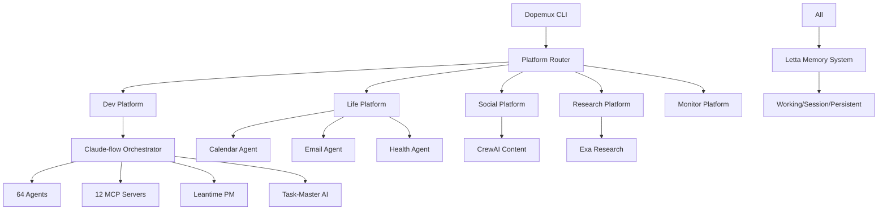

# Dopemux Complete System Architecture v3.0
## Multi-Platform CLI Application with Integrated Ecosystems

---

## Executive Summary

**Dopemux Vision**: A complete CLI application functioning as a unified platform containing multiple specialized tools and sub-platforms. Unlike simple command-line utilities, Dopemux is an integrated ecosystem combining software development automation, personal life management, social media orchestration, research capabilities, and AI-powered workflows into a single, cohesive terminal experience.

**Core Philosophy**:
- **CLI-First Design**: Terminal-native interface optimized for keyboard-driven workflows
- **Multi-Platform Integration**: Five specialized platforms within one application
- **ADHD-Friendly UX**: Neurodivergent-optimized interface with focus management
- **Agent-Driven Automation**: 64+ AI agents via Claude-flow handle complex workflows
- **Privacy-First Architecture**: Local-first with optional encrypted cloud sync

---

## 1. Complete Application Architecture

### 1.1 Top-Level CLI Interface

```bash
# Primary DOPEMUX invocation patterns
dopemux                              # Enter interactive mode (tmux-style)
dopemux dev                         # Software development platform
dopemux life                        # Personal automation platform
dopemux social                      # Social media management platform
dopemux research                    # Research & content creation platform
dopemux monitor                     # Monitoring & analysis platform

# Direct tool access within DOPEMUX
dopemux chat                        # ChatX conversation tool
dopemux slice                       # UltraSlicer development tool
dopemux merge                       # MergeOrgy conflict resolution tool
dopemux agent <agent-name>          # Direct agent interaction
dopemux memory <query>              # Multi-level memory search
```

### 1.2 Application Session Management

```yaml
dopemux_session_architecture:
  layers:
    terminal_multiplexer:
      implementation: "tmux-style with dopemux wrapper"
      features: ["split panes", "windows", "session persistence"]
      
    platform_router:
      routes: ["dev", "life", "social", "research", "monitor"]
      default: "dev"
      
    agent_orchestration:
      primary: "Claude-flow (64 agents)"
      secondary: ["zen-mcp", "sequential-thinking"]
      future: ["CrewAI", "Eliza"]
      
    memory_coordination:
      primary: "Letta framework"
      fallback: "SQLite + ConPort"
      cross_platform: true
      
    security_privacy:
      encryption: "at-rest and in-transit"
      access_control: "platform-specific boundaries"
      
    integration_hub:
      mcp_servers: 12
      external_apis: ["GitHub", "Leantime", "Calendar", "Email"]
```

---

## 2. Integrated Platforms Within Dopemux

### 2.1 Platform 1: Software Development Automation

```yaml
software_development_platform:
  orchestrator: "Claude-flow"
  
  agent_ecosystem:
    primary_agents:
      - "Claude Code integration"
      - "Cline autonomous coding"
      - "64 specialized Claude-flow agents"
      
    workflow_orchestration:
      methodology: "SPARC + Slice-based"
      stages: ["bootstrap", "research", "story", "plan", "implement", "debug", "ship"]
      
    quality_assurance:
      - "Automated testing (90% coverage requirement)"
      - "Code review via zen-mcp consensus"
      - "Security scanning agents"
      
    devops_integration:
      - "CI/CD automation"
      - "Deployment management"
      - "Infrastructure as code"
      
  integrated_tools:
    code: "Autonomous coding with Claude-flow + Cline"
    test: "Automated testing and QA workflows"
    review: "AI-powered code review system"
    deploy: "DevOps and deployment automation"
    project: "Leantime + Task-Master integration"
    slice: "UltraSlicer for rapid development"
    merge: "MergeOrgy for conflict resolution"
    analyze: "Code analysis and technical debt"
    
  memory_integration:
    project_memory: "ConPort for decisions"
    code_context: "Claude-context semantic search"
    team_knowledge: "Shared patterns in Letta"
```

### 2.2 Platform 2: Personal Life Automation

```yaml
personal_automation_platform:
  status: "Phase 3 implementation"
  
  agent_ecosystem:
    calendar_agent:
      capabilities: ["schedule optimization", "meeting management", "time blocking"]
      integration: "Google Calendar, Outlook"
      
    email_agent:
      capabilities: ["automated responses", "prioritization", "organization"]
      integration: "Gmail, Outlook"
      
    health_agent:
      capabilities: ["ADHD medication reminders", "exercise tracking", "wellness"]
      adhd_features: ["hyperfocus detection", "break reminders", "energy tracking"]
      
    finance_agent:
      capabilities: ["expense tracking", "budgeting", "investment monitoring"]
      
    social_agent:
      capabilities: ["relationship management", "important dates", "obligations"]
      
  life_management_tools:
    calendar: "Intelligent schedule management"
    email: "Automated email processing"
    health: "Health tracking and ADHD support"
    finance: "Personal finance automation"
    habits: "Habit tracking and modification"
    relationships: "Social contact management"
    goals: "Personal goal setting and tracking"
    wellness: "Mental health and self-care"
    
  data_integration:
    personal_data_lake: "Unified storage for all personal information"
    behavior_analytics: "Pattern recognition across life areas"
    predictive_insights: "AI-powered recommendations"
```

### 2.3 Platform 3: Social Media Management

```yaml
social_media_platform:
  status: "Phase 4 implementation"
  orchestrator: "CrewAI (content focus)"
  
  agent_ecosystem:
    content_creation: "Automated post generation"
    engagement: "Comment management, follower interaction"
    analytics: "Performance tracking, trend analysis"
    cross_platform: "Coordinated posting across platforms"
    
  social_tools:
    content: "Content creation and curation"
    schedule: "Post scheduling and calendar"
    engage: "Community management"
    analyze: "Performance analytics"
    trends: "Trend monitoring"
    campaigns: "Marketing automation"
    influencer: "Outreach and collaboration"
    crisis: "Reputation management"
```

### 2.4 Platform 4: Research & Content Creation

```yaml
research_platform:
  status: "Phase 2-3 implementation"
  
  agent_ecosystem:
    web_research: "Exa MCP for high-signal research"
    academic_research: "Paper analysis, citations"
    content_analysis: "Text analysis, sentiment, topics"
    writing_assistant: "Content creation, editing"
    
  research_tools:
    web: "Web research and information gathering"
    academic: "Paper research and analysis"
    content: "Content creation assistance"
    analyze: "Text and content analysis"
    citations: "Bibliography management"
    summarize: "Document summarization"
    translate: "Multi-language support"
    publish: "Content distribution"
```

### 2.5 Platform 5: Monitoring & Analysis

```yaml
monitoring_platform:
  status: "Phase 5 implementation"
  
  agent_ecosystem:
    system_monitoring: "Server and performance tracking"
    business_analytics: "KPI tracking, BI"
    personal_analytics: "Productivity metrics"
    security_monitoring: "Threat detection"
    
  monitoring_tools:
    system: "Infrastructure monitoring"
    business: "Business metrics and KPIs"
    personal: "Productivity analytics"
    security: "Threat detection"
    performance: "Optimization analysis"
    alerts: "Intelligent notifications"
    dashboards: "Custom visualizations"
    reports: "Automated generation"
```

---

## 3. Integrated Tools Within Dopemux

### 3.1 ChatX: Advanced Conversation Management

```yaml
chatx_tool:
  purpose: "Multi-platform conversation management"
  
  integrations:
    platforms: ["Discord", "Slack", "Teams", "WhatsApp"]
    
  features:
    conversation_analysis: "Sentiment, topics, relationships"
    automated_responses: "Context-aware auto-replies"
    privacy_protection: "Local processing with encryption"
    
  commands:
    discord: "Discord conversation management"
    slack: "Slack workspace automation"
    teams: "Microsoft Teams integration"
    whatsapp: "WhatsApp message automation"
    analyze: "Conversation analysis and insights"
    privacy: "Privacy-preserving processing"
```

### 3.2 UltraSlicer: Rapid Development Cycles

```yaml
ultraslicer_tool:
  purpose: "ADHD-optimized micro-development workflows"
  
  workflow_stages:
    bootstrap: "Initialize new development slice"
    research: "Research with external knowledge"
    story: "User story and acceptance criteria"
    plan: "Step-by-step implementation"
    implement: "TDD-driven with AI assistance"
    debug: "Systematic issue resolution"
    ship: "Final polish and deployment"
    retrospect: "Analysis and learning capture"
    
  adhd_features:
    - "Short focus periods (15-30 min slices)"
    - "Clear completion milestones"
    - "Automatic context preservation"
    - "Progress visualization"
```

### 3.3 MergeOrgy: Conflict Resolution System

```yaml
mergeorgy_tool:
  purpose: "AI-powered merge conflict resolution"
  
  features:
    intelligent_resolution: "AI analyzes and resolves conflicts"
    multi_agent_coordination: "Coordinate changes from multiple agents"
    version_control: "Deep Git integration"
    conflict_prevention: "Proactive detection"
    
  commands:
    detect: "Proactive conflict detection"
    resolve: "AI-powered resolution"
    coordinate: "Multi-agent synchronization"
    preview: "Resolution preview"
    apply: "Apply changes with safety"
    learn: "Pattern learning for prevention"
```

---

## 4. Unified Memory System

### 4.1 Cross-Platform Memory Architecture

```yaml
memory_architecture:
  layers:
    agent_memory:
      description: "Individual agent conversation history"
      implementation: "Claude-flow SQLite + Letta"
      
    session_memory:
      description: "Current session state"
      size: "32K tokens"
      ttl: "24 hours"
      
    project_memory:
      description: "Long-term project knowledge"
      implementation: "ConPort + Letta persistent tier"
      
    user_memory:
      description: "Personal preferences and patterns"
      implementation: "OpenMemory + Letta self-editing"
      
    global_memory:
      description: "Cross-platform patterns"
      implementation: "Graph DB (future)"
      
    data_lake:
      description: "Personal data integration"
      status: "Phase 4"
      
  access_patterns:
    platform_specific: "Each platform has dedicated space"
    cross_platform_sharing: "Relevant info shared"
    user_context: "Maintained across all platforms"
    privacy_boundaries: "Strict access controls"
```

### 4.2 Memory Implementation with Letta

```python
# Letta configuration for Dopemux
class DopemuxMemorySystem:
    def __init__(self):
        self.letta_client = LettaClient(
            api_key=os.getenv("LETTA_API_KEY"),
            tier="plus"  # $39/month, 10k requests
        )
        
        self.tiers = {
            "working": {
                "size": "8K tokens",
                "features": ["real-time", "self-editing"]
            },
            "session": {
                "size": "32K tokens", 
                "features": ["cross-agent", "persistent"]
            },
            "persistent": {
                "size": "unlimited",
                "features": ["patterns", "preferences"]
            }
        }
        
    async def store(self, platform, key, value, tier="session"):
        """Store memory with platform isolation"""
        namespaced_key = f"{platform}:{key}"
        return await self.letta_client.store(
            namespaced_key, value, tier=tier
        )
```

---

## 5. ADHD-Friendly UX Design

### 5.1 Focus Management Features

```yaml
focus_management:
  single_tasking_mode:
    description: "Restrict interface to current task only"
    implementation: "Hide all platforms except active"
    
  progress_visualization:
    - "Clear progress bars"
    - "Completion indicators"
    - "Slice completion celebrations"
    
  interruption_handling:
    - "Automatic context save"
    - "Quick resume functionality"
    - "Interruption log for later review"
    
  energy_aware_scheduling:
    - "Track energy levels throughout day"
    - "Adjust task complexity accordingly"
    - "Suggest breaks during low energy"
```

### 5.2 Cognitive Load Reduction

```yaml
cognitive_features:
  smart_defaults:
    - "Learn from user patterns"
    - "Pre-fill common values"
    - "Suggest next actions"
    
  context_aware_suggestions:
    - "Relevant commands based on current work"
    - "History-based completions"
    - "Smart abbreviations"
    
  automatic_cleanup:
    - "Background file cleanup"
    - "Session consolidation"
    - "Memory optimization"
    
  distraction_blocking:
    - "Optional notification blocking"
    - "Focus mode with limited commands"
    - "Batch non-urgent items"
```

### 5.3 Motivation & Engagement

```yaml
gamification:
  achievements:
    - "Daily streaks"
    - "Complexity milestones"
    - "Speed improvements"
    
  pattern_recognition:
    - "Highlight successful workflows"
    - "Suggest proven patterns"
    - "Celebrate consistency"
    
  reminders:
    - "Gentle, non-intrusive"
    - "Based on personal patterns"
    - "Positive framing"
    
  reinforcement:
    - "Celebrate completions"
    - "Progress milestones"
    - "Personal bests"
```

---

## 6. Technology Stack & Integration

### 6.1 Core Technology Decisions

```yaml
technology_stack:
  orchestration:
    primary: "Claude-flow (64 agents)"
    execution: "zen-mcp (multi-model)"
    reasoning: "sequential-thinking-mcp"
    content: "CrewAI (Phase 3)"
    blockchain: "Eliza (Phase 4)"
    
  memory:
    primary: "Letta framework"
    local: "SQLite"
    project: "ConPort"
    personal: "OpenMemory"
    
  interface:
    terminal: "tmux-style multiplexing"
    cli: "Python with Rich/Textual"
    
  project_management:
    strategic: "Leantime MCP"
    tactical: "Claude-Task-Master AI"
    
  mcp_servers: # All 12 with correct purposes
    zen: "Multi-model orchestration"
    claude_context: "Semantic code search"
    conport: "Project memory/decisions"
    task_master_ai: "PRD parsing/task management"
    serena: "LSP-based code editing"
    sequential_thinking: "Deep reasoning"
    context7: "Library documentation"
    exa: "High-signal web research"
    cli: "Command execution"
    playwright: "Browser automation"
    morphllm_fast_apply: "Fast code application"
    magic: "Utility functions"
```

### 6.2 Integration Architecture



---

## 7. Implementation Roadmap

### 7.1 Phase-by-Phase Development

```yaml
implementation_phases:
  phase_1_foundation: # Weeks 1-2
    focus: "Core CLI and dev platform"
    deliverables:
      - "Dopemux CLI framework"
      - "Claude-flow integration"
      - "Tmux-style interface"
      - "Basic memory system (Letta)"
      - "Leantime + Task-Master"
      
  phase_2_enhancement: # Weeks 3-4
    focus: "Enhanced dev capabilities"
    deliverables:
      - "All 12 MCP servers integrated"
      - "zen-mcp multi-model execution"
      - "sequential-thinking reasoning"
      - "UltraSlicer workflows"
      - "MergeOrgy conflict resolution"
      
  phase_3_life_automation: # Month 2
    focus: "Personal life platform"
    deliverables:
      - "Calendar integration"
      - "Email automation"
      - "Health tracking"
      - "ADHD features"
      - "ChatX conversations"
      
  phase_4_content_social: # Month 3
    focus: "Content and social platforms"
    deliverables:
      - "CrewAI integration"
      - "Social media management"
      - "Content creation tools"
      - "Research platform"
      
  phase_5_monitoring: # Month 4
    focus: "Analytics and monitoring"
    deliverables:
      - "System monitoring"
      - "Personal analytics"
      - "Business metrics"
      - "Security monitoring"
```

### 7.2 Week 1 Sprint (IMMEDIATE)

```bash
# Day 1-2: Foundation
npm install -g claude-flow@alpha
pip install letta
git clone https://github.com/dopemux/dopemux
cd dopemux && make setup

# Day 3-4: Core Integration
dopemux init
dopemux config set orchestrator claude-flow
dopemux config set memory letta
dopemux mcp install all

# Day 5: Testing
dopemux dev test --integration
dopemux memory test
dopemux session save/restore
```

---

## 8. Security & Privacy Architecture

### 8.1 Privacy-First Design

```yaml
privacy_architecture:
  local_first_processing:
    - "Sensitive operations performed locally"
    - "Optional cloud sync with encryption"
    - "User control over data location"
    
  data_sovereignty:
    - "User owns all data"
    - "Export functionality"
    - "Right to deletion"
    
  minimal_collection:
    - "Only necessary data collected"
    - "Transparent about usage"
    - "Opt-in for analytics"
    
  encryption:
    at_rest: "AES-256"
    in_transit: "TLS 1.3"
    keys: "User-controlled"
```

### 8.2 Platform Isolation

```yaml
security_boundaries:
  platform_isolation:
    - "Separate memory namespaces"
    - "Permission boundaries"
    - "No cross-platform data without consent"
    
  agent_sandboxing:
    - "Resource limits per agent"
    - "Capability-based security"
    - "Audit logging"
    
  api_security:
    - "Rate limiting"
    - "Token rotation"
    - "Secure storage in keychain/vault"
```

---

## 9. Performance & Scalability

### 9.1 Performance Targets

```yaml
performance_metrics:
  response_times:
    cli_command: "< 100ms"
    agent_spawn: "< 500ms"
    memory_query: "< 50ms"
    platform_switch: "< 200ms"
    
  throughput:
    concurrent_agents: 64
    parallel_tasks: 10
    tokens_per_minute: 100000
    
  resource_usage:
    memory: "< 2GB baseline"
    cpu: "< 20% idle"
    disk: "< 100MB/day growth"
```

### 9.2 Scalability Features

```yaml
scalability:
  horizontal:
    - "Distribute agents across cores"
    - "Optional cloud processing"
    - "Container orchestration ready"
    
  vertical:
    - "Efficient memory usage"
    - "Lazy loading"
    - "Resource pooling"
    
  modular:
    - "Add platforms without affecting others"
    - "Plugin architecture"
    - "Hot-reload capabilities"
```

---

## 10. Success Metrics & Analytics

### 10.1 Development Productivity

```yaml
dev_metrics:
  velocity:
    - "Lines of code per day"
    - "Features delivered per sprint"
    - "Bug fix time"
    
  quality:
    - "Test coverage (target: 90%)"
    - "Code review scores"
    - "Technical debt ratio"
    
  efficiency:
    - "Time to market"
    - "Deployment frequency"
    - "Rollback rate"
```

### 10.2 Personal Life Metrics

```yaml
life_metrics:
  goals:
    - "Achievement rate"
    - "Progress consistency"
    
  health:
    - "Medication adherence"
    - "Exercise consistency"
    - "Sleep quality"
    
  productivity:
    - "Task completion rate"
    - "Focus period duration"
    - "Energy level correlation"
```

### 10.3 System Performance

```yaml
system_metrics:
  agents:
    - "Task success rate"
    - "Token efficiency"
    - "User satisfaction"
    
  memory:
    - "Hit rate"
    - "Query latency"
    - "Storage growth"
    
  platforms:
    - "Usage distribution"
    - "Feature adoption"
    - "Error rates"
```

---

## Quick Start Commands

```bash
# Install Dopemux
curl -sSL https://dopemux.dev/install | bash

# Initialize with Claude-flow
dopemux init --orchestrator claude-flow

# Configure platforms
dopemux platform enable dev life social research monitor

# Start development session
dopemux dev start --mode guided

# Personal automation
dopemux life calendar sync
dopemux life health track

# Research workflow
dopemux research web "topic" --deep

# Monitor everything
dopemux monitor dashboard
```

---

## Critical Success Factors

✓ **Multi-Platform Architecture**: Not just dev, but complete life OS  
✓ **Claude-flow Orchestration**: 64 agents proven at scale  
✓ **Letta Memory**: Self-editing, persistent across platforms  
✓ **ADHD-Optimized**: Focus management, cognitive load reduction  
✓ **Privacy-First**: Local processing, encrypted sync  
✓ **Tmux-Style Interface**: Familiar, powerful, persistent  
✓ **Correct MCP Servers**: All 12 with accurate capabilities  

---

## Document Metadata

```yaml
version: "3.0.0"
date: "2025-09-14"
status: "Complete System Architecture"
includes:
  - "All 5 platforms"
  - "Integrated tools (ChatX, UltraSlicer, MergeOrgy)"
  - "Complete memory system"
  - "ADHD features"
  - "Security/privacy"
  - "Full roadmap"
```

*This document represents the COMPLETE Dopemux vision - not just a development tool, but a comprehensive AI-powered operating system for developers and creators.*
