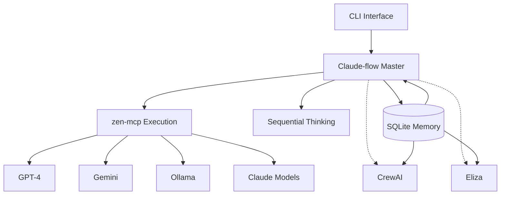

# Dopemux Software Development Orchestration Architecture
## Comprehensive Implementation Guide

> **Document Purpose**: This guide provides complete architectural decisions, implementation strategies, and integration patterns for Dopemux's software development orchestration system. Optimized for LLM-based planning and implementation.

> **Last Updated**: 2025-01-11
> **Status**: Architecture Defined, Ready for Implementation
> **Primary Orchestrator**: Claude-flow

---

## 1. Executive Summary

### 1.1 System Overview
Dopemux is a personal CLI-based orchestration platform combining multiple AI systems for software development, content creation, blockchain development, and task automation. The platform leverages tmux for session management and integrates multiple specialized AI frameworks.

### 1.2 Key Architectural Decisions
- **Primary Orchestrator**: Claude-flow (chosen for superior performance, native tmux integration, and proven results)
- **Complementary Systems**: 
  - CrewAI for content operations (Phase 3)
  - Eliza for blockchain development (Phase 4)
  - zen-mcp for multi-model execution (Phase 2)
  - sequential-thinking MCP for complex reasoning (Phase 2)
- **Memory Strategy**: SQLite-based persistence with RAG enhancement
- **Integration Pattern**: Claude-flow as master coordinator with specialized subsystems

### 1.3 Performance Targets
- Code generation: 150,000+ lines in 48 hours
- Token efficiency: 32.3% reduction via Claude-flow
- Cost optimization: 40% reduction on routine tasks via zen-mcp
- Execution speed: 5.76x improvement for appropriate tasks via CrewAI

---

## 2. Component Architecture

### 2.1 Component Roles and Responsibilities

```yaml
dopemux_components:
  orchestration_layer:
    claude-flow:
      role: "Master orchestrator and primary development engine"
      responsibilities:
        - Task decomposition and planning
        - Agent swarm coordination
        - Memory management
        - Workflow orchestration
        - GitHub integration
        - Documentation generation
      capabilities:
        - SPARC methodology
        - 87 MCP tools
        - Multi-agent swarms
        - Neural pattern learning
        - Hooks automation
      
  execution_layer:
    zen-mcp:
      role: "Multi-model execution bridge"
      responsibilities:
        - Model selection and routing
        - Cost optimization
        - Fallback handling
        - Specialized model capabilities
      configuration:
        planning_mode: DISABLED  # Critical: Claude-flow handles all planning
        
    sequential-thinking-mcp:
      role: "Deep analytical reasoning engine"
      responsibilities:
        - Complex debugging
        - Formal proofs
        - Root cause analysis
        - Multi-constraint optimization
      triggers:
        - Error patterns
        - Algorithmic verification
        - Security analysis
        
  specialized_layers:
    crewai:  # Phase 3
      role: "Content and general automation"
      responsibilities:
        - Content creation workflows
        - Marketing automation
        - General task automation
        
    eliza:  # Phase 4
      role: "Blockchain development"
      responsibilities:
        - Smart contract development
        - Web3 integration
        - DeFi protocols
```

### 2.2 Integration Architecture



---

## 3. Implementation Roadmap

### 3.1 Phase 1: Core Foundation (Weeks 1-2)
**Objective**: Establish Claude-flow as primary orchestrator

#### Tasks
```bash
# 1. Install Claude-flow
npm install -g claude-flow@alpha

# 2. Configure tmux integration
cat > ~/.dopemux/claude-flow-config.yaml << 'EOF'
orchestrator:
  mode: master
  tmux:
    enabled: true
    session_prefix: "dopemux"
    persistence: true
  memory:
    backend: sqlite
    path: ~/.dopemux/memory.db
  mcp:
    auto_discover: true
    tools_path: ~/.dopemux/mcp-tools
EOF

# 3. Initialize memory system
claude-flow init --with-memory --with-mcp

# 4. Create tmux session template
cat > ~/.dopemux/tmux-layout.sh << 'EOF'
#!/bin/bash
tmux new-session -d -s dopemux
tmux split-window -h -p 30
tmux select-pane -t 0
tmux send-keys "claude-flow start --mode=orchestrator" C-m
tmux select-pane -t 1
tmux send-keys "claude-flow monitor" C-m
EOF
```

#### Validation Criteria
- [ ] Claude-flow installed and responding
- [ ] Tmux sessions persist across disconnections
- [ ] Memory system creating SQLite database
- [ ] Basic MCP tools discovered

### 3.2 Phase 2: Enhanced Capabilities (Weeks 3-4)
**Objective**: Add multi-model execution and deep reasoning

#### Tasks
```javascript
// 1. Configure zen-mcp integration
const zenMcpConfig = {
  mode: "execution_only",  // Critical: no planning
  planning: {
    enabled: false,
    reason: "Claude-flow handles all task planning"
  },
  models: {
    primary: "claude-3-opus",
    fallback: ["gpt-4", "gemini-pro"],
    cost_optimized: ["claude-haiku", "gemini-flash"],
    local: ["ollama/llama3", "ollama/codellama"]
  },
  routing_rules: {
    complex_reasoning: "claude-3-opus",
    code_generation: "claude-3-sonnet",
    simple_queries: "gemini-flash",
    cost_sensitive: "claude-haiku"
  }
};

// 2. Setup sequential-thinking triggers
const sequentialThinkingTriggers = {
  auto_invoke: {
    error_patterns: [
      "race condition",
      "memory leak",
      "deadlock",
      "performance degradation"
    ],
    keywords: [
      "prove that",
      "analyze why",
      "step-by-step debug",
      "root cause"
    ]
  },
  checkpoint_interval: 10, // steps
  max_reasoning_depth: 50
};
```

#### Integration Points
```yaml
claude_flow_hooks:
  before_task_execution:
    - evaluate_complexity
    - check_sequential_thinking_triggers
    - determine_model_routing
    
  task_routing:
    high_complexity: direct_execution
    deep_reasoning: sequential_thinking_mcp
    cost_sensitive: zen_mcp
    standard: direct_execution
    
  after_task_completion:
    - update_memory
    - learn_patterns
    - optimize_future_routing
```

### 3.3 Phase 3: Content Operations (Month 2)
**Objective**: Integrate CrewAI for content and automation

#### Tasks
```python
# 1. Install CrewAI with tools
pip install crewai[tools]

# 2. Create CrewAI integration bridge
class CrewAIBridge:
    def __init__(self, claude_flow_client):
        self.claude_flow = claude_flow_client
        self.memory_path = "~/.dopemux/memory.db"
        
    def delegate_content_task(self, task):
        # CrewAI handles content creation
        crew = Crew(
            agents=[content_writer, editor, seo_optimizer],
            tasks=[task],
            memory=True,
            memory_config={"db_path": self.memory_path}
        )
        return crew.kickoff()
        
    def sync_with_claude_flow(self, results):
        # Return results to Claude-flow
        return self.claude_flow.integrate_results(results)
```

### 3.4 Phase 4: Blockchain Integration (Month 3+)
**Objective**: Add Eliza for Web3 development

#### Configuration
```typescript
// Eliza Plugin integration
import { Plugin as FlowPlugin } from '@elizaos-plugins/plugin-flow';

const elizaConfig = {
  plugins: [FlowPlugin],
  integration: {
    orchestrator: "claude-flow",
    communication: "mcp-bridge",
    memory_sync: true
  }
};
```

---

## 4. Critical Configuration Details

### 4.1 Task Routing Decision Tree
```python
def route_task(task, context):
    """
    Master routing logic for Dopemux
    LLM Note: This is the critical decision point for all task routing
    """
    
    # Step 1: Check for deep reasoning requirements
    if requires_formal_reasoning(task):
        return {
            'handler': 'sequential-thinking-mcp',
            'reason': 'Complex analysis required',
            'handoff': 'claude-flow-implementation'
        }
    
    # Step 2: Check cost sensitivity
    if is_routine_task(task) and context.optimize_cost:
        return {
            'handler': 'zen-mcp',
            'model': 'gemini-flash',
            'reason': 'Cost optimization for routine task'
        }
    
    # Step 3: Check for content operations
    if task.type in ['blog', 'documentation', 'marketing']:
        return {
            'handler': 'crewai',
            'reason': 'Specialized content creation'
        }
    
    # Step 4: Check for blockchain operations
    if task.involves_web3():
        return {
            'handler': 'eliza',
            'reason': 'Blockchain specialization'
        }
    
    # Default: Claude-flow handles directly
    return {
        'handler': 'claude-flow',
        'method': 'SPARC',
        'reason': 'Standard development task'
    }
```

### 4.2 Memory Schema
```sql
-- Core memory tables for Dopemux
CREATE TABLE IF NOT EXISTS task_history (
    id INTEGER PRIMARY KEY,
    task_id TEXT UNIQUE,
    orchestrator TEXT,
    handler TEXT,
    input TEXT,
    output TEXT,
    tokens_used INTEGER,
    cost_usd REAL,
    duration_ms INTEGER,
    success BOOLEAN,
    created_at TIMESTAMP DEFAULT CURRENT_TIMESTAMP
);

CREATE TABLE IF NOT EXISTS reasoning_chains (
    id INTEGER PRIMARY KEY,
    task_id TEXT,
    step_number INTEGER,
    reasoning TEXT,
    validation TEXT,
    created_at TIMESTAMP DEFAULT CURRENT_TIMESTAMP,
    FOREIGN KEY (task_id) REFERENCES task_history(task_id)
);

CREATE TABLE IF NOT EXISTS model_performance (
    model TEXT,
    task_type TEXT,
    avg_quality REAL,
    avg_speed_ms INTEGER,
    avg_cost_usd REAL,
    success_rate REAL,
    last_updated TIMESTAMP DEFAULT CURRENT_TIMESTAMP,
    PRIMARY KEY (model, task_type)
);
```

### 4.3 Tmux Session Architecture
```bash
# Dopemux tmux layout
# Window 0: Orchestration
#   Pane 0: Claude-flow master
#   Pane 1: Claude-flow monitor
# Window 1: Execution
#   Pane 0: zen-mcp server
#   Pane 1: Sequential thinking
# Window 2: Specialized (Phase 3+)
#   Pane 0: CrewAI
#   Pane 1: Eliza

dopemux_layout() {
    tmux new-session -d -s dopemux -n orchestration
    tmux split-window -h -t dopemux:0
    
    tmux new-window -t dopemux -n execution
    tmux split-window -h -t dopemux:1
    
    tmux new-window -t dopemux -n specialized
    tmux split-window -h -t dopemux:2
    
    # Start services
    tmux send-keys -t dopemux:0.0 "claude-flow start --master" C-m
    tmux send-keys -t dopemux:0.1 "claude-flow monitor" C-m
    tmux send-keys -t dopemux:1.0 "zen-mcp serve --no-planning" C-m
    tmux send-keys -t dopemux:1.1 "sequential-thinking-mcp serve" C-m
}
```

---

## 5. Implementation Guidelines for LLMs

### 5.1 Priority Rules
1. **NEVER** enable planning mode in zen-mcp when Claude-flow is active
2. **ALWAYS** route through Claude-flow first for task decomposition
3. **PREFER** specialized tools for their domains (CrewAI for content, Eliza for blockchain)
4. **CHECKPOINT** sequential-thinking every 10 steps to prevent token exhaustion
5. **SYNC** memory after every major operation

### 5.2 Error Handling Patterns
```python
# Standard error handling flow
try:
    result = claude_flow.execute(task)
except RateLimitError:
    result = zen_mcp.fallback_execute(task)
except ComplexityError:
    analysis = sequential_thinking.analyze(task)
    result = claude_flow.implement(analysis)
except TokenLimitError:
    chunks = claude_flow.chunk_task(task)
    results = [execute_with_checkpoint(chunk) for chunk in chunks]
    result = claude_flow.merge_results(results)
```

### 5.3 Performance Optimization
- **Parallel Execution**: Use Claude-flow's swarm capabilities for independent tasks
- **Model Stratification**: Opus for planning, Sonnet for coding, Haiku for simple tasks
- **Caching Strategy**: Cache frequent queries, reusable components, and reasoning chains
- **Context Management**: Compress context between handoffs, maintain only essential state

### 5.4 Testing Strategy
```yaml
test_scenarios:
  integration:
    - claude_flow_to_zen_mcp_handoff
    - sequential_thinking_checkpoint_recovery
    - memory_persistence_across_sessions
    - tmux_session_restoration
    
  performance:
    - 1000_line_code_generation_time
    - token_usage_vs_baseline
    - model_routing_accuracy
    - memory_query_latency
    
  reliability:
    - fallback_on_rate_limit
    - error_recovery_patterns
    - session_crash_recovery
    - concurrent_task_handling
```

---

## 6. Monitoring and Observability

### 6.1 Key Metrics
```yaml
metrics_to_track:
  performance:
    - tasks_per_hour
    - lines_of_code_generated
    - average_task_duration
    - success_rate
    
  cost:
    - tokens_per_task
    - cost_per_task_type
    - model_usage_distribution
    - cache_hit_rate
    
  quality:
    - error_rate
    - reasoning_accuracy
    - code_quality_score
    - user_satisfaction
```

### 6.2 Dashboard Configuration
```javascript
// Real-time monitoring dashboard
const dashboardConfig = {
  panels: [
    {
      title: "Orchestration Status",
      metrics: ["active_agents", "queue_depth", "throughput"]
    },
    {
      title: "Model Usage",
      metrics: ["model_distribution", "cost_tracking", "rate_limits"]
    },
    {
      title: "Memory System",
      metrics: ["db_size", "query_latency", "cache_hits"]
    },
    {
      title: "Error Tracking",
      metrics: ["error_rate", "recovery_success", "fallback_usage"]
    }
  ]
};
```

---

## 7. Security and Best Practices

### 7.1 Security Configuration
- Store API keys in environment variables or secure vaults
- Implement rate limiting at orchestration layer
- Sanitize all user inputs before processing
- Audit log all model interactions
- Encrypt memory database at rest

### 7.2 Development Best Practices
1. **Version Control**: Track all configuration changes
2. **Documentation**: Document custom workflows and integrations
3. **Testing**: Test each component in isolation before integration
4. **Monitoring**: Set up alerts for anomalies
5. **Backup**: Regular backups of memory database and configurations

---

## 8. Troubleshooting Guide

### 8.1 Common Issues and Solutions

| Issue | Symptoms | Solution |
|-------|----------|----------|
| Planning conflicts | Duplicate task decomposition | Ensure zen-mcp planning is disabled |
| Memory exhaustion | Slow queries, large DB | Implement retention policies, archive old data |
| Token limit errors | Incomplete responses | Use sequential-thinking checkpoints |
| Tmux session loss | Work disappears | Enable persistence, use `--continue` flag |
| Model timeouts | Slow responses | Implement aggressive timeouts with fallbacks |

### 8.2 Debug Commands
```bash
# Check system status
claude-flow status --verbose

# Inspect memory database
sqlite3 ~/.dopemux/memory.db ".tables"

# View active tmux sessions
tmux ls | grep dopemux

# Check model routing
zen-mcp debug --show-routing

# Analyze reasoning chains
sequential-thinking-mcp export --task-id=<id>
```

---

## 9. Future Enhancements

### 9.1 Potential Additions
- **Voice Interface**: Natural language commands via speech
- **Mobile Monitoring**: Remote dashboard access
- **Custom Plugins**: Domain-specific MCP tools
- **Advanced Analytics**: ML-based performance optimization
- **Collaborative Mode**: Multi-user development support

### 9.2 Scaling Considerations
- Consider container orchestration for resource isolation
- Implement distributed memory with Redis for larger projects
- Add GPU acceleration for local model inference
- Create plugin marketplace for community tools

---

## 10. Quick Start Checklist

### For LLMs Implementing Dopemux:
- [ ] Install Claude-flow globally via npm
- [ ] Configure tmux session templates
- [ ] Initialize SQLite memory database
- [ ] Disable zen-mcp planning mode
- [ ] Set up model routing rules
- [ ] Configure sequential-thinking triggers
- [ ] Create monitoring dashboard
- [ ] Test basic orchestration flow
- [ ] Implement error handling
- [ ] Document custom workflows

---

## Appendix A: Configuration Templates

### Complete Configuration File
```yaml
# ~/.dopemux/config.yaml
dopemux:
  version: "1.0.0"
  orchestrator: "claude-flow"
  
  claude_flow:
    mode: "master"
    memory:
      backend: "sqlite"
      path: "~/.dopemux/memory.db"
    tmux:
      enabled: true
      persistence: true
    mcp:
      tools_path: "~/.dopemux/mcp-tools"
      
  zen_mcp:
    planning: false  # CRITICAL
    models:
      primary: "claude-3-opus"
      fallback: ["gpt-4", "gemini-pro"]
      
  sequential_thinking:
    auto_trigger: true
    checkpoint_interval: 10
    
  monitoring:
    enabled: true
    port: 8080
    
  security:
    encrypt_memory: true
    audit_logging: true
```

---

## Appendix B: Emergency Recovery

### Session Recovery Protocol
```bash
#!/bin/bash
# Emergency recovery script

# 1. Check for existing sessions
if tmux has-session -t dopemux 2>/dev/null; then
    echo "Session exists, attaching..."
    tmux attach -t dopemux
else
    echo "No session found, recovering from memory..."
    
    # 2. Restore from memory
    claude-flow recover --from-memory
    
    # 3. Recreate session
    source ~/.dopemux/tmux-layout.sh
    
    # 4. Resume last task
    claude-flow continue --last-task
fi
```

---

**Document Status**: Complete
**Optimization Level**: High (for LLM parsing)
**Implementation Ready**: Yes

*This document is structured for optimal LLM comprehension with clear hierarchies, explicit instructions, and comprehensive examples. Each section can be processed independently while maintaining full context.*
