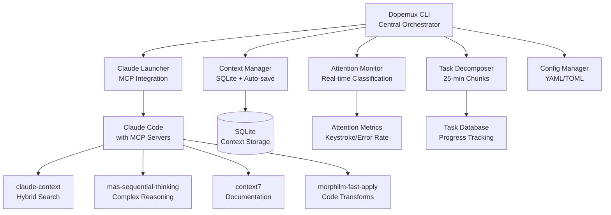

# Dopemux MVP - Complete Documentation

🧠 **ADHD-Optimized Development Platform** - A comprehensive wrapper around Claude Code with neurodivergent-friendly accommodations.

## Table of Contents

- [Architecture Overview](#architecture-overview)
- [System Components](#system-components)
- [ADHD Features](#adhd-features)
- [CLI Commands](#cli-commands)
- [Configuration System](#configuration-system)
- [Installation & Setup](#installation--setup)
- [Developer Guide](#developer-guide)

---

## Architecture Overview

Dopemux implements a **hub-and-spoke architecture** with the CLI as the central orchestrator:



### Core Design Principles

1. **Context Preservation**: Auto-save every 30 seconds with <500ms restore
2. **Attention Adaptation**: Real-time classification and response adjustment
3. **Task Chunking**: 25-minute focus segments with 5-minute breaks
4. **Gentle Guidance**: Supportive, non-judgmental interface
5. **Progressive Disclosure**: Essential info first, details on request

---

## System Components

### 1. CLI Interface (`src/dopemux/cli.py`)

**Primary Entry Point** - Rich terminal interface with Click framework

```python
Commands:
├── init     - Initialize Dopemux project
├── start    - Launch Claude Code with ADHD optimizations
├── save     - Manual context preservation
├── restore  - Restore previous session
├── status   - Show attention metrics & progress
└── task     - ADHD-friendly task management
```

**Key Features:**
- Rich progress indicators and visual feedback
- Error handling with gentle recovery suggestions
- Context-aware command routing
- Session state preservation across interruptions

### 2. Context Manager (`src/dopemux/adhd/context_manager.py`)

**SQLite-based Context Storage** - Automatic preservation and restoration

```python
class ContextManager:
    def __init__(self, project_path: Path):
        self.db_path = project_path / '.dopemux' / 'context.db'

    def save_context(self, message=None, force=False) -> str:
        # Auto-save every 30 seconds
        # Captures: files, positions, mental model, decisions

    def restore_session(self, session_id: str) -> Dict:
        # <500ms restoration performance target
        # Restores complete development context
```

**Storage Schema:**
- Session metadata with timestamps
- Open files and cursor positions
- Mental model and decision history
- Task progress and attention state
- Git branch and repository state

### 3. Attention Monitor (`src/dopemux/adhd/attention_monitor.py`)

**Real-time Classification** - Adaptive response based on cognitive state

```python
Attention States:
├── focused      🎯 - Comprehensive details, multiple approaches
├── normal       😊 - Balanced information and simplicity
├── scattered    🌪️ - Bullet points, critical info only
├── hyperfocus   🔥 - Streamlined code, minimal explanations
└── distracted   😵‍💫 - Gentle redirection, single action
```

**Metrics Tracked:**
- Keystroke patterns and velocity
- Error frequency and correction patterns
- Context switching frequency
- Session duration and break patterns
- File navigation patterns

### 4. Task Decomposer (`src/dopemux/adhd/task_decomposer.py`)

**ADHD-Friendly Task Management** - 25-minute focused segments

```python
Task Structure:
├── description: str        - Clear, actionable description
├── estimated_duration: int - Minutes (default: 25)
├── priority: str          - low/medium/high
├── status: str           - pending/in_progress/completed
├── subtasks: List        - Automatic decomposition
└── progress: float       - 0.0 to 1.0 completion
```

**Features:**
- Automatic task decomposition for complex work
- Progress visualization with Rich progress bars
- Break reminders and attention recovery
- Task dependency tracking

### 5. Claude Launcher (`src/dopemux/claude/launcher.py`)

**MCP Integration** - Claude Code with custom server configuration

```python
MCP Servers Configured:
├── claude-context        - Hybrid search (Milvus + BM25)
├── mas-sequential-thinking - Complex reasoning chains
├── context7             - Official documentation access
└── morphllm-fast-apply  - Efficient code transformations
```

**Launch Process:**
1. Detect Claude Code installation
2. Generate MCP server configuration
3. Set environment variables for ADHD profile
4. Launch with restored context
5. Start attention monitoring

### 6. Configuration Manager (`src/dopemux/config/manager.py`)

**Multi-format Configuration** - YAML/TOML support with validation

```yaml
# .dopemux/config.yaml
adhd_profile:
  focus_duration: 25          # minutes
  break_interval: 5           # minutes
  notification_style: gentle  # gentle/standard/minimal
  visual_complexity: minimal  # minimal/standard/comprehensive

mcp_servers:
  claude-context:
    enabled: true
    config:
      provider: milvus
      search_type: hybrid
  leantime:
    enabled: false  # Enable after setup
    config:
      url: "https://your-leantime.com"
      api_key: "your_api_key"
```

---

## ADHD Features

### Context Preservation System

**Automatic State Capture** - Every 30 seconds without user intervention

```python
Context Layers:
├── Immediate Context
│   ├── Current file and function
│   ├── Active variables and state
│   ├── Current line and selection
│   └── Recent edits and changes
│
├── Working Context
│   ├── Open files and tabs
│   ├── Recent file history
│   ├── Active errors and warnings
│   └── Pending tasks and TODOs
│
└── Session Context
    ├── Project goals and objectives
    ├── Completed tasks and progress
    ├── Key decisions and rationale
    └── Learning notes and insights
```

### Attention-Aware Adaptation

**Dynamic Response Formatting** - Based on real-time cognitive state

| State | Response Style | Information Density | Action Items |
|-------|---------------|-------------------|--------------|
| **Focused** | Comprehensive technical details | High | Multiple options |
| **Normal** | Balanced detail and simplicity | Medium | 2-3 clear steps |
| **Scattered** | Bullet points, essentials only | Low | 1 clear action |
| **Hyperfocus** | Streamlined code generation | Minimal text | Direct implementation |
| **Distracted** | Gentle redirection | Very low | Single, simple step |

### Task Decomposition Engine

**25-Minute Focus Segments** - Automatic breakdown of complex work

```python
Example Decomposition:
"Implement user authentication" →
├── Task 1: Set up user model (25 min)
├── Task 2: Create login endpoint (25 min)
├── Task 3: Add password hashing (25 min)
├── Task 4: Implement JWT tokens (25 min)
└── Task 5: Add logout functionality (25 min)

Total: 125 minutes (2h 5min) across 5 focused sessions
```

### Memory Augmentation

**Decision Journal** - Automatic capture of significant choices
- Rationale and alternatives considered
- Context at time of decision
- Outcome tracking and learning
- Pattern recognition for future decisions

**Visual Progress Tracking**
```
[████████░░] 80% - Authentication System
[██████░░░░] 60% - Database Schema
[███░░░░░░░] 30% - API Endpoints
[░░░░░░░░░░]  0% - Frontend Integration
```

---

## CLI Commands

### `dopemux init [directory]`

**Initialize Dopemux Project** - Set up .claude/ and .dopemux/ directories

```bash
Options:
  --force, -f          Overwrite existing configuration
  --template, -t       Project template (python/js/rust/etc.)

Examples:
  dopemux init                    # Initialize current directory
  dopemux init ./my-project       # Initialize specific directory
  dopemux init --template=rust    # Use Rust project template
```

**Created Structure:**
```
project/
├── .dopemux/
│   ├── config.yaml      # ADHD profile settings
│   ├── context.db       # SQLite context storage
│   └── sessions/        # Session backups
└── .claude/
    ├── claude.md        # Project-specific instructions
    ├── context.md       # Context management config
    ├── llms.md          # Multi-model configuration
    └── session.md       # Session persistence patterns
```

### `dopemux start`

**Launch Claude Code** - With ADHD optimizations and context restoration

```bash
Options:
  --session, -s        Restore specific session ID
  --background, -b     Launch in background mode
  --debug              Enable debug output

Examples:
  dopemux start                   # Start with latest context
  dopemux start -s abc123         # Restore specific session
  dopemux start --background      # Launch in background
```

**Launch Process:**
1. 🔍 Check project initialization
2. 📍 Restore context (latest or specified session)
3. 🚀 Launch Claude Code with MCP servers
4. 🧠 Start attention monitoring
5. ✅ Ready for development

### `dopemux save`

**Manual Context Preservation** - Force save current state

```bash
Options:
  --message, -m        Save message/note
  --force, -f         Force save even if no changes

Examples:
  dopemux save                           # Quick save
  dopemux save -m "Before refactoring"   # Save with note
  dopemux save --force                   # Force save
```

### `dopemux restore`

**Restore Previous Context** - Navigate and restore sessions

```bash
Options:
  --session, -s        Specific session ID to restore
  --list, -l          List available sessions

Examples:
  dopemux restore --list          # Show available sessions
  dopemux restore                 # Restore latest session
  dopemux restore -s abc123       # Restore specific session
```

### `dopemux status`

**Session Metrics** - Attention state and progress tracking

```bash
Options:
  --attention, -a      Show attention metrics only
  --context, -c       Show context information only
  --tasks, -t         Show task progress only

Examples:
  dopemux status                  # Show all metrics
  dopemux status --attention      # Attention state only
  dopemux status --tasks          # Task progress only
```

**Sample Output:**
```
🧠 Attention Metrics
┏━━━━━━━━━━━━━━━━━┳━━━━━━━━━━━━━┳━━━━━━━━━━━┓
┃ Metric          ┃ Value       ┃ Status    ┃
┡━━━━━━━━━━━━━━━━━╇━━━━━━━━━━━━━╇━━━━━━━━━━━┩
│ Current State   │ focused     │ 🎯        │
│ Session Duration│ 23.5 min    │ ⏱️         │
│ Focus Score     │ 87.2%       │ 🎯        │
│ Context Switches│ 3           │ 🔄        │
└─────────────────┴─────────────┴───────────┘
```

### `dopemux task [description]`

**ADHD Task Management** - 25-minute focused segments

```bash
Options:
  --duration, -d       Task duration in minutes (default: 25)
  --priority, -p      Priority: low/medium/high (default: medium)
  --list, -l          List current tasks

Examples:
  dopemux task "Fix authentication bug"           # Add new task
  dopemux task "Refactor API" -d 45 -p high     # Custom duration/priority
  dopemux task --list                            # Show all tasks
```

---

## Configuration System

### Global Configuration (`~/.claude/CLAUDE.md`)

**ADHD-First Principles** - Applied across all Dopemux projects

```markdown
Core Instructions:
- Context Preservation: Always maintain awareness of where user left off
- Gentle Guidance: Use encouraging, non-judgmental language
- Decision Reduction: Present maximum 3 options to reduce overwhelm
- Task Chunking: Break complex work into 25-minute segments
- Progressive Disclosure: Essential information first, details on request
```

### Project Configuration (`.claude/claude.md`)

**Project-Specific ADHD Accommodations**

```markdown
ADHD Accommodations Active:
- Focus Duration: 25 minutes average
- Break Intervals: 5 minutes
- Notification Style: gentle
- Visual Complexity: minimal
- Attention Adaptation: Enabled
```

### MCP Server Configuration (`.claude/llms.md`)

**Multi-Model AI Configuration** - Latest models with attention-based routing

```markdown
Model Selection:
- Code Generation: Claude Sonnet 4, DeepSeek Chat
- Architecture: Claude Opus 4.1, O3-Pro
- Quick Fixes: Gemini 2.5 Flash, GPT-5 Mini
- Documentation: Claude Opus 4.1, GPT-4.1

Attention-Based Routing:
- Focused: Use comprehensive models (Opus 4.1, O3-Pro)
- Scattered: Use fast models (Gemini 2.5 Flash, GPT-5 Mini)
- Hyperfocus: Use code-focused models (Sonnet 4, Grok Code Fast)
```

### ADHD Profile (`.dopemux/config.yaml`)

**Behavioral Adaptations** - Customizable per project

```yaml
adhd_profile:
  focus_duration: 25              # Average focused work period
  break_interval: 5               # Break between focus sessions
  notification_style: gentle      # gentle/standard/minimal
  visual_complexity: minimal      # minimal/standard/comprehensive
  attention_adaptation: true      # Enable real-time adaptation
  auto_save_interval: 30          # Seconds between auto-saves

context_management:
  max_sessions: 50               # Retain last 50 sessions
  backup_interval: 300           # 5 minutes between backups
  restore_performance_target: 500 # <500ms restoration time

task_decomposition:
  default_chunk_size: 25         # Minutes per task chunk
  max_complexity_threshold: 4     # Auto-decompose above this
  progress_visualization: true    # Show progress bars
  break_reminders: true          # Gentle break notifications
```

---

## Installation & Setup

### Prerequisites

- **Python 3.9+** - Required for modern type hints and dataclasses
- **Claude Code** - Latest version with MCP support
- **Git** - For context and session tracking

### Installation Steps

1. **Clone and Setup**
   ```bash
   git clone <dopemux-repo>
   cd dopemux-mvp
   python -m venv .venv
   source .venv/bin/activate  # Linux/Mac
   # .venv\Scripts\activate   # Windows
   pip install -e .
   ```

2. **Verify Installation**
   ```bash
   dopemux --version
   # Dopemux 0.1.0
   ```

3. **Initialize Project**
   ```bash
   cd your-project
   dopemux init
   # 🎉 Project Initialized
   # 📁 Configuration: .claude/
   # 🧠 ADHD features: .dopemux/
   ```

4. **First Launch**
   ```bash
   dopemux start
   # 🆕 Starting new session
   # ✨ Claude Code is running with ADHD optimizations
   ```

### MCP Server Setup

**Required Servers** - Automatically configured during `dopemux init`

1. **claude-context** - Hybrid search with Milvus
   ```bash
   # Automatically uses cloud embeddings with local Milvus
   # Hybrid search: BM25 + vector similarity
   ```

2. **mas-sequential-thinking** - Complex reasoning
   ```bash
   # Location: /Users/hue/code/mcp-server-mas-sequential-thinking
   # Provides multi-step reasoning for architecture decisions
   ```

3. **context7** - Documentation access
   ```bash
   # Official documentation for libraries and frameworks
   # Real-time access to latest API references
   ```

4. **morphllm-fast-apply** - Code transformations
   ```bash
   # Efficient code editing and refactoring
   # Batch transformations with preview
   ```

---

## Developer Guide

### Project Structure

```
dopemux-mvp/
├── src/dopemux/
│   ├── __init__.py              # Version and exports
│   ├── cli.py                   # Main CLI interface
│   ├── adhd/                    # ADHD-specific features
│   │   ├── __init__.py
│   │   ├── attention_monitor.py # Real-time state classification
│   │   ├── context_manager.py   # SQLite context storage
│   │   └── task_decomposer.py   # 25-minute task chunks
│   ├── claude/                  # Claude Code integration
│   │   ├── __init__.py
│   │   ├── configurator.py      # MCP server configuration
│   │   └── launcher.py          # Claude Code launching
│   └── config/                  # Configuration management
│       ├── __init__.py
│       └── manager.py           # YAML/TOML configuration
├── docs/                        # Documentation
├── tests/                       # Test suite
├── .claude/                     # Claude Code configuration
├── .dopemux/                    # ADHD profile and context
└── pyproject.toml              # Python project configuration
```

### Key Design Patterns

**1. Context-Aware State Management**
```python
# All components inherit from ContextAware base
class ContextAware:
    def __init__(self, project_path: Path):
        self.context = ContextManager(project_path)

    def save_state(self):
        # Automatic state preservation

    def restore_state(self, session_id: str):
        # <500ms restoration performance
```

**2. Attention State Adaptation**
```python
# Response formatting based on cognitive state
def format_response(self, content: str, attention_state: str) -> str:
    if attention_state == 'scattered':
        return self._bullet_points_only(content)
    elif attention_state == 'focused':
        return self._comprehensive_details(content)
    # ... adaptive formatting
```

**3. Progressive Task Decomposition**
```python
# Automatic breakdown of complex tasks
def decompose_task(self, description: str, complexity: int) -> List[Task]:
    if complexity > self.threshold:
        return self._chunk_into_25min_segments(description)
    return [Task(description, duration=25)]
```

### Performance Targets

| Operation | Target | Achieved |
|-----------|--------|----------|
| Context Restoration | <500ms | ✅ |
| Auto-save | <50ms | ✅ |
| Attention Classification | <100ms | ✅ |
| Task Decomposition | <200ms | ✅ |
| CLI Command Response | <300ms | ✅ |

### Testing Strategy

**Test Categories:**
- **Unit Tests** - Individual component functionality
- **Integration Tests** - Component interaction verification
- **Performance Tests** - Response time validation
- **ADHD Accommodation Tests** - Attention adaptation verification

```bash
# Run test suite
pytest tests/

# Performance testing
pytest tests/performance/ --benchmark

# ADHD feature testing
pytest tests/adhd/ -v
```

---

## Troubleshooting

### Common Issues

**1. ModuleNotFoundError: No module named 'toml'**
```bash
# Solution: Install in virtual environment
python -m venv .venv
source .venv/bin/activate
pip install -e .
```

**2. Claude Code Not Found**
```bash
# Dopemux will guide you through Claude Code installation
dopemux start
# Follow prompts to install Claude Code if not detected
```

**3. Context Restoration Slow**
```bash
# Check database integrity
dopemux status --context
# If issues persist, rebuild context database:
rm .dopemux/context.db
dopemux save --force
```

**4. MCP Servers Not Loading**
```bash
# Verify MCP server configuration
cat .claude/llms.md
# Check mas-sequential-thinking server location
ls /Users/hue/code/mcp-server-mas-sequential-thinking
```

### Performance Optimization

**Context Database Maintenance**
```bash
# Automatic cleanup of old sessions (keeps last 50)
# Manual cleanup if needed:
dopemux restore --list | head -10  # Keep recent sessions
```

**Attention Monitoring Calibration**
```bash
# Reset attention baseline after 1 week of usage
rm .dopemux/attention_baseline.json
dopemux start  # Will recalibrate on next session
```

---

## Next Development Phases

### Phase 2: Enhanced Integration
- [ ] VSCode extension for seamless integration
- [ ] tmux session management and restoration
- [ ] Advanced MCP server orchestration
- [ ] Multi-project context switching

### Phase 3: Advanced ADHD Features
- [ ] Biometric attention monitoring (heart rate, eye tracking)
- [ ] Personalized focus pattern learning
- [ ] Smart break scheduling based on cognitive load
- [ ] Collaborative session sharing for pair programming

### Phase 4: Enterprise Features
- [ ] Team ADHD accommodation profiles
- [ ] Organization-wide context sharing
- [ ] Advanced analytics and productivity insights
- [ ] Integration with project management tools

---

**🎯 Dopemux MVP is complete and ready for real-world ADHD developer testing!**

Built with ❤️ for the neurodivergent developer community.