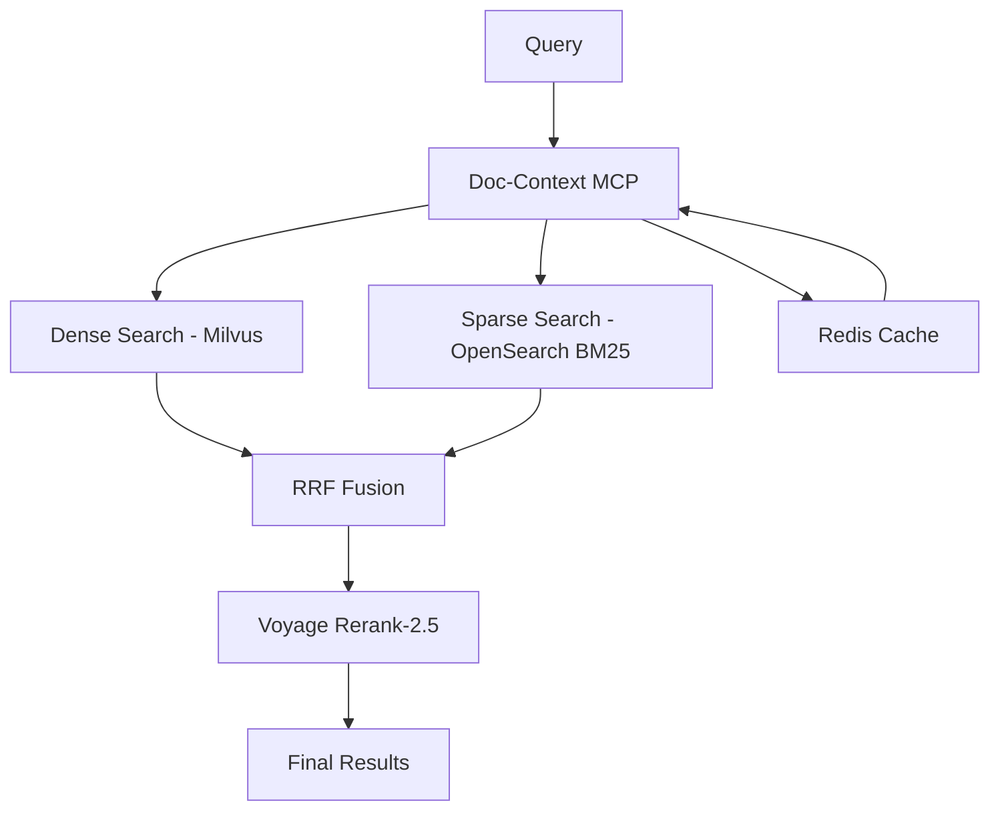

# Datastore Orchestration - RACI Matrix & Consistency Strategy

## Overview

This document defines ownership, access patterns, and consistency strategies for all datastores in the Dopemux orchestration system. Clear ownership prevents conflicts and ensures data integrity across multi-agent workflows.

## RACI Matrix

| Datastore | Owner | Writers | Readers | Consistency Model | Purpose |
|-----------|-------|---------|---------|------------------|---------|
| **Leantime DB** (MySQL) | Leantime API | Sync Service | All roles via API | Strong (ACID) | PM source of truth |
| **Milvus-code** | Claude-Context | Ingestion job | Dev roles | Bounded→Strong | Semantic code search |
| **Milvus-docs** | Doc-Context | Doc pipeline | Most roles | Bounded | Document RAG |
| **OpenSearch BM25** | Doc-Context | BM25 indexer | Fusion layer | Eventual | Sparse text search |
| **ConPort Graph** | ConPort MCP | Role checkpoints | Product/Arch/QA | Strong | Project knowledge |
| **Redis Cache** | Cache middleware | All via proxy | All roles | Best-effort | Semantic caching |
| **Neo4j Graph** | ConPort/dedicated | ConPort + roles | Decision queries | Strong | Knowledge graph |

## Detailed Ownership Specifications

### 1. Leantime DB (PM Source of Truth)

**Owner**: Leantime application API
**Purpose**: Authoritative project management data

**Write Patterns**:
- **Sync Service**: Bidirectional updates from Task-Orchestrator
- **Human Users**: Direct UI interactions
- **Webhook Handlers**: External integrations

**Read Patterns**:
- **All Roles**: Via Leantime REST API
- **Sync Service**: Polling for changes
- **Reporting**: Analytics and dashboards

**Consistency Strategy**:
- ACID transactions for all operations
- External_id mapping for sync integrity
- Idempotent upserts with conflict resolution
- Transactional outbox for dual writes

**Schema Ownership**:
```sql
-- External ID mapping for sync
ALTER TABLE tasks ADD COLUMN external_id VARCHAR(255) UNIQUE;
ALTER TABLE projects ADD COLUMN external_id VARCHAR(255) UNIQUE;

-- Sync metadata
ALTER TABLE tasks ADD COLUMN sync_timestamp TIMESTAMP;
ALTER TABLE tasks ADD COLUMN sync_source ENUM('leantime', 'orchestrator', 'taskmaster');
```

### 2. Milvus-code (Semantic Code Search)

**Owner**: Claude-Context MCP server
**Purpose**: Vector embeddings for code semantic search

**Write Patterns**:
- **Ingestion Job**: Scheduled/triggered codebase indexing
- **Git Hooks**: Incremental updates on commits
- **Manual Refresh**: Via Claude-Context tools

**Read Patterns**:
- **Dev Roles**: TDD Engineer, Implementer, Validator, Refactor
- **Architecture Roles**: Engineering Architect for design context
- **QA Role**: Test coverage analysis

**Consistency Strategy**:
- **Bounded Consistency**: Fast reads during development
- **Strong Consistency**: Release gates and compliance checks
- **Collection Namespacing**: {worktree_id}_{collection_name}

**Collection Structure**:
```python
# Per-worktree isolation
collections = {
    f"{worktree_id}_code_chunks": {
        "vector_field": "embedding",
        "metadata": ["file_path", "function_name", "line_start", "line_end"]
    },
    f"{worktree_id}_test_coverage": {
        "vector_field": "test_embedding",
        "metadata": ["test_file", "coverage_percentage", "last_run"]
    }
}
```

### 3. Milvus-docs (Document RAG)

**Owner**: Doc-Context MCP server (to be built)
**Purpose**: Hybrid search for documentation

**Write Patterns**:
- **Document Pipeline**: Ingestion from multiple sources
- **Incremental Updates**: On document changes
- **Bulk Reindex**: For schema migrations

**Read Patterns**:
- **Research Role**: Evidence gathering, competitor analysis
- **Product Architect**: Requirements context
- **Docs Writer**: User documentation context
- **Most Roles**: General knowledge retrieval

**Hybrid Architecture**:


**Consistency Strategy**:
- **Bounded Consistency**: Fast retrieval for most queries
- **Cache Invalidation**: Aggressive on document updates
- **Contextualized Embeddings**: Voyage context-3 for chunk context

### 4. ConPort Graph (Project Memory)

**Owner**: ConPort MCP server
**Purpose**: Structured project knowledge and decision lineage

**Write Patterns**:
- **Role Checkpoints**: Memory writes during transitions
- **Decision Logging**: ADRs, trade-offs, constraints
- **User Trait Learning**: ADHD patterns and preferences

**Read Patterns**:
- **Product Roles**: Strategy and value context
- **Architecture Roles**: Design decisions and dependencies
- **QA Role**: Test strategy and risk assessment

**Graph Schema**:
```cypher
// Core entities
CREATE (project:Project {id, name, domain})
CREATE (decision:Decision {id, title, rationale, date, confidence})
CREATE (user:User {id, adhd_traits, preferences, energy_patterns})
CREATE (component:Component {id, name, type, dependencies})

// Relationships
CREATE (project)-[:HAS_DECISION]->(decision)
CREATE (user)-[:PREFERS]->(workflow_pattern)
CREATE (component)-[:DEPENDS_ON]->(component)
CREATE (decision)-[:AFFECTS]->(component)
```

**Consistency Strategy**:
- **Strong Consistency**: Critical for decision lineage
- **Graph Transactions**: ACID properties maintained
- **Versioned Edges**: Track decision evolution over time

### 5. Redis Semantic Cache

**Owner**: Cache middleware layer
**Purpose**: Reduce embedding costs and improve latency

**Access Patterns**:
- **All Roles**: Transparent caching via middleware
- **Cache Hits**: Distance-based similarity matching
- **Cache Invalidation**: On source document updates

**Caching Strategy**:
```python
# Cache key generation
def generate_cache_key(query_embedding, search_type, role_context):
    return f"cache:{search_type}:{role_context}:{hash(query_embedding)}"

# Distance threshold for hits
CACHE_HIT_THRESHOLD = 0.95  # Cosine similarity
CACHE_TTL = 3600  # 1 hour base TTL
CACHE_INVALIDATION_EVENTS = [
    "document_updated",
    "codebase_changed",
    "project_settings_modified"
]
```

**Performance Targets**:
- **Hit Rate**: > 60% for repeated queries
- **Latency Reduction**: 80%+ for cache hits
- **Memory Efficiency**: LRU eviction with usage tracking

## Concurrency & Multi-Agent Safety

### Git Worktree Isolation

All datastores support namespacing by `{worktree_id}` to enable parallel agents:

```yaml
# Namespace strategy per datastore
namespacing:
  milvus_collections: "{worktree_id}_code_chunks"
  neo4j_labels: "Project_{worktree_id}"
  redis_keys: "cache:{worktree_id}:{query_hash}"
  external_ids: "{worktree_id}_{original_id}"
```

### Idempotency & Outbox Pattern

**Write Operations**:
- Every write includes idempotency key
- Store last operation result for deduplication
- Transactional outbox for cross-datastore events

**Example Outbox Event**:
```json
{
  "event_id": "uuid",
  "event_type": "task_created",
  "source_system": "task_orchestrator",
  "target_systems": ["leantime", "conport"],
  "payload": {
    "task_id": "orchestrator_123",
    "external_id": "worktree_abc_123",
    "title": "Implement user authentication",
    "metadata": {...}
  },
  "idempotency_key": "create_task_orchestrator_123",
  "timestamp": "2025-09-24T10:30:00Z"
}
```

### Consistency Level Tuning

**Development Workflows** (Speed Priority):
- Milvus: Bounded consistency
- Cache: Best-effort
- Graph: Eventual consistency for read replicas

**Release Workflows** (Accuracy Priority):
- Milvus: Strong consistency
- Cache: Invalidate and refresh
- Graph: Strong consistency for all reads

## Monitoring & Observability

### Health Checks
- **Leantime**: API response time < 500ms
- **Milvus**: Query latency < 200ms
- **ConPort**: Graph query time < 100ms
- **Redis**: Hit rate > 60%, memory usage < 80%

### Metrics Dashboard
```yaml
key_metrics:
  - datastore_availability_percentage
  - cross_datastore_sync_lag_seconds
  - cache_hit_rate_by_role
  - consistency_violation_count
  - worktree_isolation_effectiveness
```

### Alert Thresholds
- Sync lag > 30 seconds
- Cache hit rate < 40%
- Consistency violations > 5/hour
- Cross-datastore operation failures > 1%

---

Generated: 2025-09-24
Status: Architecture validated, ready for implementation
Next: Tool inventory and role mapping specifications