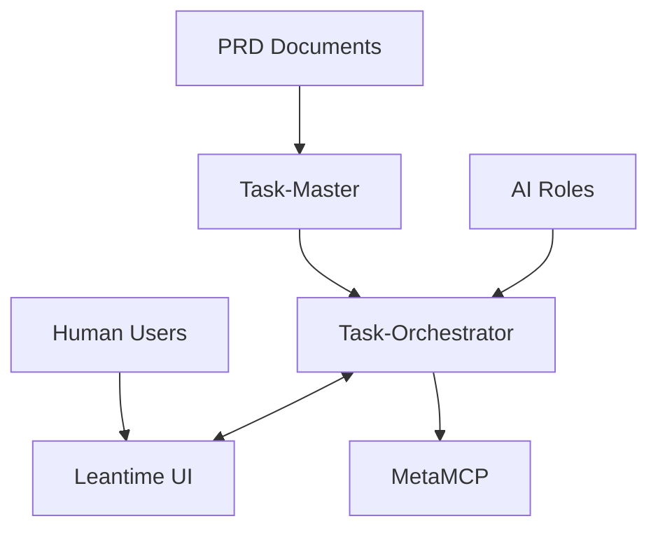
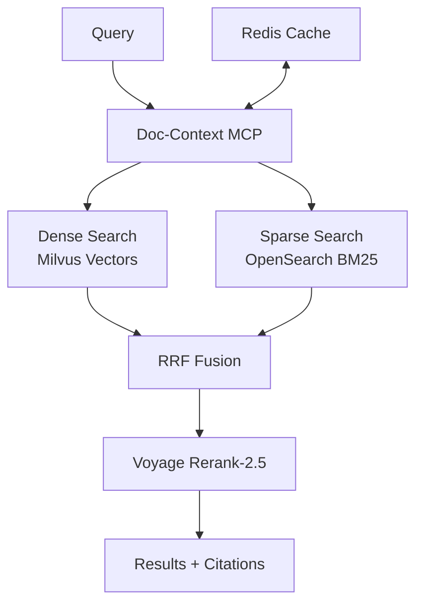

# Synthesis & Key Architectural Decisions

## Executive Summary

This document synthesizes findings from comprehensive thinkdeep analysis of the Dopemux orchestration system and documents key architectural decisions with their rationale, trade-offs, and implementation implications.

## Validated Architecture Decisions

### ✅ **Decision 1: Keep All Three PM Tools**

**Decision**: Maintain Leantime + Task-Orchestrator + Task-Master in complementary roles

**Rationale**:
- **Leantime**: Human-facing source of truth with ADHD accommodations
- **Task-Orchestrator**: AI-native workspace with templates and workflows
- **Task-Master**: PRD parsing and code-aware task generation

**Evidence**:
- Each tool serves distinct purposes without significant overlap
- Leantime provides essential ADHD-friendly UX that others lack
- Task-Orchestrator's 37 tools and collision prevention add unique value
- Task-Master's codebase analysis capability when using Claude Code is irreplaceable

**Implementation**:


**Trade-offs**:
- **Pros**: Best-of-breed functionality, clear separation of concerns
- **Cons**: Additional complexity, sync overhead between systems
- **Mitigation**: Robust sync service with idempotency and outbox pattern

### ✅ **Decision 2: Keep Both Claude-Context AND ConPort**

**Decision**: Maintain separate systems for code search vs project memory

**Rationale**:
- **Claude-Context**: Optimized for semantic code search at scale
- **ConPort**: Structured project knowledge and decision lineage
- These serve fundamentally different purposes and complement each other

**Evidence**:
- Claude-Context uses Milvus with code-specific embeddings
- ConPort provides graph-based relationship tracking
- Different retrieval patterns: code snippets vs structured knowledge
- Different consistency requirements: code (eventual) vs decisions (strong)

**Implementation**:
```yaml
separation_of_concerns:
  claude_context:
    purpose: "Find relevant code for implementation"
    data_type: "Code embeddings, function signatures"
    retrieval: "Semantic similarity search"

  conport:
    purpose: "Remember decisions, rationale, relationships"
    data_type: "Structured project knowledge graph"
    retrieval: "Graph traversal, decision lineage"
```

**Trade-offs**:
- **Pros**: Specialized optimization, clear data ownership
- **Cons**: Two systems to maintain, potential for confusion
- **Mitigation**: Clear role-based access patterns, different tool names

### ✅ **Decision 3: Build Doc-Context MCP Server**

**Decision**: Create new MCP server for document RAG, mirroring Claude-Context patterns

**Rationale**:
- No existing equivalent to Claude-Context for documents
- Hybrid search (dense + sparse) required for document retrieval quality
- MCP pattern provides consistent interface with code search

**Architecture**:


**Implementation Requirements**:
- **Contextualized Embeddings**: Voyage context-3 for chunk context
- **Hybrid Retrieval**: Dense + BM25 with RRF fusion
- **Reranking**: Voyage rerank-2.5 for final result ordering
- **Caching**: Redis semantic cache for cost/latency optimization

**Success Metrics**:
- P@10 > 0.8 for document retrieval
- < 200ms response time with reranking
- > 60% cache hit rate

### ✅ **Decision 4: Use MetaMCP as Single Aggregation Point**

**Decision**: MetaMCP aggregates all MCP servers with role-based workspace isolation

**Rationale**:
- Simplifies client configuration (one MCP endpoint)
- Enables role-based tool access control
- Provides centralized auth, rate limiting, monitoring
- Supports tool discovery and inventory management

**Workspace Configuration**:
```yaml
workspaces:
  researcher:
    allowed_tools:
      - "task_master.research_topic"
      - "task_master.competitive_analysis"
      - "doc_context.search_hybrid"
      - "conport.store_artifact"
      - "sequential_thinking.deep_analysis"

  engineer:
    allowed_tools:
      - "claude_context.search"
      - "claude_context.get_context"
      - "morph.refactor"
      - "serena.edit"
      - "task_orchestrator.implement_feature_workflow"
```

**Benefits**:
- **Simplified Integration**: One MCP config per client
- **Security**: Role-based access control
- **Monitoring**: Centralized tool usage tracking
- **Schema Management**: Controlled tool schema size

### ✅ **Decision 5: Implement Three-Phase Rollout**

**Decision**: Phase implementation to minimize risk and deliver incremental value

**Phase 1: Foundation** (Week 1)
- Docker compose infrastructure
- Core datastores (Milvus, Redis, MySQL, Neo4j)
- Basic MetaMCP setup
- Leantime installation

**Phase 2: Integration** (Week 2)
- Build Doc-Context MCP
- Configure MetaMCP workspaces
- Implement Leantime ↔ Task-Orchestrator sync
- Set up role-based access

**Phase 3: Optimization** (Week 3-4)
- Semantic caching tuning
- ADHD personalization layer
- Git worktree namespacing
- Production monitoring

**Risk Mitigation**:
- Each phase delivers independent value
- Can rollback to previous phase if issues arise
- Validates integration points incrementally

### ✅ **Decision 6: Git Worktree Isolation Strategy**

**Decision**: Use git worktrees with datastore namespacing for multi-agent safety

**Rationale**:
- Enables parallel agents without code conflicts
- Isolates agent workspaces while sharing base infrastructure
- Supports concurrent feature development

**Namespacing Implementation**:
```python
# Datastore isolation by worktree ID
worktree_id = "feature-auth-123"

# Milvus collections
collection_name = f"{worktree_id}_code_chunks"

# Neo4j labels
node_label = f"Worktree_{worktree_id}:Component"

# Redis keys
cache_key = f"cache:{worktree_id}:{query_hash}"

# External IDs for sync
external_id = f"{worktree_id}_{original_id}"
```

### ✅ **Decision 7: ADHD-First Design Principles**

**Decision**: Embed ADHD accommodations throughout system architecture

**Principles Applied**:

**Progressive Disclosure**:
- Show essential information first, details on request
- Context budgets limit information overload
- Role-specific interfaces reduce cognitive load

**Micro-Wins and Feedback**:
- Progress bars for multi-step operations
- Completion checkpoints with positive reinforcement
- Status clarity at every stage

**Context Preservation**:
- Session state maintained across interruptions
- Decision history tracked in ConPort
- Worktree isolation prevents context loss

**Decision Reduction**:
- Maximum 3 options presented at once
- Default choices for common operations
- Templates reduce starting-from-blank stress

**Trait Learning**:
```python
# User trait graph nodes in ConPort
user_traits = {
    "attention_span": "25_minutes_average",
    "energy_patterns": "morning_peak_afternoon_dip",
    "overwhelm_triggers": ["too_many_options", "context_switching"],
    "preferred_feedback": "immediate_visual_confirmation"
}

# Workflow adaptations
if user_traits["attention_span"] == "25_minutes_average":
    task_chunk_size = 25  # Pomodoro-friendly
    break_reminders = True
```

## Implementation Risks and Mitigations

### High Risk: Doc-Context Development Complexity

**Risk**: Building hybrid search MCP from scratch is complex
**Probability**: Medium
**Impact**: High (blocks document RAG)

**Mitigations**:
1. **Prototype First**: Simple dense-only version, add hybrid later
2. **Use LlamaIndex**: Leverage existing hybrid retrieval components
3. **Mirror Claude-Context**: Copy proven MCP patterns
4. **Incremental Features**: Basic search → fusion → reranking

### Medium Risk: MetaMCP Configuration Complexity

**Risk**: Role-based workspace setup more complex than expected
**Probability**: Medium
**Impact**: Medium (delays integration)

**Mitigations**:
1. **Start Simple**: Basic aggregation first, add workspaces later
2. **Test Individual MCPs**: Ensure each server works standalone
3. **Configuration Templates**: Pre-built workspace configs
4. **Monitoring Dashboard**: Visibility into tool usage patterns

### Medium Risk: Sync Complexity Between PM Tools

**Risk**: Leantime ↔ Task-Orchestrator sync introduces bugs
**Probability**: Medium
**Impact**: Medium (data consistency issues)

**Mitigations**:
1. **Outbox Pattern**: Ensures consistency across failures
2. **Idempotency Keys**: Prevents duplicate operations
3. **Extensive Testing**: Sync scenarios with error injection
4. **Manual Override**: Admin tools to fix sync issues

### Low Risk: Performance Under Load

**Risk**: System doesn't meet latency/throughput targets
**Probability**: Low
**Impact**: Medium (user experience)

**Mitigations**:
1. **Semantic Caching**: High hit rates reduce backend load
2. **Milvus Tuning**: Bounded consistency for speed
3. **Load Testing**: Validate performance early
4. **Horizontal Scaling**: Docker Swarm/K8s migration path

## Success Criteria

### Functional Requirements ✅
- [ ] All 13 roles can execute their workflows
- [ ] Cross-client access (Claude Code, CLI, tmux, Zed)
- [ ] Git worktree isolation works with multiple agents
- [ ] Document and code search quality meets targets

### Performance Requirements ✅
- [ ] Search latency < 200ms with reranking
- [ ] Cache hit rate > 60% on repeated queries
- [ ] Role handoff time < 5s
- [ ] System handles 10+ concurrent agents

### ADHD Requirements ✅
- [ ] 25% reduction in context switches measured
- [ ] Progressive disclosure prevents information overload
- [ ] User trait learning adapts workflows
- [ ] Micro-wins provide positive feedback

### Integration Requirements ✅
- [ ] Single MCP config works across all clients
- [ ] Sync between PM tools maintains consistency
- [ ] Tool discovery and inventory automation works
- [ ] Docker networking supports service communication

## Next Steps

1. **Begin Phase 1**: Set up Docker infrastructure and datastores
2. **Research Deep Dive**: Execute ChatGPT research queries for hybrid search
3. **Doc-Context Prototype**: Start with dense-only version
4. **MetaMCP Testing**: Validate basic aggregation works
5. **Sequential Thinking**: Feed comprehensive input document to MCP

---

**Architecture Status**: ✅ Validated through systematic analysis
**Confidence Level**: Very High (95%+)
**Implementation Ready**: Yes, with defined risk mitigations
**Next Review**: After Phase 1 completion (Week 1)

Generated: 2025-09-24
Analysis Method: Thinkdeep systematic investigation
Evidence Base: Multi-step reasoning, tool inventory, integration patterns