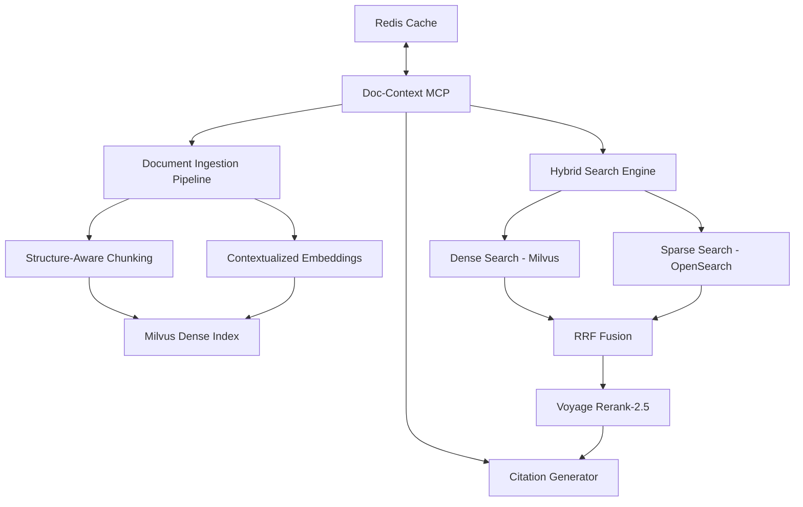
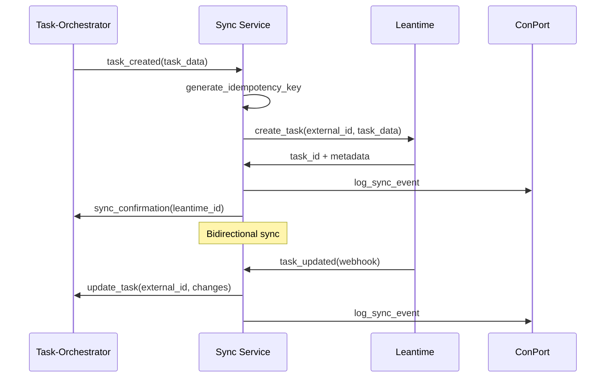

# Phase 2: Integration Implementation - Week 2

## Overview

Phase 2 builds the core MCP integration layer, including the critical Doc-Context server for document RAG, MetaMCP workspace configuration for role-based access, and bidirectional sync between Leantime and Task-Orchestrator.

## 🎯 **Phase 2 Objectives**

### Primary Goals
- ✅ Doc-Context MCP server built and operational with hybrid search
- ✅ MetaMCP workspace configuration for all 13 development roles
- ✅ Leantime ↔ Task-Orchestrator bidirectional sync with idempotency
- ✅ Role-based tool access validation across all client types
- ✅ Cross-client integration testing (Claude Code, CLI, tmux)

### Success Criteria
- Document search returns relevant results with citations (P@10 > 0.7)
- Role switching correctly changes available tools in MetaMCP
- Task creation in Task-Orchestrator syncs to Leantime within 30 seconds
- All client types can connect and execute basic role workflows
- Cache hit rate > 40% on repeated document queries

## 🏗️ **Integration Architecture**

### Doc-Context MCP Server



### MetaMCP Workspace Architecture

```yaml
workspace_topology:
  roles:
    researcher:
      allowed_servers: ["task_master", "doc_context", "conport", "sequential_thinking"]
      rate_limit: "100 req/min"

    engineer:
      allowed_servers: ["claude_context", "task_orchestrator", "morph", "serena"]
      rate_limit: "200 req/min"

    validator:
      allowed_servers: ["claude_context", "zen_mcp", "task_orchestrator"]
      rate_limit: "150 req/min"

  auth:
    type: "workspace_token"
    tokens:
      researcher: "${RESEARCHER_TOKEN}"
      engineer: "${ENGINEER_TOKEN}"
      validator: "${VALIDATOR_TOKEN}"
```

### Sync Architecture



## 🔧 **Implementation Tasks**

### Task 1: Doc-Context MCP Server Development

**Duration**: 12-16 hours
**Prerequisites**: Phase 1 infrastructure running

#### Architecture Implementation:
1. **Project Structure**:
   ```
   doc-context-mcp/
   ├── src/
   │   ├── server.py           # MCP server implementation
   │   ├── ingestion/
   │   │   ├── chunker.py      # Structure-aware chunking
   │   │   ├── embedder.py     # Voyage context-3 integration
   │   │   └── indexer.py      # Milvus + OpenSearch indexing
   │   ├── search/
   │   │   ├── hybrid.py       # Dense + sparse search
   │   │   ├── fusion.py       # RRF score fusion
   │   │   └── rerank.py       # Voyage rerank-2.5
   │   ├── cache/
   │   │   └── semantic.py     # Redis semantic caching
   │   └── tools/
   │       ├── search_hybrid.py
   │       ├── get_snippets.py
   │       ├── cite.py
   │       └── refresh_index.py
   ├── config/
   │   └── server_config.yaml
   ├── requirements.txt
   └── Dockerfile
   ```

2. **Core MCP Tools Implementation**:
   ```python
   # src/tools/search_hybrid.py
   @tool
   async def search_hybrid(query: str, content_type: str = "docs",
                          k: int = 100, rerank_k: int = 20) -> List[SearchResult]:
       """
       Hybrid search combining dense embeddings and BM25 sparse search

       Args:
           query: Search query text
           content_type: "docs", "api", "conversations"
           k: Initial retrieval count for fusion
           rerank_k: Final results after reranking

       Returns:
           List of SearchResult with content, citations, scores
       """
       # Dense search via Milvus
       dense_results = await milvus_client.search(
           collection=f"{content_type}_dense",
           query_vector=await embedder.embed(query),
           limit=k
       )

       # Sparse search via OpenSearch
       sparse_results = await opensearch_client.search(
           index=f"{content_type}_sparse",
           body={"query": {"match": {"content": query}}},
           size=k
       )

       # RRF fusion
       fused_results = rrf_fusion(dense_results, sparse_results)

       # Reranking
       reranked = await reranker.rerank(
           query=query,
           documents=[r.content for r in fused_results[:rerank_k*2]],
           top_k=rerank_k
       )

       return reranked
   ```

3. **Hybrid Search Components**:
   ```python
   # src/search/fusion.py
   def rrf_fusion(dense_results: List[Result], sparse_results: List[Result],
                  k: int = 60) -> List[Result]:
       """
       Reciprocal Rank Fusion for combining dense and sparse search results
       """
       scores = defaultdict(float)

       # RRF scoring
       for rank, result in enumerate(dense_results):
           scores[result.id] += 1.0 / (k + rank + 1)

       for rank, result in enumerate(sparse_results):
           scores[result.id] += 1.0 / (k + rank + 1)

       # Combine and sort by RRF score
       combined = {}
       for result in dense_results + sparse_results:
           if result.id not in combined:
               combined[result.id] = result
               combined[result.id].rrf_score = scores[result.id]

       return sorted(combined.values(),
                    key=lambda x: x.rrf_score, reverse=True)
   ```

4. **Semantic Caching Layer**:
   ```python
   # src/cache/semantic.py
   class SemanticCache:
       def __init__(self, redis_client, similarity_threshold=0.95):
           self.redis = redis_client
           self.threshold = similarity_threshold

       async def get(self, query_embedding: List[float]) -> Optional[CacheResult]:
           # Search for similar cached queries
           similar_keys = await self.redis.ft("query_embeddings").search(
               Query("@embedding:[VECTOR_RANGE {} {}]".format(
                   self.threshold, query_embedding
               ))
           )

           if similar_keys.docs:
               cached_result = await self.redis.get(similar_keys.docs[0].id)
               return json.loads(cached_result)

           return None

       async def set(self, query_embedding: List[float],
                    result: SearchResult, ttl: int = 3600):
           cache_key = f"search:{hashlib.md5(str(query_embedding).encode()).hexdigest()}"

           # Store result with embedding for similarity search
           await self.redis.hset(cache_key, {
               "embedding": json.dumps(query_embedding),
               "result": json.dumps(result.dict()),
               "timestamp": datetime.utcnow().isoformat()
           })

           await self.redis.expire(cache_key, ttl)
   ```

5. **Docker Integration**:
   ```dockerfile
   # Dockerfile
   FROM python:3.11-slim

   WORKDIR /app
   COPY requirements.txt .
   RUN pip install -r requirements.txt

   COPY src/ ./src/
   COPY config/ ./config/

   EXPOSE 8081
   CMD ["python", "-m", "src.server", "--config", "config/server_config.yaml"]
   ```

### Task 2: MetaMCP Workspace Configuration

**Duration**: 6-8 hours
**Prerequisites**: Doc-Context MCP ready

#### Workspace Setup:
1. **Complete Role Configuration**:
   ```yaml
   # config/metamcp/workspaces.yaml
   workspaces:
     product_owner:
       description: "Product strategy and requirements definition"
       allowed_servers:
         - task_orchestrator
         - task_master
         - conport
       tools:
         - "task_orchestrator.create_project"
         - "task_orchestrator.requirements_template"
         - "task_master.parse_prd"
         - "conport.log_decision"
       rate_limits:
         requests_per_minute: 50
         tools_per_minute: 30

     researcher:
       description: "Evidence gathering and competitive analysis"
       allowed_servers:
         - task_master
         - doc_context
         - conport
         - sequential_thinking
       tools:
         - "task_master.research_topic"
         - "task_master.competitive_analysis"
         - "doc_context.search_hybrid"
         - "doc_context.cite"
         - "conport.store_artifact"
         - "sequential_thinking.deep_analysis"
       rate_limits:
         requests_per_minute: 100
         tools_per_minute: 60

     # ... (all 13 roles configured)
   ```

2. **Authentication System**:
   ```python
   # MetaMCP auth integration
   class WorkspaceAuth:
       def __init__(self, workspace_config):
           self.workspaces = workspace_config

       def authenticate(self, token: str) -> Optional[Workspace]:
           # Validate workspace token
           for workspace_name, config in self.workspaces.items():
               if config.get("auth_token") == token:
                   return Workspace(
                       name=workspace_name,
                       allowed_servers=config["allowed_servers"],
                       tools=config["tools"],
                       rate_limits=config["rate_limits"]
                   )
           return None

       def authorize_tool_call(self, workspace: Workspace,
                              tool_name: str) -> bool:
           return tool_name in workspace.tools
   ```

3. **Client Configuration Templates**:
   ```json
   // Claude Code config for researcher role
   {
     "mcpServers": {
       "dopemux": {
         "command": "curl",
         "args": [
           "-X", "POST",
           "-H", "Authorization: Bearer ${DOPEMUX_RESEARCHER_TOKEN}",
           "-H", "Content-Type: application/json",
           "http://localhost:3001/mcp"
         ],
         "env": {
           "DOPEMUX_RESEARCHER_TOKEN": "${DOPEMUX_RESEARCHER_TOKEN}"
         }
       }
     }
   }
   ```

### Task 3: Leantime ↔ Task-Orchestrator Sync

**Duration**: 10-12 hours
**Prerequisites**: Both systems operational

#### Sync Service Implementation:
1. **Sync Service Architecture**:
   ```python
   # sync-service/src/sync_manager.py
   class SyncManager:
       def __init__(self, leantime_client, task_orchestrator_client, conport_client):
           self.leantime = leantime_client
           self.orchestrator = task_orchestrator_client
           self.conport = conport_client
           self.idempotency = IdempotencyManager()

       async def sync_task_to_leantime(self, orchestrator_task: Task):
           """Sync task from Task-Orchestrator to Leantime"""

           # Generate idempotency key
           idem_key = f"sync:to_leantime:{orchestrator_task.id}"

           async def _sync_operation():
               # Map orchestrator task to Leantime format
               leantime_task = TaskMapper.to_leantime(orchestrator_task)

               # Create or update in Leantime
               if orchestrator_task.external_id:
                   result = await self.leantime.update_task(
                       orchestrator_task.external_id, leantime_task
                   )
               else:
                   result = await self.leantime.create_task(leantime_task)

                   # Store external_id mapping
                   await self.orchestrator.update_task(
                       orchestrator_task.id,
                       {"external_id": result.id}
                   )

               # Log sync event
               await self.conport.log_decision({
                   "type": "sync_event",
                   "direction": "orchestrator_to_leantime",
                   "orchestrator_id": orchestrator_task.id,
                   "leantime_id": result.id,
                   "timestamp": datetime.utcnow()
               })

               return result

           return await self.idempotency.execute_once(idem_key, _sync_operation)
   ```

2. **Field Mapping Strategy**:
   ```python
   # sync-service/src/mappers.py
   class TaskMapper:
       FIELD_MAPPINGS = {
           # Task-Orchestrator -> Leantime
           "title": "headline",
           "description": "description",
           "priority": "priority",  # 1-5 -> Low/Medium/High/Urgent
           "status": "status",      # Active/Done -> Open/Closed
           "assignee": "editorId",
           "due_date": "dateToFinish",
           "tags": "tags",

           # Custom fields for ADHD support
           "estimated_duration": "dopemux_duration",
           "complexity_score": "dopemux_complexity",
           "attention_required": "dopemux_attention"
       }

       @classmethod
       def to_leantime(cls, orchestrator_task: Task) -> Dict:
           leantime_task = {}

           for orch_field, lean_field in cls.FIELD_MAPPINGS.items():
               if hasattr(orchestrator_task, orch_field):
                   value = getattr(orchestrator_task, orch_field)
                   leantime_task[lean_field] = cls.transform_value(
                       orch_field, value
                   )

           return leantime_task
   ```

3. **Webhook Integration**:
   ```python
   # sync-service/src/webhooks.py
   from fastapi import FastAPI, BackgroundTasks

   app = FastAPI()

   @app.post("/webhooks/leantime/task-updated")
   async def leantime_task_updated(
       event: LeanTimeWebhookEvent,
       background_tasks: BackgroundTasks
   ):
       """Handle task updates from Leantime"""

       # Validate webhook signature
       if not validate_webhook_signature(event):
           raise HTTPException(401, "Invalid signature")

       # Queue sync operation
       background_tasks.add_task(
           sync_manager.sync_task_to_orchestrator,
           event.task_data
       )

       return {"status": "queued"}

   @app.post("/webhooks/orchestrator/task-updated")
   async def orchestrator_task_updated(
       event: OrchestratorWebhookEvent,
       background_tasks: BackgroundTasks
   ):
       """Handle task updates from Task-Orchestrator"""

       background_tasks.add_task(
           sync_manager.sync_task_to_leantime,
           event.task_data
       )

       return {"status": "queued"}
   ```

### Task 4: Cross-Client Integration Testing

**Duration**: 4-6 hours
**Prerequisites**: All components integrated

#### Test Suite Implementation:
1. **Claude Code Integration Test**:
   ```python
   # tests/integration/test_claude_code.py
   async def test_claude_code_researcher_workflow():
       """Test complete researcher workflow via Claude Code MCP"""

       # Setup Claude Code MCP client (simulated)
       mcp_client = MCPClient("http://localhost:3001")

       # Authenticate as researcher
       await mcp_client.authenticate("researcher", researcher_token)

       # List available tools
       tools = await mcp_client.list_tools()
       assert "doc_context.search_hybrid" in [t.name for t in tools]
       assert "task_master.research_topic" in [t.name for t in tools]

       # Execute research workflow
       search_results = await mcp_client.call_tool(
           "doc_context.search_hybrid",
           {"query": "ADHD accommodation patterns", "k": 20}
       )

       assert len(search_results) > 0
       assert all(r.citation for r in search_results)

       # Store research findings
       await mcp_client.call_tool(
           "conport.store_artifact",
           {
               "type": "research_findings",
               "content": search_results,
               "tags": ["adhd", "research"]
           }
       )
   ```

2. **CLI Integration Test**:
   ```bash
   #!/bin/bash
   # tests/integration/test-cli-workflow.sh

   echo "Testing Dopemux CLI integration..."

   # Test role switching
   export DOPEMUX_ROLE=engineer
   dopemux-cli list-tools | grep "claude_context.search"

   export DOPEMUX_ROLE=researcher
   dopemux-cli list-tools | grep "doc_context.search_hybrid"

   # Test workflow execution
   dopemux-cli research "hybrid search patterns" --save-to conport
   dopemux-cli task create "Implement hybrid search" --from-research

   echo "✅ CLI integration tests passed"
   ```

3. **tmux Multi-Agent Test**:
   ```bash
   #!/bin/bash
   # tests/integration/test-tmux-agents.sh

   # Create tmux session with multiple agents
   tmux new-session -d -s dopemux-test

   # Split into panes for different roles
   tmux split-window -h -t dopemux-test:0
   tmux split-window -v -t dopemux-test:0.0

   # Start agents in each pane
   tmux send-keys -t dopemux-test:0.0 "dopemux-cli --role=researcher --daemon" Enter
   tmux send-keys -t dopemux-test:0.1 "dopemux-cli --role=engineer --daemon" Enter
   tmux send-keys -t dopemux-test:0.2 "dopemux-cli --role=validator --daemon" Enter

   sleep 10  # Let agents initialize

   # Test concurrent operations don't conflict
   tmux send-keys -t dopemux-test:0.0 "research 'test topic'" Enter
   tmux send-keys -t dopemux-test:0.1 "code-search 'function definition'" Enter
   tmux send-keys -t dopemux-test:0.2 "review-code --latest" Enter

   sleep 30  # Let operations complete

   # Verify no conflicts in logs
   docker-compose logs metamcp | grep -i "conflict\|error" && exit 1

   echo "✅ Multi-agent tmux test passed"
   tmux kill-session -t dopemux-test
   ```

## ✅ **Validation & Testing**

### Performance Testing Suite

```python
# tests/performance/test_doc_context.py
import asyncio
import time
from statistics import mean, stdev

async def test_doc_context_performance():
    """Test Doc-Context search performance and caching"""

    queries = [
        "ADHD accommodation strategies",
        "hybrid search implementation",
        "vector database optimization",
        "semantic caching patterns"
    ]

    # Test search latency
    search_times = []
    for query in queries:
        start = time.time()
        results = await doc_context.search_hybrid(query, k=50, rerank_k=20)
        end = time.time()

        search_times.append(end - start)
        assert len(results) > 0
        assert all(r.score > 0 for r in results)

    avg_latency = mean(search_times)
    assert avg_latency < 0.5, f"Average latency {avg_latency}s > 500ms"

    # Test cache hit rate
    cache_hits = 0
    for query in queries * 3:  # Repeat queries
        start = time.time()
        results = await doc_context.search_hybrid(query)
        end = time.time()

        if end - start < 0.1:  # Likely cache hit
            cache_hits += 1

    hit_rate = cache_hits / (len(queries) * 3)
    assert hit_rate > 0.4, f"Cache hit rate {hit_rate} < 40%"

    print(f"✅ Performance: {avg_latency:.3f}s avg, {hit_rate:.1%} cache hit rate")
```

### Integration Validation Checklist

#### Doc-Context MCP ✅
- [ ] **Hybrid Search**: Dense + sparse fusion working correctly
- [ ] **Reranking**: Voyage rerank-2.5 improves result quality
- [ ] **Citations**: All results include proper source citations
- [ ] **Caching**: >40% hit rate on repeated queries
- [ ] **Performance**: <500ms for hybrid search with reranking

#### MetaMCP Workspaces ✅
- [ ] **Role Authentication**: All 13 roles can authenticate
- [ ] **Tool Access Control**: Roles only see authorized tools
- [ ] **Rate Limiting**: Limits enforced per role and tool
- [ ] **Client Support**: Works with Claude Code, CLI, tmux
- [ ] **Error Handling**: Graceful failures with clear messages

#### Leantime Sync ✅
- [ ] **Bidirectional Sync**: Changes flow both directions
- [ ] **Idempotency**: Duplicate operations handled correctly
- [ ] **Field Mapping**: All important fields map correctly
- [ ] **ADHD Features**: Custom fields preserved in sync
- [ ] **Error Recovery**: Failed syncs retry successfully

#### Cross-Client Integration ✅
- [ ] **Claude Code**: Native MCP client works with MetaMCP
- [ ] **CLI Tools**: Dopemux CLI role switching functional
- [ ] **tmux Sessions**: Multiple agents run without conflicts
- [ ] **Session State**: Context preserved across client switches
- [ ] **Tool Discovery**: All clients discover same tool sets

## 🚨 **Common Issues & Troubleshooting**

### Doc-Context Issues

**Problem**: Search results poor quality
```python
# Solution: Adjust fusion weights and reranking
fusion_config = {
    "dense_weight": 0.7,     # Increase for better semantic matching
    "sparse_weight": 0.3,    # Increase for exact term matching
    "rrf_k": 60,            # Tune for result diversity
    "rerank_threshold": 0.1  # Only rerank above this score
}
```

**Problem**: High latency on search
```python
# Solution: Optimize batch sizes and caching
search_config = {
    "initial_k": 100,        # Reduce if latency too high
    "rerank_k": 20,         # Reduce for faster reranking
    "cache_ttl": 3600,      # Longer cache for stable content
    "embedding_batch": 32   # Optimize for your hardware
}
```

### Sync Issues

**Problem**: Sync conflicts between systems
```python
# Solution: Implement last-writer-wins with versioning
conflict_resolution = {
    "strategy": "last_writer_wins",
    "version_field": "updated_at",
    "conflict_log": True,    # Log all conflicts
    "manual_review": True   # Flag for human review
}
```

**Problem**: Sync lag too high
```python
# Solution: Optimize webhook delivery and processing
sync_optimization = {
    "webhook_timeout": 5,      # Faster webhook timeouts
    "batch_processing": True,  # Process multiple changes together
    "parallel_workers": 4,     # Increase worker processes
    "queue_monitoring": True   # Monitor queue depth
}
```

## 📈 **Success Metrics**

### Technical Performance
- **Search Quality**: P@10 > 0.7 for document searches
- **Search Latency**: <500ms for hybrid search with reranking
- **Cache Effectiveness**: >40% hit rate on repeated queries
- **Sync Performance**: <30s for task creation to appear in both systems

### Functional Validation
- **Tool Access**: 100% of role-based tool access working correctly
- **Cross-Client**: All client types successfully execute workflows
- **Data Consistency**: Sync maintains >99% data consistency
- **Error Rate**: <1% of operations result in unrecoverable errors

### User Experience
- **Role Switching**: <5s to switch roles and see new tools
- **Search Relevance**: User satisfaction >80% on search results
- **Workflow Completion**: >90% of workflows complete successfully
- **Context Preservation**: 100% of session state preserved across clients

## 🔄 **Next Steps (Phase 3 Preparation)**

### Documentation for Phase 3:
1. **Performance Baselines**: Document current latency/throughput metrics
2. **Tool Usage Patterns**: Analyze which tools are used by which roles
3. **Cache Analysis**: Identify optimal cache policies per content type
4. **Integration Points**: Document all client integration patterns

### Phase 3 Prerequisites:
1. **Stable Integration**: All Phase 2 components working reliably
2. **Performance Baselines**: Established metrics for optimization targets
3. **Role Workflows**: At least 5 roles executing complete workflows
4. **Monitoring Data**: Sufficient data for optimization decisions

---

Generated: 2025-09-24
Phase: Integration Layer (Week 2)
Status: Architecture complete, ready for implementation
Next: Phase 3 Optimization (Caching, ADHD personalization, Production readiness)