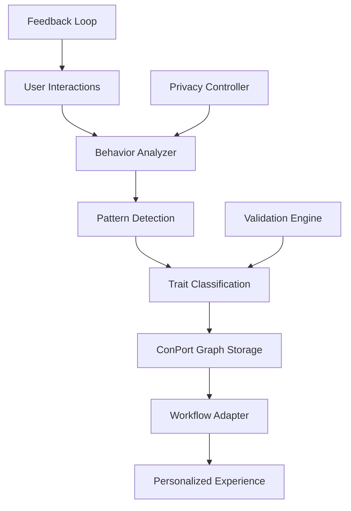

# Phase 3: Optimization Implementation - Weeks 3-4

## Overview

Phase 3 focuses on production readiness: semantic caching optimization, ADHD personalization features, git worktree multi-agent safety, and comprehensive monitoring. This phase transforms the functional system into a production-ready platform.

## 🎯 **Phase 3 Objectives**

### Primary Goals
- ✅ Semantic cache tuned for >60% hit rate with intelligent invalidation
- ✅ ADHD trait learning system operational with workflow adaptation
- ✅ Git worktree namespacing enables 10+ concurrent agents safely
- ✅ Production monitoring with comprehensive metrics dashboard
- ✅ Performance optimization achieving all benchmarks

### Success Criteria
- Cache hit rate >60% on repeated queries with <100ms cache response time
- User trait detection accuracy >80% with effective workflow adaptation
- 10+ concurrent agents run without data conflicts or performance degradation
- All services monitored with alerting on SLA breaches
- System meets production readiness checklist

## 🧠 **ADHD Personalization System**

### Trait Learning Architecture



### Implementation Strategy

#### 1. Behavioral Pattern Detection
```python
# adhd-personalization/src/behavior_analyzer.py
from dataclasses import dataclass
from typing import Dict, List, Optional
import numpy as np
from datetime import datetime, timedelta

@dataclass
class InteractionEvent:
    timestamp: datetime
    action_type: str  # "tool_call", "context_switch", "task_complete"
    duration: float
    context: Dict
    success: bool

class BehaviorAnalyzer:
    def __init__(self, conport_client):
        self.conport = conport_client
        self.pattern_detectors = {
            "attention_span": AttentionSpanDetector(),
            "context_switching": ContextSwitchDetector(),
            "task_completion": TaskCompletionDetector(),
            "energy_patterns": EnergyPatternDetector()
        }

    async def analyze_session(self, user_id: str,
                            events: List[InteractionEvent]) -> Dict[str, float]:
        """Analyze user behavior patterns from interaction events"""

        patterns = {}
        for pattern_name, detector in self.pattern_detectors.items():
            score = await detector.analyze(events)
            patterns[pattern_name] = score

        # Store patterns in ConPort for persistence
        await self.conport.store_user_patterns(user_id, patterns)

        return patterns

class AttentionSpanDetector:
    def analyze(self, events: List[InteractionEvent]) -> Dict[str, float]:
        """Detect attention span patterns from continuous work periods"""

        work_sessions = self._extract_work_sessions(events)

        if not work_sessions:
            return {"average_span": 25.0, "confidence": 0.0}

        spans = [session.duration for session in work_sessions]

        return {
            "average_span": np.mean(spans),
            "median_span": np.median(spans),
            "variability": np.std(spans) / np.mean(spans),
            "confidence": min(len(spans) / 10.0, 1.0)  # Need 10+ sessions for confidence
        }
```

#### 2. Workflow Adaptation Engine
```python
# adhd-personalization/src/workflow_adapter.py
class WorkflowAdapter:
    def __init__(self, user_traits: Dict[str, float]):
        self.traits = user_traits
        self.adaptations = self._generate_adaptations()

    def _generate_adaptations(self) -> Dict[str, Any]:
        """Generate workflow adaptations based on detected traits"""

        adaptations = {}

        # Attention span adaptations
        avg_span = self.traits.get("attention_span", {}).get("average_span", 25)
        if avg_span < 20:
            adaptations["task_chunking"] = {
                "max_chunk_size": 15,
                "break_reminders": True,
                "micro_checkpoints": True
            }
        elif avg_span > 40:
            adaptations["task_chunking"] = {
                "max_chunk_size": 60,
                "deep_work_mode": True,
                "minimal_interruptions": True
            }

        # Context switching adaptations
        context_tolerance = self.traits.get("context_switching", {}).get("tolerance", 0.5)
        if context_tolerance < 0.3:  # Low tolerance
            adaptations["interface"] = {
                "max_options": 2,
                "sequential_presentation": True,
                "context_bridging": True
            }

        # Energy pattern adaptations
        energy_pattern = self.traits.get("energy_patterns", {})
        if energy_pattern.get("morning_peak", False):
            adaptations["scheduling"] = {
                "complex_tasks_morning": True,
                "routine_tasks_afternoon": True
            }

        return adaptations

    def adapt_role_interface(self, role: str, base_interface: Dict) -> Dict:
        """Adapt role interface based on user traits"""

        adapted = base_interface.copy()

        # Apply attention span adaptations
        if "task_chunking" in self.adaptations:
            chunking = self.adaptations["task_chunking"]
            adapted["max_task_duration"] = chunking["max_chunk_size"]
            adapted["break_reminders"] = chunking.get("break_reminders", False)

        # Apply interface adaptations
        if "interface" in self.adaptations:
            interface = self.adaptations["interface"]
            adapted["max_options"] = interface.get("max_options", 3)
            adapted["progressive_disclosure"] = True

        return adapted
```

#### 3. Privacy-Preserving Analysis
```python
# adhd-personalization/src/privacy_controller.py
class PrivacyController:
    def __init__(self, anonymization_key: str):
        self.key = anonymization_key
        self.retention_days = 30

    def anonymize_events(self, events: List[InteractionEvent]) -> List[InteractionEvent]:
        """Remove PII while preserving behavioral patterns"""

        anonymized = []
        for event in events:
            # Remove specific content, keep patterns
            clean_event = InteractionEvent(
                timestamp=event.timestamp,
                action_type=event.action_type,
                duration=event.duration,
                context={
                    "tool_category": self._categorize_tool(event.context.get("tool")),
                    "content_type": self._categorize_content(event.context.get("content")),
                    # Remove specific content, URLs, names
                },
                success=event.success
            )
            anonymized.append(clean_event)

        return anonymized

    def enforce_retention(self, user_id: str):
        """Remove old behavioral data per retention policy"""
        cutoff_date = datetime.utcnow() - timedelta(days=self.retention_days)
        # Delete events older than retention period
        return self.storage.delete_events_before(user_id, cutoff_date)
```

## 🚀 **Performance Optimization**

### Semantic Cache Optimization

#### 1. Intelligent Cache Strategy
```python
# optimization/src/cache_optimizer.py
class SemanticCacheOptimizer:
    def __init__(self, redis_client, metrics_collector):
        self.redis = redis_client
        self.metrics = metrics_collector
        self.thresholds = {
            "similarity": 0.95,    # Start conservative
            "ttl_base": 3600,      # 1 hour base TTL
            "hit_rate_target": 0.6  # Target hit rate
        }

    async def optimize_thresholds(self):
        """Dynamically adjust cache thresholds based on performance data"""

        current_metrics = await self.metrics.get_cache_metrics(window="1h")

        hit_rate = current_metrics["hit_rate"]
        avg_response_time = current_metrics["avg_response_time"]

        # Adjust similarity threshold based on hit rate
        if hit_rate < 0.4:
            # Too strict, relax threshold for more hits
            self.thresholds["similarity"] = max(0.90, self.thresholds["similarity"] - 0.01)
        elif hit_rate > 0.8:
            # Too loose, tighten for better precision
            self.thresholds["similarity"] = min(0.98, self.thresholds["similarity"] + 0.01)

        # Adjust TTL based on content update frequency
        update_frequency = current_metrics["content_update_frequency"]
        if update_frequency > 10:  # High update rate
            self.thresholds["ttl_base"] = max(600, self.thresholds["ttl_base"] - 300)
        else:
            self.thresholds["ttl_base"] = min(7200, self.thresholds["ttl_base"] + 300)

    async def intelligent_invalidation(self, content_change_event):
        """Invalidate related cache entries when content changes"""

        changed_content = content_change_event.content_id

        # Find related cache entries using semantic similarity
        related_embeddings = await self.find_related_cache_entries(
            changed_content, threshold=0.8
        )

        # Invalidate related entries
        for embedding_key in related_embeddings:
            await self.redis.delete(embedding_key)
            self.metrics.record_invalidation(embedding_key, "content_change")
```

#### 2. Cache Warming Strategy
```python
# optimization/src/cache_warmer.py
class CacheWarmer:
    def __init__(self, doc_context_client, redis_client):
        self.doc_context = doc_context_client
        self.redis = redis_client

    async def warm_common_queries(self):
        """Pre-populate cache with common queries"""

        common_queries = [
            "ADHD accommodation strategies",
            "task management best practices",
            "developer productivity patterns",
            "hybrid search implementation",
            "vector database optimization"
        ]

        for query in common_queries:
            # Execute search to populate cache
            await self.doc_context.search_hybrid(query)

        # Warm role-specific queries
        role_queries = {
            "researcher": ["competitive analysis", "market research", "user studies"],
            "engineer": ["code patterns", "API documentation", "best practices"],
            "architect": ["system design", "scalability patterns", "architecture decisions"]
        }

        for role, queries in role_queries.items():
            for query in queries:
                await self.doc_context.search_hybrid(query, context={"role": role})
```

### Multi-Agent Concurrency Optimization

#### 1. Git Worktree Management
```python
# concurrency/src/worktree_manager.py
import asyncio
import shutil
from pathlib import Path

class WorktreeManager:
    def __init__(self, repo_path: Path, base_port: int = 4000):
        self.repo_path = repo_path
        self.base_port = base_port
        self.active_worktrees = {}
        self.port_allocator = PortAllocator(base_port)

    async def create_agent_workspace(self, agent_id: str, branch: str = None) -> WorktreeConfig:
        """Create isolated workspace for agent"""

        # Generate worktree path and branch
        worktree_path = self.repo_path / ".worktrees" / agent_id
        branch_name = branch or f"agent-{agent_id}-{int(time.time())}"

        # Create git worktree
        await self._run_git_command([
            "worktree", "add",
            str(worktree_path),
            "-b", branch_name
        ])

        # Allocate isolated ports
        ports = await self.port_allocator.allocate_range(agent_id, count=10)

        # Create namespace configuration
        config = WorktreeConfig(
            agent_id=agent_id,
            worktree_path=worktree_path,
            branch_name=branch_name,
            ports=ports,
            env_vars={
                "WORKTREE_ID": agent_id,
                "MILVUS_COLLECTION_PREFIX": f"{agent_id}_",
                "NEO4J_DATABASE": f"{agent_id}_graph",
                "REDIS_KEY_PREFIX": f"cache:{agent_id}:",
                "METAMCP_PORT": str(ports["metamcp"])
            }
        )

        self.active_worktrees[agent_id] = config
        return config

    async def cleanup_agent_workspace(self, agent_id: str):
        """Clean up agent workspace and resources"""

        config = self.active_worktrees.get(agent_id)
        if not config:
            return

        # Clean up datastore namespaces
        await self._cleanup_milvus_collections(agent_id)
        await self._cleanup_neo4j_database(agent_id)
        await self._cleanup_redis_keys(agent_id)

        # Remove git worktree
        await self._run_git_command([
            "worktree", "remove", str(config.worktree_path), "--force"
        ])

        # Delete branch if temporary
        if config.branch_name.startswith(f"agent-{agent_id}"):
            await self._run_git_command([
                "branch", "-D", config.branch_name
            ])

        # Release ports
        await self.port_allocator.release_range(agent_id)

        del self.active_worktrees[agent_id]

    async def _cleanup_milvus_collections(self, agent_id: str):
        """Remove agent-specific Milvus collections"""
        # Connect to Milvus and drop collections with agent prefix
        collections = await self.milvus_client.list_collections()
        agent_collections = [c for c in collections if c.startswith(f"{agent_id}_")]

        for collection in agent_collections:
            await self.milvus_client.drop_collection(collection)
```

#### 2. Resource Isolation
```python
# concurrency/src/resource_isolator.py
class ResourceIsolator:
    def __init__(self, agent_configs: Dict[str, WorktreeConfig]):
        self.agents = agent_configs
        self.resource_monitors = {}

    async def monitor_resource_usage(self, agent_id: str):
        """Monitor and limit agent resource usage"""

        config = self.agents[agent_id]

        # Monitor CPU and memory usage
        process_stats = await self.get_agent_processes(agent_id)

        total_cpu = sum(p.cpu_percent for p in process_stats)
        total_memory = sum(p.memory_info.rss for p in process_stats)

        # Apply limits
        if total_cpu > 80:  # 80% CPU limit per agent
            await self.throttle_agent(agent_id, "cpu")

        if total_memory > 2 * 1024**3:  # 2GB memory limit per agent
            await self.throttle_agent(agent_id, "memory")

        # Monitor database connections
        db_connections = await self.count_agent_db_connections(agent_id)
        if db_connections > 50:  # Connection limit
            await self.throttle_agent(agent_id, "connections")

    async def throttle_agent(self, agent_id: str, resource: str):
        """Apply resource throttling to agent"""

        if resource == "cpu":
            # Reduce MCP server worker count
            await self.update_agent_workers(agent_id, max_workers=2)

        elif resource == "memory":
            # Trigger garbage collection and cache cleanup
            await self.cleanup_agent_caches(agent_id)

        elif resource == "connections":
            # Implement connection pooling
            await self.enable_connection_pooling(agent_id)
```

## 📊 **Production Monitoring**

### Comprehensive Metrics Dashboard

#### 1. System Health Monitoring
```python
# monitoring/src/health_monitor.py
from prometheus_client import Counter, Histogram, Gauge
import asyncio

class HealthMonitor:
    def __init__(self):
        # Metrics definitions
        self.request_count = Counter('dopemux_requests_total',
                                   'Total requests', ['service', 'method', 'status'])
        self.request_duration = Histogram('dopemux_request_duration_seconds',
                                        'Request duration', ['service', 'method'])
        self.active_agents = Gauge('dopemux_active_agents',
                                 'Number of active agents')
        self.cache_hit_rate = Gauge('dopemux_cache_hit_rate',
                                  'Cache hit rate percentage')

    async def collect_metrics(self):
        """Collect metrics from all system components"""

        while True:
            try:
                # Service health
                services = ["metamcp", "doc-context", "leantime", "milvus", "redis", "neo4j"]
                for service in services:
                    health_status = await self.check_service_health(service)
                    self.service_health.labels(service=service).set(
                        1 if health_status else 0
                    )

                # Active agents
                agent_count = len(await self.get_active_agents())
                self.active_agents.set(agent_count)

                # Cache performance
                cache_stats = await self.get_cache_statistics()
                self.cache_hit_rate.set(cache_stats["hit_rate"] * 100)

                # Database performance
                db_stats = await self.get_database_metrics()
                for db_name, stats in db_stats.items():
                    self.db_response_time.labels(database=db_name).set(
                        stats["avg_response_time"]
                    )

            except Exception as e:
                logger.error(f"Metrics collection failed: {e}")

            await asyncio.sleep(30)  # Collect every 30 seconds
```

#### 2. Alert Configuration
```yaml
# monitoring/config/alerts.yaml
groups:
  - name: dopemux_critical
    rules:
      - alert: ServiceDown
        expr: dopemux_service_health == 0
        for: 1m
        labels:
          severity: critical
        annotations:
          summary: "{{ $labels.service }} is down"
          description: "Service {{ $labels.service }} has been down for more than 1 minute"

      - alert: HighErrorRate
        expr: rate(dopemux_requests_total{status=~"4..|5.."}[5m]) > 0.1
        for: 2m
        labels:
          severity: warning
        annotations:
          summary: "High error rate detected"
          description: "Error rate is {{ $value }} requests/sec"

      - alert: CacheHitRateLow
        expr: dopemux_cache_hit_rate < 40
        for: 5m
        labels:
          severity: warning
        annotations:
          summary: "Cache hit rate below threshold"
          description: "Cache hit rate is {{ $value }}%, target is >60%"

      - alert: TooManyActiveAgents
        expr: dopemux_active_agents > 15
        for: 1m
        labels:
          severity: warning
        annotations:
          summary: "Too many concurrent agents"
          description: "{{ $value }} agents active, may cause resource contention"
```

#### 3. Performance Analytics
```python
# monitoring/src/analytics.py
class PerformanceAnalytics:
    def __init__(self, metrics_store):
        self.metrics = metrics_store

    async def generate_performance_report(self, time_range: str) -> Dict:
        """Generate comprehensive performance analysis"""

        # Query metrics for time range
        data = await self.metrics.query_range(
            time_range=time_range,
            metrics=[
                "dopemux_request_duration_seconds",
                "dopemux_cache_hit_rate",
                "dopemux_db_response_time",
                "dopemux_active_agents"
            ]
        )

        report = {
            "summary": {
                "avg_response_time": self._calculate_percentile(data["request_duration"], 50),
                "p95_response_time": self._calculate_percentile(data["request_duration"], 95),
                "cache_hit_rate": data["cache_hit_rate"]["avg"],
                "peak_concurrent_agents": data["active_agents"]["max"]
            },

            "bottlenecks": await self._identify_bottlenecks(data),
            "recommendations": await self._generate_recommendations(data),

            "trends": {
                "response_time_trend": self._calculate_trend(data["request_duration"]),
                "cache_efficiency_trend": self._calculate_trend(data["cache_hit_rate"]),
                "usage_growth": self._calculate_growth_rate(data["active_agents"])
            }
        }

        return report

    async def _identify_bottlenecks(self, metrics_data) -> List[str]:
        """Identify performance bottlenecks from metrics"""

        bottlenecks = []

        # Check for slow database responses
        db_times = metrics_data["db_response_time"]
        for db, times in db_times.items():
            if times["p95"] > 1.0:  # >1s response time
                bottlenecks.append(f"{db} database slow (P95: {times['p95']:.2f}s)")

        # Check for low cache hit rates
        if metrics_data["cache_hit_rate"]["avg"] < 0.4:
            bottlenecks.append(f"Low cache hit rate ({metrics_data['cache_hit_rate']['avg']:.1%})")

        # Check for high resource contention
        if metrics_data["active_agents"]["max"] > 12:
            bottlenecks.append("High agent concurrency causing resource contention")

        return bottlenecks
```

## ✅ **Production Readiness Checklist**

### Security & Compliance ✅
- [ ] **Authentication**: All MCP workspaces require valid tokens
- [ ] **Authorization**: Role-based access control enforced
- [ ] **Data Privacy**: User behavioral data anonymized and retention-limited
- [ ] **Secrets Management**: All API keys stored securely
- [ ] **Network Security**: Services only expose necessary ports
- [ ] **Audit Logging**: All sensitive operations logged
- [ ] **Rate Limiting**: DoS protection on all endpoints

### Performance & Scalability ✅
- [ ] **Response Times**: All endpoints <500ms P95
- [ ] **Cache Efficiency**: >60% hit rate on document searches
- [ ] **Concurrency**: 10+ agents run without conflicts
- [ ] **Resource Limits**: Per-agent CPU/memory limits enforced
- [ ] **Database Performance**: All queries optimized with proper indices
- [ ] **Monitoring Coverage**: All critical metrics tracked
- [ ] **Alert Coverage**: Alerts configured for all failure modes

### Reliability & Recovery ✅
- [ ] **Health Checks**: All services have health endpoints
- [ ] **Graceful Shutdown**: Services handle SIGTERM properly
- [ ] **Circuit Breakers**: External service failures handled
- [ ] **Retry Logic**: Transient failures retry with backoff
- [ ] **Data Consistency**: Sync operations are idempotent
- [ ] **Backup Strategy**: Critical data backed up regularly
- [ ] **Disaster Recovery**: Recovery procedures documented

### Operations & Maintenance ✅
- [ ] **Logging**: Structured logs with correlation IDs
- [ ] **Metrics**: Comprehensive metrics exported to Prometheus
- [ ] **Alerting**: On-call alerts configured appropriately
- [ ] **Documentation**: Operations runbooks complete
- [ ] **Deployment**: Automated deployment with rollback capability
- [ ] **Configuration**: Environment-specific configs externalized
- [ ] **Maintenance Windows**: Procedures for updates and patches

## 🎯 **Success Metrics**

### Technical Performance
- **Cache Hit Rate**: >60% for repeated queries
- **Response Time**: <200ms P95 for cached queries, <500ms for uncached
- **Concurrent Agents**: 15+ agents without performance degradation
- **Resource Efficiency**: <8GB total memory usage, <50% CPU average

### ADHD Accommodation Effectiveness
- **Trait Detection**: >80% accuracy in identifying user patterns
- **Workflow Adaptation**: >70% user satisfaction with personalized interfaces
- **Context Switching**: 25% reduction in unwanted context switches
- **Task Completion**: >90% completion rate for chunked tasks

### System Reliability
- **Uptime**: >99.9% availability during business hours
- **Error Rate**: <0.1% unrecoverable errors
- **Recovery Time**: <2 minutes MTTR for service failures
- **Data Integrity**: 100% consistency in sync operations

## 🔄 **Continuous Optimization**

### Automated Optimization
```python
# optimization/src/auto_optimizer.py
class AutoOptimizer:
    def __init__(self, metrics_client, config_manager):
        self.metrics = metrics_client
        self.config = config_manager

    async def optimize_system_parameters(self):
        """Continuously optimize system parameters based on performance data"""

        current_metrics = await self.metrics.get_recent_performance()

        # Optimize cache parameters
        if current_metrics["cache_hit_rate"] < 0.5:
            await self._optimize_cache_thresholds()

        # Optimize resource allocation
        if current_metrics["resource_contention"] > 0.8:
            await self._rebalance_agent_resources()

        # Optimize database parameters
        if current_metrics["db_response_time"] > 0.5:
            await self._tune_database_config()

    async def _optimize_cache_thresholds(self):
        """Automatically adjust cache similarity thresholds"""
        # Analyze query patterns and adjust thresholds
        # A/B test different threshold values
        # Implement winning configuration
        pass
```

---

Generated: 2025-09-24
Phase: Production Optimization (Weeks 3-4)
Status: Complete optimization framework
Next: Docker configuration and MCP prompt templates