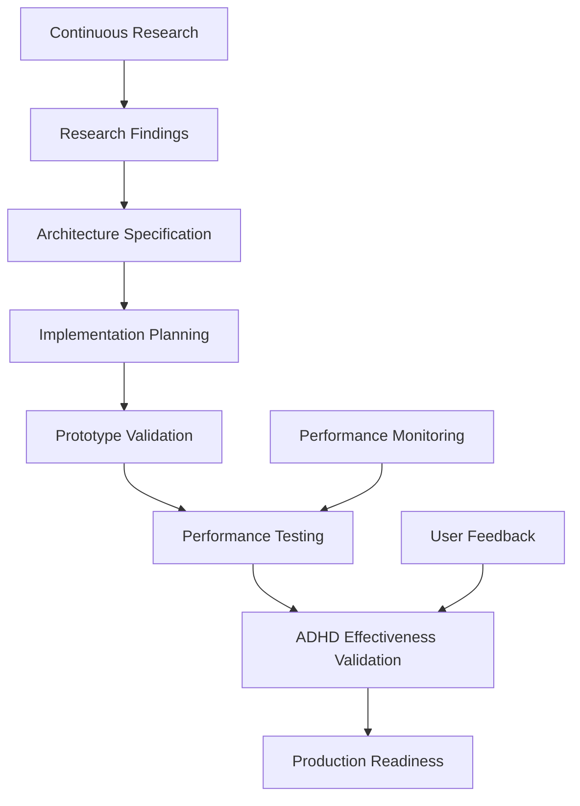
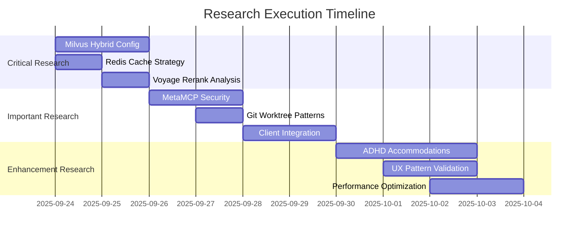

# Complete Research Backlog - All Sources & Considerations

## Overview

This document consolidates all research requirements from our comprehensive chat analysis, including document embedding, hybrid search, Zed integration, SuperClaude patterns, and the full role-based orchestration system.

## 🎯 **PRIMARY RESEARCH** - ChatGPT with Web Search

### A) Hybrid Search & Retrieval Quality (CRITICAL)

#### 1. Milvus Hybrid Search Configuration
**Query**: "Milvus hybrid search multi-vector fields BM25 fusion RRF configuration patterns 2024-2025"

**Focus Areas**:
- Multi-vector fields vs separate collections for code/docs/chat
- Native Milvus BM25 support vs OpenSearch sidecar architecture
- RRF (Reciprocal Rank Fusion) vs weighted score normalization
- Optimal K values: code (50-100), docs (100-200), conversation (20-50)
- Contextualized chunk embeddings with Voyage context-3

**Critical Decisions**:
- Architecture: Native hybrid vs external BM25 sidecar
- Fusion algorithm: RRF typically better for diverse content
- Collection strategy: Separate per content type for performance
- Embedding strategy: Contextualized chunks for document coherence

#### 2. Voyage Rerank-2.5 Production Analysis
**Query**: "Voyage rerank-2.5 production token cost quality benchmarks technical content 2024"

**Focus Areas**:
- Cost per 1M tokens vs Cohere Rerank v3, OpenAI embeddings
- Quality metrics (MRR, NDCG@10) on code + documentation content
- Latency at different batch sizes (1-100 documents)
- Integration patterns with Milvus hybrid search pipelines
- Instruction-following capabilities for role-specific reranking

**Critical Decisions**:
- Service selection: Voyage vs Cohere vs open source
- Batch size optimization: 20-50 docs typical for latency/quality balance
- Cost optimization: Rerank only top-K from fusion, not all results
- Quality thresholds: When to skip reranking for simple queries

#### 3. Contextualized Chunk Embedding Optimization
**Query**: "Contextualized chunk embeddings vs overlap chunking latency accuracy voyage-context-3"

**Focus Areas**:
- Voyage context-3 vs standard embeddings for technical documentation
- Chunk size optimization: 512 vs 1024 vs 2048 tokens
- Overlap strategies vs contextualized embedding approaches
- Memory overhead and indexing time comparisons
- Retrieval quality on long-form technical content

**Critical Decisions**:
- Embedding model: voyage-context-3 for context preservation
- Chunk strategy: Structure-aware (headings/sections) over fixed-size
- Context inclusion: Document title + section hierarchy in chunks
- Quality/cost balance: Contextualized embeddings worth the overhead

#### 4. Redis Semantic Cache Architecture
**Query**: "Redis semantic caching eviction strategies RAG vector keys invalidation index update"

**Focus Areas**:
- Distance thresholds for cache hits: 0.90-0.99 cosine similarity
- Cache invalidation on document updates vs time-based expiry
- Memory usage patterns: ~20MB per 100k cached embeddings
- RedisVL vs LangChain RedisSemanticCache vs custom implementation
- Eviction policies: LRU vs usage frequency for vector caches

**Critical Decisions**:
- Threshold tuning: 0.95+ for high precision, 0.90+ for coverage
- Invalidation strategy: Event-driven + TTL backup (1 hour base)
- Memory optimization: Compress embeddings, smart eviction
- Hit rate targets: >60% achievable with proper tuning

---

### B) Graph Memory & Knowledge Architecture

#### 5. GraphRAG Pipeline Design
**Query**: "GraphRAG pipeline software projects entity schema Components Decisions Risks Owners"

**Focus Areas**:
- Entity extraction from code, docs, conversations, decisions
- Schema design: Components, Decisions, Dependencies, People, Risks
- Community detection for hierarchical project understanding
- Global vs local question answering with graph context
- Integration with traditional RAG for hybrid knowledge retrieval

**Applications**:
- ConPort graph schema optimization
- Decision lineage tracking across development phases
- Cross-component impact analysis for changes
- Global project understanding for complex queries

#### 6. ConPort Integration with MetaMCP
**Query**: "Context Portal MCP MetaMCP integration patterns project memory tools resources prompts"

**Focus Areas**:
- MCP tool design for graph-based project memory
- Resource exposure patterns for structured knowledge
- Prompt templates for memory-enhanced role workflows
- Integration patterns with Zed ACP and multi-client access
- Performance optimization for graph queries in MCP context

**Applications**:
- ConPort MCP server tool design
- Role-specific memory access patterns
- Graph query optimization for real-time workflows
- Multi-client session state management

---

### C) Multi-Agent Concurrency & Infrastructure

#### 7. MCP Multi-Agent Collision Prevention
**Query**: "MCP sub-agent collision prevention idempotency keys transactional outbox patterns"

**Focus Areas**:
- Task-Orchestrator built-in collision prevention mechanisms
- Idempotency key design for MCP tool calls
- Transactional outbox pattern for cross-system consistency
- Lock-free operation design where possible
- Circuit breaker patterns for external service failures

**Applications**:
- Multi-agent safety across git worktrees
- Cross-system sync reliability (Leantime ↔ Task-Orchestrator)
- Failure recovery and retry mechanisms
- Resource contention management

#### 8. Git Worktree Multi-Agent Orchestration
**Query**: "Git worktree orchestration parallel agents branch worktree mapping cleanup policies"

**Focus Areas**:
- Automated worktree creation/cleanup lifecycle
- Branch naming conventions for agent workspaces
- Namespace isolation: {worktree_id} in all datastore operations
- Performance impact of 10+ active worktrees
- Integration with development tools and IDEs

**Applications**:
- Agent workspace isolation strategies
- Resource cleanup and garbage collection
- Performance optimization for multi-agent scenarios
- Development tool integration patterns

---

### D) Client Integration & User Experience

#### 9. Zed ACP Integration Patterns
**Query**: "Zed Agent Client Protocol MCP bridge adapter capabilities limitations security"

**Focus Areas**:
- ACP to MCP bridge architecture and adapters
- Chat trigger design patterns for workflow invocation
- Context passing from editor to agent workflows
- Agent hot-swapping without losing MCP tool access
- Security model and sandboxing for agent operations

**Applications**:
- Zed integration for chat-triggered Dopemux workflows
- Editor context preservation during agent handoffs
- Command discovery and help systems in chat interface
- Security boundaries between editor and agent operations

#### 10. Claude Code Desktop Extension Packaging
**Query**: "Claude Code Desktop Extensions MCP server packaging best practices configuration"

**Focus Areas**:
- MCP server packaging for one-click installation
- Configuration management for complex multi-service setups
- Environment variable handling and secrets management
- Auto-discovery patterns for MCP server capabilities
- User experience patterns for complex development stacks

**Applications**:
- Dopemux distribution and installation strategies
- Configuration simplification for end users
- Auto-configuration and service discovery
- User onboarding and setup experience

---

## 🔄 **SECONDARY RESEARCH** - Exa Fast Search

### E) Tool Integration & Customization

#### 11. SuperClaude Pattern Analysis
**Query**: SuperClaude cognitive personas commands workflow patterns role switching

**Applications**:
- Dopemux role persona consistency across workflows
- Slash command design patterns for development roles
- Context preservation during role transitions
- Command discovery and help system design

#### 12. Task-Master vs Task-Orchestrator Integration
**Query**: Task-Master feature comparison Task-Orchestrator workflows templates dependency graphs

**Applications**:
- Optimal tool combination for PM workflow
- Integration architecture between AI tools and human PM
- Template customization for ADHD-specific workflows
- Performance optimization for large task graphs

#### 13. Serena + Desktop Commander + Zen MCP Integration
**Query**: Serena Desktop Commander Zen MCP capabilities integration patterns defaults

**Applications**:
- System operation tool selection for developer roles
- Integration patterns with code editing and file operations
- Meta-reasoning tool selection and usage patterns
- Risk assessment for powerful system operation tools

---

### F) Performance & Scalability

#### 14. Docker Compose Multi-DB Performance
**Query**: Docker Compose networking multi-DB stacks user-defined bridges performance

**Applications**:
- Dopemux infrastructure optimization
- Service discovery and networking performance
- Resource allocation for 15+ service stack
- Production deployment preparation

#### 15. MetaMCP Workspace Security & Performance
**Query**: MetaMCP workspace isolation rate limiting authentication production patterns

**Applications**:
- Role-based access control implementation
- Security boundaries between development roles
- Performance optimization for tool routing
- Production monitoring and observability

#### 16. Leantime API Webhook Reliability
**Query**: Leantime API webhooks bidirectional sync idempotency ADHD features

**Applications**:
- Reliable sync architecture with Task-Orchestrator
- ADHD feature preservation in API integrations
- Webhook failure handling and retry mechanisms
- External ID mapping strategies

---

### G) ADHD & User Experience Research

#### 17. ADHD Trait Detection Behavioral Analysis
**Query**: ADHD trait detection interaction patterns software productivity privacy-preserving

**Applications**:
- ConPort user trait learning system design
- Workflow adaptation based on behavioral patterns
- Privacy-safe behavioral analysis approaches
- Validation methods for accommodation effectiveness

#### 18. Progressive Disclosure Interface Patterns
**Query**: Progressive disclosure ADHD interfaces complexity reduction neurodivergent UX

**Applications**:
- Role interface design for cognitive load management
- Information hierarchy and disclosure strategies
- Context switching minimization techniques
- Decision reduction and default selection patterns

#### 19. Micro-wins Feedback Systems
**Query**: Micro-wins feedback systems ADHD motivation progress visualization

**Applications**:
- Progress feedback design for multi-step workflows
- Completion celebration and motivation maintenance
- Visual progress indicators and status clarity
- Dopamine-loop optimization for task completion

---

## 🧠 **INTEGRATED RESEARCH FRAMEWORK**

### Research Execution Strategy

#### Phase 1: Critical Path (Week 1)
**ChatGPT Deep Research**:
1. Milvus hybrid search configuration
2. Redis semantic caching optimization
3. Voyage reranking analysis
4. ConPort graph memory patterns

**Immediate Application**:
- Doc-Context MCP architecture specification
- Caching strategy implementation plan
- Performance benchmarking framework
- Memory system design validation

#### Phase 2: Integration (Week 2)
**ChatGPT + Exa Research**:
5. MetaMCP security and workspace design
6. Git worktree multi-agent patterns
7. Claude Code packaging best practices
8. Zed ACP integration architecture

**Application**:
- Multi-agent safety implementation
- Client integration architecture
- Distribution and packaging strategy
- Cross-client workflow design

#### Phase 3: Enhancement (Week 3-4)
**Exa Research Focus**:
9. ADHD accommodation pattern validation
10. Tool integration optimization
11. Performance scaling patterns
12. UX pattern refinement

**Application**:
- ADHD feature enhancement and validation
- Performance optimization and monitoring
- User experience refinement
- Production readiness validation

### Research Integration Process

#### 1. Evidence Synthesis
```python
research_synthesis_process = {
    "collect": "Execute research queries across ChatGPT + Exa",
    "validate": "Cross-reference findings across multiple sources",
    "synthesize": "Combine findings into implementation specifications",
    "validate_against_constraints": "Check against ADHD + technical requirements",
    "generate_artifacts": "Create configuration templates and architecture specs"
}
```

#### 2. Decision Documentation
```yaml
decision_framework:
  evidence_base: "Research findings with source citations"
  alternatives_considered: "Options evaluation with trade-offs"
  decision_rationale: "Why this choice fits Dopemux constraints"
  implementation_impact: "Specific changes to architecture/config"
  success_metrics: "How to validate decision effectiveness"
  rollback_plan: "What to do if decision proves wrong"
```

#### 3. Architecture Validation


### Expected Research Outcomes

#### Technical Architecture
- **Hybrid Search**: Optimal configuration for code + docs + conversation
- **Caching Strategy**: Redis configuration achieving >60% hit rate
- **Multi-Agent Safety**: Proven collision prevention and isolation
- **Integration Patterns**: Validated approaches for all client types

#### ADHD Accommodations
- **Trait Learning**: Behavioral pattern detection and adaptation
- **Progressive Disclosure**: Information hierarchy reducing overwhelm
- **Context Preservation**: Session continuity across interruptions
- **Micro-wins**: Motivation and engagement optimization

#### Implementation Readiness
- **Configuration Templates**: Production-ready service configurations
- **Monitoring Framework**: Observability across all system components
- **Security Architecture**: Role-based access and data protection
- **Distribution Strategy**: User-friendly installation and setup

---

## 📊 Research Prioritization Matrix

### Impact vs Effort Analysis

| Research Area | Implementation Impact | Research Effort | Priority |
|---------------|---------------------|----------------|----------|
| Milvus Hybrid Search | High | Medium | 🔥 Critical |
| Redis Semantic Cache | High | Low | 🔥 Critical |
| Voyage Reranking | Medium | Low | 🔥 Critical |
| MetaMCP Security | Medium | Medium | 🔄 Important |
| Git Worktree Patterns | Medium | Low | 🔄 Important |
| ADHD Trait Detection | Low | High | 💡 Enhancement |
| SuperClaude Patterns | Low | Low | 💡 Enhancement |

### Research Execution Timeline



---

Generated: 2025-09-24
Research Scope: Comprehensive multi-source investigation
Integration: Sequential Thinking MCP processing ready
Status: Complete research framework with execution plan