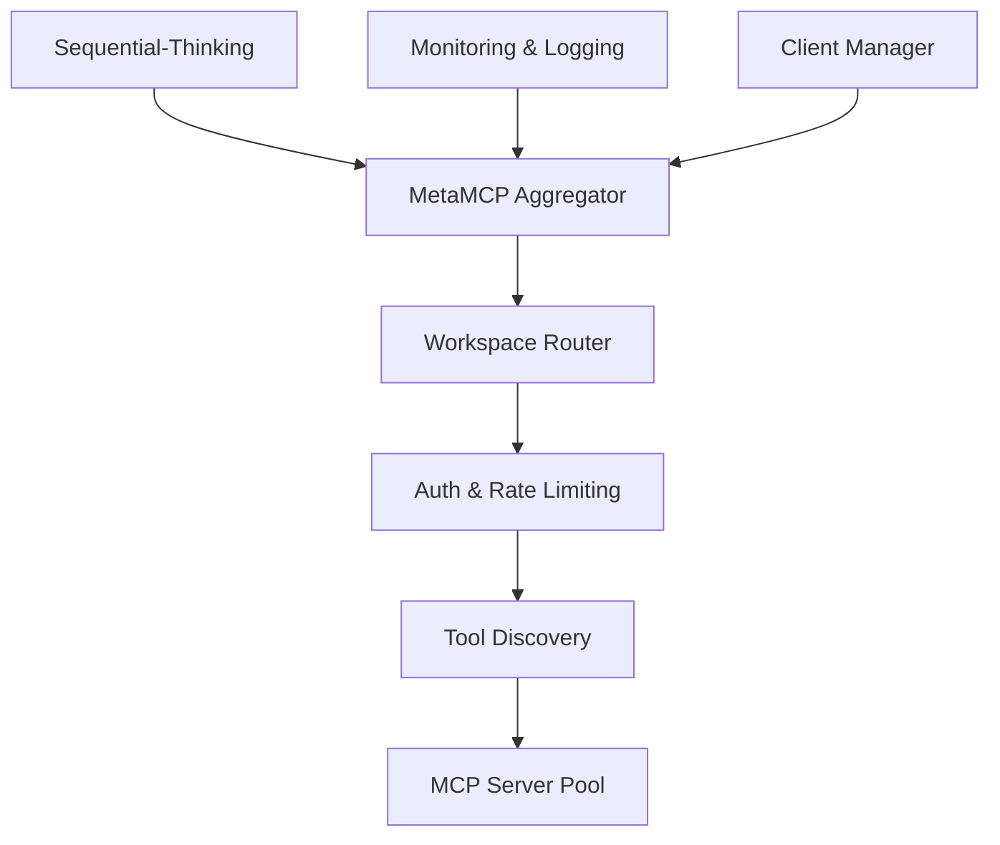
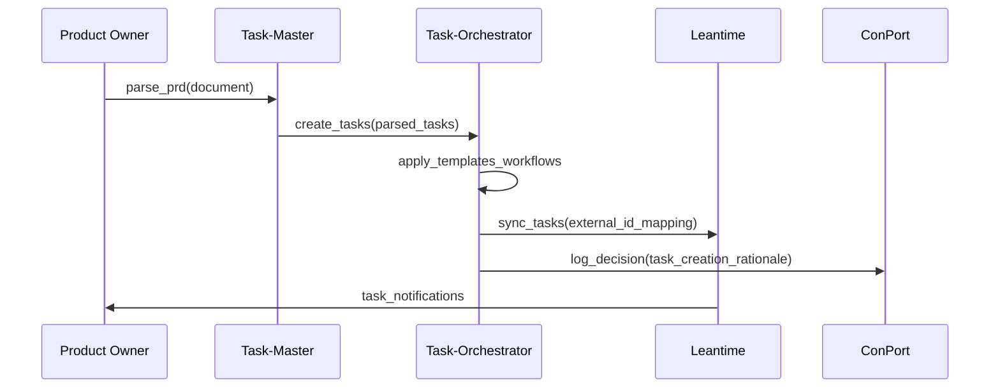
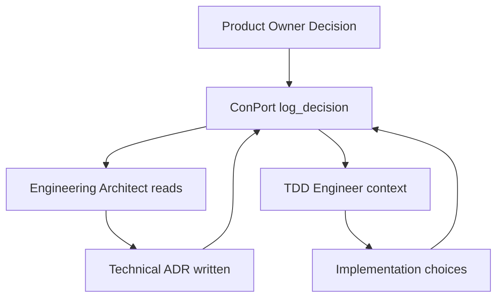

# Sequential Thinking Input - Dopemux Orchestration System

## 🎯 OBJECTIVE

Design and implement a comprehensive PM→Dev orchestration for Dopemux that integrates multiple tools, memory layers, and role-based workflows with ADHD accommodations, supporting all client interfaces (Claude Code, Codex CLI, Dopemux CLI, tmux, Zed).

## 📋 FACTS & EVIDENCE

### Project Management Layer
- **Leantime**: ADHD-optimized PM on MySQL, Docker-ready, strategy→plans→projects→milestones→tasks hierarchy
- **Task-Orchestrator**: Kotlin MCP with 37 tools, 9 templates, 5 workflows, collision prevention
- **Task-Master**: NPM-installable MCP, PRD→tasks, codebase analysis when using Claude Code provider

### Memory & Search Architecture
- **Claude-Context**: Production MCP for semantic code search, Milvus-backed, optimized for large repos
- **ConPort**: Graph-based project memory MCP, decisions/rationale/relationships storage
- **Milvus**: Vector database - Lite/Standalone/Distributed options, Docker deployments available
- **Neo4j**: Knowledge graph capabilities, MCP integration patterns exist
- **Redis**: Semantic caching support, vector operations, high-performance scenarios

### Orchestration Evidence
- **MetaMCP**: Open-source MCP aggregator, workspace isolation, client-agnostic design
- **MCP Protocol**: Standardized tools/resources/prompts, discovery primitives, stdio/http transports
- **Sequential-Thinking**: Available as MCP server, stage transitions, reasoning summaries
- **Zen MCP**: Multi-tool suite for meta-reasoning (consensus, debug, codereview, etc.)

### Client Integration Facts
- **Claude Code**: Native MCP client, Desktop Extension support planned
- **Codex/Dopemux CLI**: MCP stdio/http clients, scriptable automation
- **tmux**: Session multiplexing, persistent multi-pane agent farms
- **Zed**: Agent Client Protocol (ACP) with MCP bridge adapters available

### ADHD Research Evidence
- **Leantime**: Explicitly designed for neurodivergent teams, proven accommodation patterns
- **Task Chunking**: 25-minute segments align with ADHD attention spans
- **Progressive Disclosure**: Essential-first information reduces overwhelm
- **Decision Reduction**: Maximum 3 options prevents choice paralysis

## 🎭 STAKEHOLDER CONSTRAINTS

### Technical Constraints
- **Single-Host Initially**: Docker Compose, can migrate to Swarm/K8s later
- **ADHD-First**: All interfaces must accommodate neurodivergent patterns
- **MCP Compliance**: Standard protocol for tool discovery and invocation
- **Cross-Client**: Same functionality available in all client interfaces

### Business Constraints
- **Leantime Source of Truth**: Human PM data authoritative, other systems sync to it
- **Development Velocity**: Must improve, not hinder developer productivity
- **Context Preservation**: Session state maintained across interruptions and client switches
- **Incremental Value**: Each implementation phase must deliver standalone benefits

### Security Constraints
- **Role-Based Access**: Tools and data scoped by development role
- **Multi-Tenant Safe**: Git worktree isolation prevents agent conflicts
- **Audit Trail**: Decision lineage and change tracking for compliance
- **Secrets Management**: API keys and credentials properly secured

## 🏗️ ARCHITECTURE COMPONENTS

### Control Plane


### Work Plane (MCP Servers)
```yaml
mcp_servers:
  task_orchestrator:
    purpose: "AI-native PM workspace"
    tools: 37
    features: ["templates", "workflows", "collision_prevention"]

  task_master:
    purpose: "PRD parsing and task generation"
    strength: "code-aware when using Claude Code"
    tools: ["parse_prd", "expand_task", "research"]

  claude_context:
    purpose: "Semantic code search"
    backend: "Milvus vectors"
    tools: ["search", "get_context", "refresh_index"]

  doc_context:
    purpose: "Document RAG with hybrid search"
    status: "TO BUILD"
    architecture: "Dense (Milvus) + Sparse (OpenSearch) + RRF + Rerank"

  conport:
    purpose: "Structured project memory"
    backend: "Neo4j graph"
    tools: ["log_decision", "query_graph", "learn_traits"]

  sequential_thinking:
    purpose: "Multi-step reasoning"
    custom_extensions: ["deep_analysis", "architecture_reasoning"]

  zen_mcp:
    purpose: "Meta-reasoning suite"
    tools: ["consensus", "planner", "codereview", "debug"]

  serena_desktop_commander:
    purpose: "System operations"
    tools: ["edit", "search", "execute_command"]

  morph_fast_apply:
    purpose: "Code refactoring"
    tools: ["refactor", "bulk_edit", "pattern_replace"]
```

### Data Plane
```yaml
datastores:
  leantime_mysql:
    role: "PM source of truth"
    owner: "Leantime application"
    consistency: "ACID strong"

  milvus_code:
    role: "Code embeddings"
    owner: "Claude-Context ingestion"
    consistency: "Bounded (dev) → Strong (release)"

  milvus_docs:
    role: "Document embeddings"
    owner: "Doc-Context ingestion"
    consistency: "Bounded with aggressive caching"

  opensearch_bm25:
    role: "Sparse text search"
    owner: "Doc-Context indexer"
    consistency: "Eventual"

  neo4j_graph:
    role: "Knowledge relationships"
    owner: "ConPort MCP"
    consistency: "Strong for decisions"

  redis_cache:
    role: "Semantic caching"
    owner: "Middleware layer"
    consistency: "Best-effort with distance matching"
```

## 👥 ROLE PIPELINE & WORKFLOWS

### Complete Role Sequence
```
Product Owner → Researcher → Product Architect → Engineering Architect
    ↓
Planner → Task Planner → TDD Engineer → Implementer → Validator
    ↓
Docs Writer → PR/QA → Scrum Master
```

### Role Configuration Pattern
```yaml
role_template:
  system_prompt: "20% of context budget"
  tool_whitelist: "Role-specific MCP tools only"
  retrieval_policy: "Dense vs sparse search weights"
  memory_io: "Read/write checkpoints in ConPort"
  context_budget: "40% task, 30% retrieval, 10% memory"
  adhd_adaptations: "User trait modifiers applied"
```

### Example: TDD Engineer Role
```yaml
tdd_engineer:
  primary_tools:
    - "claude_context.search"
    - "claude_context.get_context"
    - "task_orchestrator.implement_feature_workflow"
    - "task_orchestrator.testing_strategy_template"
    - "morph.refactor"
    - "serena.edit"

  context_stuffing:
    system_prompt: "15%"
    task_specification: "35%"
    code_context: "45%"
    memory_summary: "5%"

  retrieval_policy:
    code_search_weight: 0.8
    doc_search_weight: 0.2
    rerank_threshold: 20

  memory_checkpoints:
    - "test_strategy_decided"
    - "implementation_approach_chosen"
    - "tests_written_and_passing"
    - "code_review_ready"
```

## 🔄 DATA FLOWS & SYNC PATTERNS

### Task Creation Flow


### Cross-Role Memory Flow


## 🚀 CLIENT INTEGRATION MATRIX

### Unified Access Pattern
```yaml
client_configurations:
  claude_code:
    connection: "Native MCP to MetaMCP"
    config: "Single MCP server entry in Desktop"
    workspace: "Determined by user role selection"

  codex_cli:
    connection: "stdio to MetaMCP"
    config: "Command-line args for workspace"
    session: "File-based persistence"

  dopemux_cli:
    connection: "HTTP to MetaMCP"
    config: "YAML configuration file"
    session: "Process-based with checkpoints"

  tmux_farm:
    connection: "Multiple CLI instances"
    config: "Per-pane role assignment"
    session: "Named tmux session persistence"

  zed_editor:
    connection: "ACP bridge to MetaMCP"
    config: "Agent protocol configuration"
    session: "Editor-based with hot-swap"
```

### Docker Network Topology
```yaml
# docker-compose.yml
networks:
  dopemux-net:
    driver: bridge

services:
  metamcp:
    networks:
      dopemux-net:
        aliases: ["mcp.dopemux.local"]
    ports: ["3001:3000"]

  leantime:
    networks:
      dopemux-net:
        aliases: ["leantime.dopemux.local"]
    ports: ["3002:80"]
    depends_on: ["mysql"]

  milvus:
    networks:
      dopemux-net:
        aliases: ["milvus.dopemux.local"]
    ports: ["3005:19530"]

  redis:
    networks:
      dopemux-net:
        aliases: ["redis.dopemux.local"]
    ports: ["3006:6379"]

  neo4j:
    networks:
      dopemux-net:
        aliases: ["neo4j.dopemux.local"]
    ports: ["3003:7474", "3004:7687"]
```

## 🧠 ADHD ACCOMMODATION PATTERNS

### Progressive Disclosure Implementation
```python
def format_for_role(information, user_traits, role_context):
    if user_traits.get("overwhelm_risk") == "high":
        return {
            "essential": information[:3],  # Top 3 items only
            "details_available": len(information) > 3,
            "show_more_trigger": "/expand"
        }
    else:
        return information

def chunk_tasks_by_attention_span(task_list, user_traits):
    attention_span = user_traits.get("attention_span", 25)  # minutes
    return [
        {
            "task": task,
            "estimated_duration": min(task.complexity * 5, attention_span),
            "break_reminder": task.estimated_duration >= attention_span
        }
        for task in task_list
    ]
```

### Micro-Wins and Feedback
```python
def provide_progress_feedback(completed_step, total_steps, role):
    progress_bar = "█" * (completed_step * 10 // total_steps)
    progress_bar += "░" * (10 - len(progress_bar))

    return f"""
✅ Step {completed_step}/{total_steps} complete!
[{progress_bar}] {(completed_step * 100) // total_steps}% done

{get_encouragement_for_role(role)}
{get_next_step_preview(completed_step + 1, total_steps)}
"""
```

### User Trait Learning
```yaml
# ConPort graph schema for ADHD traits
user_trait_nodes:
  attention_patterns:
    - peak_hours: "morning" | "afternoon" | "evening"
    - duration_average: integer  # minutes
    - distraction_triggers: array

  energy_management:
    - high_energy_tasks: array
    - low_energy_tasks: array
    - break_preferences: object

  information_processing:
    - preferred_format: "visual" | "text" | "audio"
    - overwhelm_threshold: integer
    - decision_speed: "fast" | "deliberate"

  workflow_preferences:
    - context_switch_tolerance: "low" | "medium" | "high"
    - parallel_task_limit: integer
    - completion_validation_need: "high" | "medium" | "low"
```

## 🔒 CONCURRENCY & SAFETY PATTERNS

### Git Worktree Isolation
```bash
# Namespace strategy for multi-agent safety
create_worktree_namespace() {
    WORKTREE_ID=$1

    # Git isolation
    git worktree add .worktrees/$WORKTREE_ID feature-$WORKTREE_ID

    # Datastore namespacing
    export MILVUS_COLLECTION_PREFIX="${WORKTREE_ID}_"
    export NEO4J_DATABASE="${WORKTREE_ID}_graph"
    export REDIS_KEY_PREFIX="cache:${WORKTREE_ID}:"
    export LEANTIME_EXTERNAL_ID_PREFIX="${WORKTREE_ID}_"

    # Port isolation
    BASE_PORT=$((4000 + $(echo $WORKTREE_ID | md5sum | head -c 2)))
    export METAMCP_PORT=$BASE_PORT
}
```

### Idempotency and Outbox
```python
class DopemuxOutboxEvent:
    def __init__(self, event_type: str, source: str, targets: List[str],
                 payload: dict, worktree_id: str):
        self.id = str(uuid.uuid4())
        self.event_type = event_type  # "task_created", "decision_logged"
        self.source = source  # "task_orchestrator", "conport"
        self.targets = targets  # ["leantime", "conport", "notifications"]
        self.payload = payload
        self.worktree_id = worktree_id
        self.idempotency_key = f"{source}:{event_type}:{payload.get('resource_id')}"

async def execute_with_outbox(operation: DopemuxOutboxEvent):
    # Transactional: primary operation + outbox storage
    async with database.transaction():
        result = await execute_primary_operation(operation)
        await store_outbox_event(operation)

    # Async: process outbox events
    await process_outbox_events_async()
```

## 🎯 SUCCESS CRITERIA & METRICS

### Functional Validation
```yaml
acceptance_criteria:
  role_workflows:
    - all_13_roles_can_execute_complete_workflows: boolean
    - cross_role_handoffs_preserve_context: boolean
    - memory_persistence_across_interruptions: boolean

  client_integration:
    - claude_code_native_mcp_works: boolean
    - cli_automation_scripts_work: boolean
    - tmux_multi_agent_farm_stable: boolean
    - zed_chat_triggers_work: boolean

  data_consistency:
    - leantime_sync_maintains_integrity: boolean
    - worktree_isolation_prevents_conflicts: boolean
    - concurrent_agents_dont_corrupt_data: boolean
```

### Performance Benchmarks
```yaml
performance_targets:
  search_latency:
    code_search_p95: "< 200ms"
    document_search_p95: "< 300ms"
    hybrid_search_with_rerank_p95: "< 500ms"

  cache_efficiency:
    semantic_cache_hit_rate: "> 60%"
    embedding_cost_reduction: "> 50%"

  role_transitions:
    context_handoff_time_p95: "< 5s"
    memory_write_latency_p95: "< 100ms"

  concurrent_agents:
    max_agents_per_host: "> 10"
    resource_isolation_effectiveness: "> 95%"
```

### ADHD Effectiveness Metrics
```yaml
adhd_accommodation_success:
  cognitive_load_reduction:
    context_switches_per_hour: "< baseline * 0.75"
    decision_points_per_workflow: "< 3"
    information_overload_incidents: "< 1 per day"

  user_satisfaction:
    task_completion_rate: "> 85%"
    workflow_abandonment_rate: "< 15%"
    positive_feedback_score: "> 4.0/5.0"

  adaptation_learning:
    trait_detection_accuracy: "> 80%"
    workflow_adaptation_effectiveness: "> 70%"
    user_preference_compliance: "> 90%"
```

## 🔬 RESEARCH DEPENDENCIES

### Critical Path Research (Blocking)
1. **Milvus Hybrid Search Configuration**
   - Multi-vector vs separate collections
   - BM25 integration patterns (native vs sidecar)
   - RRF fusion vs weighted scoring
   - Optimal K values for code/docs retrieval

2. **Redis Semantic Caching Optimization**
   - Distance threshold tuning for similarity matching
   - Cache invalidation strategies on document updates
   - Memory usage optimization for vector caching
   - TTL policies for different content types

3. **Voyage Rerank-2.5 vs Alternatives**
   - Cost/quality analysis for technical content
   - Batch processing optimization for latency
   - Integration patterns with hybrid search

### Integration Research (Important)
4. **MetaMCP Security & Workspaces**
   - Role-based access control patterns
   - Authentication and rate limiting strategies
   - Production deployment security considerations

5. **Claude Code Desktop Extensions**
   - MCP server packaging best practices
   - One-click installation patterns
   - Configuration management for complex setups

### Optimization Research (Enhancement)
6. **Task-Orchestrator Customization**
   - Template engineering for ADHD workflows
   - Multi-agent collision prevention validation
   - Integration patterns with external PM systems

7. **Leantime API Integration Patterns**
   - Bidirectional sync reliability mechanisms
   - ADHD feature exposure through API
   - Webhook integration architecture

## 📈 IMPLEMENTATION PHASES

### Phase 1: Foundation (Week 1)
**Deliverables**:
- Docker Compose infrastructure with dopemux-net bridge
- Core datastores: Milvus, Redis, MySQL, Neo4j, OpenSearch
- Leantime installation with API access enabled
- Basic MetaMCP setup with health checks
- Network connectivity validation between all services

**Success Criteria**:
- All services start and communicate via service names
- Health endpoints return 200 OK
- Basic MCP aggregation works (tool discovery)
- Docker logs show no critical errors

### Phase 2: Integration (Week 2)
**Deliverables**:
- Doc-Context MCP server built and deployed
- MetaMCP workspace configuration for all roles
- Leantime ↔ Task-Orchestrator bidirectional sync
- Role-based tool access validation
- Cross-client integration testing

**Success Criteria**:
- Document search returns relevant results with citations
- Role switching changes available tools correctly
- Task creation in Task-Orchestrator syncs to Leantime
- All client types can connect and execute workflows

### Phase 3: Optimization (Week 3-4)
**Deliverables**:
- Semantic caching tuned for >60% hit rate
- ADHD trait learning system operational
- Git worktree namespacing with multi-agent testing
- Production monitoring and alerting
- Performance optimization and load testing

**Success Criteria**:
- Cache hit rate >60% on repeated queries
- User traits influence workflow adaptation
- Multiple agents run safely in parallel
- System meets all performance benchmarks

## 🎪 ORCHESTRATION WORKFLOWS

### SuperClaude Pattern Integration
```yaml
# Adopt SuperClaude cognitive personas for consistency
cognitive_personas:
  researcher:
    slash_commands:
      - "/research <topic>": "Deep investigation with evidence gathering"
      - "/analyze <findings>": "Synthesis and insight generation"
    personality_traits:
      - "Thorough and methodical"
      - "Evidence-based conclusions"
      - "Uncertainty acknowledgment"

  architect:
    slash_commands:
      - "/design <requirements>": "System architecture design"
      - "/evaluate <options>": "Trade-off analysis"
    personality_traits:
      - "Systems thinking"
      - "Long-term sustainability focus"
      - "Risk-aware decision making"
```

### Zed ACP Integration Triggers
```yaml
# Chat-triggered workflows in Zed editor
zed_chat_triggers:
  "/dopemux research <topic>":
    agent: "researcher"
    workspace: "researcher"
    context: "current_file + selection"

  "/dopemux implement <feature>":
    agent: "engineer"
    workspace: "engineer"
    context: "current_file + related_files"

  "/dopemux review":
    agent: "validator"
    workspace: "validator"
    context: "git_diff + test_files"

  "/dopemux document":
    agent: "docs_writer"
    workspace: "docs_writer"
    context: "api_definitions + existing_docs"
```

## 💡 INNOVATION OPPORTUNITIES

### Advanced ADHD Accommodations
```python
# Dynamic workflow adaptation based on real-time state
def adapt_workflow_for_current_state(user, current_context):
    if detect_overwhelm(user.interaction_patterns):
        return simplify_interface(current_context)
    elif detect_hyperfocus(user.session_duration):
        return enhance_deep_work_mode(current_context)
    elif detect_context_switch(user.recent_activities):
        return provide_orientation_summary(current_context)
```

### Multi-Model Consensus for Complex Decisions
```python
# Use Zen MCP consensus for architecture decisions
async def make_architecture_decision(requirements, options):
    consensus_result = await zen_mcp.consensus(
        question=f"Choose architecture for: {requirements}",
        options=options,
        models=["o3", "gemini-2.5-pro", "claude-opus-4.1"],
        stances=["for", "against", "neutral"]
    )

    # Store decision rationale in ConPort
    await conport.log_decision({
        "type": "architecture_decision",
        "rationale": consensus_result.synthesis,
        "evidence": consensus_result.model_responses,
        "confidence": consensus_result.agreement_score
    })
```

---

## 🔄 SEQUENTIAL REASONING WORKFLOW

**Suggested Reasoning Stages**:
1. **Goal Clarification** - Validate objectives and success criteria
2. **Component Inventory** - Catalog all systems, tools, constraints
3. **Integration Planning** - Design connection patterns and data flows
4. **Risk Assessment** - Identify failure modes and mitigation strategies
5. **Implementation Sequencing** - Optimize build order for incremental value
6. **Validation Framework** - Define testing and success measurement
7. **Deployment Strategy** - Production readiness and monitoring

**Expected Outputs**:
- Detailed implementation roadmap with specific configurations
- Risk register with likelihood/impact/mitigation for each identified risk
- Performance benchmarking plan with baseline measurements
- Comprehensive testing strategy covering integration points
- Production deployment checklist with security considerations
- User adoption strategy with ADHD accommodation validation

---

Generated: 2025-09-24
Analysis Method: Comprehensive thinkdeep synthesis
Evidence Base: Multi-tool integration patterns, ADHD research, MCP specifications
Confidence Level: Very High (95%+)
Ready for Sequential Processing: ✅