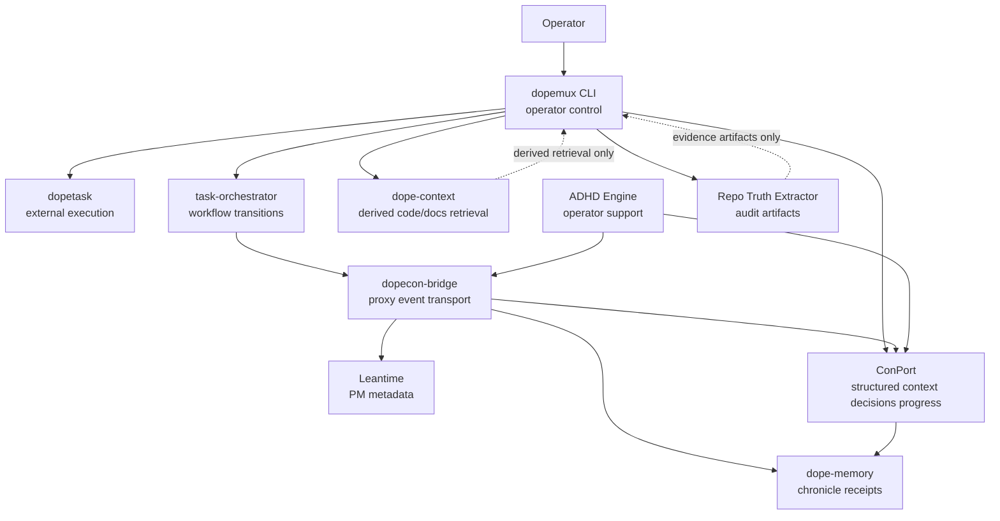

# System Map

This map shows the current repo-grounded system relationships. It is a
documentation map, not a runtime topology proof. Runtime code, compose wiring,
tests, and active entrypoints remain stronger than this diagram.

## Authority Reading

- Solid arrows show observed operational or integration paths.
- Dotted arrows mark evidence or retrieval outputs that must not become source
  truth.
- dopecon-bridge appears in the middle because many systems route through it,
  but that does not make it the canonical writer for the domains it touches.
- ADHD Engine participates in the operator-support plane and can project data
  through integrations, but it does not own PM or memory truth.

## Key Boundaries

| System | Owns | Must not own |
| --- | --- | --- |
| dopemux | Operator startup, routing, CLI coordination | PM truth, memory truth, retrieval truth, external execution after handoff |
| dopetask | Execution after wrapper handoff | PM metadata, workflow legality, memory, retrieval |
| task-orchestrator | Workflow transitions, queue, blockers | Passive PM metadata, ConPort decisions/progress, dope-memory chronicle |
| Leantime | Passive PM metadata and project/ticket snapshots | Workflow legality and decision/progress context |
| ConPort | Structured decisions, progress, context, custom data | All PM, chronicle history, dope-context retrieval |
| dope-memory | Chronicle receipts and historical ledger | Current PM status, workflow legality |
| dope-context | Derived code/docs retrieval | Source truth for the files it retrieves |
| dopecon-bridge | Proxy, adapter, compatibility routing, event transport | Canonical task, workflow, PM, decision, progress, memory, retrieval |
| ADHD Engine | Operator support and cognitive-state surfaces | PM truth, ConPort authority, dope-memory authority |
| Repo Truth Extractor | Repo audit/extraction artifacts | Runtime truth or PM/memory/retrieval authority |

## Unresolved Areas

- `UNKNOWN`: one canonical agent runtime.
- `UNKNOWN`: exact persistence model for some ADHD and working-memory-assistant
  support surfaces.
- `NEEDS_REPO_VERIFICATION`: live compose startup and service health for any
  local profile not explicitly exercised.
