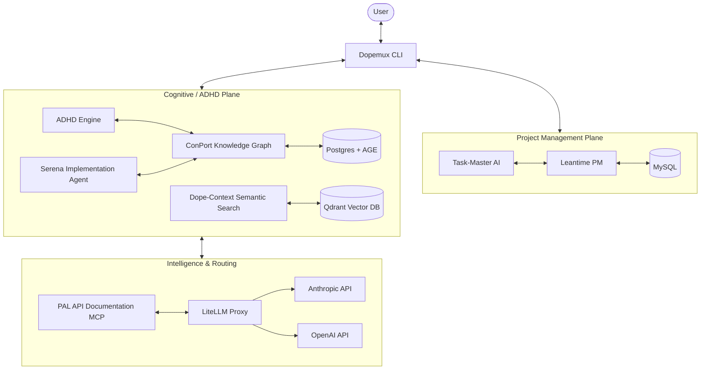
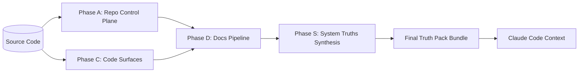

# Dopemux System Architecture Maps

This document provides high-level and detailed architectural views of the Dopemux ecosystem.

## 1. High-Level Modular Overview (The "Planes")

Dopemux operates on a **Two-Plane Architecture**: the **Project Management (PM) Plane** and the **Cognitive (ADHD) Plane**.



---

## 2. Extraction & Repo-Truth Flow (The "Intelligence Tree")

The Repo-Truth stack transforms raw source code into structured "Ground Truth" for LLMs.



---

## 3. Modular Container Deployment

Dopemux uses a fragmented deployment strategy to optimize for machine resources.

```mermaid
graph TD
    subgraph Core [Core Stack - 8GB]
        Postgres
        Redis
        Qdrant
        ConPort
        Orchestrator
    end

    subgraph Research [Research Stack - +2GB]
        GPT-Researcher
        Exa
    end

    subgraph Full [Full Stack - +6GB]
        Leantime
        LiteLLM
        Desktop-Commander
        Webhooks
    end

    Installer -->|Choice 1| Core
    Installer -->|Choice 2| Core + Research
    Installer -->|Choice 3| Core + Research + Full
```
