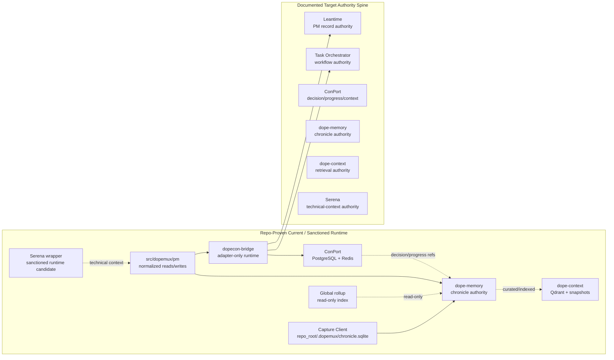

# Memory And Persistence Deep Dive

## How To Read This Document

This document separates four claim classes and does not flatten them into one story:

- **Repo-proven current**: local runtime code, runtime-alignment docs, and truth-pack outputs derived from inspected code.
- **Documented target**: active ADRs, PM-plane contracts, and current specs that define the intended authority model.
- **Historical claim**: older design docs, earlier subsystem specs, and local candidate implementations that describe previous or unrealized directions.
- **Drift / unknown**: contradictions, duplicate surfaces, missing packet artifacts, or runtime gaps where the repo does not prove a clean answer.

Authority order for conflicts in this synthesis:

1. runtime code and runtime-alignment docs
1. truth packs generated from inspected runtime/code
1. active ADRs and PM-plane contracts
1. active subsystem docs/specs
1. historical design docs

Conflict rule:

- If two layers disagree, the higher-authority layer wins for **current reality**.
- Lower-authority claims are preserved as **target**, **historical**, or **drift**, not rewritten as if they were current.

## Executive Synthesis

The current Dopemux memory and persistence story is no longer a single “memory system.” The repo’s documented target architecture and the highest-confidence runtime evidence converge on a split model: **Leantime** owns PM operational records, **Task Orchestrator** owns workflow law, **ConPort** owns decisions/progress/durable context, **dope-memory** owns chronological chronicle memory, **dope-context** owns retrieval/search artifacts, and **Serena** is sanctioned only as a technical-context plane. The largest remaining risks are historical overlap and shadow surfaces: WMA and DDDPG still exist as legacy/local candidates, `dopecon-bridge` still carries traces of former shadow authority, `conport-kg` remains quarantined, and several older PM/memory docs still describe stronger guarantees than current code proves.

## Plane And Authority Map

| Layer / system | Primary object class | Canonicality | Storage | Transport / callable seam | Status |
| --- | --- | --- | --- | --- | --- |
| Leantime | PM operational records: projects, work items, sprints, milestones | **Documented target canonical** | Leantime app DB (not independently revalidated here) | JSON-RPC, plugin seams, bridge proxy paths | Repo contains active clients/contracts, but this synthesis did not re-prove live runtime behavior |
| Task Orchestrator | Workflow law: blockers, legality, next-action, progression | **Documented target canonical** | Service-owned workflow state, backend not re-established here | HTTP APIs, PM adapters | PM-plane docs treat it as workflow authority; project-scoped read surfaces are wired, transition binding gap remains documented |
| ConPort | Decisions, progress, durable structured context | **Repo-proven current** and **documented target canonical** | PostgreSQL primary, Redis cache | REST `/api/*` canonical; FastMCP wrappers; JSON-RPC compatibility | Active authority candidate, but some exclusivity and append-only claims remain aspirational |
| dope-memory | Chronicle memory: raw events, curated work log, recap/replay/reflection/trajectory | **Repo-proven current** and **documented target canonical** | SQLite canonical ledger, optional PostgreSQL mirror, Redis Streams transport | FastAPI HTTP `/tools/*`; no native MCP framing | Active runtime lives inside `services/working-memory-assistant/` |
| dope-context | Semantic retrieval over code/docs/artifacts | **Repo-proven current** and **documented target canonical** | Qdrant collections plus `~/.dope-context/` snapshots and metrics | FastMCP tools over stdio/HTTP/SSE/streamable-http | Active search plane with explicit provenance boundaries |
| Serena | Technical and code context | **Documented target canonical** | Sanctioned runtime is wrapper; local candidate adds PostgreSQL + Redis | Wrapper SSE/info runtime; local candidate stdio/HTTP | Active PM-plane contract is narrow and read-oriented; local `services/serena/` is not sanctioned runtime |
| DDDPG | Historical decision graph / storage experiment | **Historical / non-canonical** | SQLite backend implemented; Postgres AGE design only | Library-level interfaces, no repo-proven active runtime | Remains useful as historical design context, not current authority |
| WMA | Interrupt-recovery snapshots and context restoration | **Historical / non-canonical** | PostgreSQL + Redis in design and local service | FastAPI on port `8096` | Co-located legacy subsystem, not sanctioned memory authority |
| dopecon-bridge | Adapter, router, translator, event transport | **Explicitly non-canonical** | Transitional bridge-local SQL tables plus Redis/event transport | FastAPI on port `3016` | Active runtime is narrower than older docs; local tables are transitional only |
| conport-kg | Graph projection / query helper | **Non-canonical / quarantined** | Historical AGE-backed graph design | No repo-proven current callable surface | Not runtime-real in the current workspace |
| Capture client | Deterministic raw capture writer into the chronicle ledger | Writer to canonical chronicle ledger, not a separate authority plane | `repo_root/.dopemux/chronicle.sqlite` | plugin / cli / mcp / auto capture modes | Repo-proven current |
| Global rollup | Cross-project pointer index over project chronicle ledgers | Derived, read-only | `~/.dopemux/global_index.sqlite` | CLI / library helper | Repo-proven current, explicitly non-authoritative |
| PM plane package | Normalized cross-plane read/write contracts | Boundary layer, not canonical storage | In-memory store plus external adapters | Python package surfaces in `src/dopemux/pm/` | Repo-proven current, but overlapping API surfaces still need reconciliation |

## Persistence Matrix

| Store / artifact | Writer | Readers / consumers | Physical path / backend | Durability | Classification | Notes |
| --- | --- | --- | --- | --- | --- | --- |
| Chronicle raw ledger | Capture client, dope-memory ingestion | dope-memory promotion/search logic | `repo_root/.dopemux/chronicle.sqlite` table `raw_activity_events` | Durable with short retention | **Active canonical raw chronicle** | ADR-213 converges plugin/cli/mcp capture on one ledger |
| Chronicle curated ledger | dope-memory `ChronicleStore`, PM chronicle adapters | dope-memory search/recap/reflection, PM chronicle reads, global rollup | `repo_root/.dopemux/chronicle.sqlite` table `work_log_entries` | Durable | **Active canonical chronicle** | Core temporal memory surface |
| Chronicle reflection cards | dope-memory reflection generation | dope-memory recap/reflection surfaces | `repo_root/.dopemux/chronicle.sqlite` table `reflection_cards` | Durable | **Active derived** | Derived from curated chronicle, not a separate authority |
| Chronicle trajectory state | dope-memory trajectory manager | dope-memory ranking/search | `repo_root/.dopemux/chronicle.sqlite` table `trajectory_state` | Durable | **Active derived** | Search/ranking aid, not primary truth |
| dope-memory Postgres mirror | dope-memory mirror worker | Mirror consumers only | PostgreSQL mirror schema from `postgres_mirror.sql` | Durable | **Mirror / non-canonical** | One-way from SQLite when enabled |
| Global rollup index | `GlobalRollupIndexer` | cross-project lookup tools | `~/.dopemux/global_index.sqlite` | Durable | **Derived / read-only** | Stores project registry and promoted pointers only |
| ConPort primary store | ConPort REST/JSON-RPC/FastMCP-backed server | PM-plane context/decision/progress clients, bridge proxies, agents | PostgreSQL tables plus migrations | Durable | **Active canonical for its object classes** | Decisions are effectively append-oriented via API, but progress/context remain mutable |
| ConPort cache | ConPort server | ConPort server only | Redis | Ephemeral | **Cache** | Not durable truth |
| dope-context vector indexes | dope-context indexing pipelines | dope-context search/retrieval surfaces | Qdrant collections `code_{hash}` and `docs_{hash}` | Durable | **Active canonical retrieval substrate** | Retrieval authority only, not source truth |
| dope-context local state | dope-context indexing/autonomous tooling | dope-context search and sync operations | `~/.dope-context/snapshots/`, `search_metrics.json`, BM25 cache | Durable | **Active derived / operational** | Supports sync, BM25, autonomous indexing, metrics |
| Serena sanctioned runtime store | upstream wrapper runtime | sanctioned Serena runtime | wrapper around upstream Serena; storage not independently established here | Unknown from this synthesis | **Unknown / externalized** | Deployment alignment docs narrow contract without re-proving internal persistence |
| Serena local candidate store | local `services/serena/` implementation | local candidate MCP/HTTP services | PostgreSQL intelligence DB plus Redis navigation cache | Durable + ephemeral | **Non-sanctioned local candidate** | Rich local code exists, but compose does not sanction it as active runtime |
| WMA snapshot store | local `main.py` WMA service | WMA recovery flows | PostgreSQL + Redis per local README/design docs | Durable + ephemeral | **Historical / local candidate** | Not the sanctioned memory authority |
| DDDPG SQLite backend | `SQLiteBackend` | local DDDPG query/storage code | `~/.dddpg/cache/{workspace}/{instance}/decisions.db` | Durable | **Historical / local candidate** | Implemented backend, but not current authority |
| DDDPG Postgres AGE design | historical design only | planned DDDPG hybrid architecture | PostgreSQL AGE graph | Intended durable | **Historical planned** | Design-phase source of truth, not repo-proven active runtime |
| dopecon-bridge local tables | bridge runtime and legacy paths | bridge-local endpoints | local SQL tables such as `TaskRecord`, `DdgDecision`, `DdgProgress` | Durable | **Transitional / non-canonical** | Explicitly not PM-plane truth |
| PM in-memory store | `InMemoryPMTaskStore` | unit-only PM canonical model package | process memory | Ephemeral | **Active local boundary helper** | Unit-tested canonical model, not durable backend |

## Historical Evolution

| Period / decision point | What the repo said or built | What changed |
| --- | --- | --- |
| 2025 WMA design phase | WMA was designed as an ADHD interrupt-recovery service with PostgreSQL + Redis snapshot storage and rich recovery interfaces | Later dope-memory work reused the same subtree but narrowed authority toward chronicle memory rather than general recovery truth |
| 2025 DDDPG design phase | DDDPG was framed as a decision-driven planning graph with a planned hybrid Postgres AGE + SQLite cache model | The newer Memory Trinity and PM-plane ADRs moved canonical decision/progress authority to ConPort instead of DDDPG |
| 2026-02 dope-memory v1 spec | dope-memory spec formalized SQLite canonical chronicle, Postgres mirror, promotion/redaction, and dual-capture convergence | Runtime code now broadly matches this direction, but legacy WMA runtime and shadow MCP surfaces remain in the same subtree |
| 2026-02 ADR-213 | Accepted dual-capture canonical ledger: all capture modes write to one per-project chronicle ledger and global rollup is read-only | `src/dopemux/memory/capture_client.py` and `global_rollup.py` implement this as the repo-proven capture spine |
| 2026-03 Memory Trinity ADR set | ConPort, dope-memory, dope-context, Serena, Task Orchestrator, and Leantime were split into explicit planes and authorities | This is the current target architecture that PM-plane docs and adapters are aligning toward |
| 2026-03 runtime-alignment phase | Serena wrapper was sanctioned over the richer local Serena tree; conport-kg was quarantined; dopecon-bridge was narrowed to adapter-only | Current repo reality now mixes active target alignment with substantial historical residue and drift |

## WMA

### Historical claim

- WMA was designed as a full interrupt-recovery subsystem with snapshot capture, progressive disclosure recovery, ADHD-state adaptation, and PostgreSQL + Redis persistence.
- The architectural and interface docs describe WMA as the primary working-memory system rather than a legacy/local candidate.
- Sources: `docs/04-explanation/architecture/working-memory-assistant.md`, `docs/04-explanation/architecture/working-memory-interfaces.md`, `services/working-memory-assistant/README.md`.

### Target / planned

- The current repo does **not** elevate WMA to canonical memory authority in the active Memory Trinity ADR set.
- WMA’s remaining value is historical: it documents earlier goals for recovery UX, snapshot scope, and ADHD-aware restoration.
- Sources: `docs/90-adr/adr-memory-trinity-authority-and-interaction-model.md`, `docs/90-adr/adr-dope-memory-as-chronicle-memory-authority.md`.

### Repo-proven current

- `services/working-memory-assistant/main.py` still exists as a local FastAPI service on port `8096`, with PostgreSQL + Redis configuration, JWT/auth code, and snapshot/recovery models.
- The subtree still contains WMA-specific modules such as `wma_core.py`, `cache_manager.py`, `trigger_manager.py`, and `predictive_context_restoration.py`.
- Sources: `services/working-memory-assistant/main.py`, `services/working-memory-assistant/README.md`.

### Drift / open questions

- The same directory now houses both the active dope-memory runtime and the older WMA runtime, which is the largest source of naming and authority confusion in the repo.
- `services/dope-memory/mcp_stdio_adapter.py` still targets WMA’s `8096` port instead of dope-memory’s `3020` port, which materially reinforces the overlap.
- Authority winner for current memory-plane claims: **dope-memory runtime + Memory Trinity ADRs**, not WMA docs.
- Sources: `repo-truth-pack/dope-memory/DRIFT_REPORT.md`, `services/dope-memory/mcp_stdio_adapter.py`, `docs/90-adr/adr-dope-memory-as-chronicle-memory-authority.md`.

## dope-memory

### Historical claim

- The dope-memory spec positioned the service as the “temporal spine” beside DopeQuery/ConPort and DopeContext, with SQLite canonical storage, Postgres mirror, EventBus ingestion, and deterministic promotion.
- Earlier deep dives and specs also described dope-memory as the authoritative successor to ad-hoc memory and partially to WMA’s broader working-memory ambition.
- Sources: `docs/03-reference/spec/dope-memory/v1/readme.md`, `docs/03-reference/spec/dope-memory/v1/01-architecture.md`, `docs/04-explanation/technical-deep-dives/dope-memory-deep-dive-2.md`.

### Target / planned

- The active ADR set makes dope-memory canonical for chronicle memory only: chronological work log, replay, recap, reflections, trajectory, and linked temporal provenance.
- dope-memory is explicitly not canonical for PM entities, workflow legality, or canonical decision/progress records.
- Sources: `docs/90-adr/adr-dope-memory-as-chronicle-memory-authority.md`, `docs/90-adr/adr-memory-trinity-authority-and-interaction-model.md`, `docs/90-adr/adr-pm-plane-authority-boundaries.md`.

### Repo-proven current

- The active runtime entrypoint is `services/working-memory-assistant/dope_memory_main.py`, exposing HTTP tool routes on port `3020` and using `ChronicleStore` backed by the canonical ledger path resolver.
- `chronicle/schema.sql` defines the canonical SQLite tables for raw events, curated work log entries, issue links, reflection cards, and trajectory state.
- Truth-pack evidence confirms the active tool surface is the 10-tool HTTP server in `dope_memory_main.py`, with SQLite canonical ledger, optional Redis Streams intake, and optional Postgres mirror.
- Sources: `services/working-memory-assistant/dope_memory_main.py`, `services/working-memory-assistant/chronicle/schema.sql`, `repo-truth-pack/dope-memory/EXECUTIVE_SUMMARY.md`, `repo-truth-pack/dope-memory/ARCHITECTURE_AND_INTENDED_USES.md`.

### Drift / open questions

- The subtree contains a shadow `mcp/server.py` surface with 7 tools while the runtime entrypoint exposes 10; `GET /` still reports only 7 tools.
- `services/dope-memory/mcp_stdio_adapter.py` points at WMA’s `8096` port and only proxies 3 tools.
- The repo includes a committed `chronicle/chronicle.db` artifact inside the service tree even though ADR-213 and `canonical_ledger.py` center authority on `repo_root/.dopemux/chronicle.sqlite`.
- Authority winner for current runtime shape: **`dope_memory_main.py` and the dope-memory truth pack**, not the shadow MCP module or legacy WMA wiring.
- Sources: `repo-truth-pack/dope-memory/DRIFT_REPORT.md`, `services/dope-memory/mcp_stdio_adapter.py`, `services/working-memory-assistant/canonical_ledger.py`.

## DDDPG

### Historical claim

- DDDPG was documented as a decision-driven knowledge and planning graph with a hybrid Postgres AGE + SQLite cache model and strong multi-instance support.
- Historical analysis docs describe it as ready to build into a graph-centric source of truth for decisions and related workflow intelligence.
- Sources: `docs/03-reference/systems/dddpg/storage-design.md`, `services/dddpg/DEEP_ANALYSIS_CURRENT_STATE.md`, `services/dddpg/ANALYSIS_INDEX_OLD.md`.

### Target / planned

- Historical DDDPG design targeted PostgreSQL AGE as the source of truth and SQLite as a fast per-instance cache, with EventBus synchronization between them.
- In today’s documented target architecture, that role has been superseded by ConPort for decisions/progress/context and by Task Orchestrator/Leantime for PM and workflow truth.
- Sources: `docs/03-reference/systems/dddpg/storage-design.md`, `docs/90-adr/adr-conport-as-decision-progress-and-context-authority.md`, `docs/90-adr/adr-pm-plane-authority-boundaries.md`.

### Repo-proven current

- The repo still contains an implemented storage abstraction and `SQLiteBackend` under `services/dddpg/storage/`, plus query and KG-integration scaffolding.
- The implemented backend is local SQLite with migrations and FTS-style search support; no repo-proven active DDDPG runtime or current deployment wiring was established in this synthesis.
- Sources: `services/dddpg/storage/interface.py`, `services/dddpg/storage/sqlite_backend.py`, `services/dddpg/DEEP_ANALYSIS_CURRENT_STATE.md`.

### Drift / open questions

- Historical docs overstate readiness and strategic centrality relative to the current Memory Trinity and PM-plane ADR set.
- The planned Postgres AGE source-of-truth design is still design-phase history, not the current authority model.
- Authority winner for current decision/progress truth: **ConPort**, not DDDPG.
- Sources: `docs/90-adr/adr-conport-as-decision-progress-and-context-authority.md`, `docs/90-adr/adr-memory-trinity-authority-and-interaction-model.md`, `services/dddpg/ANALYSIS_INDEX_OLD.md`.

## ConPort

### Historical claim

- Older PM and memory docs often described ConPort as the sole, append-only authority for decisions, progress, task provenance, and memory-like state.
- Earlier bridge and PM material also treated the knowledge graph as the center of both PM and cognitive coordination.
- Sources: `docs/03-reference/planes/pm/dopemux/02-memory-and-state.md`, `docs/03-reference/systems/dopecon-bridge/readme.md`.

### Target / planned

- The active ADR set makes ConPort canonical for decisions, progress, and durable structured project context only.
- The preferred sanctioned PM-plane integration surface is REST `/api/*`, with FastMCP as a wrapper over the same logical contract and JSON-RPC remaining compatibility-only.
- Sources: `docs/90-adr/adr-conport-as-decision-progress-and-context-authority.md`, `docs/90-adr/adr-memory-trinity-authority-and-interaction-model.md`, `docs/03-reference/systems/conport/preferred-canonical-surface.md`.

### Repo-proven current

- ConPort truth-pack evidence shows a PostgreSQL + Redis system with REST, FastMCP, and JSON-RPC surfaces, plus decision/progress/context tables and event publishing.
- The repo treats REST as the broadest and preferred operational contract, while surface-equivalence docs record wrapper parity and known gaps.
- Sources: `repo-truth-pack/conport/EXECUTIVE_SUMMARY.md`, `repo-truth-pack/conport/ARCHITECTURE_AND_INTENDED_USES.md`, `docs/03-reference/systems/conport/surface-equivalence-and-drift.md`.

### Drift / open questions

- Truth-pack analysis explicitly shows that sole-authority and append-only claims are not fully enforced: progress and context remain mutable, and custom data can be deleted.
- Tool surfaces still drift: JSON-RPC discovery gaps, historical wrapper payload mismatches, and admin methods that are callable but not sanctioned for PM-plane use.
- Authority winner for current reality: **ConPort is the intended and strongest decision/progress/context authority, but not all invariants are enforced in runtime code**.
- Sources: `repo-truth-pack/conport/DRIFT_REPORT.md`, `docs/03-reference/systems/conport/surface-equivalence-and-drift.md`.

## dope-context

### Historical claim

- Earlier dope-memory and architecture docs described DopeContext as semantic archival retrieval alongside the other memory systems.
- It was treated as the search/retrieval plane, but sometimes with broader aspirational multi-index language than current code supports.
- Sources: `docs/03-reference/spec/dope-memory/v1/readme.md`, `services/dope-context/README.md`.

### Target / planned

- The active ADR set makes dope-context canonical for retrieval indexes, ranking, and search-plane outputs only.
- It may index ConPort or dope-memory material with provenance, but it may not become canonical for decision, chronicle, PM, or workflow truth.
- Sources: `docs/90-adr/adr-dope-context-as-search-and-retrieval-plane.md`, `docs/90-adr/adr-memory-trinity-authority-and-interaction-model.md`.

### Repo-proven current

- Truth-pack evidence shows an 18-tool dope-context service built around Qdrant plus local snapshot/BM25/metrics state under `~/.dope-context/`.
- The active implementation exposes hybrid retrieval, autonomous indexing, and conditional decision enrichment while preserving search-plane provenance boundaries.
- Sources: `repo-truth-pack/dope-context/EXECUTIVE_SUMMARY.md`, `repo-truth-pack/dope-context/ARCHITECTURE_AND_INTENDED_USES.md`, `services/dope-context/README.md`.

### Drift / open questions

- The config describes API/chat indexes that are not implemented, wrapper scripts do not fully match the Docker runtime entrypoint, and optional ConPort/ADHD integration paths lack end-to-end tests.
- Authority winner for current reality: **the implemented 18-tool search plane**, not the broader aspirational multi-index config.
- Sources: `repo-truth-pack/dope-context/DRIFT_REPORT.md`, `services/dope-context/README.md`.

## Serena

### Historical claim

- The local `services/serena/` tree documents a large, ADHD-optimized, 33-tool code-intelligence system with ConPort integration, intelligence PostgreSQL storage, and Redis navigation caching.
- Historical and local docs would let a reader assume that this large local implementation is the active Serena runtime.
- Sources: `repo-truth-pack/serena-v2/EXECUTIVE_SUMMARY.md`, `repo-truth-pack/serena-v2/ARCHITECTURE_AND_INTENDED_USES.md`, `services/serena/README.md` when present in local contexts.

### Target / planned

- The active ADR set places Serena in the technical-context plane only: code intelligence, implementation-facing context, and technical enrichment.
- PM-plane sanctioned use is explicitly narrow and read-oriented.
- Sources: `docs/90-adr/adr-serena-as-technical-context-plane.md`, `docs/03-reference/systems/serena/deployment-alignment-and-sanctioned-contract.md`.

### Repo-proven current

- Deployment-alignment docs say the sanctioned runtime candidate is the dockerized wrapper under `docker/mcp-servers-source/serena/`, not the larger `services/serena/` tree.
- The active PM-plane contract currently sanctions only `pm_get_technical_context` style behavior and excludes local Serena → ConPort write behavior from dependency assumptions.
- Sources: `docs/03-reference/systems/serena/runtime-candidate-inventory.md`, `docs/03-reference/systems/serena/deployment-alignment-and-sanctioned-contract.md`.

### Drift / open questions

- The repo contains two materially different Serena surfaces: the sanctioned wrapper and the much richer local candidate implementation.
- The local tree’s ConPort-writing behavior, tool inventory, and storage model are not sanctioned as current runtime truth until deployment evidence changes.
- Authority winner for current PM-plane integration claims: **deployment-alignment docs and the sanctioned wrapper**, not the richer local `services/serena/` tree.
- Sources: `repo-truth-pack/serena-v2/DRIFT_REPORT.md`, `docs/03-reference/systems/serena/deployment-alignment-and-sanctioned-contract.md`.

## PM plane

### Historical claim

- Older PM memory/state docs described ConPort as a stronger single source of truth for project state, append-only event ledgers, and supervisor “promotion” semantics than newer evidence supports.
- Early PM packets focused on a canonical local PM task model and event envelope without external persistence backends.
- Sources: `docs/03-reference/planes/pm/dopemux/02-memory-and-state.md`, `task-packets/TP-PM-ARCH-04A.md`, `task-packets/TP-PM-ARCH-04B.md`.

### Target / planned

- The active PM-plane contract splits PM across Leantime, Task Orchestrator, ConPort, dope-memory, dope-context, and Serena, with write/read matrices and synthesized contracts preserving provenance.
- Workflow-significant writes route through Task Orchestrator, PM record writes through Leantime, decision/progress/context writes through ConPort, and chronicle writes through dope-memory.
- Sources: `docs/90-adr/adr-pm-plane-authority-boundaries.md`, `docs/03-reference/planes/pm/pm-plane-write-matrix.md`, `docs/03-reference/planes/pm/pm-plane-read-matrix.md`, `docs/03-reference/planes/pm/pm-plane-write-adjudication-model.md`, `docs/03-reference/planes/pm/pm-plane-synthesized-read-contracts.md`.

### Repo-proven current

- `src/dopemux/pm/` contains the canonical task model/store, normalized chronicle read/write contracts, cross-plane adapters, and PM-plane read/write helper surfaces.
- The current code already models fail-closed PM chronicle reads, external authority routing, and receipt/provenance structures across Leantime, Task Orchestrator, ConPort, and dope-memory.
- Sources: `src/dopemux/pm/__init__.py`, `src/dopemux/pm/chronicle.py`, `src/dopemux/pm/reads.py`, `src/dopemux/pm/writes.py`, `src/dopemux/pm/adapters/dope_memory.py`, `src/dopemux/pm/adapters/conport.py`, `src/dopemux/pm/adapters/orchestrator.py`.

### Drift / open questions

- The PM package still exposes overlapping write surfaces in `api.py`, `write.py`, and `writes.py`, with partially different contracts and levels of abstraction.
- `pm-plane-write-adjudication-model.md` documents a runtime transition binding gap; the code shows the boundary layer, but not a fully unified durable runtime across all authorities.
- Authority winner for current PM-plane direction: **the newer ADR/read-write matrix set plus the normalized adapter code**, not the older PM memory/state claims.
- Sources: `src/dopemux/pm/api.py`, `src/dopemux/pm/write.py`, `src/dopemux/pm/writes.py`, `docs/03-reference/planes/pm/pm-plane-write-adjudication-model.md`.

## capture / global rollup

### Historical claim

- dope-memory v1 architecture docs and ADR-213 positioned capture as a dual-mode system that converges on a single canonical ledger, with a read-only global rollup index for cross-project lookup.
- Capture was explicitly separated from implicit prompt injection and from MCP as a write authority.
- Sources: `docs/03-reference/spec/dope-memory/v1/01-architecture.md`, `docs/90-adr/adr-213-dual-capture-canonical-ledger.md`, `docs/90-adr/adr-213-capture-adapters-single-ledger.md`.

### Target / planned

- The accepted ADR keeps capture mode-independent, deterministic, and repo-root-scoped, and keeps the global rollup as a read-only index rather than a second source of truth.
- Lane-based opt-in capture policy adds explicit enablement rather than blanket tmux/lane capture.
- Sources: `docs/90-adr/adr-213-dual-capture-canonical-ledger.md`, `docs/90-adr/adr-213-capture-adapters-single-ledger.md`.

### Repo-proven current

- `src/dopemux/memory/capture_client.py` resolves repo roots deterministically, initializes the WMA chronicle schema into `repo_root/.dopemux/chronicle.sqlite`, enforces deterministic event IDs, and supports plugin/cli/mcp/auto modes.
- `src/dopemux/memory/global_rollup.py` builds `~/.dopemux/global_index.sqlite` and only opens project chronicle ledgers read-only.
- `src/dopemux/memory/lane_policy.py` enforces explicit opt-in lane capture policy with audit logging.
- Sources: `src/dopemux/memory/capture_client.py`, `src/dopemux/memory/global_rollup.py`, `src/dopemux/memory/lane_policy.py`.

### Drift / open questions

- Capture currently depends on the WMA chronicle schema and redactor path inside `services/working-memory-assistant/`, so any future subtree split must keep those references updated.
- There are two ADR-213 files with different statuses and emphasis: accepted dual-capture ledger versus proposed capture-adapters-single-ledger. The accepted ADR is the higher-authority statement for current design.
- Sources: `docs/90-adr/adr-213-dual-capture-canonical-ledger.md`, `docs/90-adr/adr-213-capture-adapters-single-ledger.md`, `src/dopemux/memory/capture_client.py`.

## dopecon-bridge

### Historical claim

- Older docs framed DopeconBridge as the central nervous system of Dopemux and implied broad PM/cognitive coordination authority.
- Those descriptions made it easy to interpret the bridge as a center of truth rather than a translator.
- Sources: `docs/03-reference/systems/dopecon-bridge/readme.md`.

### Target / planned

- The current ADR narrows dopecon-bridge to adapter/router/translator-only behavior, explicitly excluding PM task, workflow, decision/progress, and chronicle authority.
- Task lifecycle should defer to Leantime, workflow law to Task Orchestrator, and decision/progress/context to ConPort.
- Sources: `docs/90-adr/adr-dopecon-bridge-narrowing-to-adapter-only-role.md`, `docs/90-adr/adr-pm-plane-authority-boundaries.md`.

### Repo-proven current

- The active runtime is bounded to `services/dopecon-bridge/main.py` plus the `dopecon_bridge/` package.
- The sanctioned runtime README explicitly says local SQL tables are transitional and non-canonical and lists blocked/deprecated routes that previously depended on bridge-local authority.
- Sources: `services/dopecon-bridge/README.md`, `services/dopecon-bridge/main.py`, `services/dopecon-bridge/dopecon_bridge/routes.py`.

### Drift / open questions

- The service tree still contains many legacy or excluded root-level modules, plus tests and files that reflect broader historical responsibilities.
- Older docs and active code/tree shape can still mislead readers into overstating current authority.
- Authority winner for current PM-plane claims: **the adapter-only README and narrowing ADR**, not the older “central nervous system” docs.
- Sources: `services/dopecon-bridge/README.md`, `docs/90-adr/adr-dopecon-bridge-narrowing-to-adapter-only-role.md`, `docs/03-reference/systems/dopecon-bridge/readme.md`.

## conport-kg

### Historical claim

- ConPort-KG was historically treated as an important graph/context service and appears in older inventories, compose fragments, and architecture discussions.
- It was conceptually close to graph-backed decision/context reasoning.
- Sources: `compose/legacy/conport-kg-docker-compose.yml`, older system inventories surfaced through repo search.

### Target / planned

- The PM-plane and memory ADR set allows a future graph/query helper or projection role, but not independent canonical authority.
- Any future conport-kg role defaults to derived projection over canonical ConPort records.
- Sources: `docs/90-adr/adr-conport-as-decision-progress-and-context-authority.md`, `docs/90-adr/adr-pm-plane-authority-boundaries.md`.

### Repo-proven current

- The repo-proven runtime status is negative: `services/conport_kg/` contains only residue, and no active compose or registry evidence establishes a live runtime.
- Current callable surface count is zero.
- Sources: `docs/03-reference/systems/conport-kg/runtime-reality.md`, filesystem evidence under `services/conport_kg/`.

### Drift / open questions

- Historical references still make the graph layer feel operationally central, but the runtime-reality doc explicitly quarantines it as not runtime-real.
- Authority winner for current reality: **runtime-reality doc and active service tree contents**, not historical graph ambitions.
- Sources: `docs/03-reference/systems/conport-kg/runtime-reality.md`.

## Cross-Plane Flows

### Capture to chronicle

1. Capture events originate via plugin/cli/mcp/auto paths.
1. `emit_capture_event()` resolves `repo_root/.dopemux/chronicle.sqlite`.
1. Raw events land in `raw_activity_events`.
1. dope-memory promotion and chronicle logic derive curated `work_log_entries`.
1. Global rollup reads promoted pointers without writing back to project ledgers.

Primary sources: `src/dopemux/memory/capture_client.py`, `src/dopemux/memory/global_rollup.py`, `services/working-memory-assistant/chronicle/schema.sql`, `docs/90-adr/adr-213-dual-capture-canonical-ledger.md`.

### Chronicle promotion and reflection

1. dope-memory ingests raw activity events and manual writes.
1. Redaction happens before persistence.
1. Promotion creates curated chronicle entries with provenance.
1. Reflection and trajectory layers derive secondary memory products.

Primary sources: `services/working-memory-assistant/dope_memory_main.py`, `services/working-memory-assistant/chronicle/schema.sql`, `repo-truth-pack/dope-memory/ARCHITECTURE_AND_INTENDED_USES.md`.

### Decision / progress attachment

1. ConPort owns decision and progress truth.
1. dope-memory may carry linked chronicle entries about those records, but not redefine them.
1. PM-plane chronicle adapters attach canonical IDs and linked IDs into chronicle details and links.

Primary sources: `docs/90-adr/adr-conport-as-decision-progress-and-context-authority.md`, `docs/90-adr/adr-dope-memory-as-chronicle-memory-authority.md`, `src/dopemux/pm/chronicle.py`.

### Retrieval and search

1. dope-context indexes code/docs and optionally decision-linked material with provenance.
1. Search outputs remain retrieval artifacts, not canonical durable truth.
1. PM-plane synthesized reads are expected to preserve lane-by-lane provenance rather than collapse all planes into one record.

Primary sources: `docs/90-adr/adr-dope-context-as-search-and-retrieval-plane.md`, `repo-truth-pack/dope-context/ARCHITECTURE_AND_INTENDED_USES.md`, `docs/03-reference/planes/pm/pm-plane-synthesized-read-contracts.md`.

### PM read / write routing

1. PM reads route to one canonical source per primary object class with optional supporting planes.
1. PM writes classify mutation class first.
1. Workflow-significant writes resolve to Task Orchestrator, PM metadata to Leantime, decision/progress/context to ConPort, and chronicle writes to dope-memory.
1. `dopecon-bridge` may proxy or normalize, but it is not a canonical writer.

Primary sources: `docs/03-reference/planes/pm/pm-plane-read-matrix.md`, `docs/03-reference/planes/pm/pm-plane-write-matrix.md`, `docs/03-reference/planes/pm/pm-plane-write-adjudication-model.md`, `src/dopemux/pm/writes.py`.

## Unresolved Drift Ledger

| Drift | Higher-authority reality | Lower-authority or conflicting claim | Impact |
| --- | --- | --- | --- |
| WMA and dope-memory share one subtree | dope-memory is the sanctioned chronicle authority; WMA is legacy/local candidate | WMA architecture and interface docs still read like the primary working-memory design | Directory-level ambiguity and operator confusion |
| dope-memory stdio adapter targets `8096` | dope-memory runtime is on `3020` | `services/dope-memory/mcp_stdio_adapter.py` still proxies WMA-era port/tool subset | Tooling can hit the wrong service and misrepresent current capability |
| dope-memory has duplicate MCP surfaces | `dope_memory_main.py` is runtime authority | shadow `mcp/server.py` still exports a 7-tool class | Edits can land in non-runtime code |
| ConPort invariants are stronger in docs than in code | truth pack shows mutable progress/context and no exclusivity enforcement | older PM memory/state docs imply append-only and sole-authority guarantees | Readers can over-trust runtime guarantees |
| Serena has dual codebases | sanctioned runtime is the dockerized wrapper | local `services/serena/` tree implies a richer active runtime with local storage and ConPort writes | PM-plane integrations can target the wrong Serena surface |
| DDDPG still looks strategic in older docs | current authority moved to ConPort + PM-plane ADR spine | DDDPG storage design and analysis docs still describe graph-backed source-of-truth ambitions | Historical designs can be mistaken for current architecture |
| dopecon-bridge older docs overclaim authority | active runtime README and ADR make it adapter-only | older readme calls it the central nervous system of Dopemux | Split-brain risk if readers trust the older story |
| conport-kg historical significance lingers | runtime-reality doc says no active runtime and zero callable surfaces | older inventories and legacy compose fragments imply a live service | Graph layer can be mistaken for active infra |
| PM package has overlapping write surfaces | normalized `writes.py` and ADR-aligned docs show the current direction | `api.py` and `write.py` expose parallel semantics and older boundary assumptions | Internal developer confusion inside `src/dopemux/pm/` |
| PACKET_031 and PACKET_032 are indexed but missing | task packet index/status reference active memory packets | no packet file is present under `task-packets/` for those IDs | Historical traceability gap for memory capture/promotion work |
| ADR-213 has duplicate active-looking files | accepted `adr-213-dual-capture-canonical-ledger.md` is the stronger current design authority | proposed `adr-213-capture-adapters-single-ledger.md` restates a similar direction with different status | Readers need explicit precedence |
| `docs/03-reference/planes/pm/dopemux/02-memory-and-state.md` conflicts with newer docs | newer ADR/truth-pack set separates target vs current and rejects several hard claims as current fact | older PM memory/state doc treats some future or disproven invariants as settled current truth | Must not be used as standalone current-state authority |

## Source Appendix

### Runtime code and runtime-alignment docs

- `services/working-memory-assistant/dope_memory_main.py`
- `services/working-memory-assistant/main.py`
- `services/working-memory-assistant/chronicle/schema.sql`
- `services/dope-memory/mcp_stdio_adapter.py`
- `src/dopemux/memory/__init__.py`
- `src/dopemux/memory/capture_client.py`
- `src/dopemux/memory/global_rollup.py`
- `src/dopemux/memory/lane_policy.py`
- `src/dopemux/pm/__init__.py`
- `src/dopemux/pm/api.py`
- `src/dopemux/pm/chronicle.py`
- `src/dopemux/pm/chronicle_models.py`
- `src/dopemux/pm/reads.py`
- `src/dopemux/pm/write.py`
- `src/dopemux/pm/writes.py`
- `src/dopemux/pm/adapters/conport.py`
- `src/dopemux/pm/adapters/dope_memory.py`
- `src/dopemux/pm/adapters/orchestrator.py`
- `services/dddpg/storage/interface.py`
- `services/dddpg/storage/sqlite_backend.py`
- `services/dopecon-bridge/README.md`
- `services/dopecon-bridge/main.py`
- `services/dopecon-bridge/dopecon_bridge/routes.py`
- `docs/03-reference/systems/conport-kg/runtime-reality.md`
- `docs/03-reference/systems/serena/deployment-alignment-and-sanctioned-contract.md`
- `docs/03-reference/systems/serena/runtime-candidate-inventory.md`

### Truth packs

- `repo-truth-pack/dope-memory/EXECUTIVE_SUMMARY.md`
- `repo-truth-pack/dope-memory/ARCHITECTURE_AND_INTENDED_USES.md`
- `repo-truth-pack/dope-memory/DRIFT_REPORT.md`
- `repo-truth-pack/conport/EXECUTIVE_SUMMARY.md`
- `repo-truth-pack/conport/ARCHITECTURE_AND_INTENDED_USES.md`
- `repo-truth-pack/conport/DRIFT_REPORT.md`
- `repo-truth-pack/dope-context/EXECUTIVE_SUMMARY.md`
- `repo-truth-pack/dope-context/ARCHITECTURE_AND_INTENDED_USES.md`
- `repo-truth-pack/dope-context/DRIFT_REPORT.md`
- `repo-truth-pack/serena-v2/EXECUTIVE_SUMMARY.md`
- `repo-truth-pack/serena-v2/ARCHITECTURE_AND_INTENDED_USES.md`
- `repo-truth-pack/serena-v2/DRIFT_REPORT.md`

### Active ADR and PM authority docs

- `docs/90-adr/adr-memory-trinity-authority-and-interaction-model.md`
- `docs/90-adr/adr-conport-as-decision-progress-and-context-authority.md`
- `docs/90-adr/adr-dope-memory-as-chronicle-memory-authority.md`
- `docs/90-adr/adr-serena-as-technical-context-plane.md`
- `docs/90-adr/adr-dope-context-as-search-and-retrieval-plane.md`
- `docs/90-adr/adr-pm-plane-authority-boundaries.md`
- `docs/90-adr/adr-task-orchestrator-as-workflow-authority.md`
- `docs/90-adr/adr-dopecon-bridge-narrowing-to-adapter-only-role.md`
- `docs/90-adr/adr-213-dual-capture-canonical-ledger.md`
- `docs/90-adr/adr-213-capture-adapters-single-ledger.md`
- `docs/90-adr/adr-pm-003-storage-derived-mirrored.md`
- `docs/03-reference/planes/pm/pm-plane-read-matrix.md`
- `docs/03-reference/planes/pm/pm-plane-write-matrix.md`
- `docs/03-reference/planes/pm/pm-plane-write-adjudication-model.md`
- `docs/03-reference/planes/pm/pm-plane-synthesized-read-contracts.md`
- `docs/03-reference/systems/conport/preferred-canonical-surface.md`
- `docs/03-reference/systems/conport/surface-equivalence-and-drift.md`

### Historical design and spec material

- `docs/04-explanation/architecture/working-memory-assistant.md`
- `docs/04-explanation/architecture/working-memory-interfaces.md`
- `docs/03-reference/systems/dddpg/storage-design.md`
- `services/dddpg/DEEP_ANALYSIS_CURRENT_STATE.md`
- `services/dddpg/ANALYSIS_INDEX_OLD.md`
- `docs/03-reference/spec/dope-memory/v1/readme.md`
- `docs/03-reference/spec/dope-memory/v1/01-architecture.md`
- `docs/03-reference/spec/dope-memory/v1/02-data-model-sqlite.md`
- `docs/03-reference/planes/pm/dopemux/02-memory-and-state.md`
- `task-packets/INDEX.md`
- `task-packets/STATUS.md`
- `task-packets/TP-PM-ARCH-04A.md`
- `task-packets/TP-PM-ARCH-04B.md`
- `task-packets/README.md`
- `docs/03-reference/systems/dopecon-bridge/readme.md`
- `docs/04-explanation/technical-deep-dives/dope-memory-deep-dive-2.md`

### Index and placement surfaces updated or consulted

- `docs/04-explanation/overview.md`
- `docs/00-MASTER-INDEX.md`
- `docs/docs_index.yaml`
- `docs/03-reference/documentation-catalog.md`
