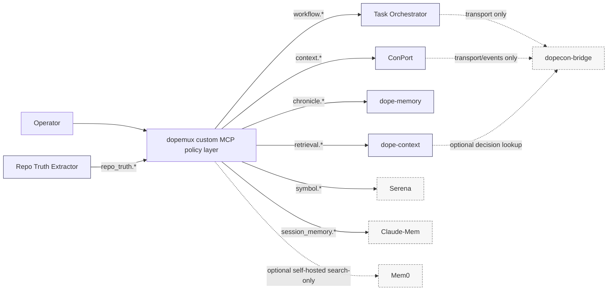

# MCP Customization Synthesis DR Report

Target file: `docs/05-audit-reports/mcp-customization/07-mcp-customization-synthesis-dr-report.md`

## Executive Findings

items:
1. The safe Dopemux strategy is **not** to pick a single “best server,” but to keep the existing split-authority model intact and add a boundary-enforcing custom MCP layer that routes each action to the already-declared canonical writer: Leantime for passive PM metadata, Task Orchestrator for workflow transitions and workflow views, ConPort for structured decisions/progress/context/custom data, dope-memory for chronicle receipts and evidence history, dope-context for derived code/docs retrieval, and dopecon-bridge for transport only. Any synthesis that turns bridge, retrieval, or external memory into source truth would violate the repo rules and truth docs. (Sources: `RULES(6).md` L44-L93; `ARCHITECTURE(7).md` L11-L23, L29-L84; `PM_PLANE(7).md` L7-L9, L28-L30, L40-L60; `system-boundaries(8).md` L16-L23, L71-L109; `00-dopemux-context-boundaries(4).md` L35-L49)
2. Among the researched upstreams, only **ConPort** and **Task Orchestrator** fit canonical write slices in Dopemux, and even then only within their narrow domains. **Serena** fits as read-mostly symbolic code intelligence; **Claude Context** fits as a derived retrieval sidecar or benchmark/fallback, not default truth-bearing retrieval; **Claude-Mem** fits as read-only operator-support continuity memory with promotion-only reviewed flows; and **Mem0** should remain deferred by default and, if explored at all, limited to an isolated self-hosted, search-only pilot with destructive paths hidden. (Sources: `01_conport_DR_report.md` L5-L9, L82-L123; `02_task_orchestrator_DR_report.md` L6-L8, L320-L362, L400-L403; `03_serena_DR_report.md` L9-L10, L164-L177, L181-L208, L230-L233; `04_claude_context_DR_report.md` L9-L11, L120-L156, L174-L181; `05_claude_mem_DR_report.md` L11-L12, L134-L193, L215-L220; `06_mem0_DR_report.md` L7-L15, L96-L165, L187-L192)
3. The main failure mode is **hidden authority transfer** through mutating memory tools, semantic retrieval presented as truth, bridge/proxy routes that look canonical, and support tooling that bypasses worktree, task-packet, redaction, or provenance rules. The synthesis therefore has to default to read-mostly exposures, explicit writer naming, double redaction, receipt mirroring, event-shaped idempotent writes, and deterministic retrieval phases with fail-closed behavior when provenance or ownership is unresolved. (Sources: `RULES(6).md` L26-L33, L189-L256; `TRUTH_GAPS(7).md` L19-L28, L70-L89; `responsibility-collision-matrix(8).md` L5-L14; `07-cross-system-synthesis.md` L36-L42, L49-L75)

more_count: 8
next_token: 5_5_pro_audit_prompt

**Scope and evidence base.** This synthesis used the six server-specific reports that were uploaded in this session, the cross-system synthesis seed, and the Dopemux authority/truth documents that describe current boundaries, runtime slices, and known drift. No fresh broad upstream research was performed; where upstream contradictions remained unresolved in the uploaded reports, they are carried forward as `UNKNOWN` rather than reinterpreted here. The six server reports were usable, but several of them explicitly inherited a missing-baseline limitation, and the separately named `00_baseline_DR_report.md` was not present among the accessible uploads in this session. I therefore treated `00-dopemux-context-boundaries(4).md` plus the current authority docs as the practical baseline surrogate, while preserving that substitution itself as a blocker. (Sources: `07-cross-system-synthesis.md` L7-L21, L36-L42, L73-L91; `00-dopemux-context-boundaries(4).md` L35-L49, L60-L91)

**Citation namespace note.** Parenthesized names such as `RULES(6).md` and `SYSTEM_ConPort(4).md` are upload-session evidence labels from the DR input bundle, not guaranteed repository paths. Where this branch adds or the repo already contains a tracked equivalent, use the tracked path for navigation: `RULES(6).md` -> `docs/03-reference/governance/rules.md`, `PAL_CHAINING_DOCTRINE.md` -> `docs/03-reference/execution/pal-chaining-doctrine.md`, `PAL_EXECUTION_RULES.md` -> `docs/03-reference/execution/pal-execution-rules.md`, `system-boundaries(8).md` -> `docs/03-reference/systems/system-boundaries.md`, `PM_PLANE(7).md` -> `docs/03-reference/planes/pm-plane.md`, `SYSTEM_ConPort(4).md` -> `docs/03-reference/systems/conport/system-conport.md`, `SYSTEM_DopeContext(4).md` -> `docs/03-reference/systems/dope-context/system-dopecontext.md`, `SYSTEM_DopeMemory(4).md` -> `docs/03-reference/systems/dope-memory/system-dopememory.md`, `SYSTEM_TaskOrchestrator(1).md` -> `docs/03-reference/systems/task-orchestrator/system-taskorchestrator.md`, `TRUTH_DATA_EVENTS(9).md` -> `docs/03-reference/truth/truth-data-events.md`, and `TRUTH_GAPS(7).md` -> `docs/03-reference/truth/truth-gaps.md`. Uploaded labels without a tracked equivalent remain evidence labels, not repo-path claims.

| Evidence class | Used in this synthesis | Notes |
|---|---|---|
| Server-specific DR reports | `01_conport_DR_report.md`, `02_task_orchestrator_DR_report.md`, `03_serena_DR_report.md`, `04_claude_context_DR_report.md`, `05_claude_mem_DR_report.md`, `06_mem0_DR_report.md` | All six were present and materially useful. |
| Cross-system seed | `07-cross-system-synthesis.md` | Used for objective, required fields, conflict checks, and validation constraints. |
| Core authority docs | `RULES(6).md`, `ARCHITECTURE(7).md`, `PM_PLANE(7).md`, `system-boundaries(8).md` | Used as the primary repo-side synthesis baseline. |
| System docs | `SYSTEM_ConPort(4).md`, `SYSTEM_DopeContext(4).md`, `SYSTEM_DopeMemory(4).md`, `SYSTEM_TaskOrchestrator(1).md` | Used to ground canonical writer, active runtime, and non-responsibilities. |
| Truth docs | `TRUTH_DATA_EVENTS(9).md`, `TRUTH_GAPS(7).md` | Used for determinism, event contract, and drift/unknowns. |
| Baseline substitute | `00-dopemux-context-boundaries(4).md`, `responsibility-collision-matrix(8).md` | Used because the separately named `00_baseline_DR_report.md` was not accessible. |
| Schema contract | Audit-evidence-tree copy of `docs/03-reference/spec/dopetask/dopetask-canonical-spec.json` | Used to normalize the draft Task Packets to the observed strict contract; the copy is evidence, not source authority. |

**Baseline authority restatement.** Dopemux is a multi-system workspace, not a monolith. The repo-level docs are consistent that `dopemux` owns operator control and routing, `dopetask` is the external execution runtime after wrapper handoff, PM authority is split across Leantime, Task Orchestrator, ConPort, and dope-memory receipts, memory is split across dope-memory and ConPort, retrieval is split across dope-context and ConPort, and bridge/proxy transport must never be promoted into source truth. The docs also repeatedly say that services may span planes, but authority remains domain-specific, with the canonical writer named before any write. (Sources: `RULES(6).md` L44-L93; `ARCHITECTURE(7).md` L11-L23, L41-L84; `system-boundaries(8).md` L16-L23, L24-L50, L61-L69, L93-L109; `00-dopemux-context-boundaries(4).md` L37-L49)

| Dopemux slice | Canonical owner today |
|---|---|
| Operator control and routing | `dopemux` |
| External execution runtime | `dopetask` after wrapper handoff |
| Passive PM metadata and snapshots | Leantime |
| Workflow transitions, workflow queue/state/blockers, workflow views | Task Orchestrator |
| Structured decisions, structured progress, project/active context, custom data | ConPort |
| Chronicle receipts and evidence history | dope-memory |
| Derived code/docs retrieval and indexing | dope-context |
| Bridge, proxy, compatibility, event transport | dopecon-bridge only |
| Operator-support and cognitive-state surfaces | ADHD Engine |
| Repo extraction and audit artifacts | Repo Truth Extractor |

**Observed fact vs synthesis inference.** The authority split, canonical writers, event envelope requirements, retrieval-phase rules, bridge restrictions, and system non-responsibilities are observed from the authority docs and truth docs. The custom surface names, exposure tiers, roadmap ordering, Telegram topic mapping, and Task Packet drafts below are synthesis inferences built to preserve those observed boundaries rather than replace them. (Sources: `RULES(6).md` L26-L33, L44-L93, L97-L119, L189-L256; `00-dopemux-context-boundaries(4).md` L75-L91)

## Server Posture And Authority Mapping

**Per-server final posture.** The table below synthesizes the six server-specific reports against the Dopemux authority docs. Each row answers the question, “What should this upstream be used for in Dopemux, and what must it not become?” (Evidence basis: `01_conport_DR_report.md` L5-L9, L82-L123; `02_task_orchestrator_DR_report.md` L320-L362, L400-L403; `03_serena_DR_report.md` L72-L84, L164-L208, L230-L233; `04_claude_context_DR_report.md` L120-L156, L174-L181; `05_claude_mem_DR_report.md` L134-L193, L215-L220; `06_mem0_DR_report.md` L96-L165, L187-L192; plus repo authority docs cited in the notes below.)

| Server | Recommended role in Dopemux | Classification | Allowed writes | Allowed reads | Forbidden ownership | Primary guardrail | Confidence |
|---|---|---|---|---|---|---|---|
| ConPort | Canonical structured context plane for decisions, progress, project/active context, and constrained custom data; relationship/query surfaces where runtime proof exists | canonical | Structured decisions, structured progress, project/active context, namespaced custom data; relationship writes only after runtime validation | Same domains plus typed/FTS retrieval; semantic search only as derived enrichment | Passive PM metadata, workflow legality/transitions, chronicle authority, dope-context code/docs retrieval | Typed boundary adapter with Dopemux-owned external IDs, hidden delete paths by default, semantic results labeled derived | High for decisions/progress/context/custom data; Medium for relationship writes |
| Task Orchestrator | Canonical workflow authority for transitions, queue/state/blockers, dependencies, and workflow-serving views | canonical | Workflow transitions, execution dependencies, scoped execution decomposition, queue/blocker state | Workflow context, blocker views, readiness/next-item views | Passive PM metadata, ConPort decision/progress truth, dope-memory chronology, bridge authority | Freeze a validated tool subset first; claims/leases remain deferred until shipped-surface validation | High for workflow core; Medium for claims |
| Serena | Read-mostly symbolic code-intelligence support and operator-scoped project activation | support-only | None in default profile; symbolic edit lane only under separate operator-approved flow | Symbol lookups, references, project scoping, Serena help/introspection | Canonical retrieval truth, canonical memory, workflow truth, repo-truth extraction, default shell execution | Default read-only profile with memories, onboarding, file writes, raw edits, query-project, dashboard-open, and shell disabled | Medium |
| Claude Context | Derived retrieval sidecar for approved-repo code and repo-doc search; useful as benchmark or fallback, not as default truth-bearing retrieval plane | derived | Index/cache maintenance only inside approved roots and derived stores | Code and repo-doc retrieval with provenance wrapper | Canonical code/docs truth, project state, workflow state, structured memory, remote infra auto-provisioning by default | Approved-root wrapper, `clear_index` hidden, watcher opt-in only, auto-provision rejected | Medium-High |
| Claude-Mem | Read-only operator-support continuity memory for Claude sessions, with reviewed promotion-only candidate flows | support-only | No canonical writes; upstream local observations remain isolated in its own derived store only | `search`, `timeline`, `get_observations`, plus optional candidate extraction for review | dope-memory chronicle authority, ConPort structured truth, dope-context retrieval truth, default-generated repo `CLAUDE.md` authority | Read-only adapter, redaction gate before any promotion, folder context disabled by default | Medium |
| Mem0 | Deferred optional external-memory adapter; if explored, restrict to isolated self-hosted, search-only continuity experiments | support-only | None into canonical Dopemux stores by default; any experimental writes remain inside isolated derived Mem0 storage | Search-only derived continuity and recall hints | dope-memory chronicle authority, ConPort structured truth, dope-context retrieval truth, workflow/PM authority | Hosted mode hidden by default, destructive tools hidden, exportability and data-movement receipts required before pilot | Medium-Low |

**Important row-level caveats.** First, ConPort is clearly authoritative for decisions/progress/context/custom data, but the local system doc proves relationship traversal/query surfaces more clearly than relationship-write authority; relationship writes therefore remain `UNKNOWN` until runtime validation. Second, local Task Orchestrator workflow behavior is canonical for the workflow slice, but its persistence is bridge-mediated custom data, so the bridge remains transport, not owner. Third, Serena’s upstream identity is clear, but the Dopemux-local Serena implementation/deployment writer remains unresolved because the truth docs still show duplicate local surfaces and alias sprawl. (Sources: `SYSTEM_ConPort(4).md` L35-L63, L65-L76; `SYSTEM_TaskOrchestrator(1).md` L17-L24, L39-L40, L79-L88, L110-L119; `TRUTH_GAPS(7).md` L30-L39, L44-L55, L57-L68; `system-boundaries(8).md` L80-L84)

**Authority slice mapping.** This table answers the operational question, “Which server should write each kind of data, and which systems may only read, mirror, enrich, or adapt?” (Sources: `RULES(6).md` L74-L93, L189-L256; `PM_PLANE(7).md` L28-L30, L40-L60; `SYSTEM_ConPort(4).md` L14-L18, L35-L52; `SYSTEM_DopeMemory(4).md` L14-L20, L35-L40, L72-L80; `SYSTEM_DopeContext(4).md` L16-L28, L31-L40, L86-L97; `SYSTEM_TaskOrchestrator(1).md` L17-L24, L27-L50; `TRUTH_DATA_EVENTS(9).md` L64-L79, L123-L145, L187-L205)

| Dopemux slice | Canonical writer | Allowed upstream support servers | Adapter/proxy surfaces | Forbidden servers or claims | Required validation |
|---|---|---|---|---|---|
| Passive PM metadata | Leantime | Task Orchestrator may read workflow-correlated items; ConPort may hold related context only | `dopemux` PM write router | Task Orchestrator CRUD becoming PM metadata authority; ConPort task/progress status becoming PM canon | PM-to-workflow crosswalk test; Leantime receipt check |
| Workflow transitions | Task Orchestrator | None as canonical peers; ConPort may read for enrichment | `dopemux` workflow shim | ConPort progress states, Serena edits, Mem0/Claude-Mem memory claims | Transition legality and mirror-status tests |
| Workflow queue/state/blockers | Task Orchestrator | None as canonical peers | Project workflow APIs, adapter-only views | Leantime roadmap priority, bridge persistence being mistaken for owner | Queue/blocker read-model tests |
| Structured decisions | ConPort | Claude-Mem candidate promotion only after review; Mem0 none by default | ConPort adapter only | Claude-Mem observations as decisions; Mem0 facts as decisions; Task Orchestrator notes as decisions | External-ID/idempotency tests and reviewed-promotion path |
| Structured progress | ConPort | Task Orchestrator may read; ADHD Engine may consume | ConPort adapter only | Task Orchestrator workflow state becoming progress canon or vice versa | Separation tests between workflow status and progress log |
| Project / active context | ConPort | Claude-Mem candidate hints only after review | ConPort adapter only | Serena onboarding summary or Mem0 memory becoming active context canon | Context round-trip and namespace tests |
| Custom data | ConPort | Task Orchestrator may persist workflow_* categories through bridge as derived operational data | ConPort adapter; bridge transport only | PM metadata namespaces or bridge routes becoming custom-data authority | Namespace reservation and category allowlist tests |
| Relationship graph | ConPort where runtime proof exists; relationship-write authority otherwise `UNKNOWN` | Mem0 graph/entity hints only as advisory; Claude-Mem corpora deferred | ConPort adapter only | Mem0 graph memory or ConPort query surfaces being treated as global graph truth without proof | Runtime proof of relation-write support; neighbor query tests |
| Chronicle / evidence receipts | dope-memory | ConPort and Task Orchestrator may emit source events; external memories may produce candidate receipts only | dope-memory HTTP tools and adapters | Claude-Mem summaries, Mem0 histories, bridge events as chronicle replacement | Receipt provenance, supersession, replay, and mirror tests |
| Code/docs deterministic retrieval | dope-context | Claude Context only as secondary derived adapter or benchmark; Serena symbol read as support only | dope-context wrapper only | Claude Context or Serena appearing as default source-truth retrieval | Provenance-complete retrieval and stable-sort tests |
| Semantic retrieval enrichment | No independent canonical writer; derived layer only | dope-context hybrid, ConPort semantic, Claude Context hybrid, optionally Mem0/Claude-Mem memory search in separate lane | Derived ranking wrapper only | Any semantic/vector layer becoming source truth or phase-1 default | Separate phase labeling and rehydration tests |
| Operator-support memory | None canonical by default | Claude-Mem read-only; ADHD Engine operational support; Mem0 optional self-hosted pilot only | Adapter-only, derived-lane surfaces | External or local support memory becoming project truth | Derived-label and promotion-gate tests |
| Session continuity | None canonical by default | Claude-Mem first; Mem0 optional self-hosted only | Read-only adapters | Carrying continuity summaries into canonical context without review | Session-memory labeling and retention tests |
| Code-intelligence / edit support | Local repo changes remain canonical only through approved worktree/task-packet flow, not Serena state | Serena read-mostly symbol support | Dopemux Serena wrapper | Serena memory, shell, raw edits, or repo-truth claims by default | Read-only profile and separate edit-lane tests |
| Bridge/event transport | dopecon-bridge is transport only; canonical writer depends on payload domain | ConPort and Task Orchestrator may publish events; dope-memory may consume/promote | dopecon-bridge only as proxy/transport | `/kg/*`, `/ddg/*`, `/route/pm` being treated as canonical authority | Event-envelope and proxy non-authority tests |

## Capability Disposition And Collision Controls

**Adopt / adapt / reject / hide / defer matrix.** The synthesis below prioritizes architecture-safe customizations over feature maximization. “Adopt” means the capability aligns cleanly with an existing canonical slice. “Adapt” means the capability is useful only behind a Dopemux boundary wrapper. “Hide” means existing upstream capability should remain internal-only or disabled on the default operator surface. “Defer” means the idea is interesting but blocked by evidence gaps or unacceptable default risk. (Evidence basis: `01_conport_DR_report.md` L100-L123; `02_task_orchestrator_DR_report.md` L335-L349; `03_serena_DR_report.md` L164-L177; `04_claude_context_DR_report.md` L120-L156; `05_claude_mem_DR_report.md` L148-L193; `06_mem0_DR_report.md` L122-L165; `responsibility-collision-matrix(8).md` L5-L14)

| Upstream server | Capability | Recommendation | Reason | Dopemux boundary impact | Validation required | Priority |
|---|---|---|---|---|---|---|
| ConPort | Project / active context | adopt | Best-aligned existing canonical slice | Strengthens existing writer without changing ownership | Context versioning and workspace isolation tests | P0 |
| ConPort | Custom data | adopt | Strongest fit for deterministic keyed context | Safe if namespaces are reserved | Namespace allowlist and idempotent upsert tests | P0 |
| ConPort | Structured decisions | adapt | Canonical fit, but upstream IDs are auto-increment | Needs external-ID boundary shim | External-ID and reviewed-delete/correction tests | P0 |
| ConPort | Structured progress | adapt | Canonical fit, but must stay separate from workflow legality | High collision if status semantics blur | Progress-vs-transition separation tests | P0 |
| ConPort | Relationship graph/query | adapt | Strong fit for query surfaces, but relation writes remain less proven | Requires explicit runtime validation | Relation-write proof and neighbor query tests | P1 |
| ConPort | Semantic search | adapt | Useful enrichment only, not truth-bearing retrieval | Must remain derived evidence | Rehydration and stable-sort tests | P1 |
| Task Orchestrator | Workflow transitions | adopt | Strongest evidence-backed workflow fit | Matches canonical workflow slice | State-mapping tests | P0 |
| Task Orchestrator | Queue/state/blockers | adopt | Native execution readiness surface | Safe if not promoted into PM canon | Queue and blocker read-model tests | P0 |
| Task Orchestrator | Dependencies | adopt | Directly aligned with workflow sequencing | Safe inside execution slice only | `BLOCKS` and `unblockAt` tests | P0 |
| Task Orchestrator | Decomposition / work trees | adapt | Useful for execution children, unsafe for PM breakdown canon | Needs parent-source linkage | Parent-link and scope-limit tests | P1 |
| Task Orchestrator | Claims / leases | defer | Valuable, but release-image presence still uncertain | Medium workflow benefit, unresolved surface drift | Validate shipped `claim_item` support first | blocked |
| Serena | Symbol navigation and references | adopt | Best differentiated Serena value | Read-mostly support, no authority transfer | Wrapper allowlist tests | P1 |
| Serena | Project activation / scoping | adapt | Useful operationally, but not PM or workflow authority | Medium risk of identity confusion | Single-project binding tests | P1 |
| Serena | File/code search fallback | adapt | Useful occasionally, but dope-context owns retrieval | Must never become default retrieval | Provenance labeling and fallback gating tests | P2 |
| Serena | Memory / onboarding | hide | Highest collision with ConPort and dope-memory | High memory-plane risk | Default `no-memories` / `no-onboarding` tests | P0 |
| Serena | Symbolic edit tools | hide | Potentially useful later, but unsafe as default surface | High worktree/task-packet collision | Separate edit-lane validation | P1 |
| Serena | Shell command execution | reject | Highest-risk authority expansion for least Dopemux gain | Critical security and mutation risk | Assert disabled in default profile | P0 |
| Claude Context | Approved-root retrieval wrapper | adapt | Valuable derived search, not canonical retrieval | Useful sidecar/benchmark if provenance-complete | Provenance envelope and root-control tests | P1 |
| Claude Context | Trigger watcher / background sync | hide | Widens mutation and scoping surface | High ops risk | Explicit opt-in and scoping tests | P1 |
| Claude Context | `clear_index` | hide | Destructive operational tool | High accidental disruption risk | Operator-only authorization tests | P0 |
| Claude Context | Token-driven remote infra auto-provision | reject | Would silently create egress and infra | Critical platform-risk collision | Launch wrapper fail-closed test | P0 |
| Claude-Mem | Read-only session-memory search | adopt | Strongest safe fit for continuity | Safe if clearly derived | Read-only adapter tests | P1 |
| Claude-Mem | Fact/decision candidates | adapt | Useful hints, not truth | Needs reviewed promotion path | Promotion-to-ConPort/dope-memory tests | P1 |
| Claude-Mem | Folder `CLAUDE.md` generation | hide | Derived files can masquerade as repo truth | High retrieval-plane collision | Default-off and repo-cleanliness tests | P0 |
| Claude-Mem | Import / export | defer | Useful but sensitive | Data-movement and privacy risk | Export policy and redaction review | blocked |
| Mem0 | Self-hosted search-only pilot | adapt | Only safe lane is isolated, self-hosted, search-only | Medium value, high guardrail need | Local deployment, export, and egress audit | P2 |
| Mem0 | Hosted cloud MCP memory | defer | Default hosted path conflicts with local evidence plane | High privacy and authority risk | Explicit opt-in and outbound data audit | blocked |
| Mem0 | Update / delete / correction tools | hide | Collide with chronicle preservation and structured truth | High mutation risk | Destructive-tool hiding tests | P0 |
| Mem0 | Graph memory / entity linking | defer | Upstream docs drift remains unresolved | High relationship-truth risk | Runtime semantics validation | blocked |

**Responsibility collision matrix.** This is the synthesis-critical control table: where a capability collides, the canonical Dopemux owner wins, and the upstream remains read-only, derived, or disabled. (Evidence basis: `responsibility-collision-matrix(8).md` L5-L14; `03_serena_DR_report.md` L181-L208; `04_claude_context_DR_report.md` L137-L156; `05_claude_mem_DR_report.md` L167-L193; `06_mem0_DR_report.md` L144-L165; `01_conport_DR_report.md` L113-L123; `02_task_orchestrator_DR_report.md` L351-L376; plus core authority docs.)

| Collision | Servers involved | Canonical Dopemux owner | Risk severity | Safe integration posture | Required guardrail | Validation required |
|---|---|---|---|---|---|---|
| Mem0 vs dope-memory | Mem0, dope-memory | dope-memory | critical | Mem0 search-only, derived continuity only | Hide update/delete/history; require local receipts for any external interaction | Destructive-tool hiding, outbound data audit, receipt test |
| Mem0 vs ConPort | Mem0, ConPort | ConPort | critical | No direct decision/progress/context writes from Mem0 | Promotion-only reviewed flow; explicit canonical writer on promotion | ConPort promotion and provenance tests |
| Claude-Mem vs dope-memory | Claude-Mem, dope-memory | dope-memory | critical | Claude-Mem observations remain candidate or derived continuity only | No automatic chronicle transfer; require receipt mapping | Candidate-to-receipt tests and redaction tests |
| Claude-Mem vs ConPort | Claude-Mem, ConPort | ConPort | high | Facts/decisions only as review candidates | Promotion queue, not direct write | Decision-promotion path tests |
| Claude Context vs dope-context | Claude Context, dope-context | dope-context | high | Claude Context only as secondary sidecar or benchmark | Provenance overlay and explicit “derived sidecar” labeling | Same-query comparison and labeling tests |
| Serena vs dope-context | Serena, dope-context | dope-context | high | Serena search only as symbolic fallback or support | Retrieval ownership banner; default-hide generic file search | Source-owner labeling tests |
| Serena vs Repo Truth Extractor | Serena, Repo Truth Extractor | Repo Truth Extractor | high | Serena must never populate repo-truth surfaces | No “repo truth” naming or output paths in Serena wrapper | Surface-name audit and routing tests |
| ConPort progress vs Task Orchestrator workflow | ConPort, Task Orchestrator | Task Orchestrator for legality/transitions; ConPort for structured progress | critical | Keep progress logs and transitions separate | Explicit type split and forbidden cross-write paths | Status/progress separation tests |
| Bridge/proxy surfaces vs canonical authorities | dopecon-bridge with ConPort, Task Orchestrator, PM routes | Upstream canonical writer per domain; bridge owns none | critical | Bridge remains transport only | Every bridge-mediated write must name upstream writer | Proxy non-authority tests and event-envelope inspection |
| Serena edits vs worktree/task-packet controls | Serena, repo worktree flow | Approved worktree/task-packet flow | critical | Separate operator-approved edit lane only | Read-only default Serena profile | Worktree verification and disabled-tool tests |
| Claude-Mem or Mem0 semantic memory vs dope-context retrieval | Claude-Mem, Mem0, dope-context | dope-context | high | Keep memory search on a separate continuity lane | Never merge memory hits into code/docs ranking without labels | Lane-separation and UI-labeling tests |

## Custom MCP Architecture, Governance, And Retrieval

**Target custom MCP architecture.** The safest end state is a Dopemux-owned policy and exposure layer that sits in front of the canonical systems and support-only sidecars. It should expose small, domain-named operator surfaces, while keeping raw upstream tool surfaces internal or disabled by default. That preserves the rule that `dopemux` is the operator/control surface and that no bridge, retrieval cache, or support memory becomes source truth. (Sources: `RULES(6).md` L44-L70; `ARCHITECTURE(7).md` L27-L84; `07-cross-system-synthesis.md` L36-L42, L84-L91)



**Operator-facing surfaces, internal-only tools, and disabled defaults.**

| Exposure tier | Proposed custom surface names | Backing system | Default visibility | Notes |
|---|---|---|---|---|
| Operator-facing read | `workflow.get_queue`, `workflow.get_blockers`, `workflow.get_state`, `context.get_active`, `context.search_decisions`, `chronicle.search`, `chronicle.recap`, `retrieval.search_code`, `retrieval.search_docs`, `symbol.find`, `symbol.references`, `session_memory.search` | Task Orchestrator, ConPort, dope-memory, dope-context, Serena, Claude-Mem | visible | These are the safe first-wave surfaces because they are read-mostly or domain-correct reads. |
| Operator-facing write with explicit confirmation | `workflow.transition`, `context.log_progress`, `context.log_decision`, `session_memory.promote_candidate` | Task Orchestrator, ConPort | visible-with-confirm | Each write surface must declare the canonical writer before execution. |
| Internal-only adapters | `internal.to.advance_item`, `internal.to.manage_dependencies`, `internal.conport.write_context`, `internal.conport.write_custom_data`, `internal.dopememory.append_receipt`, `internal.claude_context.search_code`, `internal.claude_mem.search`, `internal.mem0.search`, `internal.serena.symbol` | Mixed | hidden | Keep raw upstream naming and quirks away from the operator surface. |
| Disabled/hidden by default | ConPort delete tools; Task Orchestrator claims until validated; Serena memory tools, onboarding, raw file-edit, symbolic-edit, query-project, dashboard-open, shell; Claude Context watcher, `clear_index`, token-driven auto-provision; Claude-Mem folder `CLAUDE.md`, import/export, uncontrolled saves; Mem0 hosted MCP, update/delete/correction/history/import | Mixed | blocked | These either collide directly with authority boundaries or remain blocked by unresolved evidence. |

The operator-facing tool list above is a synthesis recommendation, not an observed runtime fact. It is grounded in the safe subsets identified in the six server reports and in the repo rule that bridges, mirrors, and derived retrieval outputs must not be promoted into authority. (Sources: `01_conport_DR_report.md` L104-L123; `02_task_orchestrator_DR_report.md` L339-L349; `03_serena_DR_report.md` L166-L177, L183-L208; `04_claude_context_DR_report.md` L143-L155; `05_claude_mem_DR_report.md` L152-L165, L171-L193; `06_mem0_DR_report.md` L126-L165; `RULES(6).md` L35-L40, L63-L70, L197-L208)

**Data governance and storage rules.** Each proposed write path below names its canonical writer, required redaction points, idempotency rule, and failure model. This is where the synthesis answers the question “Which server may write, and which may only mirror, enrich, or adapt?” (Sources: `RULES(6).md` L189-L240; `TRUTH_DATA_EVENTS(9).md` L21-L49, L64-L79, L169-L205; `SYSTEM_ConPort(4).md` L35-L52, L56-L63; `SYSTEM_DopeMemory(4).md` L14-L20, L35-L40, L53-L59, L72-L80; `SYSTEM_DopeContext(4).md` L20-L29, L57-L60; `SYSTEM_TaskOrchestrator(1).md` L27-L40, L79-L81)

| Write path | Canonical writer | Storage backend | Mirror / receipt behavior | Redaction before storage | Redaction before promotion | Idempotency key | Retry behavior | Deletion / correction / supersession model | Must fail closed when |
|---|---|---|---|---|---|---|---|---|---|
| Passive PM metadata update | Leantime | Leantime metadata store | Optional workflow mirror only after successful PM update | Yes | N/A | `event_id` + PM object ID + field set | Retry only through PM router | Update in Leantime; no silent delete from other systems | PM object mapping or writer identity is unresolved |
| Workflow transition | Task Orchestrator | Current local runtime uses workflow state plus bridge-mediated workflow_* custom-data persistence | Mirror status back to PM only as explicit mirror, not ownership transfer | Yes, especially notes/guidance payloads | N/A | `event_id` + work item ID + trigger | Safe retry only if same transition envelope; reject duplicate conflicting trigger | Compensating transition or cancellation, not silent erase | Transition legality, source mapping, or claim status is unresolved |
| Structured decision log | ConPort | ConPort PostgreSQL decisions/context/custom-data surfaces | Append dope-memory receipt after primary success where the event matters historically | Yes | Yes if promoted further | `event_id` + external decision ID | Retry on same external ID only | Prefer correction/supersession receipt over operator-facing delete | External ID, provenance, or namespace is missing |
| Structured progress log | ConPort | ConPort PostgreSQL progress surfaces | Append dope-memory receipt after primary success for auditable progress events | Yes | Yes | `event_id` + external progress ID + progress type | Retry idempotently on same external ID | Allow ConPort update, but require chronicle correction receipt for material changes | Payload looks like workflow legality/state instead of progress |
| Project / active context write | ConPort | ConPort workspace context or namespaced custom data | No default chronicle mirror unless policy says the change is historically material | Yes | Yes for any derivative promotion | `workspace_id` + context namespace + external key | Retry only on same namespace/key | Update-in-place allowed; major changes may emit explicit receipt event | Namespace overlaps PM metadata or workflow state |
| Relationship write | `UNKNOWN` until runtime proof; treat query surfaces as safe, writes as blocked | ConPort only if relation-write runtime is proven | Optional dope-memory receipt for major structural changes | Yes | Yes | `event_id` + relation tuple | No write retries until runtime support is proven | Correction via compensating relation event, not silent delete | Runtime relation-write support is unproven |
| Chronicle receipt append | dope-memory | Canonical SQLite ledger; optional Postgres mirror downstream | Postgres mirror only where declared; never source truth | Yes | Yes again at promotion | `event_id` and chronicle provenance fields (`source_event_id`, `source_event_type`, `source_adapter`, `source_event_ts_utc`, `promotion_rule`, `promotion_ts_utc`) | Expect duplicates and replay; SQLite must succeed independently | Prefer correction/supersession over destructive delete | Redaction, provenance, or ledger resolution fails |
| Retrieval index update | dope-context | Qdrant collections plus BM25 snapshots under `~/.dope-context` | None; index is derived state only | Path, root, and sensitive-doc redaction/exclusion first | N/A | `workspace_id` + content hash + source path | Reindex idempotently by content identity | Reindex or clear derived index only; never source delete | Root approval, ignore policy, or provenance is missing |
| Session-memory promotion candidate | None canonical until promoted; source remains Claude-Mem or Mem0 derived store | Derived local store only until promoted | On promotion, write into ConPort or dope-memory with a new canonical envelope | Yes | Yes | `source_id` + candidate type + review decision | No automatic retries into canonical stores | Promotion creates new canonical record; source memory remains derived | Candidate lacks provenance, redaction, or review decision |
| External-memory search result caching | None canonical by default | Avoid durable caching initially | None | Yes | N/A | Query fingerprint only if local ephemeral cache is later added | Best-effort only | Expire only; no authoritative mutation | Search result lacks source label or data-movement disclosure |

**Required event envelope and provenance fields.** Every proposed cross-system event should use the repo-required shape `id`, `ts`, `workspace_id`, `instance_id`, `type`, `source`, and `data`. When the destination is dope-memory, the receipt also needs chronicle provenance fields such as `source_event_id`, `source_event_type`, `source_adapter`, `source_event_ts_utc`, `promotion_rule`, and `promotion_ts_utc`. This is not optional decoration; it is the boundary control that distinguishes a mirror receipt from a silent authority transfer. (Sources: `RULES(6).md` L213-L240; `TRUTH_DATA_EVENTS(9).md` L43-L49)

**Retrieval strategy.** The repo rules explicitly require a deterministic, keyword-only Phase 1 and reserve controlled boosts for later phases. That means the custom MCP layer should separate lexical retrieval from semantic enrichment instead of blending them into one opaque answer surface. It also means memory-search results and symbol-navigation results must never silently mix into code/docs truth. (Sources: `RULES(6).md` L244-L256; `TRUTH_DATA_EVENTS(9).md` L187-L205; `SYSTEM_DopeContext(4).md` L20-L29, L86-L97)

| Retrieval phase | Participating systems | Ranking rule | Labeling rule | Must not happen |
|---|---|---|---|---|
| Phase 1 | dope-context under a lexical-only wrapper or equivalent fail-closed adapter; ConPort FTS-only for structured decisions/custom data | Stable, explainable ordering; explicit tie-break; no LLM scoring | `derived=true`, canonical owner named, source path/ID attached | No semantic/vector-only result in this phase; no Claude Context, Claude-Mem, Mem0, or Serena memory hits mixed into code/docs truth |
| Phase 2 | dope-context hybrid results with known tie-break discipline; ConPort semantic only after typed rehydration; Claude Context as sidecar only if benchmarked | Controlled boosts only; stable secondary key required; repeated runs must preserve order | Retrieval mode and score/rank exposed; source system explicit | No result without rehydratable provenance; no semantic result outranks canonical lexical result without declared policy |
| Separate continuity lane | Claude-Mem read-only; Mem0 optional self-hosted search-only | Not part of code/docs ranking at all | Always labeled “session memory” or “external memory,” never “repo truth” | No continuity-memory hit in workflow, PM, or code/docs result sets unless explicitly promoted through review |

The most important retrieval blocker is that the current dope-context runtime is described as embedding-capable and hybrid, while the repo rules demand a keyword-only first phase. The synthesis answer is therefore to implement a lexical-only wrapper or fail closed until such a wrapper is proven. That exact lexical-only enforcement path is `UNKNOWN` in the uploaded authority materials and should be audited before rollout. (Sources: `SYSTEM_DopeContext(4).md` L20-L29; `RULES(6).md` L244-L256)

## Operator Experience And Delivery Plan

**Operator UX and Telegram topic routing.** No uploaded runtime document in this session established the current Telegram Topics implementation, so the mapping below is a synthesis assumption for operator ergonomics, not an observed fact. The purpose is to keep operator-visible domains aligned with canonical writers, while leaving transport details and raw upstream tools internal.

| Operator workflow | Proposed custom MCP surfaces | Approval state | Error / blocked state | Telegram topic assumption | What the operator sees | What remains internal |
|---|---|---|---|---|---|---|
| Workflow execution | `workflow.get_queue`, `workflow.get_blockers`, `workflow.get_state`, `workflow.transition` | Reads auto; transitions require explicit confirmation unless policy grants automation | Block if PM-to-workflow mapping is unresolved or release-drifted capability is requested | `Execution` topic | Queue, blockers, current workflow state, legal next transitions, canonical owner label | Raw Task Orchestrator tool names, bridge persistence details |
| Context and progress | `context.get_active`, `context.search_decisions`, `context.log_progress`, `context.log_decision` | Reads auto; writes confirm | Block if namespace, external ID, or writer identity is missing | `Project Context` topic | Context snapshot, decision hits, progress updates, provenance banner | Raw ConPort IDs, delete tools, raw semantic scores unless requested |
| Retrieval | `retrieval.search_code`, `retrieval.search_docs` | Auto | Block if path root is unapproved, provenance is missing, or lexical phase cannot be enforced | `Retrieval` topic | File path, line range, score/rank, source system, “derived evidence” badge | Sidecar benchmarking, index IDs, destructive index tools |
| Chronicle | `chronicle.search`, `chronicle.recap` | Auto | Block if ledger resolution or provenance mapping fails | `History` topic | Receipts, recap, replay summaries, correction indicators | Low-level raw Redis/event bus details |
| Session continuity | `session_memory.search`, `session_memory.promote_candidate` | Search auto; promotion explicit confirm only | Block if redaction fails, source labels missing, or policy forbids external memory | `Session Continuity` topic | Derived continuity memory with source labels and promotion prompt | Underlying Claude-Mem / Mem0 implementation details and raw provider settings |
| Code intelligence | `symbol.find`, `symbol.references` | Auto | Block any edit/shell request in default profile | `Code Intelligence` topic | Symbol locations and references, clearly labeled as support-only | Serena memories, onboarding, shell, raw edits, dashboard |
| Audit and boundary status | `operator.boundary_status`, `operator.hidden_tool_request` | Operator/admin only | Show blocked reason and required next action | `Ops / Audit` topic | Why a tool is blocked, which system owns the domain, what validation is missing | Raw config, secret material, unsafe upstream surface names |

**Implementation roadmap.** Each row below is a commit-sized synthesis slice grouped into the required series. The intent is to normalize evidence first, then enforce boundaries, then expose safe surfaces, then add retrieval/memory guardrails, then connect operator UX, and finally harden with tests and audit hooks. (Sources: `07-cross-system-synthesis.md` L23-L34, L77-L91; `RULES(6).md` L97-L119, L123-L150, L189-L256; server-report implementation slices throughout)

| Series | Task | Repo surface | Validation | Guardrail | Dependencies | Risk |
|---|---|---|---|---|---|---|
| Series A | Normalize synthesis evidence, missing-file ledger, and per-server posture registry | Docs and policy registry surfaces | All six reports and authority docs indexed in one manifest; missing baseline and missing spec marked `UNKNOWN` | No authority rewrite during normalization | None | Low |
| Series A | Add boundary matrix for canonical writers and forbidden claims | Docs plus boundary config | Mapping matches repo authority docs exactly | Prevents “best server” collapse | Evidence registry | Low |
| Series B | Implement ConPort adapter with external-ID shim, namespace reservation, and reviewed delete/correction policy | ConPort adapter layer | Round-trip tests for decisions/progress/context/custom data | ConPort never swallows PM or workflow authority | Series A posture registry | Medium |
| Series B | Implement Task Orchestrator workflow shim for transitions, queue, blockers, and dependency reads | Workflow adapter layer | Transition legality, queue/blocker, and PM/workflow separation tests | Leantime stays PM metadata owner | Series A posture registry | Medium |
| Series C | Add default exposure controls and hidden-tool policy for Serena, Claude Context, Claude-Mem, Mem0, and destructive ConPort/TO surfaces | Tool exposure config / wrapper policy | Default profiles expose only approved safe subset | Read-only by default where required | Series B adapters | Medium |
| Series C | Add operator-facing domain names and source labels | dopemux custom MCP surface layer | Surface inventory audit passes; blocked tools explain ownership | Operators see domains, not raw unsafe tools | Series C exposure controls | Low |
| Series D | Implement derived-memory promotion gate with double redaction and provenance envelopes | Adapter ingress / promotion queue | Promotion requires explicit review and writer declaration | Derived memory never auto-becomes truth | Series B ConPort + dope-memory hooks | Medium |
| Series D | Implement retrieval phase separation and provenance wrapper | Retrieval adapter layer | Phase-1 lexical-only test passes or feature fails closed | No semantic truth drift | Series C exposure controls | High |
| Series E | Add operator UX state machine and Telegram topic routing metadata | Operator UX layer | Approval, blocked, and error states render consistently | No hidden writes from chat surfaces | Series C-D | Medium |
| Series E | Add explicit edit-lane design behind feature flag for Serena symbolic edits only | Separate policy lane | Worktree/task-packet checks enforced before any edit surface appears | Default Serena stays read-only | Series C exposure controls | Medium |
| Series F | Build authority-boundary, determinism, redaction, and proxy non-authority test suites | Tests and CI | Full plan in next section passes | No “No issues” shortcut | Series A-E | Medium |
| Series F | Prepare 5.5 Pro audit bundle and surface inventory diff | Audit docs and generated manifests | Audit prompt reproduces all blockers and `UNKNOWN`s | Prevents silent authority transfer before rollout | Series A-E | Low |

**Task Packet drafts.** The repo rules require Task Packets to conform to `docs/03-reference/spec/dopetask/dopetask-canonical-spec.json`, require the named top-level fields, require worktree verification as the first step, and require Codex work to follow `analyze -> planner -> codereview -> precommit`. The audit evidence tree includes a schema copy, so the drafts below are normalized to that observed contract while still remaining **BLOCKED_BY_UNKNOWN** because the underlying work is future-facing and not merge-ready. (Sources: `RULES(6).md` L97-L119, L123-L176)

**Draft TP-A1 — BLOCKED_BY_UNKNOWN**

```json
{
  "id": "TP-A1-mcp-synthesis-evidence-registry",
  "project": "dopemux-mvp",
  "target": "docs/research/mcp-customization and policy registry surfaces",
  "repo_binding": {
    "project_id": "dopemux-mvp",
    "repo_marker": ".dopetaskroot",
    "require_identity_match": true
  },
  "series": {
    "id": "A",
    "base_branch": "main",
    "parent_tp_id": null,
    "final_packet": false
  },
  "commit": {
    "message": "docs(mcp): normalize synthesis evidence and unknown ledger",
    "allowlist": [
      "docs/05-audit-reports/mcp-customization/07-mcp-customization-synthesis-dr-report.md"
    ]
  },
  "pr": {
    "title": "docs(mcp): normalize synthesis evidence and unknown ledger",
    "body": "Schema-valid draft packet for the evidence registry slice. The work remains blocked by upstream unknowns and is not an execution-ready packet.",
    "base": "main"
  },
  "steps": [
    {
      "id": "A1-1",
      "task": "Verify dedicated worktree, repo identity, repo marker, and branch scope before any modification.",
      "validation": [
        "Confirm repo_binding matches checkout, required repo marker exists, current directory is inside a dedicated worktree, and branch matches TP-A1 scope."
      ]
    },
    {
      "id": "A1-2",
      "task": "Create a single evidence registry that lists the six server reports, the cross-system synthesis seed, and all authority/truth docs used by the synthesis.",
      "validation": [
        "Registry file exists and names every source used in this report, including the baseline surrogate and schema-copy references as explicit blockers."
      ]
    },
    {
      "id": "A1-3",
      "task": "Add a per-server posture registry that records canonical, derived, support-only, reject, and deferred classifications with canonical Dopemux writer mapping.",
      "validation": [
        "Registry entries for ConPort, Task Orchestrator, Serena, Claude Context, Claude-Mem, and Mem0 match the synthesized posture matrix."
      ]
    },
    {
      "id": "A1-4",
      "task": "Record all known UNKNOWNs and blockers in one normalized ledger for later 5.5 Pro audit consumption.",
      "validation": [
        "Ledger includes missing baseline report, schema-copy handling, local Serena runtime ambiguity, Task Orchestrator drift, and Mem0 graph/lineage uncertainty."
      ]
    }
  ],
  "execution": {
    "agent": "codex",
    "branch": "codex/mcp-synthesis-evidence-registry"
  },
  "pal_chain": {
    "enabled": true,
    "steps": ["analyze", "planner", "codereview", "precommit"]
  }
}
```

**Draft TP-B1 — BLOCKED_BY_UNKNOWN**

```json
{
  "id": "TP-B1-boundary-enforcing-adapters",
  "project": "dopemux-mvp",
  "target": "ConPort and Task Orchestrator adapter surfaces",
  "repo_binding": {
    "project_id": "dopemux-mvp",
    "repo_marker": ".dopetaskroot",
    "require_identity_match": true
  },
  "series": {
    "id": "B",
    "base_branch": "main",
    "parent_tp_id": null,
    "final_packet": false
  },
  "commit": {
    "message": "feat(boundaries): add conport and workflow shims with explicit writer guards",
    "allowlist": [
      "docs/05-audit-reports/mcp-customization/07-mcp-customization-synthesis-dr-report.md"
    ]
  },
  "pr": {
    "title": "feat(boundary-enforcing-adapters)",
    "body": "Schema-valid draft packet for the boundary adapter slice. The work remains blocked by upstream unknowns and is not an execution-ready packet.",
    "base": "main"
  },
  "steps": [
    {
      "id": "B1-1",
      "task": "Verify dedicated worktree, repo identity, repo marker, and branch scope before any modification.",
      "validation": [
        "Confirm repo_binding matches checkout, required repo marker exists, current directory is inside a dedicated worktree, and branch matches TP-B1 scope."
      ]
    },
    {
      "id": "B1-2",
      "task": "Implement a ConPort adapter that uses Dopemux-owned external IDs, enforces namespace reservations, and keeps decisions/progress/context/custom data separate from PM metadata and workflow state.",
      "validation": [
        "Round-trip adapter tests pass for context, custom data, decisions, and progress; forbidden namespace writes are rejected."
      ]
    },
    {
      "id": "B1-3",
      "task": "Implement a Task Orchestrator adapter that wraps workflow transitions, queue/state/blockers, and dependencies without transferring PM ownership.",
      "validation": [
        "Workflow transition legality, queue, blocker, and dependency tests pass; PM metadata is not writable through the adapter."
      ]
    },
    {
      "id": "B1-4",
      "task": "Add explicit bridge non-authority labeling to any persistence path that traverses dopecon-bridge.",
      "validation": [
        "Logs and envelopes show upstream canonical writer, while bridge is labeled transport/proxy only."
      ]
    }
  ],
  "execution": {
    "agent": "codex",
    "branch": "codex/boundary-enforcing-adapters"
  },
  "pal_chain": {
    "enabled": true,
    "steps": ["analyze", "planner", "codereview", "precommit"]
  }
}
```

**Draft TP-C1 — BLOCKED_BY_UNKNOWN**

```json
{
  "id": "TP-C1-exposure-controls",
  "project": "dopemux-mvp",
  "target": "custom MCP exposure policy and wrapper config",
  "repo_binding": {
    "project_id": "dopemux-mvp",
    "repo_marker": ".dopetaskroot",
    "require_identity_match": true
  },
  "series": {
    "id": "C",
    "base_branch": "main",
    "parent_tp_id": null,
    "final_packet": false
  },
  "commit": {
    "message": "feat(mcp): add safe exposure profiles and hidden-tool policy",
    "allowlist": [
      "docs/05-audit-reports/mcp-customization/07-mcp-customization-synthesis-dr-report.md"
    ]
  },
  "pr": {
    "title": "feat(mcp-exposure-controls)",
    "body": "Schema-valid draft packet for the MCP exposure control slice. The work remains blocked by upstream unknowns and is not an execution-ready packet.",
    "base": "main"
  },
  "steps": [
    {
      "id": "C1-1",
      "task": "Verify dedicated worktree, repo identity, repo marker, and branch scope before any modification.",
      "validation": [
        "Confirm repo_binding matches checkout, required repo marker exists, current directory is inside a dedicated worktree, and branch matches TP-C1 scope."
      ]
    },
    {
      "id": "C1-2",
      "task": "Create default-safe exposure profiles that keep Serena read-only, hide Claude Context destructive/auto-provisioning surfaces, expose Claude-Mem as read-only session memory, and hide Mem0 destructive or hosted surfaces.",
      "validation": [
        "Tool inventory snapshot shows only approved surfaces are exposed in the default profile."
      ]
    },
    {
      "id": "C1-3",
      "task": "Hide ConPort delete tools and Task Orchestrator claims/leases from the default operator profile until separate validation gates are satisfied.",
      "validation": [
        "Default operator profile cannot invoke destructive ConPort tools or unvalidated Task Orchestrator claim surfaces."
      ]
    },
    {
      "id": "C1-4",
      "task": "Add operator-visible blocked reasons that name the canonical owner whenever a hidden tool is requested.",
      "validation": [
        "Blocked tool requests return a domain-safe explanation containing the canonical writer and next validation action."
      ]
    }
  ],
  "execution": {
    "agent": "codex",
    "branch": "codex/mcp-exposure-controls"
  },
  "pal_chain": {
    "enabled": true,
    "steps": ["analyze", "planner", "codereview", "precommit"]
  }
}
```

**Draft TP-D1 — BLOCKED_BY_UNKNOWN**

```json
{
  "id": "TP-D1-retrieval-and-memory-guardrails",
  "project": "dopemux-mvp",
  "target": "retrieval wrappers and derived-memory promotion gate",
  "repo_binding": {
    "project_id": "dopemux-mvp",
    "repo_marker": ".dopetaskroot",
    "require_identity_match": true
  },
  "series": {
    "id": "D",
    "base_branch": "main",
    "parent_tp_id": null,
    "final_packet": false
  },
  "commit": {
    "message": "feat(guardrails): split retrieval phases and gate derived memory promotion",
    "allowlist": [
      "docs/05-audit-reports/mcp-customization/07-mcp-customization-synthesis-dr-report.md"
    ]
  },
  "pr": {
    "title": "feat(retrieval-memory-guardrails)",
    "body": "Schema-valid draft packet for the retrieval and memory guardrail slice. The work remains blocked by upstream unknowns and is not an execution-ready packet.",
    "base": "main"
  },
  "steps": [
    {
      "id": "D1-1",
      "task": "Verify dedicated worktree, repo identity, repo marker, and branch scope before any modification.",
      "validation": [
        "Confirm repo_binding matches checkout, required repo marker exists, current directory is inside a dedicated worktree, and branch matches TP-D1 scope."
      ]
    },
    {
      "id": "D1-2",
      "task": "Add a lexical-first retrieval wrapper that enforces Phase 1 determinism and fails closed if lexical-only behavior cannot be proven.",
      "validation": [
        "Phase-1 retrieval tests show stable lexical ordering or explicit fail-closed behavior when lexical-only enforcement is unavailable."
      ]
    },
    {
      "id": "D1-3",
      "task": "Add a derived-memory promotion gate that redacts before storage, redacts again at promotion, and requires canonical writer declaration before any ConPort or dope-memory write.",
      "validation": [
        "Promotion tests fail when provenance or redaction is missing and pass only with explicit review and full envelope fields."
      ]
    },
    {
      "id": "D1-4",
      "task": "Keep Claude-Mem and Mem0 on separate continuity lanes that never enter code/docs retrieval ranking.",
      "validation": [
        "Search result sets for code/docs never contain continuity-memory hits unless explicit promotion has occurred."
      ]
    }
  ],
  "execution": {
    "agent": "codex",
    "branch": "codex/retrieval-memory-guardrails"
  },
  "pal_chain": {
    "enabled": true,
    "steps": ["analyze", "planner", "codereview", "precommit"]
  }
}
```

**Draft TP-F1 — BLOCKED_BY_UNKNOWN**

```json
{
  "id": "TP-F1-boundary-test-and-audit-pack",
  "project": "dopemux-mvp",
  "target": "tests, CI checks, and audit bundle generation",
  "repo_binding": {
    "project_id": "dopemux-mvp",
    "repo_marker": ".dopetaskroot",
    "require_identity_match": true
  },
  "series": {
    "id": "F",
    "base_branch": "main",
    "parent_tp_id": null,
    "final_packet": false
  },
  "commit": {
    "message": "test(boundaries): add authority, determinism, redaction, and proxy-leak checks",
    "allowlist": [
      "docs/05-audit-reports/mcp-customization/07-mcp-customization-synthesis-dr-report.md"
    ]
  },
  "pr": {
    "title": "test/boundary-audit-pack",
    "body": "Schema-valid draft packet for the boundary test and audit pack slice. The work remains blocked by upstream unknowns and is not an execution-ready packet.",
    "base": "main"
  },
  "steps": [
    {
      "id": "F1-1",
      "task": "Verify dedicated worktree, repo identity, repo marker, and branch scope before any modification.",
      "validation": [
        "Confirm repo_binding matches checkout, required repo marker exists, current directory is inside a dedicated worktree, and branch matches TP-F1 scope."
      ]
    },
    {
      "id": "F1-2",
      "task": "Add authority-boundary tests, redaction tests, no-secrets-persisted tests, retrieval determinism tests, and adapter/proxy non-authority tests.",
      "validation": [
        "All new tests fail on known boundary violations and pass on the intended safe profiles."
      ]
    },
    {
      "id": "F1-3",
      "task": "Add integration-flow tests for workflow transitions, ConPort writes plus dope-memory receipts, retrieval wrappers, and session-memory promotion gates.",
      "validation": [
        "End-to-end flows pass with explicit provenance and canonical writer declarations."
      ]
    },
    {
      "id": "F1-4",
      "task": "Generate an audit bundle for 5.5 Pro containing surface inventories, enabled/disabled tool lists, UNKNOWNs, blockers, and Task Packet drafts.",
      "validation": [
        "Audit bundle includes all required artifacts and matches the final synthesis report."
      ]
    }
  ],
  "execution": {
    "agent": "codex",
    "branch": "codex/boundary-audit-pack"
  },
  "pal_chain": {
    "enabled": true,
    "steps": ["analyze", "planner", "codereview", "precommit"]
  }
}
```

## Validation, Blockers, Audit Seed, And Final Recommendation

**Test and validation plan.** The repo rules explicitly forbid “No issues” without checks, require deterministic ordering, idempotency, safe retries, double redaction, and fail-closed behavior when ownership or safety is unresolved. The plan below translates those rules into implementation-facing tests. (Sources: `RULES(6).md` L26-L40, L189-L256; `TRUTH_DATA_EVENTS(9).md` L169-L205; `TRUTH_GAPS(7).md` L19-L28, L70-L89)

| Test class | What to test | Minimum acceptance |
|---|---|---|
| Determinism tests | Retrieval ordering for lexical phase, dope-context hybrid tie handling, dope-memory chronicle search ordering, ConPort semantic rehydration ordering where enabled | Repeated runs produce stable order; tie-break is explicit; semantic result without rehydratable provenance fails closed |
| Redaction tests | Redaction before storage and again before promotion; `<private>` and non-tagged secret-like inputs for Claude-Mem / Mem0 candidate paths; notes/guidance payload scrubbing | Secret-like content never lands in canonical stores without approved redaction; failed redaction blocks write |
| No-secrets-persisted tests | Canonical stores and derived stores after representative flows | Secrets are absent from stored canonical records and derived operator-facing caches |
| Authority-boundary tests | PM metadata through Leantime only, workflow through Task Orchestrator only, decisions/progress/context/custom data through ConPort only, receipts through dope-memory only | Attempts to cross-write into the wrong owner fail visibly |
| Adapter/proxy non-authority tests | dopecon-bridge, wrapper profiles, internal adapters | Logs and envelopes always report the upstream canonical writer; bridge never appears as canonical owner |
| Retrieval ranking tests | Phase separation, provenance fields, result-lane separation between code/docs search and continuity memory | Continuity memory never enters code/docs ranking; provenance fields are present on every returned item |
| Integration flow tests | Workflow transition plus PM mirror, ConPort write plus dope-memory receipt, retrieval wrapper plus operator view, session-memory candidate promotion | End-to-end flow preserves writer naming, receipts, and labels |
| Failure / retry / idempotency tests | Duplicate events, partial failure, replay, retry against same external ID, SQLite mirror failure scenarios | Same `event_id` or external ID does not duplicate canonical state; mirrors tolerate retry without claiming source truth |
| Performance targets | Warm-path adapter and wrapper calls where applicable | p50 under 50 ms and p99 under 250 ms for warm local read paths and envelope assembly; explicitly exclude cold indexing, first-run model/provider calls, and disabled external-memory pilots |
| Safety-profile tests | Default-safe Tool inventory across Serena, Claude Context, Claude-Mem, Mem0, Task Orchestrator claims, and ConPort deletes | Default profile exposes only approved safe subset; blocked requests explain why |

**Blockers and `UNKNOWN`s.** Because the synthesis is supposed to preserve contradictions instead of smoothing them over, the unresolved items are grouped below by category rather than buried in prose.

| Category | Unresolved fact or blocker |
|---|---|
| Upstream lineage | `00_baseline_DR_report.md` was not accessible in this session; several server reports therefore already carried a missing-baseline blocker. |
| Schema contract | Audit-evidence-tree copy of `docs/03-reference/spec/dopetask/dopetask-canonical-spec.json` was used to normalize the draft packets, while root-level provenance and runtime execution authority remain separate. |
| Upstream feature uncertainty | Task Orchestrator surface drift remains unresolved: README/Quick Start say 13 tools, API docs say 14 including `claim_item`, and `server.json` still shows `3.2.0` while the report anchored `v3.3.0`. |
| Upstream feature uncertainty | Serena’s local Dopemux canonical implementation/deployment writer remains `UNKNOWN` because local truth docs still show duplicate surfaces and alias sprawl. |
| Upstream feature uncertainty | ConPort relationship-query surfaces are proven more clearly than relationship-write authority; relation writes remain `UNKNOWN` until runtime proof. |
| Upstream feature uncertainty | Claude Context exact package-registry state, resources/prompts, and fully documented lexical-only enforcement path remain `UNKNOWN`. |
| Upstream feature uncertainty | Claude-Mem observation-level delete/correction semantics, full auth model, and exact event-id replay guarantees remain `UNKNOWN`. |
| Upstream feature uncertainty | Mem0 graph-memory/entity-linking semantics and `mem0-mcp-server` source lineage remain `UNKNOWN`; hosted-memory default posture is still too risky. |
| Dopemux runtime drift | dope-memory active runtime is on `3020`, but older adapter assumptions still point to `8096`; any custom exposure must avoid inheriting stale transport assumptions. |
| Dopemux runtime drift | Local Task Orchestrator runtime, Docker target, and port surfaces remain partly contradictory in the truth docs; workflow ownership is clear, packaging alignment is not. |
| Security / privacy | Serena upstream security model assumes trusted surroundings; shell and edit surfaces therefore remain unsafe as defaults. |
| Security / privacy | Claude-Mem may send captured content to hosted model providers unless constrained; Mem0 hosted cloud MCP would externalize project memory by default. |
| Storage / delete / correction | ConPort and upstream memories all expose mutable surfaces; a uniform correction/supersession policy for canonical writes is still not fully specified in the uploaded docs. |
| Retrieval determinism | Phase-1 lexical-only enforcement path for dope-context is not proven in the uploaded docs even though the repo rules require it. |
| Operator UX | Telegram Topic implementation details were not evidenced in the uploaded files; the mapping in this report is therefore design guidance, not runtime fact. |

**What 5.5 Pro should audit after this synthesis.** The audit should focus on the places where architecture safety is easy to lose: hidden authority transfer, schema drift, and unsupported write exposure. At minimum, it should verify that no custom surface collapses PM, workflow, context, chronicle, retrieval, bridge, support memory, and execution into one server; that all write paths name the canonical writer; that proxy routes remain labeled as transport; that hidden tools are actually hidden in default profiles; that retrieval phase separation is real; that Task Packet drafts only claim conformance when they are actually normalized to the observed schema contract; and that no hosted/external memory mode is enabled without explicit policy, exportability, and data-movement disclosure. (Sources: `07-cross-system-synthesis.md` L49-L91; `RULES(6).md` L26-L40, L44-L93, L97-L119, L189-L256; `TRUTH_GAPS(7).md` L19-L28, L70-L89)

**5.5 Pro audit prompt seed**

> Audit this Dopemux MCP customization synthesis for boundary collapse and unsupported claims. Check that:
> - no section silently merges PM, workflow, ConPort context/progress/decisions, dope-memory chronicle, dope-context retrieval, dopecon-bridge transport, execution, and operator-support into one owner;
> - every proposed write names one canonical Dopemux-side writer;
> - bridge/proxy routes are never treated as source truth;
> - retrieval outputs remain derived and phase-separated;
> - Serena, Claude Context, Claude-Mem, and Mem0 are not granted hidden canonical ownership;
> - default-safe tool exposure really hides shell, edit, mutation, onboarding, external-project, destructive index, destructive memory, and hosted-memory surfaces where the synthesis says it does;
> - all unresolved facts stay marked `UNKNOWN`;
> - the Task Packet drafts are normalized to the observed `docs/03-reference/spec/dopetask/dopetask-canonical-spec.json` schema copy and are not overclaimed as execution-ready packets;
> - the test plan covers determinism, redaction, no-secrets-persisted, authority boundaries, proxy non-authority, ranking stability, performance, and idempotent retry behavior;
> - no recommendation assumes a hosted external-memory service is safe by default.

**Final recommendation.**

items:
1. Implement a **Dopemux-owned custom MCP policy layer** that keeps ConPort and Task Orchestrator as the only write-bearing upstream integrations for canonical slices, while exposing Serena, Claude Context, Claude-Mem, and Mem0 only through derived, read-mostly, or deferred adapter lanes. (Sources: `RULES(6).md` L44-L93; `01_conport_DR_report.md` L82-L123; `02_task_orchestrator_DR_report.md` L320-L362; `03_serena_DR_report.md` L230-L233; `04_claude_context_DR_report.md` L174-L181; `05_claude_mem_DR_report.md` L217-L220; `06_mem0_DR_report.md` L187-L192)
2. The highest risk is **hidden authority transfer** through mutable memory tools, semantic retrieval presented as truth, bridge routes that look canonical, and support tooling that bypasses worktree, task-packet, redaction, or provenance controls. (Sources: `RULES(6).md` L26-L40, L189-L256; `TRUTH_GAPS(7).md` L19-L28, L70-L89; `responsibility-collision-matrix(8).md` L5-L14)
3. The next action is to execute **Series A and Series B first**, then run the 5.5 Pro audit before enabling any additional write-capable upstream surfaces or any external-memory pilot. (Sources: `07-cross-system-synthesis.md` L84-L91; `RULES(6).md` L97-L119; roadmap in this report)

more_count: 6
next_token: 5_5_pro_audit_prompt
