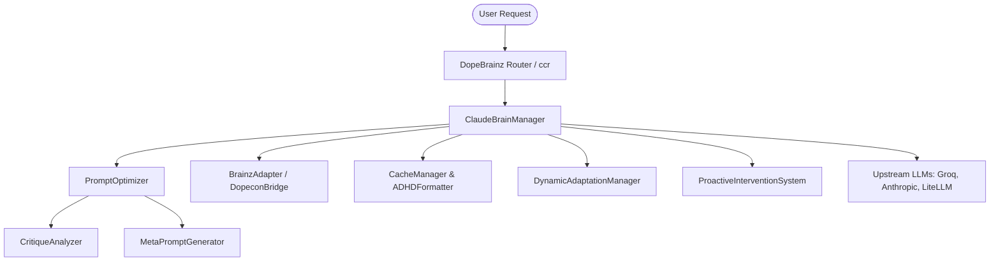

# Dope Brain (Claude Brain) Service - Comprehensive Design & Implementation Compilation

This document compiles all features, component architectures, design specifications, and implementation details for the **Dope Brain** (Claude Brain) service in the Dopemux ecosystem. It highlights a critical implementation gap in `main.py` and provides a roadmap to complete and run the service.

---

## 1. Executive Summary & Plane Architecture
In the Dopemux platform, **Dope Brain** represents the **Cognitive & Intelligence Plane**. It interacts dynamically with:
1. **ConPort (Decision Storage / Knowledge Graph)**: For logging provider choices, prompt evaluations, and cognitive states.
2. **dope-memory (Long-term / Episode Chronicle)**: For retrieving user workspace context.
3. **dope-context (Code/Docs Retrieval)**: For extracting static workspace references.
4. **ADHD Engine**: For tracking user attention states (focused, scattered, hyperfocused, fatigued) and cognitive loads (0.0 to 1.0) dynamically.



---

## 2. In-Repo Component Directory & Specifications

The codebase lives under [services/claude_brain](file:///Users/hue/code/dopemux-mvp/services/claude_brain). Below is the catalog of modules:

### 2.1 Core Orchestration & Routing
*   **File:** [brain_manager.py](file:///Users/hue/code/dopemux-mvp/services/claude_brain/brain_manager.py)
*   **Key Classes:**
    *   `ProviderProfile`: Configures cost tiers (`FREE`, `LOW`, `MEDIUM`, `HIGH`), average response times, quality ratings, and specific model IDs (e.g. `anthropic/claude-3.5-haiku`, `openai/gpt-4o-mini`, `groq/llama3-groq-70b`).
    *   `ClaudeBrainManager`: Performs LiteLLM routing. Selects optimal providers based on cognitive state (e.g., routing to fast/free Groq when user is fatigued or scattered to decrease latency and friction, or Anthropic Sonnet for complex queries). Integrates a circuit breaker via `FailureHandler` and logs choice actions directly to `ConPort`.

### 2.2 Prompt Engineering & Evolution
*   **File:** [prompt_optimizer.py](file:///Users/hue/code/dopemux-mvp/services/claude_brain/prompt_optimizer.py)
    *   `PromptOptimizer`: Manages the *generate-critique-evolve* loop. Supports three levels of optimization (`basic`, `intermediate`, `advanced`) utilizing a local database of few-shot examples targeting context-specific improvements.
*   **File:** [meta_prompt_generator.py](file:///Users/hue/code/dopemux-mvp/services/claude_brain/meta_prompt_generator.py)
    *   `MetaPromptGenerator`: Evolves the meta-prompt templates dynamically using quality scores and feedback trends to refine optimization rules over time.
*   **File:** [critique_analyzer.py](file:///Users/hue/code/dopemux-mvp/services/claude_brain/critique_analyzer.py)
    *   `CritiqueAnalyzer`: Evaluates prompts along six key dimensions: `clarity`, `specificity`, `adhd_friendliness`, `structure`, `context`, and `actionability` using rule-based and structural parsing.

### 2.3 ADHD Caching & Adaptation (Phase 2A)
*   **File:** [cache_manager.py](file:///Users/hue/code/dopemux-mvp/services/claude_brain/cache_manager.py)
    *   `CacheManager`: Redis-backed async cache with zlib compression and custom TTL management.
    *   `ADHDFormatter`: Formats outputs for scan-friendliness. Rewrites responses to inject visual indicators (e.g., ✅ success, ❌ error, ⚠️ warning, 💡 tip, 🎯 objective) and enforces **progressive disclosure** under high cognitive loads.
*   **File:** [dynamic_adaptation.py](file:///Users/hue/code/dopemux-mvp/services/claude_brain/dynamic_adaptation.py)
    *   `DynamicAdaptationManager`: Interfaces with the ADHD Engine to fetch attention state records. Performs text-scaling to adjust response lengths (Minimal, Simplified, Structured, Detailed, Comprehensive) according to real-time cognitive metrics.

### 2.4 Proactive Interventions (Phase 2B)
*   **File:** [proactive_intervention.py](file:///Users/hue/code/dopemux-mvp/services/claude_brain/proactive_intervention.py)
    *   `ProactiveInterventionSystem`: Coordinates context switches and cognitive fatigue. Calculates context-switching difficulties, suggests recovery strategies, and triggers immediate or delayed break alerts (`BREAK_REMINDER`, `COGNITIVE_LOAD_WARNING`, `FOCUS_BOOST`).

### 2.5 Privacy-Preserving Personalization (Phase 3A)
*   **File:** [phase3_federated_personalization.py](file:///Users/hue/code/dopemux-mvp/services/claude_brain/phase3_federated_personalization.py)
    *   `FederatedPersonalizationEngine`: Establishes privacy-preserving local user profile tracking. Implements differential privacy algorithms and federated weight updates to customize model responses to user-specific cognitive patterns without exposing raw keystrokes or inputs.

### 2.6 Event-Driven Team Coordination (Phase 3B)
*   **File:** [phase3_team_coordination.py](file:///Users/hue/code/dopemux-mvp/services/claude_brain/phase3_team_coordination.py)
    *   `TeamCoordinationHub`: Leverages event streaming for shared development workflows. Coordinates synchronized focus timers, break coordination, and warning alerts across teams without violating individual focus privacy.

---

## 3. The Implementation Gap: `main.py`
The most critical finding in the current repository is that while all logical components are fully fleshed out, **the FastAPI server interface does not exist**.

*   `services/claude_brain/Dockerfile` exposes port `8080` and starts `python main.py`.
*   [main.py](file:///Users/hue/code/dopemux-mvp/services/claude_brain/main.py) only contains a single helper method `_simplify_meta_prompt` and exits immediately when run, meaning the service cannot serve HTTP traffic, failing health-checks and integrations.

### Expected Endpoint Catalog (as specified in README)
*   `GET /health` - Service status and connections check
*   `GET /api/v1/status` - Live metrics and cached stats
*   `POST /api/v1/optimize-prompt` - Executes prompt optimization
*   `POST /api/v1/generate-meta-prompt` - Generates evolved meta-prompts
*   `POST /api/v1/analyze-critique` - Performs dimensional critique assessments
*   `POST /api/v1/brain-request` - Core routing and request handling
*   `POST /api/v1/adapt-response` - Runs ADHD formatting and text-scaling
*   `POST /api/v1/process-state` - Integrates user state context switches and fatigue patterns

---

## 4. Plan to Build & Expose Dope Brain

To transition Dope Brain from a set of library files into a running FastAPI service, we propose the following implementation plan:

### Step 1: Implement the FastAPI Application in `main.py`
Rewrite [main.py](file:///Users/hue/code/dopemux-mvp/services/claude_brain/main.py) to bind all core logic classes (`ClaudeBrainManager`, `PromptOptimizer`, `DynamicAdaptationManager`, `ProactiveInterventionSystem`) to HTTP routes.

### Step 2: Establish the Port Configuration
Register and bind the service to the appropriate port base.
*   Category: `cognitive`
*   Target Port: `8080` (as mapped by the Dockerfile)

### Step 3: Write Integration Unit Tests
Create testing suites targeting:
1. FastAPI endpoint connectivity.
2. Degradation handling when Redis, ADHD Engine, or ConPort are offline.
3. ADHD dynamic formatting responses (confirming emoji insertion and sizing scales).

---

## 5. Proposed FastAPI main.py Blueprint

```python
import uvicorn
from fastapi import FastAPI, HTTPException, Depends, status
from pydantic import BaseModel, Field
from typing import Dict, Any, List, Optional

from config import settings
from brain_manager import ClaudeBrainManager, ClaudeBrainRequest
from prompt_optimizer import PromptOptimizer
from critique_analyzer import CritiqueAnalyzer
from dynamic_adaptation import DynamicAdaptationManager
from proactive_intervention import ProactiveInterventionSystem

app = FastAPI(title="Claude Brain Service", version="1.0.0")

# Global singleton dependencies
brain_manager = ClaudeBrainManager()
prompt_optimizer = PromptOptimizer(brain_manager)
critique_analyzer = CritiqueAnalyzer()
adaptation_manager = DynamicAdaptationManager(settings.adhd_engine_url)
intervention_system = ProactiveInterventionSystem()

@app.on_event("startup")
async def startup_event():
    await brain_manager.initialize()
    await adaptation_manager.initialize()
    await intervention_system.initialize()

# Schemas
class OptimizePromptRequest(BaseModel):
    prompt: str
    optimization_level: str = "intermediate"
    user_context: Optional[Dict[str, Any]] = None

class BrainRequestModel(BaseModel):
    operation: str
    prompt: str
    context: Optional[Dict[str, Any]] = None
    user_id: Optional[str] = None
    session_id: Optional[str] = None
    cognitive_load: float = 0.5
    attention_state: str = "focused"

# Routes
@app.get("/health")
async def health():
    return {
        "status": "healthy",
        "integrations": {
            "cache": await brain_manager.cache_manager.health_check(),
            "adhd_engine": await adaptation_manager.adhd_integration._health_check()
        }
    }

@app.post("/api/v1/optimize-prompt")
async def optimize_prompt(req: OptimizePromptRequest):
    try:
        res = await prompt_optimizer.optimize_prompt(
            prompt=req.prompt,
            optimization_level=req.optimization_level,
            user_context=req.user_context
        )
        return res
    except Exception as e:
        raise HTTPException(status_code=500, detail=str(e))

@app.post("/api/v1/brain-request")
async def brain_request(req: BrainRequestModel):
    # Construct request
    brain_req = ClaudeBrainRequest(
        operation=req.operation,
        prompt=req.prompt,
        context=req.context or {},
        user_id=req.user_id,
        session_id=req.session_id,
        cognitive_load=req.cognitive_load,
        attention_state=req.attention_state
    )
    res = await brain_manager.process_request(brain_req)
    if not res.success:
        raise HTTPException(status_code=500, detail=res.error_message)
    return res

if __name__ == "__main__":
    uvicorn.run("main:app", host=settings.api_host, port=settings.api_port, reload=settings.debug)
```
