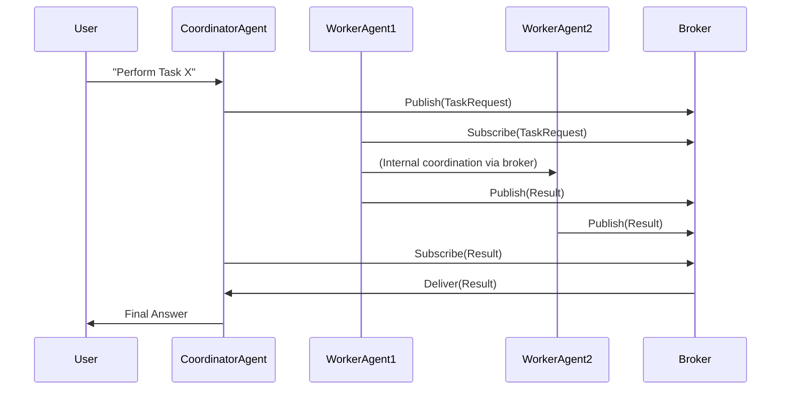

# Executive Summary
Multi-agent AI systems promise powerful collaboration but often fail when moving from pilot to production. In fact, ≈40% of multi-agent pilots fail within six months【11†L538-L546】. These failures rarely stem from model “hallucinations” alone; they arise from *distributed-system* issues like poor task decomposition, hidden coupling, and inconsistent state【2†L63-L68】. For **Dopemux**, a hypothetical large-scale multi-agent platform, we pre-mortem every aspect: architecture, individual agents, routing, UX, and memory. We identify dozens of failure modes (with likelihood/impact ratings) and propose concrete mitigations (design, runtime, tests) and hard constraints (guardrails, types, formal specs, monitoring).

We categorize failures into six areas:

- **Architectural Failures:** e.g. poorly defined boundaries, tight coupling, “state drift” across agents【5†L68-L74】【26†L57-L64】.
- **Agent Failures:** e.g. infinite loops, agents stopping too soon (“fake completion”), misuse of tools【18†L116-L122】【21†L64-L71】.
- **Routing Failures:** e.g. exponential cost growth, inconsistent outputs from nondeterministic agent interactions【13†L665-L674】【30†L147-L154】.
- **UX Failures:** e.g. cognitive overload, invisible background failures, interfaces that don’t match agentic behaviors【40†L115-L120】【40†L141-L148】.
- **Memory Failures:** e.g. polluted memory, redundant or conflicting entries, promoting transient data to long-term memory【28†L10-L14】【28†L46-L54】.

For each mode we detail: causes, real-world scenarios, likelihood (H/M/L), impact (H/M/L), detection signals (metrics/logs), and mitigation strategies (design-time, runtime, testing), including trade-offs. Tables compare all modes by likelihood/impact, and map mitigations to enforcement (guards, type checks, monitoring).

We list *hard constraints* (e.g. acyclic workflows, strict typing, budget limits) and enforcement mechanisms (runtime guards, CI tests, monitoring, audits). We suggest agent coordination patterns (prompts, I/O contracts) to enforce roles and invariants. We design unit/integration/“chaos” tests targeting each failure.

Finally, we outline an **integration pipeline**: feed these findings into *Claude Opus* (LLM synthesis), then into *GPT-5/Codex* for implementation planning, and validate with an *auditor model* for contradictions. Diagrams illustrate high-level flows and coordination protocols. Overall, this report provides a rigorous, prioritized pre-mortem for Dopemux to steer architecture and development, ensuring robustness before lines of code are written.

# 1. ARCHITECTURAL FAILURES
Architectural issues arise when system structure does not match responsibilities or dynamics. Below are key failure modes:

- **Poorly Defined Boundaries / Role Confusion:** Agents begin doing tasks outside their intended scope【15†L874-L882】. *Cause:* Ambiguous role definitions and fallback routing. *Example:* A “pricing” agent starts approving contracts (out of scope), because its prompt lacked strict roles【15†L874-L882】. *Likelihood:* Medium (common in early designs). *Impact:* High (undermines entire workflow). *Detection:* Audit logs showing tasks handled by unexpected agents; alerts on role mismatches. *Mitigation:* At design, define clear agent roles and strict task-to-agent mappings; at runtime, enforce input prompts that include role context; in testing, include regression tests assigning tasks to wrong agents. *Trade-offs:* Strict boundaries increase initial design work and may limit opportunistic coordination.

- **Hidden Coupling / Tight Inter-Agent Communication:** Direct, peer-to-peer links create an unmanageable mesh【5†L68-L74】. *Cause:* Agents directly calling each other without intermediaries. *Example:* With 10 agents, every pair might exchange messages (45 connections)【30†L147-L154】; a protocol change in one agent inadvertently breaks others. *Likelihood:* High if not planned; *Impact:* High (cascading failures, race conditions). *Detection:* Graph of message flows growing quadratically; lots of missed messages or inconsistent state across agents. *Mitigation:* Use a **message broker or task router** to decouple agents【5†L68-L74】 (e.g. Kafka topics). Define explicit APIs/schemas for communication (enforced via type-checks or JSON schemas). Testing: simulate partial broker failures or message delays. *Trade-offs:* Brokers add complexity and latency, but greatly improve scalability and resilience.

- **State Drift Across Agents:** Agents maintain divergent views of shared state【26†L57-L65】. *Cause:* Asynchronous updates, independent memory caches, or agents joining late. *Example:* Agent A and B both update a “project plan” stored in shared DB; A’s update reaches B only after B has made decisions. Over time, each agent’s context “drifts” from reality【26†L57-L65】. *Likelihood:* High in loosely synchronized systems; *Impact:* High (subtle, hard-to-debug errors). *Detection:* Discrepancies in logs, divergence metrics (e.g. count of unsynchronized changes). Monitor: sanity-check hashes of shared state snapshots across agents periodically. *Mitigation:* Enforce **monotonic state evolution** and *explicit propagation*【26†L79-L84】. For example, use consensus protocols for critical state, or require that **all** updates go through a single “state manager” agent with strict logs. In design, document which data is authoritative. In runtime, use atomic commits or version tags to catch stale reads. In testing, run long-lived simulations to measure drift. *Trade-offs:* Strong consistency may reduce concurrency and require locks; relaxed consistency (eventual) risks data conflicts.

**Other Architectural Risks:**
- **Bad API Contracting:** Undefined input/output schemas cause miscommunication. Mitigate by specifying strict I/O formats (e.g. JSON schemas) and validating all messages.
- **Insufficient Observability:** Lack of logging/tracing hides faults. (See mitigation in Section 6.)
- **Scalability Limits:** Architecture not designed for future scale leads to rework. Anticipate growth (horizontal scaling, load balancing).

**Table 1. Architectural Failure Modes (Likelihood/Impact)**

| Failure Mode                 | Description                                   | Likelihood | Impact |
|------------------------------|-----------------------------------------------|------------|--------|
| Hidden Coupling / Mesh       | Direct agent links (N*(N-1) connections)【5†L68-L74】 | High       | High   |
| State Drift                  | Divergent agent state views【26†L57-L65】      | High       | High   |
| Role Confusion / Bad Boundaries | Agents handling wrong tasks【15†L874-L882】  | Med        | High   |
| Poor I/O Contracts           | Unspecified schemas causing mis-parsing      | Med        | Med    |
| Inadequate Observability     | No logs/traces (see Section 6)                | High       | High   |

# 2. AGENT FAILURES
Failures at the agent level often involve logic or resource misuse. Key modes:

- **Infinite Loops / Unbounded Iteration:** An agent never stops due to poor termination criteria. *Cause:* Missing loop-break condition or over-ambitious exploration. *Example:* An agent that retries searching “find three references” but only finds one, yet keeps looping until timed out or budget exhausted. The *awesome-agent-failures* list categorizes this as a *Verification & Termination Failure*: “Agent…gets stuck in a loop due to poor completion criteria.”【38†L304-L312】. *Likelihood:* Medium to high (easy to overlook). *Impact:* High (resource exhaustion, hanging workflows). *Detection:* Long-running logs, high CPU/memory on agent threads, missing “TaskComplete” signals. Monitor timeouts and iteration counts. *Mitigation:*
  - **Design:** Use directed acyclic workflows (see Enforcement) to eliminate cycles【33†L431-L434】; require agents to include termination conditions in prompts.
  - **Runtime:** Impose step/time budgets (circuit-breaker timers), detect repeated outputs (hash history) and force termination.
  - **Testing:** Unit tests supply inputs known to cause loops, assert the agent either stops or raises an error. Chaos tests: randomly strip intermediate signals to simulate no progress.
  *Trade-offs:* Strict timeouts may kill valid long tasks; needs fine-tuning between liveness and safety.

- **Fake/Partial Completion (Premature Termination):** Agents claim to finish when tasks remain. *Cause:* Misidentifying goal achievement (e.g. no explicit “final answer”). *Example:* Agent asked “summarize 5 reports” returns after 1 summary and ends session, believing task done. This too is a *Verification & Termination* issue【38†L304-L312】. *Likelihood:* Medium; *Impact:* Medium (incomplete results, user confusion). *Detection:* Discrepancy between requested and delivered outputs (e.g. count-of-items mismatches). Use checks: if output schema requires “N items” but fewer appear, flag error. *Mitigation:*
  - **Design:** Require agents to output “completed: true/false” flags or explicit TODO lists.
  - **Runtime:** On receiving incomplete results, have a supervisor agent detect mismatch and re-invoke.
  - **Testing:** Write integration tests with complex goals (e.g. n-item tasks) to ensure agents do full work.
  *Trade-offs:* Extra verification steps add latency; risk redundant work if not carefully scoped.

- **Incorrect Tool Use / Tool Misuse:** An agent invokes a legitimate tool incorrectly or in unsafe ways【21†L64-L71】【38†L300-L304】. *Cause:* Ambiguous prompts, lack of intent validation, or overly powerful tool permissions. *Example:* A “support” agent wrongly uses a `DELETE_CUSTOMER` API instead of `ARCHIVE`, wiping data. The Snyk study calls this *tool misuse*: “an agent invokes authorized tools in unsafe, unintended ways”【21†L64-L71】. *Likelihood:* High (especially with broad tools); *Impact:* High (data loss, security breach). *Detection:* Unusual API call patterns (e.g. many deletes), alerts on critical tool usage, permission violation logs. *Mitigation:*
  - **Design:** Enforce *least-privilege*: each agent sees only needed subset of tool functions【21†L88-L91】. Use prompt constraints to whitelist operations.
  - **Runtime:** Validate tool arguments against schemas; sandbox tool execution; require human-in-loop for destructive actions. Use constitutional AI techniques (validator agent checking dangerous proposals)【15†L858-L865】.
  - **Testing:** Unit tests mocking tools: feed malicious or edge-case prompts to ensure agent doesn’t call forbidden actions. Penetration-style tests: e.g. attempt “del-all” patterns.
  *Trade-offs:* Restricting tools may limit agent effectiveness; additional checks add latency.

- **Role Misinterpretation / Overconfidence:** Agent undertakes tasks for which it is not designed. *Cause:* Over-general prompts or one agent overstepping. *Example:* A “data-analyst” agent starts modifying a database schema because it “decided” it was needed. This is similar to *Role Confusion* but at agent logic level. *Likelihood:* Low/Med; *Impact:* High. *Detection:* Agents producing output outside their spec (e.g. non-summary from a summarizer). Flag via type/schema mismatch. *Mitigation:* Incorporate role context in prompt (e.g. “You are only allowed to analyze data, not modify schemas”); enforce output schemas.

**Table 2. Agent-Level Failures (Likelihood/Impact)**

| Failure Mode               | Description                               | Likelihood | Impact |
|----------------------------|-------------------------------------------|------------|--------|
| Infinite Loop              | Agent loops without termination【38†L304-L312】  | Med        | High   |
| Premature Termination      | Agent stops before task is done【38†L304-L312】  | Med        | Med    |
| Incorrect Tool Use         | Misusing allowed tools (e.g. dangerous APIs)【38†L300-L304】【21†L64-L71】 | High       | High   |
| Overconfidence/Role Missteps | Agent acts outside its remit          | Med        | High   |
| Hallucination (Tool Output) | Agent trusts a wrong tool output (not listed but known risk)  | Med        | High   |

# 3. ROUTING FAILURES
Failures in message/task routing and multi-step flows can amplify costs and inconsistencies:

- **Token/Cost Explosion:** Coordination multiplies API calls. *Cause:* Sequential agent chains, verbose exchanges, redundant context passing. *Example:* Pilot cost $6 (3 agents×100 requests) but production cost $600/day (3×10,000×$0.02)【13†L665-L674】, or even $18K/month as shown. Chatty agents and context bloat are cited traps【13†L677-L685】. *Likelihood:* High (if unchecked); *Impact:* High (operation becomes unviable financially). *Detection:* Real-time monitoring of token usage and spending; alerts when exceeding budgets. *Mitigation:*
  - **Design:** Minimize agent hops (consider monolithic agent or function-calling instead of spawning new agent)【13†L654-L663】. Use parallel calls when possible.
  - **Runtime:** Enforce token limits per conversation; cache responses for repeated queries; use smaller LLMs for simple tasks【13†L691-L699】. Batch requests to reduce overhead.
  - **Testing:** Simulate high-volume workloads to measure cost growth; include “budget burn” tests.
  *Trade-offs:* Caching and smaller models may slightly reduce answer quality; setting token caps risks truncating needed info.

- **Latency Cascades:** Sequential agent steps add up delays. *Cause:* Synchronous chaining of agents (each waits for prior). *Example:* 3 agents taking 3s, 4s, 5s yields 12s response instead of 3s in a single agent【13†L706-L714】. *Likelihood:* High; *Impact:* High (poor UX). *Detection:* End-to-end latency tracking and SLA monitoring. *Mitigation:*
  - **Design:** Reorganize tasks to run in parallel where independent; use asynchronous agents or background processing for non-critical tasks【13†L732-L740】.
  - **Runtime:** Impose per-agent timeouts; use caching to avoid unnecessary calls. Provide incremental responses to user (hybrid fast+background model).
  - **Testing:** Load tests simulating user requests under different concurrency. Inject artificial slowdowns to see cascade effects.
  *Trade-offs:* Parallelism increases complexity (race conditions), may need conflict resolution.

- **Unpredictable/Nondeterministic Outputs:** Different runs yield different results due to LLM randomness or context drift. *Cause:* Stochastic LLM sampling, inconsistent contexts across agents. *Example:* Two execution of the same multi-agent workflow produce different final answers, undermining reliability. *Likelihood:* High (in any LLM-driven system); *Impact:* Medium-High (hard to reproduce bugs, user mistrust). *Detection:* Compare output variance across runs; track seed usage or model versions. *Mitigation:*
  - **Design:** Fix random seeds where possible; structure workflows so that branching is limited (DAGs)【33†L431-L434】. Use evaluation agents to double-check critical outputs.
  - **Runtime:** Log model versions and temperature settings; limit randomness (e.g. greedy decoding for final answers).
  - **Testing:** Regression tests under fixed seeds; A/B tests to quantify output drift.
  *Trade-offs:* Eliminating randomness may reduce creative solutions and coverage of corner cases.

- **Inconsistent State/Outputs:** Different agents might produce conflicting results on the same data. *Cause:* Poor synchronization or context fragmentation. *Example:* Two agents analyze budget data and each outputs a different summary, because each only saw part of the data. *Likelihood:* Medium; *Impact:* High (requires manual resolution). *Detection:* Automated checks for logical contradictions between agent outputs. *Mitigation:* Use a central datastore or knowledge base for sharing state【3†L250-L258】. Include conflict-detection logic in the workflow.

**Table 3. Routing & Coordination Failures (Likelihood/Impact)**

| Failure Mode               | Description                              | Likelihood | Impact |
|----------------------------|------------------------------------------|------------|--------|
| Token/Cost Explosion       | Exponential cost with more agents/tasks【13†L665-L674】 | High       | High   |
| Latency Cascades           | Slow sequential agent chain【13†L706-L714】    | High       | High   |
| Nondeterministic Results   | Random/stochastic outputs differ per run    | High       | Med    |
| Partial/Retry Failures     | One agent fails, others still run (inconsistent)【33†L509-L517】 | Med        | High   |
| Context Misalignment       | Agents see partial/outdated context      | Med        | High   |

# 4. UX FAILURES
User experience pitfalls can invalidate the system even if the tech works:

- **Cognitive Overload:** The system overwhelms users with complexity or choices. *Cause:* Too much information or autonomy without clear controls. *Example:* A fully-autonomous mode buries the user in logs; early automation UIs forced users to confirm every step, “introducing cognitive overload”【40†L115-L120】. *Likelihood:* High (especially at launch); *Impact:* High (user frustration, abandonment). *Detection:* User feedback surveys, task completion rates, time-on-task metrics. *Mitigation:*
  - **Design:** Follow “human-on-the-loop” patterns: allow users to steer or constrain agents【40†L115-L120】. Choose appropriate autonomy level (see Agentic UX). Provide intuitive dashboards; avoid requiring users to micro-manage every agent.
  - **Runtime:** Offer interactive override/pause controls; give users “explainability” (e.g. summary of what agents plan to do next)【40†L141-L148】.
  - **Testing:** Conduct UX studies with prototypes, measuring cognitive load (e.g. NASA-TLX). Include tasks that simulate real user workflows.
  *Trade-offs:* More user steps slows automation; balance by adaptive autonomy (gradually increasing agent freedom as trust builds).

- **Invisible Failures (Opaque Agent Actions):** Agents work silently behind the scenes, hiding errors. *Cause:* No feedback/progress display, logs not surfaced. *Example:* An agent fails early in a chain, but final user sees only silence or a wrong answer. *Likelihood:* High; *Impact:* High (users unaware until unhappy). *Detection:* Low user satisfaction, repeated queries. *Mitigation:*
  - **Design:** Implement *progress reveal* – show intermediate steps or status messages【40†L141-L148】. Use notifications or dashboards to indicate agent activity.
  - **Runtime:** If a sub-agent fails, alert the user (e.g. “Analysis agent timed out, trying fallback”).
  - **Testing:** Simulate partial failures; check the UI shows warning messages rather than blank screens.
  *Trade-offs:* Revealing partial info can confuse users not expecting it; must balance transparency with clarity.

- **Unusable/Dynamic Interface:** Traditional static UIs may not fit agentic flows. *Cause:* Expecting agents to fit into old chatbot or web UI paradigms. *Example:* A rigid form-based UI cannot capture multi-turn agent dialogues or emergent workflows. *Likelihood:* High; *Impact:* Medium (frustration, poor adoption). *Mitigation:*
  - **Design:** Use “generative UI” patterns【40†L155-L164】. For example, let agents generate forms or views on-the-fly based on tasks.
  - **Testing:** Include usability tests focusing on agent-specific UI elements (e.g. dynamic menus, visualizations of RAG contexts).

**Table 4. UX Failure Modes (Likelihood/Impact)**

| Failure Mode         | Description                                   | Likelihood | Impact |
|----------------------|-----------------------------------------------|------------|--------|
| Cognitive Overload   | Too much autonomy/info ⇒ user confusion【40†L115-L120】 | High       | High   |
| Invisible Failures   | Failures hidden from user (agents “silent” errors)【40†L137-L140】【40†L141-L148】 | High       | High   |
| Unusable Interfaces  | Mismatch between dynamic agent actions and static UI  | High       | Med    |
| Loss of Control      | User feels out of the loop (over-automation)【40†L115-L120】 | Med        | High   |

# 5. MEMORY FAILURES
Multi-agent systems often rely on memory stores (short- or long-term) for context. Failure modes include:

- **Memory Pollution:** Irrelevant or incorrect data accumulates, degrading quality【28†L10-L14】. *Cause:* Storing everything, including noise or disinformation. *Example:* Agents gradually ingest user chats, including off-topic content (“The Earth is flat”), polluting knowledge. *Likelihood:* High (if memory is unfiltered); *Impact:* Medium (leads to hallucinations or wrong decisions). *Detection:* Sudden drop in accuracy or coherence; flag contradictions (e.g. known facts contradicted). *Mitigation:* Strategies from best practices: validate/sanitize inputs before storage【28†L17-L25】; use expiration policies (time or usage thresholds)【28†L27-L34】; filter context by relevance (semantic matches)【28†L36-L44】. Regularly audit memory for duplicates or conflicts【28†L46-L54】. *Trade-offs:* Aggressive filtering risks losing useful context; must tune thresholds.

- **Memory Duplication:** The same information is stored multiple times in memory. *Cause:* Lack of de-duplication on writes. *Example:* Different agents add identical summaries of a document, cluttering the memory store. *Likelihood:* High; *Impact:* Low-Med (wastes space, may cause retrieval noise). *Detection:* Identical or highly similar entries detected by automated diff or embedding similarity. *Mitigation:* Before writing, check similarity to existing memories (using hashing or vector similarity). Merge duplicates or drop redundant entries. Implement garbage collection cycles. *Trade-offs:* Extra computation on write; risk false duplicates merging distinct facts if threshold too low.

- **Wrong Promotion (False Long-Term Storage):** Transient conversation details are treated as permanent knowledge. *Cause:* Over-zealous memory retention or misguided memory classification. *Example:* Agent’s ephemeral intermediate “scratchpad” (like debugging info) gets stored as a fact. *Likelihood:* Medium; *Impact:* Medium. *Detection:* Inconsistencies between memory and authoritative data sources; user notices agent “remembering” irrelevant details. *Mitigation:* Define clear *tiers* of memory (ephemeral vs. long-term). Only promote memory when passing review (e.g. a verifier agent must confirm a fact before storage). Include feedback loops: if memory leads to error and is flagged, remove it. Automated memory audits to remove out-of-domain info. *Trade-offs:* More complex memory architecture; may miss capturing valid context if too strict.

**Table 5. Memory Failure Modes (Likelihood/Impact)**

| Failure Mode         | Description                                      | Likelihood | Impact |
|----------------------|--------------------------------------------------|------------|--------|
| Pollution            | Irrelevant/false info in memory【28†L10-L14】       | High       | Med    |
| Duplication          | Storing redundant entries【28†L46-L54】           | High       | Low    |
| Wrong Promotion      | Ephemeral info saved as fact                      | Med        | Med    |
| Incomplete Recall    | Loss of needed context (not enough memory)        | Med        | High   |

# 6. WHAT TO ENFORCE (Hard Constraints & Guards)
Preventing failures requires **hard constraints** and strict enforcement at design/runtime. Below is a prioritized checklist of constraints with enforcement strategies:

- **Acyclic Execution Flows:** Enforce DAG or FSM architectures to guarantee termination【33†L431-L434】. (No unbounded loops.) *Enforcement:* Use workflow engines or orchestrators where the execution graph is defined ahead of time; disallow agents from spawning sub-agents in an ad-hoc loop. Static analysis of prompts can check for “goto” patterns.

- **State Consistency Invariants:** Architect *monotonic state evolution* and *total propagation*【26†L79-L84】. For any write, ensure all agents see it or no partial writes occur. *Enforcement:* Use versioned stores or event sourcing; require commit acknowledgments. Formal methods: specify state topology and use model checking for critical invariants.

- **Strict Role & Schema Contracts:** Every agent’s inputs/outputs must follow a fixed schema. *Enforcement:* Employ a *type system* or JSON schema for messages. Validate payloads at runtime (as in [33] Node I/O validation). Prompt engineering: include “You must output JSON with fields X,Y,Z; no other content.” Use rapid response format checking (e.g. with function calls in LLMs).

- **Permission & Tool Scopes:** Agents get *least-privilege* tools and data【21†L88-L91】. *Enforcement:* At runtime, use permission tokens for API access; sandbox critical tools. In deployment, audit agent-to-tool mappings. Formal spec: list allowed operations per agent and verify at startup.

- **Resource Budgets & Timeouts:** Limit token usage, execution time, and iteration counts. *Enforcement:* Implement runtime guards/circuit breakers (e.g. kill processes hitting limits). Integrate monitoring alerts when budgets are near exhaustion.

- **Observability & Logging Requirements:** Mandate structured logging and tracing for *all* inter-agent events【3†L292-L300】. *Enforcement:* Architecture must include tracing (OpenTelemetry) by default. Log formats and correlation IDs are part of design contract. CI tests verify that logs are present and parseable.

- **Continuous Evaluation Constraints:** Define golden datasets for regression tests (per [3] continuous eval). *Enforcement:* Build these tests into CI; require periodic runs where agents must score above threshold on held-out tasks.

- **Prompt and Context Guards:** Use *“controller” prompts* that vet or modify agent outputs. For example, for each inter-agent message, prepend “Confirm compliance: …”【15†L858-L865】. *Enforcement:* A validator agent or module checks each message against content rules (e.g. detect instructions injected into content).

**Table 6. Mitigations ⇒ Enforcement Mechanisms**

| Mitigation Strategy         | Enforcement Mechanism       |
|-----------------------------|-----------------------------|
| Decouple via broker         | Message broker (Kafka) & schema validation |
| Agent acyclic workflow      | Workflow engine/DAG or FSM (no loops)【33†L431-L434】 |
| Role-bound prompts          | Prompt templates with explicit role fields; static task mapping【15†L898-L902】 |
| Input/output schema checks  | Type systems / JSON schemas; automated validation【33†L491-L499】 |
| Least-privilege tools       | API access controls; tool registry with capability flags |
| Budget/time limits          | Runtime guardrails (timeouts, max tokens); cost monitors |
| Observability (logging)     | Logging/Tracing middleware (OpenTelemetry)【3†L292-L300】; correlation IDs |
| State invariants           | Versioned state store; enforce commit/rollback protocols【26†L79-L84】 |
| Memory hygiene              | Memory pipeline filters; periodic audits (scripts)【28†L17-L25】【28†L46-L54】 |
| Monitoring & Alerts         | Metrics (latency, success, errors) and alerts【3†L292-L300】 |
| Formal specs & tests        | CI with unit/integration tests; formal verification for critical modules |

**Prompts & I/O Contracts for Coordination:**
Design agent prompts and APIs with clear contracts. For example, in a task workflow:

- **Coordinator Agent** prompt (Input: user query; Output: JSON list of sub-tasks and responsible agent names):
  *Input:* `{"user_request": <text>, "context": <structured>}`
  *Prompt:* “You are the Central Planner. Given the user request, output a JSON array of tasks with fields `{id, description, assigned_agent_role}`. Do not execute any tasks yourself.”

- **Worker Agent** prompt (Input: task with context; Output: result object):
  *Input:* `{"task_id": <id>, "description": <text>, "relevant_context": <text>}`
  *Prompt:* “You are a `<assigned_role>` agent. Given the task description and context, produce a JSON response `{task_id, output}`, where `output` contains the completed work. Only return the JSON; do not include explanation text.”

- **Feedback/Verifier Agent** (checks outputs):
  *Input:* `{"task_id": <id>, "output": <agent_output>, "requirements": <constraints>}`
  *Prompt:* “Validate whether `output` satisfies the requirements. Return JSON `{task_id, valid: true/false, issues: [..]}`.”

Each prompt should specify format and enforce boundaries (e.g. agent roles, required JSON keys). Use "You must not..." constraints to prevent overreach【15†L874-L882】【15†L898-L902】.

# 7. TESTING AND VALIDATION STRATEGIES

**Example Tests for Each Failure Mode:**

- **Architectural (Hidden Coupling):** *Unit:* Send messages between all agent pairs in isolation, ensure none bypass the broker. *Integration:* Stress test with N agents in a mesh; verify connectivity equals expected fan-out. *Chaos:* Kill an agent node; ensure system degrades gracefully (circuit-breaker).

- **Agent (Infinite Loop):** *Unit:* Provide loop-prone inputs (e.g. unanswered queries) and assert agent terminates within budget. *Integration:* Orchestrate agents that call each other; measure no agent hogs >`X` tokens/seconds. *Chaos:* Simulate network drop mid-loop; ensure agent catches and halts.

- **Routing (Cost Explosion):** *Unit:* Compare cost of single vs multi-agent approach on same task. *Integration:* Deploy full pipeline with mock LLM and count tokens, verify cost < threshold. *Chaos:* Burst many parallel requests; ensure cost spikes trigger alerts.

- **UX (Cognitive Overload):** *Unit:* Evaluate response time on UI tasks; ensure summaries fit readability thresholds. *Integration:* Run user-session simulations tracking attention metrics. *Chaos:* Flood the interface with rapid requests; observe if UX still usable.

- **Memory (Pollution):** *Unit:* Insert junk data and assert it’s filtered or expires. *Integration:* Fill memory with semantically unrelated facts; test agent reasoning for noise. *Chaos:* Corrupt a subset of memory store; verify detection and cleanup routines.

# 8. INTEGRATION PIPELINE

We plan to use a staged AI tooling workflow for development:

```mermaid
flowchart LR
    A[Failure Analysis (this report)] --> B(Claude Opus: Synthesis)
    B --> C(GPT-5/Codex: Implementation Plan)
    C --> D(Auditor Model: Contradiction Check)
    D --> E[Revised Specs and Code]
```

1. **Claude Opus (Synthesis):** Aggregate these findings into coherent design documents or feature requests. Claude can refine priorities and highlight implicit assumptions.
2. **GPT-5/Codex (Implementation Planning):** Generate code skeletons, test case templates, and configuration (e.g. broker setup, prompts) based on the strategy.
3. **Auditor Model (Contradiction Detection):** Analyze the outputs for logical inconsistencies or unmet requirements. For example, ensure that a proposed mitigation doesn’t conflict with another (guard vs. usability). This “human-like” audit closes feedback loops.

Each step ingests structured input and outputs should be checked by automated tests and human review to ensure fidelity.

**Diagrams and Flow:** Below is a simplified sequence of agent coordination in the proposed architecture:



This shows user request flow through a central coordinator and message broker to multiple worker agents, each with defined I/O contracts (JSON messages). Robust logging and correlation IDs (not shown) trace each step.

# Sources
We cite recent industry and research literature on multi-agent architectures and AI agents to substantiate these points【5†L68-L74】【18†L116-L122】【21†L64-L71】【26†L57-L65】【28†L10-L14】【33†L509-L517】【40†L115-L120】. These include case studies and taxonomy papers demonstrating real-world failure modes, as well as practical guidelines from AI engineering blogs and security experts【13†L665-L674】【15†L874-L882】. Each section above includes linked sources for further detail.
