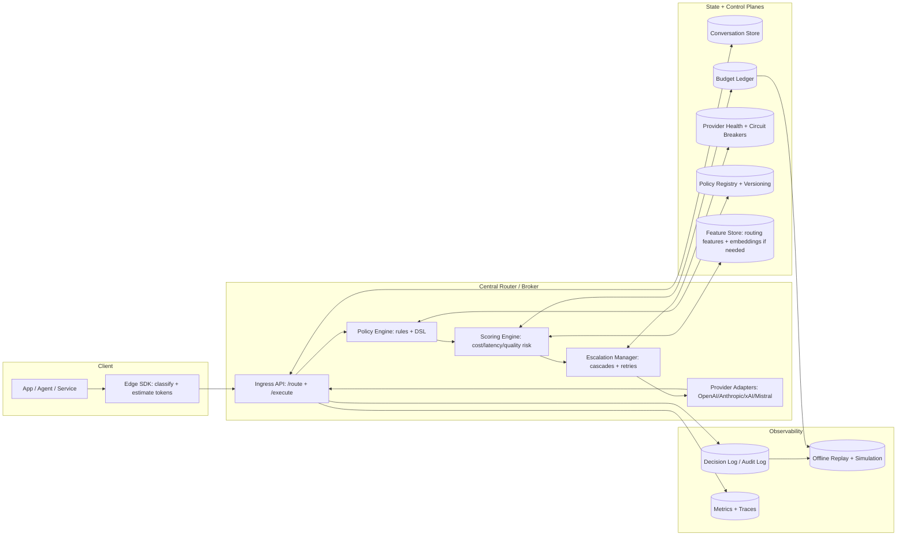
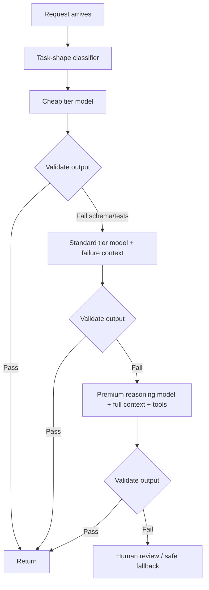

# Multi-LLM Routing and Cost Optimisation System Design

## Executive summary

A multi-LLM router is (a) a deterministic *decision system* and (b) a best-effort *execution system* layered on top of multiple non-deterministic providers. The practical objective is not “always pick the cheapest model,” but “hit quality and latency targets at the lowest *expected* cost while remaining robust to provider outages and drift.” This design treats routing as an explicit, versioned policy and optimisation problem, then makes execution reproducible via **idempotency, provenance logging, stable tie-breaking, and (when supported) model seeding/fingerprints**. citeturn2search0turn2search1turn3search2turn7search0turn9search2

Key recommendations (implementation-oriented):

The routing plane should be **centralised** (single broker) for policy control, budget enforcement, security, and observability, but augmented with **edge hints** (e.g., task-shape classification, token estimation, user-context normalisation) for latency reduction. This aligns with provider realities: stateful server-side sessions exist in some APIs (e.g., certain Responses APIs), but portability and governance are best achieved with **application-owned state** plus provider state used opportunistically for cache hits/latency. citeturn3search0turn4search1turn7search3turn7search6turn16search15

Routing policies should be:
- **policy-as-code**, compiled to a deterministic decision graph, fully versioned, and evaluated in “shadow mode” before activation.
- **role-based + task-shape-based**, with explicit fallback/escalation chains (cost tiers) and per-role budgets.
- **observable**: every decision emits a “why” explanation, including the rule path, constraints, predicted cost/latency, and provider health. citeturn2search1turn2search33turn4search10turn5search3turn7search0

Cost control should combine:
- **pre-flight token estimation** using provider token counting endpoints when available (for exactness with tools/images/files), plus local approximations for fast-path decisions,
- **real-time budget enforcement** (hard stops + soft degrade),
- **post-flight accounting** using provider usage objects, and
- **offline simulation/replay** (batch APIs + policy replay). citeturn4search0turn5search2turn5search1turn10search1turn15search1

For multi-model strategies:
- Prefer **single-model execution** for most requests.
- Use **cascades** (cheap-first, escalate-on-failure) for cost reduction (supported by both academic work and production patterns).
- Use **parallel/ensemble** strategies only when the value of reduced error risk exceeds the extra cost/latency (e.g., high-stakes decisions, adversarial inputs, or known brittle tasks). citeturn2search0turn2search1turn2search29turn2search33turn15search14

Determinism strategy: make decision-making deterministic everywhere; make model output deterministic where the provider supports it (e.g., seed + fingerprint, or explicit random seed), otherwise achieve “effective determinism” through caching and idempotent replay. citeturn12search2turn8search0turn9search2turn3search2turn13view0

## System goals and assumptions

Assumptions (explicitly tunable):

Latency targets:
- Interactive: P95 end-to-end ≤ 2.0 s for “cheap tier” tasks; ≤ 6.0 s for “standard tier”; ≤ 20 s for “premium reasoning.” (Token generation dominates latency; output length is the largest lever.) citeturn4search10turn4search12
- Offline: up to 24 hours turnaround acceptable for batch jobs.

Budget targets:
- Per-request budgets expressed in currency (or credits) and mapped to token/compute estimates per provider.
- Per-tenant monthly hard cap enforced centrally; per-role sub-budgets enforced per request/session.

Providers and capabilities:
- Providers include OpenAI, Anthropic, xAI, and Mistral.
- Batch processing at ~50% discount is available from multiple providers and should be the default for offline evaluation/enrichment workloads. citeturn4search0turn5search1turn6search1turn10search1

Governance/security:
- Router runs in a trusted environment (not in the browser); client apps use short-lived or scoped tokens where relevant (for certain realtime flows), and never hold long-lived provider keys. citeturn3search14turn16search15
- Data retention is policy-controlled; provider-side state is used only if allowed by tenant policy.

Quality objectives:
- “Correctness” is task-specific; the router must support pluggable evaluators (unit tests, schema validators, LLM-as-a-judge, human review sampling). Using stronger reasoning models as evaluators is a documented production pattern. citeturn3search7turn15search13

## Routing architecture

The architecture separates concerns into: **decision plane**, **execution plane**, **state plane**, and **observability plane**.

### Reference architecture



This centralised broker pattern is the only design that cleanly enforces global budgets and consistent policies under outage conditions; placing routing fully at the edge tends to fragment policy and complicate secrets and auditability. However, *edge hints* (local token estimation, simple task classification) reduce latency and reduce router CPU cost. citeturn4search10turn3search0turn15search1turn5search3turn7search0

### Placement options and trade-offs

Central broker (recommended default):
- Pros: single policy source of truth; supports global budget enforcement and cohort-level experimentation; simplest to instrument and audit. citeturn17view0turn16search5
- Cons: adds one network hop; must be highly available.

Edge routing:
- Pros: lower latency; can be resilient to broker outages.
- Cons: moving policy and keys to the edge increases attack surface; inconsistent routing decisions across versions; difficult to do cross-tenant budgeting and uniform fallback. citeturn16search15turn3search14

Hybrid (pragmatic high-scale):
- Edge computes **task-shape + rough token estimate + privacy classification**; broker computes final decision and executes. This is often the best latency/cost balance because token generation dominates anyway, but the edge can prevent obvious waste (e.g., routing a simple classification to a premium model). citeturn4search10turn4search12turn2search0

### State management and consistency

You should plan for four state modes, selected per tenant/policy:

Application-owned state (recommended):
- Store conversation turns, tool calls, and outputs in your own store.
- Pros: portable across providers; supports strict retention policies.
- Cons: you pay for re-sending context unless prompt caching or compaction is used. OpenAI explicitly documents prompt caching and context management mechanisms to mitigate this. citeturn4search1turn12search21turn15search14turn15search23turn16search15

Provider-owned state (selectively):
- Some Responses-style APIs can store conversation state server-side and allow continuation by ID, with retention windows (e.g., 30 days in at least one provider’s Responses API) and explicit `store` controls. Use this **only** if tenant policy allows provider-side storage. citeturn7search3turn7search6turn7search0
- Critical nuance: even with stateful APIs, you can still be billed for full conversation history; caching may reduce cost, but do not assume “free history.” citeturn7search2turn7search3turn7search11

Stateless provider APIs:
- Some providers’ primary message APIs are documented as stateless and require sending the full history each time. This pushes you toward application-owned state + prompt compaction/caching patterns. citeturn11search0turn5search12

Deterministic “state snapshots”:
- For deterministic replays, store (a) the exact normalised prompt, (b) tool schemas, (c) any reasoning artefacts required to continue a multi-turn interaction statelessly (some APIs support encrypted reasoning artefacts for this), and (d) routing decision provenance. citeturn15search14turn14view3

### Security and privacy controls

Provider key handling:
- Keys never leave the broker; where a provider supports browser/session tokens (e.g., realtime client secrets), mint those server-side with strict TTL and session config, and bind them to tenant and policy. citeturn3search14turn16search15

Data retention and “stored state”:
- OpenAI documents multiple data categories (including abuse monitoring logs and application state persisted by some features). Ensure your tenant policy explicitly governs whether you enable features that persist provider-side state. citeturn16search15
- Anthropic documents eligibility for Zero Data Retention for features and also provides admin/monitoring APIs; use those to support regulated tenants. citeturn11search0turn16search5turn16search9
- xAI documents that Responses are stored for 30 days by default (and can be deleted/disabled depending on API usage); treat this as a data residency/retention decision. citeturn7search0turn7search3turn7search6

Idempotency:
- Router should implement idempotency for *execution* (to prevent duplicate charges on retries) regardless of provider behaviour, following common API idempotency patterns as used in payments APIs. citeturn3search2turn3search5turn3search8turn17view0turn37search37
  (This is one of those “boring, critical engineering” points: if your router doesn’t dedupe requests, your cost optimisation system will ironically become a cost amplifier during transient failures.)

## Route policy design

Routing policy is a product surface. Treat it like: **versioned code + change management + tests**.

### Policy dimensions and rule precedence

Recommended precedence order:

Hard constraints (must):
- data residency / storage allowed
- allowed providers/models
- maximum request latency class (interactive vs offline)
- safety tier requirements and tool permissions

Then optimisation (should):
- minimise expected cost under a minimum expected quality
- minimise expected latency under a maximum budget
- enforce quotas and per-role spend

Finally preferences (nice-to-have):
- provider affinity (e.g., keep a tenant on a negotiated contract tier)
- experimentation assignment

This mirrors the “routing as constrained optimisation” framing used in routing/cascade research: choose models to optimise a utility subject to budget/quality constraints. citeturn2search0turn2search33turn2search1

### Task-shape routing

A practical taxonomy (you can extend) that maps well to cost profiles:

- classification / extraction (short output, schema-bound)
- summarisation (moderate output, compression ratio)
- code generation / refactoring (structured, correctness-sensitive)
- complex reasoning / planning (longer thinking, higher variance cost)
- tool-heavy agent steps (tool orchestration, can explode token use)

OpenAI explicitly distinguishes “reasoning models” vs “workhorse GPT models” and recommends mixing them (planner vs executor). That advice generalises well to multi-provider environments: use high-reasoning models sparingly as planners/judges and cheaper models for execution steps. citeturn3search7turn15search14

### Fallback chains and escalation rules

Escalation must be explicit and deterministic:

- Fallback: provider failure/429/timeout triggers a switch to a different provider/model in the same tier (or next tier down).
- Escalation: quality failure triggers re-run on a higher tier model (or a different provider) with additional context (e.g., critique, constraints, or test failures).

Mermaid escalation chain (illustrative):



Validation should be multi-layer:
- schema validation (JSON schema / tool outputs)
- lightweight heuristics (length caps, forbidden tokens)
- unit tests for code (where feasible)
- optional “judge” evaluation (strong model grades weak response), which is widely used in practice and appears in provider guidance. citeturn3search7turn9search2turn9search3turn15search13turn15search14

### Policy language/DSL

You want a DSL that:
- is human-auditable,
- compiles to a deterministic decision DAG,
- embeds versioning and rollout metadata,
- supports partial evaluation (fast “can this request ever go to provider X?”).

A minimal YAML-like policy shape:

- `match`: predicates on role/task/tenant/privacy/latency class
- `constraints`: hard limits (max_cost, max_latency, allowed_storage)
- `candidates`: ordered tiers, each tier a set of `(provider, model_family)` with weights
- `escalation`: conditions → next tier
- `fallback`: error classes → alternate candidates
- `observability`: fields to log and sampling rates

The router compiles this to:
- a **candidate generation function**
- a **scoring function**
- a deterministic **tie-break function**
- an **escalation graph**

Versioning and rollout:
- Semantic version policy `policy_id@major.minor.patch`.
- Rollout via feature flags: shadow evaluate decisions for X% traffic, then canary execute for Y%, then ramp. OpenAI documents that ramping too fast can trigger tier downgrades for priority processing; similar ramp concerns exist across providers, so gradual traffic shifts are a routing policy *requirement*, not a nice-to-have. citeturn4search3turn3search0turn5search3turn6search3turn10search2

### Example route policy table

This is a concrete starting point. Replace model names with your organisation’s current “approved models” list and negotiated tiers; the important part is **tier structure + explicit escalation**.

| Role | Task shape | Default tier | Allowed providers | Escalation trigger | Escalation tier | Notes |
|---|---|---:|---|---|---:|---|
| Customer Support Agent | classification (intent, routing) | Cheap | OpenAI / Mistral | schema fail or low confidence | Standard | Cheap tier should be schema-bound; use strict JSON outputs where supported. citeturn9search2turn14view3 |
| Customer Support Agent | summarisation (ticket recap) | Standard | OpenAI / Anthropic / Mistral | user-visible error or policy mismatch | Premium reasoning | Promote only when summaries are used for decisions; otherwise keep standard. citeturn3search7turn15search14 |
| Data Enrichment Worker | extraction at scale | Batch cheap | OpenAI Batch / Anthropic Batches / xAI Batch / Mistral Batch | batch error rate > threshold | Batch standard | Multiple providers offer ~50% batch discounts; default to batch for offline. citeturn4search0turn5search1turn6search1turn10search1 |
| Developer Tooling | code generation (small) | Standard | OpenAI / Anthropic / xAI / Mistral | tests fail | Premium reasoning or alternate provider | Prefer deterministic seeds where supported for CI reproducibility. citeturn12search2turn9search2turn8search0 |
| Decision Support | complex reasoning | Premium reasoning | OpenAI / Anthropic / xAI | validator/judge fail | Premium reasoning + parallel verify | Consider parallel judge or self-consistency only here. citeturn2search1turn15search14turn2search33 |
| Research Assistant | tool-heavy (web/files) | Standard reasoning | OpenAI / Anthropic / xAI | tool failure or missing citations | Premium reasoning + tool constraints | Use encrypted reasoning artefacts for stateless continuation where required. citeturn15search14turn5search8turn7search15 |

## Cost control system

Cost control is where routers usually fail in production: token costs are only part of it; retries, tool calls, long-context pricing, caching, and batch discounts all distort naive accounting.

### Cost primitives and accounting model

Recommended normalised cost representation:

- `cost_estimate_microunits`: predicted cost in micro-currency units (e.g., USD * 1e6)
- `cost_actual_microunits`: from provider usage after completion
- `cost_components`: `{ input_tokens, cached_input_tokens, output_tokens, reasoning_tokens, tool_calls, containers_minutes, ... }` mapped to provider semantics.

Provider-specific signals you can and should use:

OpenAI:
- Batch API offers **50% lower costs** and a 24-hour turnaround, useful for evals/classification/embeddings at scale. citeturn4search0
- Prompt caching can reduce latency and input token costs significantly, and works automatically; caching details appear in `usage` for requests. citeturn4search1turn15search26turn15search23
- Flex processing trades latency/availability for lower cost (beta). citeturn4search6
- Priority processing trades higher token cost for lower latency, and has ramp-rate considerations. citeturn4search3turn4search2
- Exact input token counting via a dedicated endpoint that accepts Responses-style inputs, including tools/files/images. citeturn15search0turn15search1
- Organisation-level cost and usage reporting endpoints exist in the admin surface. citeturn17view0turn16search2

Anthropic:
- Messages API is stateless; always send full conversation. citeturn11search0
- Prompt caching exposes `cache_read_input_tokens` and `cache_creation_input_tokens`, which is critical for correct cost attribution and rate-limit planning. citeturn5search12turn5search3
- Message Batches API offers async processing with **50% discount** on usage for batch workloads. citeturn5search1
- Token counting API is available and free (subject to RPM limits), enabling pre-flight exact token estimation. citeturn5search2
- There are explicit **spend limits** and **rate limits** documented; integrate these signals into your quota enforcement. citeturn16search9turn5search3
- Admin “cost report” endpoint exists for billing integration. citeturn16search5

xAI:
- Rate limit tiers are spend-based; the docs describe cached prompt tokens and how to increase cache hit rates via a stable conversation header (`x-grok-conv-id`). citeturn6search3turn6search0
- Batch API offers **50% off standard token pricing** for eligible workloads; batch results include cost tracking. citeturn6search1turn16search3
- Responses API stores responses for 30 days by default; continuing by response ID makes multi-turn cheaper in bandwidth but not necessarily in billed history. citeturn7search0turn7search2
- Management API supports programmatic API key creation with QPS/QPM/TPM limits and audit logs, enabling central quota enforcement outside the router as an extra guardrail. citeturn6search10turn16search11

Mistral:
- Exact `random_seed` exists in chat endpoints, enabling deterministic sampling when set. citeturn9search2turn9search3
- Batch Inference is documented and supports file-based or inline batching; use it for large offline workloads. citeturn10search1
- Rate limits are workspace-level with both RPS and token-based limits. citeturn10search2
- `n` is supported and input tokens are billed once (relevant for “best-of-N” strategies, though you still pay output). citeturn9search2

### Budget enforcement: hard vs soft controls

Hard controls (must not exceed):
- Per-request max cost (e.g., “no more than $0.02”)
- Per-tenant monthly cap
- Per-session cap
- Per-workspace/provider cap (to avoid a single provider runaway)

Soft controls (can exceed with justification):
- Escalation budgets (e.g., allow +50% if validator fails)
- Time-of-day cost shaping (e.g., offline tasks go to batch overnight)

Escalation triggers include:
- validator failure (schema/tests), or
- self-reported uncertainty, or
- “high-risk” classification of the input (adversarial, policy-sensitive).
These align with cascade routing literature where deferral/escalation is based on a learned or heuristic “hardness” estimator. citeturn2search0turn2search33turn2search29

### Simulation and replay tooling

A cost router without replay/simulation is a guess. You want:

- Policy replay: run historical requests through new policy without executing, to see decision deltas.
- Counterfactual execution: execute a sampled subset with multiple candidate models using batch APIs where possible to reduce cost. citeturn4search0turn5search1turn6search1turn10search1
- Cost/quality frontier estimation: measure “quality vs $” curves per task type; update weekly.

The RouteLLM and FrugalGPT lines of work provide concrete frameworks for learned routing and cascades; they are useful both as algorithmic guidance and evaluation methodology references. citeturn2search0turn2search1turn2search5turn2search33

## Multi-model comparison and ensemble strategies

### Capability matrix

This matrix is intentionally feature-level (because model-quality rankings change frequently). It’s the matrix your policy compiler should reference for “can I do X on provider Y under constraint Z?”

| Capability | OpenAI | Anthropic | xAI | Mistral |
|---|---|---|---|---|
| Stateful “Responses”-style continuation by ID | Yes (Responses + conversations) citeturn13view0turn15search14 | Primarily stateless Messages API citeturn11search0 | Yes; Responses API with stored responses (30 days) citeturn7search0turn7search3 | Agents & conversations exist, but chat is typically stateless; treat as app-owned unless explicitly using Agents API citeturn9search4 |
| Batch API or batch inference | Yes; 50% lower costs citeturn4search0 | Yes; 50% discount citeturn5search1 | Yes; 50% discount for eligible text citeturn6search1turn16search3 | Yes; Batch Inference citeturn10search1 |
| Prompt caching | Yes; automatic; can reduce latency/cost significantly citeturn4search1turn4search5 | Yes; explicit cache token fields citeturn5search12turn5search3 | Yes; cached tokens + cache hit header guidance citeturn6search3 | Not a primary documented primitive in the same way; rely on batching/short prompts unless otherwise documented citeturn10search1 |
| Exact token counting endpoint | Yes; `/responses/input_tokens` citeturn15search0turn15search1 | Yes; token counting API citeturn5search2 | Yes; Tokenize Text API + console tokenizer citeturn6search3turn6search0 | Not highlighted as a separate service; use request estimates + response usage citeturn9search2 |
| Deterministic seed parameter | Chat Completions: `seed` + fingerprint for mostly deterministic outputs citeturn12search2turn13view1 | No documented seed; focus on stable sampling settings (note parameter constraints). citeturn1search1turn11search0 | No explicit seed documented; use `system_fingerprint` + fixed sampling, and cache/idempotency for effective determinism citeturn8search0turn6search0 | Yes; `random_seed` citeturn9search2turn9search3 |
| Provider fingerprint for drift detection | Historical `system_fingerprint` concept exists (chat) citeturn12search2turn4search11 | No direct analogue; rely on model version IDs and eval drift tracking citeturn1search1 | Yes; `system_fingerprint` citeturn8search0turn6search0 | Not a central primitive; rely on model/version + eval drift citeturn9search2 |
| Spend/cost reporting APIs | Org costs endpoint citeturn17view0 | Admin cost report citeturn16search5 | Batch costs + console credit accounting + audit logs citeturn16search3turn16search7turn6search10 | Console-based; integrate via internal ledger unless API added citeturn10search2 |

### When to run parallel models vs single

Single model (default):
- Most classification, extraction, summarisation, and routine code tasks should be single-pass with strict output constraints. The cost benefit of parallelism rarely outweighs its expense. citeturn4search12turn2search0

Cascades (recommended for cost optimisation):
- Cheap model first; validate; escalate if needed.
- This is directly aligned with FrugalGPT’s LLM cascade framing and later routing work, which show large cost reductions with minimal quality loss when routing/deferral is effective. citeturn2search0turn2search1turn2search29turn2search33

Parallel strategies (use sparingly):
- High-stakes: run two diverse models in parallel and use a judge/validator to select.
- Adversarial/noisy inputs: parallel can reduce single-model brittle failures.
- Latency-critical with speculative patterns: in research, speculative/cascade hybrids can reduce latency/cost, but these are more deployment-complex than standard cascades. citeturn2search17turn2search35

Ensemble patterns you can encode in policy:

- Best-of-N within one provider: use `n` to generate multiple candidates when supported and pick the one that passes constraints; note that at least some APIs bill input tokens once for `n`. citeturn9search2
- Cross-provider diversity: model A generates answer, model B critiques, router decides whether to accept or escalate. This is close to “router + judge” schemes and is compatible with RouteLLM-like “preference data” training. citeturn2search1turn3search7

## Failure handling and operability

Failures are not rare at scale: rate limits, overload, and transient network errors should be designed-in, not patched-in.

### Provider failure modes to model explicitly

OpenAI:
- Documented error codes include 429 (rate limit/quota), 500/503, etc. citeturn3search2
- Official SDKs retry certain error classes by default (connection errors, 408, 409, 429, and ≥500), which you must account for in your own retry budget and idempotency. citeturn3search8turn3search5turn3search15

Anthropic:
- Streaming may emit error events (e.g., overload) and code should handle unknown event types to be future-proof. citeturn5search9
- Rate limits include both spend limits and request/token limits; budget + throttling should be integrated. citeturn16search9turn5search3

xAI:
- Debugging docs enumerate standard HTTP error categories; rate limits are tier-based and 429 should back off. citeturn6search0turn16search14turn6search3
- Some workflows support deferred completions and batch, which can be used to avoid synchronous failure modes for offline workloads. citeturn0search10turn16search3turn6search1

Mistral:
- Explicit rate limit tiers and workspace-level limits; treat 429 as routine under bursty workloads and add broker-side throttling. citeturn10search2turn0search15

### Retries, circuit breakers, and degraded modes

Core design:

- Retry budget per request (time + cost): e.g., max 2 retries on transient errors, exponential backoff with jitter, and stop retrying if it will violate latency SLA. OpenAI SDK behaviour provides a baseline reference (but you should centralise and standardise your own). citeturn3search8turn3search5turn3search2
- Circuit breaker per provider+model+region: open after N failures or high latency; half-open to probe recovery.
- Degraded mode: if premium models fail, fall back to standard; if all providers fail, return cached answer or safe “cannot complete” message.

Deterministic retry + idempotency:
- Router assigns `idempotency_key` = stable hash of `(tenant_id, canonical_request, execution_attempt_group)`.
- If a retry occurs after a timeout, the router returns the cached result if available, otherwise continues the same execution plan rather than re-choosing a model (unless policy says “on timeout, reroute”). This prevents oscillation and makes cost predictable.

### Graceful degradation patterns

- If tool calls fail: re-run with tools disabled and ask the user for missing data, or switch to a provider/tooling stack known to be healthy for tools. Tooling is a common source of “hidden cost explosions,” so you want a “tool-call cap” (`max_tool_calls`) where supported, and broker-side enforcement where not. citeturn13view0turn15search14turn5search17turn7search13
- If context is too long: apply compaction/truncation strategies. OpenAI documents truncation modes and also provides compaction support in the Responses API surface. citeturn14view3turn12search21turn15search23

## Logging, explainability, determinism, and validation

### Decision provenance and explainable routing

Every routing decision should output a structured “rationale” object:

- matched policy id + version
- rule path and condition values
- candidate set and filtered-out reasons
- predicted cost/latency/quality risk per candidate
- chosen model + tier + provider health snapshot
- escalation decisions and validator outcomes

This is crucial for:
- debugging regressions,
- auditability,
- demonstrating cost savings,
- reproducibility (replaying the same decision later). citeturn2search1turn17view0turn16search5turn8search0turn12search21

### Deterministic execution strategy

You should separate two concepts:

Deterministic *routing* (fully achievable):
- Canonicalise request fields.
- Compute routing features deterministically.
- Use stable ordering and stable tie-breakers.

Deterministic *model output* (provider-dependent):
- OpenAI Chat Completions: use `seed` and track `system_fingerprint` for mostly deterministic outputs; backend changes can break determinism. citeturn12search2turn4search11
- Mistral: use `random_seed` for deterministic sampling. citeturn9search2turn9search3
- xAI: `system_fingerprint` exists for drift tracking; no explicit seed is documented, so treat determinism as best-effort and rely on caching/idempotency for consistent outputs. citeturn8search0turn6search0
- Anthropic: no seed parameter is documented; additionally, Claude 4+ model behaviour includes parameter constraints (e.g., temperature vs top_p usage), so determinism is primarily achieved via stable prompts, fixed sampling settings, and replay caching. citeturn1search1turn11search0
- OpenAI Responses API: the create endpoint does not surface `seed`; if you require seed-based determinism, route those tasks to an endpoint/model family that supports it or implement output caching keyed by canonical input. citeturn14view0turn12search2

### Sample JSON schemas

Below are minimal JSON Schema drafts (you will likely expand them).

Routing request schema:

```json
{
  "$schema": "https://json-schema.org/draft/2020-12/schema",
  "$id": "https://example.com/schemas/routing-request.json",
  "title": "RoutingRequest",
  "type": "object",
  "required": ["request_id", "tenant_id", "role", "task_shape", "input"],
  "properties": {
    "request_id": { "type": "string", "description": "Client-provided or router-assigned correlation id" },
    "tenant_id": { "type": "string" },
    "user_id": { "type": "string" },
    "role": { "type": "string", "description": "Application role (RBAC)" },
    "task_shape": {
      "type": "string",
      "enum": ["classification", "summarization", "code", "reasoning", "tool_heavy", "other"]
    },
    "latency_class": { "type": "string", "enum": ["interactive", "standard", "offline"], "default": "standard" },
    "budget": {
      "type": "object",
      "properties": {
        "max_cost_microusd": { "type": "integer", "minimum": 0 },
        "max_input_tokens": { "type": "integer", "minimum": 0 },
        "max_output_tokens": { "type": "integer", "minimum": 0 }
      }
    },
    "privacy": {
      "type": "object",
      "properties": {
        "allow_provider_storage": { "type": "boolean", "default": false },
        "data_classification": { "type": "string", "enum": ["public", "internal", "pii", "regulated"] }
      }
    },
    "input": {
      "type": "object",
      "required": ["messages"],
      "properties": {
        "messages": {
          "type": "array",
          "items": {
            "type": "object",
            "required": ["role", "content"],
            "properties": {
              "role": { "type": "string", "enum": ["system", "developer", "user", "assistant", "tool"] },
              "content": { "type": "string" }
            }
          }
        },
        "tools": { "type": "array", "items": { "type": "object" } }
      }
    },
    "determinism": {
      "type": "object",
      "properties": {
        "routing_seed": { "type": "integer" },
        "require_reproducible_output": { "type": "boolean", "default": false }
      }
    }
  }
}
```

Routing response schema (decision + execution plan):

```json
{
  "$schema": "https://json-schema.org/draft/2020-12/schema",
  "$id": "https://example.com/schemas/routing-response.json",
  "title": "RoutingResponse",
  "type": "object",
  "required": ["request_id", "policy_id", "decision", "candidates_considered"],
  "properties": {
    "request_id": { "type": "string" },
    "policy_id": { "type": "string", "description": "Resolved policy version" },
    "decision": {
      "type": "object",
      "required": ["provider", "model", "tier"],
      "properties": {
        "provider": { "type": "string", "enum": ["openai", "anthropic", "xai", "mistral"] },
        "model": { "type": "string" },
        "tier": { "type": "string", "enum": ["cheap", "standard", "premium"] },
        "service_mode": { "type": "string", "enum": ["default", "batch", "flex", "priority"], "default": "default" },
        "predicted_cost_microusd": { "type": "integer" },
        "predicted_latency_ms_p95": { "type": "integer" },
        "idempotency_key": { "type": "string" },
        "determinism_config": {
          "type": "object",
          "properties": {
            "seed": { "type": "integer" },
            "fingerprint_expected": { "type": "string" }
          }
        }
      }
    },
    "candidates_considered": {
      "type": "array",
      "items": {
        "type": "object",
        "required": ["provider", "model", "score"],
        "properties": {
          "provider": { "type": "string" },
          "model": { "type": "string" },
          "score": { "type": "number" },
          "filtered_out_reason": { "type": "string" },
          "predicted_cost_microusd": { "type": "integer" },
          "predicted_latency_ms_p95": { "type": "integer" }
        }
      }
    }
  }
}
```

Decision log schema (append-only audit event):

```json
{
  "$schema": "https://json-schema.org/draft/2020-12/schema",
  "$id": "https://example.com/schemas/routing-log.json",
  "title": "RoutingDecisionLog",
  "type": "object",
  "required": ["ts", "request_id", "tenant_id", "policy_id", "decision", "provenance"],
  "properties": {
    "ts": { "type": "string", "format": "date-time" },
    "request_id": { "type": "string" },
    "tenant_id": { "type": "string" },
    "policy_id": { "type": "string" },
    "execution_id": { "type": "string" },
    "decision": { "$ref": "routing-response.json#/properties/decision" },
    "provenance": {
      "type": "object",
      "properties": {
        "matched_rules": { "type": "array", "items": { "type": "string" } },
        "features": { "type": "object" },
        "budget_snapshot": { "type": "object" },
        "provider_health": { "type": "object" }
      }
    },
    "provider_response_meta": {
      "type": "object",
      "properties": {
        "provider_request_id": { "type": "string" },
        "system_fingerprint": { "type": "string" },
        "usage": { "type": "object" }
      }
    },
    "outcome": {
      "type": "object",
      "properties": {
        "status": { "type": "string", "enum": ["ok", "fallback", "escalated", "failed"] },
        "validator_results": { "type": "array", "items": { "type": "object" } }
      }
    }
  }
}
```

### Routing algorithm pseudocode (cost-aware + deterministic tie-breaking)

This is “router core logic”—the part you should be able to run in replay mode and get identical outputs.

```text
function route_and_execute(req):
    # 0) Canonicalise request for determinism
    canon = canonicalise(req)  # sort tool schemas, normalise whitespace, stable JSON
    routing_seed = req.determinism.routing_seed or hash32(canon.request_id)

    # 1) Derive features (deterministic)
    features = {
        role: canon.role,
        task_shape: canon.task_shape,
        latency_class: canon.latency_class,
        est_input_tokens: estimate_tokens(canon),     # fast estimate
        privacy: canon.privacy,
        tenant_budget_remaining: budget_ledger.remaining(canon.tenant_id),
        provider_health: health_snapshot()
    }

    # 2) Policy resolution (pure function)
    policy = policy_registry.resolve(canon.tenant_id, canon.role, canon.task_shape)
    candidates = policy.generate_candidates(features)

    # 3) Pre-flight exact token counts (optional, bounded)
    # Prefer exact per-provider token counting endpoints where available and cheap.
    for c in candidates where c.needs_exact_cost and within_time_budget():
        c.exact_input_tokens = provider_token_count(c.provider, canon)
        # (OpenAI /responses/input_tokens, Anthropic token counting, etc.)

    # 4) Score each candidate (constrained optimisation)
    scored = []
    for c in candidates:
        if violates_hard_constraints(c, features, policy):
            scored.append({c, score=-INF, filtered_out="hard_constraint"})
            continue

        predicted_cost = cost_model.predict(c, features)
        predicted_latency = latency_model.predict(c, features)
        predicted_quality = quality_model.predict(c, features)  # can be heuristic or learned

        if predicted_cost > canon.budget.max_cost_microusd:
            scored.append({c, score=-INF, filtered_out="over_budget"})
            continue

        # Utility function; choose weights per policy/role
        score = (
            policy.w_quality * predicted_quality
            - policy.w_cost * predicted_cost
            - policy.w_latency * predicted_latency
            - policy.w_risk * provider_health_risk(c.provider)
        )

        # Deterministic tie-breaker key (stable across runs)
        tie = hash64(routing_seed || c.provider || c.model || policy.id)
        scored.append({c, score, tie, predicted_cost, predicted_latency})

    # 5) Pick best candidate deterministically
    best = argmax(scored, key=(score, -tie))  # higher score wins; tie-breaker stable

    # 6) Execute with idempotency + bounded retries
    idempotency_key = stable_idempotency_key(canon, best, policy.id)
    result = execute_with_retries(best, canon, idempotency_key, policy.retry_policy)

    # 7) Validate and possibly escalate (deterministic escalation rules)
    v = validate(result, canon, policy.validators)
    if v.pass:
        log_decision_and_result(...)
        return result

    # Escalation path is a function of (policy, validator outputs, attempt count)
    next_candidate = policy.escalate(best, v, features)
    if next_candidate is None:
        log_failure(...)
        return safe_failure_response(v)

    # Re-run with escalation context (include validator failures)
    canon2 = add_failure_context(canon, v)
    return route_and_execute_with_forced_candidate(canon2, next_candidate, policy, routing_seed)
```

Notes on determinism:
- The `canonicalise()` step is non-negotiable; without it, semantically identical requests can diverge in routing due to JSON ordering/tool schema ordering differences.
- Tie-breaking must never depend on wall-clock time or random choice.
- Deterministic output is only enforceable when the provider allows seeds; otherwise, your determinism claim should be scoped to **routing determinism** and **idempotent replay**. citeturn12search2turn9search2turn8search0turn13view0turn3search2

### Tests and metrics

Correctness tests:
- Policy compile tests: policy → decision graph invariants (no cycles in escalation graph; all rules have defaults; all constraints satisfiable).
- Golden routing tests: given a fixed set of canonical requests, routing decisions (provider/model/tier) must match stored snapshots.
- Validator tests: schema validators reject malformed outputs; code tests run deterministically in CI.

Determinism tests:
- Routing determinism: same canonical request must yield identical routing decision under fixed policy and fixed health snapshot.
- Execution determinism (where supported): same canonical request + same seed must yield identical output (or identical structured output), and drift is detected by fingerprint changes where exposed. citeturn12search2turn4search11turn8search0turn6search0turn9search2

Cost metrics:
- Cost per task shape and role (mean/P95)
- Escalation rate (overall, by rule)
- Retry cost overhead (tokens and $)
- Cache hit rate (where applicable): cached tokens fields or cache token counters. citeturn4search1turn5search12turn6search3turn15search26
- Batch utilisation rate (what % of eligible tasks ran in batch). citeturn4search0turn5search1turn6search1turn10search1

Latency metrics:
- TTFT and total time by provider/model/tier (token generation dominates; output length control matters). citeturn4search10turn4search12
- Degraded-mode activation rate and mean time to recovery.

Quality metrics:
- Task-specific: accuracy/F1 for classification, ROUGE-like for summary (if appropriate), unit test pass rate for code, human rating for complex reasoning.
- Judge agreement rates if using LLM-as-a-judge. citeturn3search7turn15search13

Auditability and retention:
- Ensure audit logs include policy version, decision provenance, and provider metadata (request IDs, fingerprints, usage).
- Align data retention to tenant policy; provider-side storage must be explicitly enabled/disabled per request where supported. citeturn16search15turn7search0turn11search0
