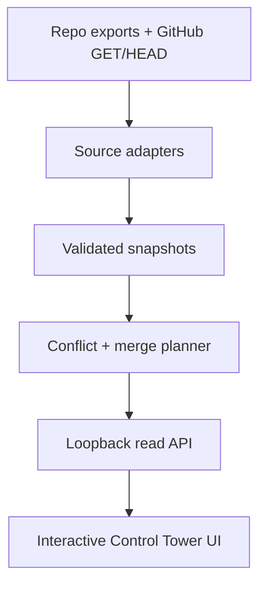

# Interactive Repository Merge Planner

**Host:** `DDD-Enterprises/dopemux-mvp`  
**Contract source:** `DDD-Enterprises/dnh-crm` governance kernel  
**AdOps integration:** repo-local adapter/export  
**Mode:** read-only, fail-closed portfolio projection

## 1. Outcome

Dopemux will host an interactive planner that answers:

- what repository lanes exist;
- what evidence supports each lane;
- which gates block merge;
- where sources disagree;
- what deterministic merge order follows from dependencies;
- what requires a Control Tower decision next.

The planner does not merge, accept, activate, deploy, label, score, dispatch
runners, mutate Task Orchestrator, or edit project authority. Its own records
always declare `authority: NONE` and `surface_class: PROJECTION`.

Repo-local truth remains canonical. dNh CRM supplies the proven governance
contract source. AdOps adapts that contract and exports a projection. Dopemux
reads both plus live GitHub evidence.

## 2. Control Tower architecture

The operating model is risk-routed:

- Control Tower/Supervisor owns scope, ledger decisions, acceptance,
  escalation, and next work;
- one bounded implementer executes the active packet;
- an independent auditor is added only when risk/evidence policy requires it;
- GitHub/CI/proof supplies durable evidence and gates;
- Task Orchestrator supplies workflow/queue/dependency state only.

The planner is the operator's read model, not a new authority plane. It preserves
Dopemux's Memory Trinity boundaries:

- ConPort: canonical structured decisions/progress;
- dope-memory: chronicle/receipts;
- dope-context: read-only retrieval;
- planner: ephemeral cross-plane projection with source locators.

No source is canonically overwritten by another plane.

## 3. Required release behavior

The next release must:

1. refresh allowlisted GitHub evidence automatically;
2. import approved conversation decisions from allowlisted canonical threads
   with manual fallback;
3. reconcile source disagreements visibly;
4. compute deterministic dependency/merge simulations;
5. preserve `UNKNOWN`, stale, degraded, blocked, and conflict states;
6. expose claim-level provenance;
7. operate from frozen fixtures without credentials;
8. be structurally read-only.

## 4. Source truth and precedence

The planner evaluates each repository using that repository's authority rules.
It does not impose one universal precedence list.

For Dopemux behavior claims:

1. active Task Packet for execution scope;
2. runtime code/config/compose/tests/entrypoints;
3. tracked truth/reference documents;
4. historical/external/design artifacts.

For AdOps execution scope:

1. active packet/amendments;
2. `PROJECT_INSTRUCTIONS.md`;
3. `.github/copilot-instructions.md`;
4. applicable repo overlays;
5. packet-bound proof/audit/decision records.

Common consumer rule: GitHub metadata and planner output are evidence, never
terminal authority. A material disagreement between admissible sources becomes
a blocking conflict; recency or confidence does not silently pick a winner.

## 5. Producer contract

Each repository may publish `repository-planner-export.v1` as a generated
projection. The contract is based on dNh's shipped `tools/gov` semantics:

- diff-derived risk tiers;
- protected, non-self-modifiable gate surfaces;
- append-only proof;
- fail-closed preflight and verification;
- implementer/auditor/acceptor separation;
- evidence-budgeted readiness.

AdOps must adapt this contract rather than recreate it. A malformed or absent
producer export does not get repaired by Dopemux; the planner may fall back to a
repo-specific read adapter and report the producer error.

Minimum producer envelope:

```json
{
  "schema_version": "repository-planner-export.v1",
  "authority": "NONE",
  "surface_class": "PROJECTION",
  "project_id": "adops",
  "repository": "DDD-Enterprises/adOps",
  "source_commit": "<40 lowercase hex>",
  "generated_at": "<RFC3339 UTC>",
  "lanes": [],
  "unknowns": [],
  "source_errors": []
}
```

## 6. Service boundary

Create a separate loopback service:

```text
services/repository-planner/
src/dopemux/repository_planner/
ui-dashboard/src/features/repository-planner/
```

Do not add GitHub as a tenth family to the accepted DCP read-only facade. Reuse
the facade's read-only/fail-closed patterns and PCP evidence envelopes, but keep
the planner as a distinct consumer service.



The service owns only an ephemeral cache. Cached values never become authority.

## 7. Source configuration and network boundary

Sources come from operator-owned configuration:

```yaml
schema_version: repository-planner.sources.v1
refresh_interval_seconds: 60
max_staleness_seconds: 300
repositories:
  - project_id: dopemux
    repository: DDD-Enterprises/dopemux-mvp
    adapter: dopemux
    enabled: true
  - project_id: dnh-crm
    repository: DDD-Enterprises/dnh-crm
    adapter: dnh_v1
    enabled: true
  - project_id: adops
    repository: DDD-Enterprises/adOps
    adapter: adops_v1
    enabled: true
```

Rules:

- repository names and refs are allowlisted, never caller URLs;
- release one permits GitHub `GET` and `HEAD` only;
- tokens come from injected secrets and are never returned or logged;
- non-GitHub redirects, arbitrary archive extraction, submodules, and path
  traversal are rejected;
- fixture mode requires no token/network;
- the API exposes no mutation endpoints.

## 8. Portfolio snapshot

`repository-planner.portfolio-snapshot.v1` contains:

```json
{
  "schema_version": "repository-planner.portfolio-snapshot.v1",
  "authority": "NONE",
  "surface_class": "PROJECTION",
  "generated_at": "2026-08-22T00:00:00Z",
  "refresh": {"status": "CURRENT"},
  "projects": [],
  "recommended_merge_order": [],
  "blocking_conflicts": [],
  "unknowns": []
}
```

Each project includes source ref/commit, freshness, adapter/version, errors, and
lanes. Each lane includes:

- packet/proof/candidate/audit/decision locators;
- full candidate commit/tree and remote-presence status;
- PR/check/review evidence;
- dNh-compatible readiness status and reasons;
- lifecycle facts kept separate from readiness;
- dependencies/dependents;
- conflicts/unknowns;
- recommended action and claim-level provenance.

Canonical API objects use strict schemas. Unknown producer fields are rejected
or preserved only inside an explicitly non-authoritative raw-evidence envelope.

## 9. Refresh behavior

- refresh at startup and every 60 seconds by default;
- use ETags/conditional requests and bounded concurrency;
- a `304` preserves the cached body and updates validation time;
- failures preserve the last snapshot as `STALE` or `DEGRADED`;
- after 300 seconds, affected merge recommendations become `DEFER`;
- auth/rate-limit errors expose sanitized classes/reset time;
- one broken repository remains isolated, but dependent lanes block.

A manual refresh button requests the same read-only refresh operation and shows
progress/failure. It cannot bypass allowlists or freshness rules.

## 10. Conversation decision import

Allowed source policy: allowlisted canonical threads plus manual fallback.

Pipeline:

1. fetch or paste one proposed decision;
2. normalize to a bounded decision record;
3. show source locator, extracted text, scope, and hash;
4. require explicit human approval;
5. commit the approved record in its authoritative project repository through
   that repository's process;
6. planner observes it on the next GitHub refresh.

The planner may stage a local, non-authoritative proposal for review, but it
cannot commit or approve the decision. Bulk transcript ingestion, automatic
promotion, and assistant self-approval are forbidden.

## 11. Conflict reconciliation

Every conflict carries:

- stable ID;
- repository/lane;
- source locators, hashes, observed values, and timestamps;
- materiality: `BLOCKING` or `NON_BLOCKING`;
- status: `OPEN`, `RESOLVED`, or `ACCEPTED_DIVERGENCE`;
- precedence rule and authority needed;
- selected/rejected value only after approved resolution;
- affected recommendations.

Open blocking conflicts force `DEFER`. Non-blocking conflicts remain visible.
The UI never hides conflicts behind a single status badge.

## 12. Deterministic merge planning

Only explicit dependencies participate in ordering. Inputs are repository/lane
IDs, dependency edges, readiness, freshness, conflicts, and PR/check evidence.

Algorithm:

1. remove lanes with hard blockers, stale evidence, missing remote candidates,
   or blocking conflicts from the eligible set;
2. detect missing dependencies and cycles;
3. topologically sort eligible nodes;
4. break otherwise-equal choices by project ID, lane ID, then candidate SHA;
5. attach a reason/provenance set to every recommendation.

Outputs:

- `MERGE_NEXT`
- `WAIT_DEPENDENCY`
- `DEFER`
- `CONTROL_TOWER_REVIEW`
- `UNKNOWN`

Simulation changes only an in-memory overlay and labels every result
`SIMULATION`. It never writes repo or Task Orchestrator state.

## 13. UI

The React/MUI dashboard adds:

- portfolio summary: current/stale projects, ready/blocked lanes, conflicts;
- repository/lane table with filters and deterministic ordering;
- lane detail drawer with gates, dependencies, proof/audit/decision records;
- provenance viewer for each claim;
- conflict comparison with both values and required authority;
- merge-order view and simulation controls;
- refresh status and source errors;
- decision-import proposal review (local draft only).

Accessibility:

- keyboard-operable tables, filters, drawers, and simulations;
- status never encoded by color alone;
- focus returns to the invoking control;
- provenance/conflict details have semantic headings and labels;
- reduced-motion preference is honored.

## 14. Vertical-slice order

Implementation order is deliberately fixture-first:

1. freeze a source-backed three-repository snapshot;
2. validate contracts and adapters;
3. render one useful portfolio screen with provenance/unknown/conflict states;
4. add deterministic readiness and merge-order logic;
5. add loopback API;
6. add authenticated GitHub GET/HEAD refresh;
7. add approved-decision proposal/import workflow.

Do not start with a live collector or broad governance migration. The frozen
slice proves the product contract before external integration complexity.

## 15. Acceptance criteria

Release one is acceptable only when:

1. a canonical Dopemux Task Packet validates;
2. frozen dNh, AdOps, and Dopemux fixtures render;
3. every claim exposes provenance;
4. stale, malformed, unknown, local-only candidate, and conflict cases fail
   closed;
5. merge order is deterministic and cycle-aware;
6. simulations are visibly non-authoritative;
7. network tests prove only allowlisted GitHub GET/HEAD operations;
8. the OpenAPI surface contains no mutating route;
9. Task Orchestrator evidence cannot change acceptance;
10. UI accessibility tests pass;
11. changed-contract preflight passes;
12. the required embedded audit is performed once after content-head freeze;
13. the PR remains unmerged until Control Tower acceptance.

## 16. Explicit exclusions

- OpenRouter, OpenCode, and custom proxy audit routes are not part of this work.
- The Grok Phase-1 finality loop is evidence for failure modes, not the planner
  implementation lane.
- No new audit/model invocation is authorized by this design document.
- No merge, acceptance, deployment, scoring, labeling, or Commit 6 action is
  included.
