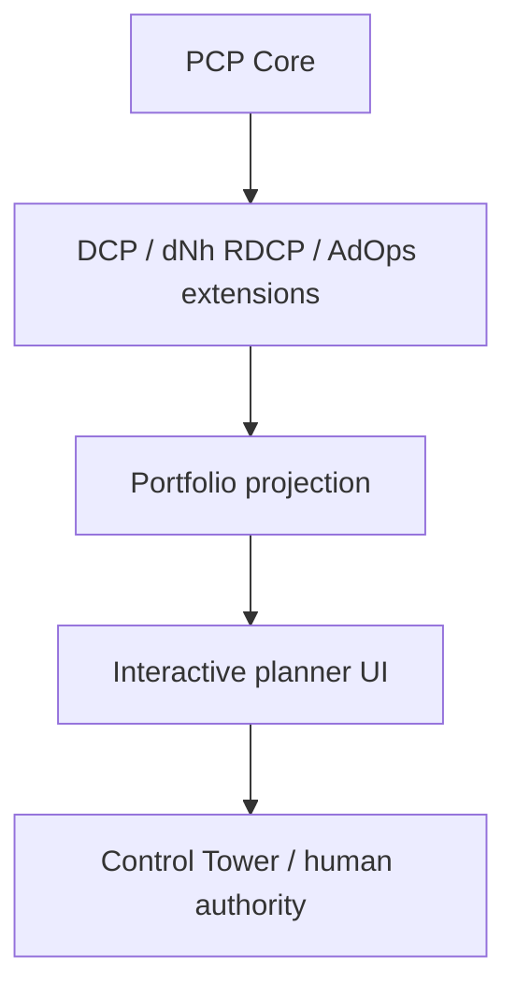

# Interactive Repository Merge Planner

## 1. Decision

Dopemux hosts a read-only interactive planner for Dopemux, dNh CRM, and
AdOps. The planner is built on the already-merged Project Control Plane (PCP)
Core. It does not introduce a parallel producer contract or copy one
repository's governance kernel into another.

PCP Core is the only generic substrate. DCP, dNh RDCP, and AdOps are additive
extensions. Repository-local authority, proof, audit, acceptance, and merge
rules remain canonical in their source repository.

All planner output declares:

```text
authority=NONE
surface_class=PROJECTION
is_proof=false
```

The planner cannot merge, accept, activate, deploy, label, score, dispatch a
runner, mutate Task Orchestrator, or edit project authority.

## 2. Evidence supporting the decision

Current Dopemux `main` already contains:

- `src/dopemux/pcp/exporter.py`, a generic, local, read-only Git exporter;
- `src/dopemux/pcp/dcp_extension_export.py`, the additive extension seam;
- `src/dopemux/pcp/task_orchestrator_projection.py`, with
  `authority="NONE"`, `is_proof=false`, and fail-closed write denial;
- strict PCP schemas under `schemas/project_control_plane/`;
- a proposed dNh extension manifest and illustrative dNh fixtures.

Current dNh CRM `main` already contains RDCP proof adapters, source ledgers,
review sensors, evidence bundles, and Task Orchestrator projections. Those
surfaces are consumed; they are not reimplemented.

AdOps already owns its packet, proof, audit, candidate, and acceptance
semantics. Increment one uses a Dopemux-owned PROJECT extension adapter against
source-backed AdOps fixtures. No `tools/gov` port is authorized. A future
repo-local AdOps exporter requires demonstrated need and a separate packet.

## 3. Authority topology



The planner preserves these boundaries:

- repository: source facts, policy, proof, audit, acceptance;
- PCP: generic evidence envelopes and additive extension contracts;
- Task Orchestrator: queue/dependency/workflow projection only;
- GitHub: Git/PR/check/review evidence transport only;
- planner: deterministic reconciliation and simulation only;
- Control Tower/human: terminal decision authority.

## 4. Release behavior

The staged release must eventually:

1. render source-backed evidence for all three repositories;
2. show unknown, stale, degraded, blocked, and conflicting facts visibly;
3. compute deterministic dependency and merge-order simulations;
4. refresh allowlisted GitHub evidence automatically;
5. import approved conversation-decision proposals from allowlisted canonical
   threads, with a marked manual fallback;
6. retain claim-level provenance and source disagreement;
7. operate from frozen fixtures without credentials;
8. expose no external write path.

## 5. Canonical data path

The planner consumes `pcp.project_evidence_export.v0` plus extension-owned
sections. It does not define `repository-planner-export.v1`.

```text
repo bytes / RDCP artifacts / GitHub observations
  -> PCP generic export
  -> additive extension adapter
  -> validated source snapshot
  -> deterministic portfolio projection
  -> loopback read API
  -> React planner UI
```

The portfolio projection is a UI read model, not a producer contract. It must
record the exact source locator, source hash, observed head, fetched time,
freshness, and transformation identifier for every material claim.

## 6. Extension ownership

### Dopemux/DCP

Reuse the accepted DCP extension seam. The existing nine-family DCP facade is
not expanded or modified.

### AdOps

The adapter lives in Dopemux for the first release and reads only explicit,
allowlisted AdOps paths. It must include `PROJECT_INSTRUCTIONS.md` in the
AdOps authority map, preserve the repository's authority order, and represent
local-only candidates as `REMOTE_COMMIT_ABSENT` rather than ready.

### dNh CRM

The adapter consumes existing RDCP proof-pointer, source-ledger, review-sensor,
and Task Orchestrator export artifacts. It preserves RDCP freshness states and
must not call dNh writers, `gov accept`, CRM services, or Task Orchestrator
write tools.

## 7. Conflict model

A conflict is a first-class record with:

- stable conflict ID;
- project and lane IDs;
- competing source locators and hashes;
- observed values;
- materiality: `BLOCKING` or `NON_BLOCKING`;
- status: `OPEN` or `RESOLVED`;
- named resolution authority;
- selected value and resolution record only when source authority supplies it.

An open blocking conflict forces `DEFER`. Recency, confidence, or majority vote
never silently selects a winner. Non-blocking conflicts remain visible.

## 8. Deterministic planning

The planner emits recommendations, never commands:

- `READY_FOR_CONTROL_TOWER_REVIEW`
- `WAIT_DEPENDENCY`
- `DEFER_STALE_EVIDENCE`
- `DEFER_BLOCKING_CONFLICT`
- `DEFER_FAILED_GATE`
- `UNKNOWN`

Dependency ordering uses a stable topological sort. Cycles are explicit
blockers. The final tie-breaker is `(project_id, lane_id, candidate_sha)`.
Repeated runs over byte-identical input must produce byte-identical canonical
JSON.

## 9. Service and UI boundary

Create a separate loopback service and feature surface:

```text
src/dopemux/repository_planner/
services/repository-planner/
ui-dashboard/src/features/repository-planner/
```

The foundation release may load a checked-in generated snapshot before the
service exists. Live wiring must use an inventoried port from
`services/registry.yaml`; no packet may invent one.

Cache mutation is local and non-authoritative. A refresh route may mutate only
the planner cache and must be named and documented honestly. Source failure
must retain last-known data as stale/degraded rather than erase it.

## 10. GitHub boundary

The live collector is a separate L3 packet. Its transport interface permits
only allowlisted `GET` and `HEAD` operations against `api.github.com` and
approved repositories, refs, paths, PRs, checks, reviews, and review threads.

It must enforce ETag/304 handling, bounded concurrency, timeouts, sanitized
errors, rate-limit handling, redirect rejection, and stale fallback. Tokens
must never enter logs, models, fixtures, proof, or API responses. Unit tests use
mock transport; any real read-only smoke test requires explicit operator
authorization.

## 11. Conversation-decision boundary

Conversation intake is a separate L3 packet. An allowlisted canonical thread
or marked manual fallback may create only a local proposal containing normalized
text, scope, target repository, source locator, content hash, and provenance.

Raw transcripts are not persisted by default. A proposal always has
`authority=NONE`. The planner has no approval endpoint. Repository-local human
approval and commitment remain separate governed actions.

## 12. Delivery packets

1. `TP-DMX-PCP-PLANNER-FOUNDATION-001`
2. `TP-DMX-PCP-ADOPS-EXTENSION-002`
3. `TP-DMX-PCP-DNH-RDCP-BRIDGE-003`
4. `TP-DMX-PCP-GITHUB-REFRESH-004`
5. `TP-DMX-PCP-CONVERSATION-DECISIONS-005`

Packets 2 and 3 depend on the accepted foundation contract. Packet 4 depends
on both extension adapters. Packet 5 depends on the live read service. Only
one packet is active at a time unless Control Tower explicitly authorizes
independent worktrees with non-overlapping files.

## 13. Acceptance criteria

The architecture is satisfied only when:

1. generic PCP Core remains usable for an arbitrary Git repository;
2. no extension is required for baseline PCP;
3. no extension weakens core fail-closed, proof, or audit gates;
4. AdOps does not copy dNh governance tooling;
5. dNh integration consumes existing RDCP artifacts;
6. the illustrative dNh placeholder fixture is not treated as live evidence;
7. every material UI claim links to provenance;
8. blocking disagreements remain unresolved until the source authority acts;
9. planning is deterministic and structurally non-mutating;
10. GitHub and conversation connectors expose no write operation;
11. Task Orchestrator remains non-authoritative;
12. Control Tower/human authority remains terminal.

## 14. Audit economy

Deep Research is not required. Repository source and governance are the
controlling evidence.

One independent Pro architecture audit is required after this design and all
five packets are frozen on one exact PR head. Implementation packets use their
repo risk lanes: L2 for foundation and extension boundaries; L3 for network,
credential, and conversation-intake boundaries. No OpenRouter, OpenCode, or
custom proxy route is authorized.
