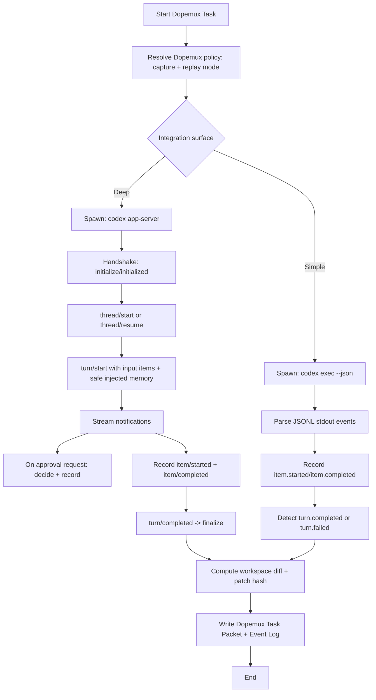

# Deterministic, replay-safe integration patterns for Codex CLI

## Executive summary

Codex CLI exposes **three distinct, publicly documented “execution surfaces”** that matter for deterministic capture and replay-safe context injection: **non-interactive `codex exec` (JSONL events), the `codex app-server` JSON‑RPC protocol (thread/turn APIs + streamed item events), and local persistence (sessions/history/logs under `CODEX_HOME`)**. citeturn23view0turn32view1turn11view0

For **deterministic, replay-safe** integration in entity["company","Dopemux","workflow automation suite"], the highest-upgrade-resilience approach is to integrate at the **protocol/event boundary** rather than scraping UI logs: either (a) **`codex app-server`** for deep interception (explicit thread/turn lifecycle, server‑initiated approvals, per‑item authoritative completion) or (b) **`codex exec --json`** for simpler single-turn automation with a stable JSONL stream of run events. citeturn32view1turn23view0turn7view0

Public sources do **not** claim that Codex runs are deterministic or reproducible in the strict sense (model outputs and tool choices can vary), so “deterministic + replay-safe” must be achieved by **Dopemux-level guarantees**: (1) freeze/record the **workspace state** (Git HEAD + clean tree), (2) freeze/record the **effective instruction chain** (AGENTS files + overrides), (3) capture **authoritative item outcomes** (`item.completed` / `item/completed`), and (4) apply **idempotent write strategies** (patch hashes, atomic writes, and “already-applied” checks) rather than re-running side effects. citeturn23view0turn13view0turn12view1turn32view1

The safest context injection point is **before work begins**: Codex reads **AGENTS.md** guidance “before doing any work,” and Codex supports layered global + project instructions with size caps; Dopemux should inject memory as a deterministic, versioned “context bundle” (ideally in `CODEX_HOME` via `AGENTS.override.md`, or via app-server turn input / developer instructions) to avoid repository contamination and mid-turn nondeterminism. citeturn12view1turn11view0turn32view1turn9view1

## Codex CLI execution model and task lifecycle

### Publicly documented primitives

Across the public docs, the runtime is described in terms of **threads, turns, and items**:

- **Thread**: a conversation container. citeturn32view1turn23view0
- **Turn**: a single user request plus agent work. citeturn32view1turn23view0
- **Item**: a unit of work or I/O (agent message, command runs, file change, tool call, etc.). citeturn32view1turn23view0

`codex exec --json` exposes these as JSONL events with `thread.started`, `turn.started`, `turn.completed` / `turn.failed`, and `item.*` events. citeturn23view0
`codex app-server` exposes analogous lifecycle notifications and explicitly states that `item/completed` is the “authoritative state.” citeturn32view1

### Deliverable A: Textual task lifecycle diagram

Below is an **ordered phase diagram** for a single Codex “task” (interpreted as: one `codex exec` run, or one `turn/start` in app-server). Phases are limited to what is publicly documented; anything beyond is explicitly labelled “unspecified.”

**Phase 0 — Invocation and configuration resolution**
**Inputs:** CLI flags (`--cd`, `--sandbox`, `--ask-for-approval`, `--json`, `--output-*`, `-c/--config`), environment variables (`CODEX_HOME`, provider env vars), layered config files (`~/.codex/config.toml`, `.codex/config.toml`, `/etc/codex/config.toml`), potential managed/requirements layers. citeturn10view0turn11view0turn25view1turn25view0turn7view0
**Outputs:** Effective runtime configuration (sandbox, approvals, web search mode, MCP enablement, environment forwarding policy, logging/telemetry settings). citeturn10view0turn11view0turn34view1turn27view0

**Phase 1 — Workspace gating and permissions envelope**
**Inputs:** current working directory, `--cd`, `--add-dir`, Git repository check settings, trust settings. citeturn15view0turn23view1turn10view0turn16view1
**Outputs:** allowed filesystem scope (sandbox mode), approval policy, “Git repo required” enforcement (unless explicitly overridden for `codex exec`). citeturn23view1turn25view3turn15view2

**Phase 2 — Instruction chain assembly (context injection layer)**
**Inputs:** global AGENTS files under `CODEX_HOME` and per-directory AGENTS files from project root to CWD; optional `developer_instructions`; optional `model_instructions_file`; size cap (`project_doc_max_bytes`) and fallback filename list. citeturn12view0turn12view1turn9view1turn16view1
**Outputs:** final “system/developer guidance bundle” made available to the agent (exact formatting is not publicly specified). citeturn12view1turn9view1

**Phase 3 — Thread start / resume**
**Exec JSONL surface:** first emits `thread.started` (includes `thread_id`). citeturn23view0
**App-server surface:** client performs `initialize`/`initialized` handshake, then calls `thread/start` or `thread/resume` (or `thread/fork`). citeturn32view1
**Outputs:** thread identifier; session persistence location is documented as `~/.codex/sessions` for persisted threads. citeturn21view0turn14view1

**Phase 4 — Turn start**
**Exec:** emits `turn.started`. citeturn23view0
**App-server:** client calls `turn/start` with structured input items; optional overrides include model/personality/cwd/sandbox policy (exact option set is versioned; schema generation is supported). citeturn32view1
**Outputs:** streamed progression events; in `codex exec`, default behaviour is progress to stderr and final message to stdout unless `--json` is enabled. citeturn23view0

**Phase 5 — Item loop (tool use, commands, messages, plans)**
**Exec:** JSONL events include `item.started` and `item.completed` carrying an `item` object; item types include reasoning, command executions, file changes, MCP tool calls, web searches, plan updates, and agent messages. citeturn23view0turn29search10
**App-server:** notifications include `item/started`, `item/completed`, plus delta streams like `item/agentMessage/delta`; it warns that the final plan item “may not exactly equal” concatenated deltas. citeturn32view1
**Outputs:** authoritative item outcomes at completion (`item.completed` / `item/completed`), including command outputs when exposed. citeturn32view1turn29search10

**Phase 6 — Approval and policy interlocks**
Approvals depend on sandbox + approval policy and can be influenced by rules/requirements and command-prefix policies. citeturn25view3turn13view0turn25view0
**App-server specifically:** approvals can arrive as **server-initiated JSON‑RPC requests**; client replies with `{decision: accept|decline}` and potentially extra accepted settings; the server ends the item with `item/completed`. citeturn32view1

**Phase 7 — Turn completion and artifacts**
**Exec:** emits `turn.completed` with a `usage` object including token counts; can also produce a schema-validated final response via `--output-schema` and write it to disk via `--output-last-message`. citeturn23view0turn23view1turn7view0
**App-server:** emits `turn/completed` with a final status when the model finishes or after cancellation (`turn/interrupt`). citeturn32view1
**Outputs:** final agent message content (surface-specific) + usage + any generated files/patches in the workspace (workspace mutations are not guaranteed to be described fully in every event surface; see “log completeness” below). citeturn23view0turn29search10

**Phase 8 — Persistence and audit trail**
**Exec + TUI:** Codex stores local state under `CODEX_HOME` (default `~/.codex`) and may write `history.jsonl` when history persistence is enabled; it also writes logs under `log_dir` (default `$CODEX_HOME/log`). citeturn11view0turn16view1turn9view1
**Resumption semantics:** resuming a run keeps prior transcript/plan history/approvals (documented for CLI resume). citeturn14view1turn6view2

## Interception points, guarantees, and failure modes

### Interception points for capture and injection

**Pre-task interception (safe for deterministic injection):**
- **AGENTS-based injection**: Codex reads `AGENTS.md` “before doing any work,” supports global and project scopes, and supports overrides (`AGENTS.override.md`). citeturn12view1turn12view0
- **`CODEX_HOME` isolation**: Codex stores state under `CODEX_HOME` (default `~/.codex`), and docs explicitly show setting `CODEX_HOME=$(pwd)/.codex` for a project-specific automation user. citeturn11view0turn12view1
- **Config-layer injection**: `developer_instructions` is “additional developer instructions injected into the session”; `model_instructions_file` is a replacement for built-in instructions instead of AGENTS. citeturn9view1turn16view1
- **App-server turn input**: `turn/start` accepts structured input items; it’s the cleanest “inject context” hook without mutating files. citeturn32view1

**Per-item / per-command interception (best for capture):**
- `codex exec --json` emits `item.started` and `item.completed` events (command executions and more). citeturn23view0turn29search10
- `codex app-server` emits `item/started` and `item/completed` and instructs clients to treat `item/completed` as authoritative. citeturn32view1
- Command policy/rule interception can be reasoned about using `.rules` and `codex execpolicy check`; rules treat commands as execvp-style argv lists and can split simple `bash -lc` scripts into separate commands before rule evaluation when safe. citeturn13view0

**Post-task interception (safe for memory capture + commit/patching):**
- **Turn completion**: `turn.completed` includes token usage in exec JSON; app-server emits `turn/completed`. citeturn23view0turn32view1
- **Notification hook**: config key `notify` is a command list invoked for notifications and “receives a JSON payload from Codex,” but the payload schema is not publicly specified in the reference text. citeturn34view0turn35view0

### Guarantees and non-guarantees relevant to deterministic replay

**Determinism (publicly unspecified):** None of the public docs claim Codex runs are deterministic or replayable in the strict sense. The event streams and controls enable auditability and resumption, but not identical re-execution. (Unspecified in public docs; treat as non-guaranteed.) citeturn23view0turn32view1

**Reproducibility via resumption (partial, documented):**
- CLI: `codex resume` and `codex exec resume` exist; resumed runs keep the original transcript, plan history, and approvals (so the agent can use prior context). citeturn14view1turn6view2turn23view1
- SDK: threads are persisted in `~/.codex/sessions` and can be resumed via `resumeThread()`. citeturn21view0turn18view0

**Log/event completeness (qualified):**
- `codex exec --json` is documented to make stdout “a JSONL stream so you can capture every event Codex emits while it’s running.” citeturn23view0
- However, **event payload detail can vary across formats/versions**. A public issue reports that an `--experimental-json` format lost tool arguments/results and contained placeholders for future data, reducing visibility compared to `--json`. citeturn29search7
- Public bugs exist where exec JSON streaming can stall (e.g., “hangs indefinitely” when `--image` is used in certain versions), implying Dopemux must treat “missing `turn.completed`” as a first-class failure mode and not assume stream completion. citeturn29search4turn23view0

**Idempotency (not provided by Codex; must be enforced externally):**
- Codex can run commands and write to files under selected sandbox/approval modes; nothing in public docs claims those side effects are idempotent. citeturn25view3turn23view0
- Codex provides guardrails via sandboxing, approvals, and rules, but idempotency of modifications is a Dopemux responsibility. citeturn25view3turn13view0

### Failure modes Dopemux must plan for

**Partial execution and mid-turn crash/hang**
- `codex exec --json` can emit `thread.started` and then stall (reported when `--image` is used in some versions). citeturn29search4turn23view0
- If a required MCP server fails to initialize and is marked required, `codex exec` “exits with an error instead of continuing.” citeturn23view0turn27view0

**Retries and “duplicate work” risk**
- The public `config-schema.json` includes provider controls like `request_max_retries`, `stream_idle_timeout_ms`, and `stream_max_retries`, implying the client may retry network/stream operations (exact retry semantics are configuration-defined and versioned). citeturn36view0
- Dopemux must therefore treat “retries” as potentially repeating upstream calls and avoid coupling replay safety to “single delivery.” citeturn36view0

**Sandbox non-availability / platform divergence**
- Linux sandbox relies on Landlock + seccomp by default; it “may not work” in some container setups lacking these features, and docs advise using an external container sandbox plus `danger-full-access` inside. citeturn25view3
- macOS uses Seatbelt via `sandbox-exec`; Windows has distinct behaviour and WSL guidance. citeturn25view3

**Managed policy instability**
- Cloud requirements for Business/Enterprise are “best-effort”; if fetch fails/timeouts, Codex continues without the cloud layer. citeturn25view0
This matters because two runs with identical local files may see different constraints if the cloud layer is intermittently available. citeturn25view0

## Deliverable B: Capture strategy options

The table below compares four integration strategies against replay safety and upgrade resilience. “Replay-safe” here means: **Dopemux can reproduce effects without re-running unsafe side effects**, and can detect partial/duplicate executions.

| Strategy | What you capture | Pros | Cons / risks | Complexity | Replay-safety | Upgrade resilience |
|---|---|---|---|---:|---:|---:|
| Wrapper-based capture (recommended baseline) | Spawn `codex exec --json` and parse JSONL events; optionally also capture stderr and `--output-last-message` file outputs. citeturn23view0turn7view0 | Uses a documented machine-readable event stream; can capture `thread.started`, `turn.*`, `item.*`, `error`; easy to store as append-only log. citeturn23view0 | Event detail may vary by version/format (esp. `--experimental-json`); stream may hang or end without `turn.completed` (must implement timeouts). citeturn29search7turn29search4 | Medium | High if combined with workspace snapshot + idempotent patch application | High (uses documented CLI surface) |
| App-server protocol integration (recommended for “deep” integration) | Spawn `codex app-server`, speak JSON-RPC-ish protocol over stdio, consume `item/started`, `item/completed`, deltas, `turn/completed`; handle server-initiated approvals. citeturn32view1 | Explicit lifecycle APIs (thread/turn), approvals as first-class protocol; can generate TypeScript/JSON schemas version-by-version so your client matches the exact Codex version. citeturn32view1 | More engineering work; requires robust protocol client + state machine; experimental API is gated behind capability flags (must avoid). citeturn32view1 | High | Very high: treat `item/completed` as authoritative; easy to record approvals/decisions; supports cancellation (`turn/interrupt`). citeturn32view1 | Very high (schema generation per version is explicitly supported) citeturn32view1 |
| Log scraping / filesystem scraping | Read `history.jsonl` (if enabled), log files under `$CODEX_HOME/log`, and session artifacts under `~/.codex/...`; infer actions. citeturn11view0turn16view1turn9view1 | Can work even for TUI sessions; no need to interpose on stdout. citeturn14view1turn16view1 | History persistence can be disabled; file formats/paths are less contractually stable; may miss per-item detail; races under concurrency. citeturn16view1turn11view0 | Low–Medium | Medium: useful for audit, but weak for deterministic replay | Medium–Low |
| Explicit emit / signaling (hooks + schema outputs) | Use `notify` hook (invoked command receives JSON payload) and/or `--output-schema` + `--output-last-message` artifact files as structured “end-of-turn” signals. citeturn34view0turn23view1turn7view0 | Clean “end-of-turn” boundary; schema-validated final outputs reduce parsing ambiguity for downstream. citeturn23view1turn7view0 | `notify` payload is not described publicly beyond “JSON payload”; only “final outcome” visibility (no guaranteed per-item trace). citeturn35view0 | Low | Medium–High for end-state capture; low for mid-turn replay tracing | Medium (hook contract underspecified) |

**Key implication:** If Dopemux needs **deterministic replay safety**, it should treat `notify` and log scraping as **secondary** signals, and rely primarily on **event/protocol capture** (`exec --json` or app-server), plus Dopemux-controlled idempotent application of effects. citeturn23view0turn32view1turn34view0

## Deliverable C: Dopemux Codex mode design

### Design goals

A Codex adapter in Dopemux must:

- Capture **authoritative, replayable outcomes** (commands run, file changes, approvals) at stable boundaries. citeturn23view0turn32view1
- Inject memory **only at safe points** (pre-work instruction assembly, or `turn/start` inputs) to avoid mid-turn divergence. citeturn12view1turn32view1
- Survive Codex upgrades by targeting **documented surfaces** and avoiding internal session file formats or experimental JSON formats. citeturn23view0turn29search7turn32view1

### Recommended architecture

**Primary mode: `app-server` adapter (deep integration)**
Use `codex app-server` when Dopemux needs *per-item capture, approvals control, and deterministic orchestration*. The app-server is explicitly designed to “power rich clients,” including authentication, history, approvals, and streamed agent events. citeturn32view1

**Fallback mode: `exec-jsonl` adapter (simple automation)**
Use `codex exec --json` when Dopemux wants a *single-turn* run with event capture and minimal protocol work. `--json` provides JSONL events, and `codex exec resume` supports multi-stage workflows. citeturn23view0turn23view1turn6view2

### Where capture MUST happen

**Capture MUST happen at:**
- `item.completed` (exec JSONL) and `item/completed` (app-server) because these include final item status and, per app-server docs, are authoritative. citeturn32view1turn23view0
- Approval decision points (app-server server-initiated approval requests), because they affect side effects and must be replayed exactly. citeturn32view1
- `turn.completed` / `turn/completed` end markers to finalize a “task packet,” record token usage (exec) and outcome status. citeturn23view0turn32view1

### Where injection is safe vs unsafe

**Safe injection**
- **Before turn begins:**
  - Provide memory via AGENTS layering (prefer `CODEX_HOME/AGENTS.override.md` for Dopemux-managed context) because Codex loads AGENTS files before work. citeturn12view1turn12view0
  - Or provide memory as structured `turn/start` input items (app-server). citeturn32view1
- **Per-run isolation:** set `CODEX_HOME` to a Dopemux-run directory (so sessions/logs/instructions are deterministic and don’t cross-contaminate concurrent runs). citeturn11view0turn12view1

**Unsafe (or replay-hostile) injection**
- **Mid-turn steering:** app-server supports `turn/steer` to append input to an in-flight turn; this is inherently harder to replay deterministically because it can interleave with tool execution already underway. citeturn32view1
- **Repository pollution:** injecting memory by writing project `AGENTS.md` files inside the repo can couple “memory state” to the workspace under test; better to keep memory in CODEX_HOME scope unless you explicitly want it versioned with the repo. citeturn12view0turn11view0

### How to guarantee idempotent writes

Because Codex can directly edit the workspace under write-capable sandboxes, Dopemux should enforce idempotency by **treating Codex runs as “proposals that produce a patch,”** even when Codex applies the patch during the run:

1. Require or strongly prefer Git repos (`codex exec` enforces Git repo by default; can be overridden, but that trades safety). citeturn23view1turn25view3
2. Start each run from a known base (Git HEAD + clean status) and record it in the task packet. (Git check guidance is explicit.) citeturn23view1
3. After completion, compute a workspace diff and store as a patch with a content hash.
4. On replay, *never* re-run side-effectful commands; instead, apply the stored patch only if it is not already applied (hash mismatch / `git apply --check` equivalent), otherwise treat the replay as a no-op.

This approach is independent of whether Codex event payloads include complete file-change detail, which is important because payload richness can vary across versions and formats (as reported for experimental JSON). citeturn29search7turn23view0

### Mermaid flowchart: end-to-end adapter sequence



### Concrete adapter hooks

Below are **stable hooks** tied to documented behaviour, not internals:

- **Hook: `onProcessStart`** — record: `CODEX_HOME`, working directory (`--cd`), sandbox/approval flags, effective config “intents.” citeturn7view0turn10view0turn11view0
- **Hook: `onThreadStarted`** — capture `thread_id` (exec: `thread.started`; app-server: `thread/started`). citeturn23view0turn32view1
- **Hook: `onTurnStarted`** — start a deterministic “turn transaction” and snapshot Git state. citeturn23view0turn23view1
- **Hook: `onItemCompleted`** — append canonical event; if item is a command execution, store exit status + aggregated output when present. citeturn29search10turn32view1
- **Hook: `onApprovalRequest`** (app-server) — record request content and decision; respond; link to item completion. citeturn32view1
- **Hook: `onTurnCompleted` / `onTurnFailed`** — finalize outcome, compute patch, persist task packet. citeturn23view0turn32view1
- **Hook: `onIdleTimeout`** — kill process, mark task as “incomplete,” retain partial event log; optionally offer resume flows. (Timeout necessity supported by public hang reports.) citeturn29search4turn23view1

## Deliverable D: Canonical event schema for Codex adapter

Codex emits different event shapes across `exec --json` and `app-server`. Dopemux should normalize them into a **single canonical envelope** while preserving the raw payload.

The schema below defines **Dopemux’s canonical raw event record** (not claiming Codex itself emits these fields). The adapter **must** fill required fields; anything not present from Codex should be captured via observation (timestamps, process ids, workspace info) or left null if unknown.

```json
{
  "$schema": "https://json-schema.org/draft/2020-12/schema",
  "$id": "https://dopemux.example/schemas/codex-canonical-event.schema.json",
  "title": "Dopemux Canonical Codex Event",
  "type": "object",
  "additionalProperties": false,
  "required": [
    "schema_version",
    "observed_at",
    "source",
    "transport",
    "event_kind",
    "correlation",
    "raw"
  ],
  "properties": {
    "schema_version": {
      "type": "string",
      "const": "codex.canonical_event.v1"
    },
    "observed_at": {
      "type": "string",
      "description": "RFC3339 timestamp from Dopemux when the event was observed.",
      "format": "date-time"
    },
    "source": {
      "type": "object",
      "additionalProperties": false,
      "required": ["adapter", "codex_home"],
      "properties": {
        "adapter": { "type": "string", "description": "e.g. dopemux-codex-adapter" },
        "adapter_version": { "type": "string" },
        "codex_home": { "type": "string", "description": "Effective CODEX_HOME path used for this run." },
        "working_directory": { "type": "string" },
        "sandbox_mode": { "type": "string" },
        "approval_policy": { "type": "string" }
      }
    },
    "transport": {
      "type": "string",
      "enum": ["exec_jsonl", "app_server_jsonrpc"]
    },
    "event_kind": {
      "type": "string",
      "description": "Normalized high-level kind used by Dopemux routing.",
      "enum": [
        "thread_started",
        "turn_started",
        "turn_completed",
        "turn_failed",
        "item_started",
        "item_completed",
        "approval_requested",
        "approval_decided",
        "error",
        "process_exit"
      ]
    },
    "correlation": {
      "type": "object",
      "additionalProperties": false,
      "required": [],
      "properties": {
        "task_id": { "type": "string", "description": "Dopemux task/run id" },
        "thread_id": { "type": ["string", "null"] },
        "turn_id": { "type": ["string", "null"] },
        "item_id": { "type": ["string", "null"] },
        "parent_item_id": { "type": ["string", "null"] }
      }
    },
    "raw": {
      "type": "object",
      "description": "The raw Codex payload (exec JSON line or app-server JSON-RPC message).",
      "additionalProperties": true
    },
    "integrity": {
      "type": "object",
      "additionalProperties": false,
      "properties": {
        "stream_seq": { "type": "integer", "minimum": 0 },
        "raw_line_sha256": { "type": "string" }
      }
    },
    "workspace_snapshot": {
      "type": "object",
      "additionalProperties": false,
      "properties": {
        "git_head": { "type": ["string", "null"] },
        "git_dirty": { "type": ["boolean", "null"] },
        "patch_sha256": { "type": ["string", "null"] }
      }
    }
  }
}
```

**Why this schema matches Codex’s public model:** it aligns with the publicly documented lifecycle boundaries (`thread.*`, `turn.*`, `item.*`) and explicitly accommodates the two supported streams (exec JSONL vs app-server JSON-RPC). citeturn23view0turn32view1

## Deliverable E: Task packet implementation

### Task packet structure

A **task packet** is the minimal replay bundle that lets Dopemux (a) audit exactly what happened, and (b) reproduce the resulting workspace state without re-running unsafe actions.

A Dopemux Codex task packet should include:

- `task_id`, start/end timestamps, run mode (`exec_jsonl` vs `app_server_jsonrpc`).
- Effective `CODEX_HOME` and configuration intent (sandbox, approval policy, web search mode, MCP enablement). citeturn11view0turn25view3turn27view0turn34view1
- Instruction sources used (AGENTS chain roots/paths and whether overrides were present). Codex explicitly supports layered AGENTS discovery and recommends checking logs/sessions for auditing which files were loaded. citeturn12view0turn12view2
- Captured canonical event log (the schema above), plus a raw stream archive. citeturn23view0turn32view1
- Workspace base snapshot (Git HEAD, dirty state) and resulting patch + patch hash (Dopemux-generated). citeturn23view1
- Stop reason: completed, failed (`turn.failed`), interrupted (app-server `turn/interrupt`), timeout/hang (Dopemux). citeturn23view0turn32view1turn29search4

### Adapter implementation sketch

**Core components**
- `CodexProcessManager`: spawn Codex process with deterministic environment and isolated `CODEX_HOME`. Codex state location and `CODEX_HOME` behaviour are documented. citeturn11view0turn12view1
- `ExecJsonlParser`: reads stdout line-by-line, parses JSON objects, maps `type` to canonical `event_kind`; writes append-only. citeturn23view0
- `AppServerClient`: JSON-RPC-ish client implementing `initialize`, `thread/start|resume|fork`, `turn/start`, consuming notifications and server-initiated approval requests. citeturn32view1
- `WorkspaceTransaction`: records Git base state at turn start, computes patch at turn end, enforces idempotent patch application.

**Stop conditions**
- For exec JSONL: stop on `turn.completed` or `turn.failed`, or Dopemux timeout if stream stalls. citeturn23view0turn29search4
- For app-server: stop on `turn/completed` notification, or after `turn/interrupt` if cancellation requested. citeturn32view1

### Determinism-focused tests (adapter-level)

These tests avoid relying on non-deterministic model text, and instead test **Dopemux invariants**.

| Test case | Setup | Expected outcome |
|---|---|---|
| Canonicalization is stable | Feed a fixed recorded JSONL (from `codex exec --json`) into parser twice | Output canonical event sequence is byte-identical; `stream_seq` increments deterministically; only `observed_at` differs if not frozen (in CI, freeze time). citeturn23view0 |
| App-server “authoritative completion” handling | Replay a recorded app-server stream containing `item/started`, deltas, `item/completed` | Adapter outputs a canonical `item_completed` event that reflects the final `item` from `item/completed` (not reconstructed from deltas). citeturn32view1 |
| Timeout safety on stalled streams | Simulate the known hang pattern: `thread.started` then no further events | Adapter stops after idle timeout; task packet marked incomplete; no patch applied; captured log retained. (Hangs are publicly reported.) citeturn29search4turn23view0 |
| Patch idempotency | Run a task that changes files; capture patch hash; attempt “replay apply” twice | First apply produces changes; second apply is detected as already-applied and becomes a no-op (or fails safely without modifying files). |
| Concurrency isolation | Run two Codex tasks simultaneously with distinct `CODEX_HOME` | Session/log artifacts do not collide; each task packet references its own `CODEX_HOME`. Codex state under `CODEX_HOME` is documented. citeturn11view0turn12view1 |
| Instruction injection determinism | Build `AGENTS.override.md` from a fixed memory bundle; run build twice | Injected instruction file content is identical; stays under the `project_doc_max_bytes` cap (32 KiB default) to avoid truncation. citeturn12view1 |

### Practical “memory compiler” for deterministic injection

Because AGENTS discovery has ordering rules and size caps, Dopemux should implement a deterministic compiler:

- Sort memory facts by stable keys (e.g., `repo@commit`, `patch_hash`, `timestamp` truncated to day, etc.).
- Emit a compact, versioned header: `DOPMUX_MEMORY_V1`.
- Enforce a size budget smaller than Codex’s AGENTS ingestion cap (`project_doc_max_bytes`, 32 KiB default) to avoid truncation. citeturn12view1turn12view0
- Write this to `CODEX_HOME/AGENTS.override.md` in the per-run `CODEX_HOME`, ensuring global-scope precedence without touching the repo. citeturn12view0turn11view0

### Key unknowns and how to handle them safely

Some integration-relevant details are **not specified** in the public docs:

- The exact schema of the `notify` JSON payload is not described beyond “receives a JSON payload.” citeturn35view0turn34view0
- The internal format of “session rollout files” is referenced publicly (e.g., `--ephemeral` disables persisting them), but their structure is not defined as a stable public contract in the CLI docs excerpt. citeturn23view0turn6view4
- Completeness of per-item payload fields can vary by version/format (`--experimental-json` issues). citeturn29search7

**Therefore:** Dopemux should treat filesystem scraping and experimental formats as optional diagnostics, and make replay safety depend on **(a) authoritative item completions, (b) captured approval decisions, and (c) Dopemux-generated workspace patches** rather than on undocumented internals. citeturn32view1turn29search7turn23view1
