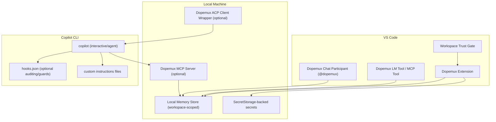
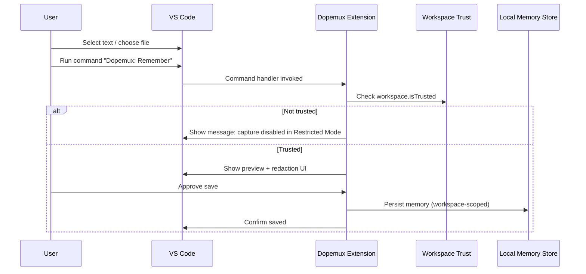
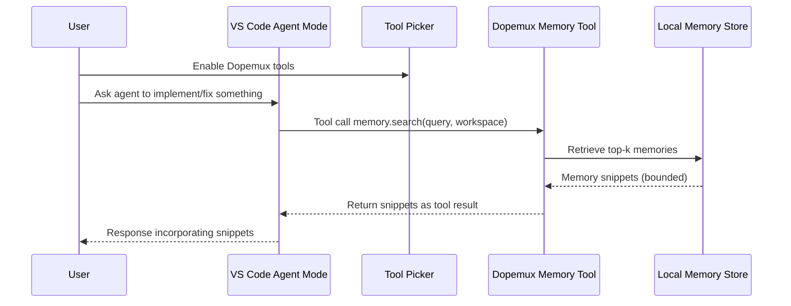
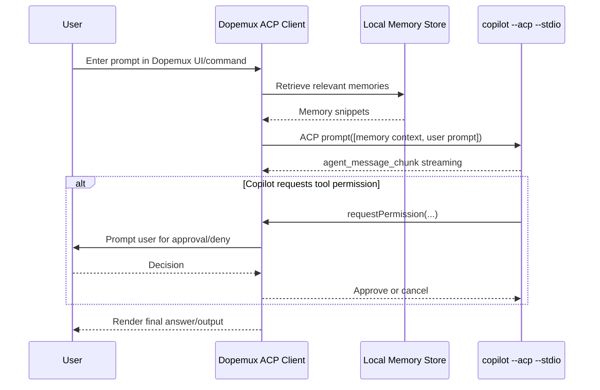

# Deep research report on integrating Dopemux with Copilot CLI and VS Code agent flows for safe memory capture and context injection

## Executive summary

This report evaluates *verifiable* integration surfaces between Copilot CLI and VS Code extension/agent workflows, focusing on **how Dopemux can capture “memory” and inject context** while respecting **Workspace Trust**, tool approval boundaries, and minimizing data leakage. It avoids speculation about model internals and limits claims to documented behaviours and public issue threads. citeturn4search0turn4search1turn19view2turn29view0turn16view1

Key findings:

VS Code gives extensions broad access to editor state (active editor, selections), workspace files (via `workspace.fs`, `findFiles`, `openTextDocument`), and terminals (including a **shell integration API** that can expose command lines and stream raw output). These surfaces are powerful enough to build a high-fidelity memory system, but they also create meaningful “exfiltration risk” if Dopemux stores or transmits sensitive content. citeturn18view0turn18view2turn21view1turn22view1turn22view2turn18view5turn5search14

Workspace Trust is a first-class boundary in VS Code: Restricted Mode exists to prevent unintended code execution and explicitly disables/limits multiple categories of risky features (including **AI agents**, tasks, debugging, and extensions), and extension authors can declare how they behave in untrusted workspaces through `capabilities.untrustedWorkspaces` and runtime checks like `workspace.isTrusted` or `workspace.onDidGrantWorkspaceTrust`. citeturn4search0turn4search1

Copilot CLI includes explicit guardrails that Dopemux should integrate **with**, not bypass: trusted directory prompts; a tool approval model; path/URL permissions (with known heuristic limits); and formal integration points including **custom instructions files**, MCP servers (with per-tool allow/deny controls), hooks (for auditing and policy enforcement), and an **ACP server mode** for programmatic clients that can mediate prompts and permissions. citeturn3view2turn19view1turn19view2turn19view3turn16view1turn23view0turn24view5turn3view4

Recommended conservative architecture:

Default to **explicit, user-driven memory capture** (opt-in) + **local-only persistence** by default (workspace-scoped), with secrets stored only using VS Code `SecretStorage`. Avoid any automatic ingestion of full file contents or terminal output into long-lived storage. citeturn22view3turn0search2turn4search0turn7view0

Use **tool-based retrieval** for injection (rather than silent prompt interception): implement a VS Code Language Model Tool and/or MCP server that returns only the minimum memory snippets needed, under explicit user tool enablement (tool picker) and (where applicable) organizational MCP allowlist governance. citeturn6view2turn29view0turn28view0

For Copilot CLI, prefer either (a) Dopemux as an **MCP server** the agent can call (with `--allow-tool/--deny-tool` governance) or (b) Dopemux as an **ACP client wrapper** that injects context into the user prompt and can refuse tool calls via the ACP permission callback. citeturn3view4turn16view1turn15view0

Unknowns (flagged):

There is no stable, official VS Code API documented that lets a third-party extension read or intercept prompts sent to other chat participants (e.g., Copilot’s built-in participant) outside the extension’s own participant/tools. This report therefore treats **prompt interception** as *not a dependable/legitimate integration strategy* and focuses on participant/tool-based injection where the extension is the explicit handler. citeturn6view1turn30view4

## Scope and assumptions

Assumptions (explicit):

Dopemux can ship (1) a VS Code extension and (2) a local companion process (optional) such as an MCP server and/or ACP client wrapper. Dopemux may also store data locally (file/DB) or optionally in a user-configured remote store. (No assumption is made about Dopemux internal data model beyond “it can store/retrieve memory entries.”)

User intent: capture memory and inject context **without violating Workspace Trust** and **without leaking data**. Therefore, designs are biased toward “least privilege,” explicit opt-in, workspace scoping, and reversible changes.

Copilot environment: Copilot CLI is documented as public preview and has policy-controlled availability for org-provisioned users; VS Code agent workflows follow Workspace Trust restrictions in Restricted Mode. citeturn19view1turn4search1

Non-goals:

No reverse engineering or speculation about Copilot model internals or hidden prompt composition beyond what is publicly described. citeturn5search26turn20view0

## Verified VS Code and Copilot CLI surfaces

### Extension APIs for commands, terminals, workspace context, storage

VS Code commands (execution + registration):

Extensions can register commands via `vscode.commands.registerCommand` and execute commands via `vscode.commands.executeCommand`. The API reference explicitly notes that commands contributed by extensions have no restrictions when executed (contrast: editor commands have argument type limits). citeturn30view4

Terminal surfaces:

VS Code exposes terminal lifecycle events (e.g., `window.onDidOpenTerminal`) and, critically, **terminal shell integration** events like `window.onDidStartTerminalShellExecution` / `window.onDidEndTerminalShellExecution`. These fire only when shell integration is activated and can expose `event.execution.commandLine` and allow streaming terminal output via `TerminalShellExecution.read()`. citeturn18view5turn5search14turn5search2

The terminal shell integration API also includes `Terminal.shellIntegration.executeCommand(...)` and a `sendText(...)` fallback. The API reference includes a security-relevant note: argument escaping is not intended as a security measure and extensions should be careful passing untrusted data. citeturn18view6turn30view1

Workspace context and file system:

VS Code provides workspace events and enumerators such as `workspace.onDidOpenTextDocument`, `workspace.onDidSaveTextDocument`, `workspace.workspaceFolders`, and the ability to search for files using `workspace.findFiles`. citeturn21view3turn21view4turn21view2turn21view1

Extensions can read/write files using the `workspace.fs` file system API (e.g., `readFile`, `writeFile`). citeturn22view1turn22view2

Persistent storage in extensions:

`ExtensionContext.globalState` and `ExtensionContext.workspaceState` store key/value data (mementos); `globalStorageUri` and `storageUri` provide directories for file-based storage. `storageUri` is workspace-specific and is undefined when no workspace/folder is open. citeturn22view6turn17view0

For secrets, VS Code provides `SecretStorage` (`context.secrets`) which is explicitly documented as encrypted and not synced across machines. The Remote Development guide also warns not to store secrets in `workspaceState`/`globalState` because they are not secure. citeturn22view3turn0search2

Workspace Trust APIs and manifest declaration:

Extensions can declare their Restricted Mode support in `package.json` via `capabilities.untrustedWorkspaces` (`true` / `false` / `limited`) and can gate behaviour at runtime using `workspace.isTrusted` and `workspace.onDidGrantWorkspaceTrust`. citeturn4search0turn4search1

### Data surfaces that are available and whether extensions can access them

Copilot’s own documented context gathering (what Copilot may send upstream) includes: code near the cursor, other open files, and repository URL/file paths. This is important because Dopemux’s memory capture and injection system should not inadvertently expand the set of sensitive files being pulled into AI context (especially in agent flows). citeturn5search26turn8search5turn4search1

From the VS Code API surface:

Active editor identity is accessible via `window.activeTextEditor`; selection changes are observable via `window.onDidChangeTextEditorSelection`; active editor changes via `window.onDidChangeActiveTextEditor`. citeturn18view0turn18view1turn18view2

Workspace-wide file discovery is accessible via `workspace.findFiles` and file reading/writing via `workspace.fs.readFile` / `workspace.fs.writeFile`. citeturn21view1turn22view1turn22view2

Terminal command lines and output *may* be accessible (when shell integration is enabled) via terminal shell integration events and `read()` streaming. citeturn18view5turn5search2turn5search14

User prompts:

VS Code chat participants receive the user prompt only when the user explicitly routes to that participant (e.g., @-mention). Creating a participant is done with `createChatParticipant(id, handler)` and the participant “handles the user’s natural language prompt.” This supports a conservative boundary assumption: Dopemux can[reliably] observe prompts it owns (its participant/tool calls), but should not assume it can observe prompts routed to other participants. citeturn6view1turn30view4turn30view4

In Copilot CLI, hooks provide *explicit* access to the exact prompt text: the “User prompt submitted hook” input JSON includes a `prompt` field described as “The exact text the user submitted.” This is a high-risk surface for memory capture and must be treated as “sensitive by default.” citeturn24view5turn13search2

### Deliverable A: Table of verified Copilot and VS Code surfaces

| API / Surface | Access | Persistence | Risks | Citations |
|---|---|---|---|---|
| `vscode.commands.registerCommand` / `executeCommand` | Extensions can register and execute commands; extension-contributed commands have “no restrictions” when executed | None inherently (but commands can cause side effects) | Command execution can trigger code execution, open folders, run tasks indirectly; must gate dangerous actions behind trust/explicit UI | citeturn30view4turn30view3 |
| `vscode.window.activeTextEditor` + `onDidChangeActiveTextEditor` | Read active editor identity; observe editor switches | None | Enables continuous capture of “what user is looking at,” which can become sensitive telemetry | citeturn18view0turn18view1 |
| `vscode.window.onDidChangeTextEditorSelection` | Observe selections/highlights (proxy for user focus) | None | Selections can include secrets or sensitive code; avoid storing raw selection text by default | citeturn18view2 |
| `vscode.workspace.onDidOpenTextDocument` / `onDidSaveTextDocument` | Observe which docs are opened/saved | None | File event logs can reveal repo structure and work patterns; keep minimal metadata | citeturn21view3turn21view4 |
| `vscode.workspace.findFiles(...)` | Enumerate files across workspace folders | None | Mass indexing can pull sensitive files; should be disabled in Restricted Mode and opt-in in trusted workspaces | citeturn21view1turn4search1 |
| `vscode.workspace.fs.readFile/writeFile` | Read/write arbitrary URIs via VS Code file system abstraction | File contents can be persisted anywhere the extension writes | High exfiltration risk; any automated scanning must be clearly disclosed and limited to trusted workspaces | citeturn22view1turn22view2turn4search1 |
| `vscode.window.createTerminal` / PTY terminals | Create terminals, including pseudo-terminals controlled by extension | Terminal sessions can persist depending on user settings | PTY can capture user input in that terminal; avoid building “spy terminals”; disclose clearly | citeturn18view4turn17view0 |
| Terminal shell integration: `window.onDidStartTerminalShellExecution` / `onDidEnd...` + `execution.read()` | Observe terminal **command lines** + stream output when shell integration active | None by default; extension may store results | Capturing command lines/output can leak secrets, tokens, hostnames; tool only fires when shell integration active | citeturn18view5turn5search14turn5search2 |
| `Terminal.shellIntegration.executeCommand` + `sendText` fallback | Extension can run commands in terminals; API warns escaping is not a security measure | None | Passing untrusted data into shell can lead to code execution; treat as sensitive operation; require trust and explicit user approval | citeturn18view6turn30view1turn4search1 |
| Workspace Trust manifest: `capabilities.untrustedWorkspaces` | Static declaration of how extension behaves in Restricted Mode | Persisted in extension package | Mis-declaration can cause unsafe behaviour in untrusted workspaces | citeturn4search0 |
| Workspace Trust runtime: `workspace.isTrusted`, `workspace.onDidGrantWorkspaceTrust` | Gate behaviour based on trust state | None | Failing closed is essential; Restricted Mode is designed to limit auto code execution | citeturn4search0turn4search1 |
| Extension storage: `context.globalState` / `context.workspaceState` | Key/value storage (mementos) | Persisted (global vs workspace) | Not secure for secrets; cross-workspace contamination if global used incorrectly | citeturn22view6turn0search2 |
| Extension storage dirs: `context.storageUri` / `globalStorageUri` | File storage dirs | Persisted; workspace vs global | Files may include sensitive data; must avoid committing/replicating; implement lifecycle cleanup | citeturn22view6turn17view0 |
| Secrets: `context.secrets` (`SecretStorage`) | Encrypted secret storage; not synced | Persisted locally (platform-backed) | Still sensitive; keep minimal; avoid logging; don’t mirror into other storages | citeturn22view3turn0search2 |
| Chat participation: `createChatParticipant(id, handler)` | Extension receives user prompt only when invoked | Chat history handled by host, not by Dopemux unless stored | Must disclose what is stored; do not silently siphon prompts | citeturn30view4turn6view1 |
| Language Model API: `selectChatModels` / `sendRequest` | Extensions can call models; VS Code provides transparency about usage/quotas | None by default | If prompts include workspace context, may leak; must minimize attachments and respect user model choice | citeturn6view0 |
| VS Code tool system: Language Model Tools | Agent mode can invoke extension tools; designed for agentic workflows | None by default | Tools can access editor APIs; require strict policy, logging, and explicit enablement | citeturn6view2 |
| MCP servers in VS Code (`.vscode/mcp.json`, tool picker) | Tools/resources/prompts can be enabled via tool picker; MCP servers require trust decisions | Config persisted in user profile or workspace; can sync across devices | MCP servers can run arbitrary code; tool picker + trust prompts are critical; starting server from `mcp.json` can bypass trust prompt | citeturn29view0turn13search0 |
| Org governance for MCP allowlist/registry | Admins can set registry URL and restrict to registry-only servers | Policy-level | Enterprise policy can block Dopemux MCP usage; plan for graceful fallback | citeturn28view0 |
| Copilot CLI trusted directories + config `trusted_folders` | CLI prompts to trust directory; permanent trust stored in config | Persisted in `~/.copilot/config.json` by default | Heuristic scoping not guaranteed to protect outside trusted dirs; don’t rely on it as a hard sandbox | citeturn3view2turn3view3 |
| Copilot CLI tool approvals + `--allow-tool/--deny-tool` | User approves tools; can allow all tools or specific tools, including MCP tools | Per session / flags | `--allow-all-tools` gives agent your full permissions; Dopemux should discourage | citeturn3view4turn19view2turn2view1 |
| Copilot CLI path/URL permissions | Default access limited to cwd/subdirs + temp; URLs require approval; detection is heuristic | Session-level | Heuristic extraction misses complex constructs/vars; Dopemux should avoid “security by heuristics” assumptions | citeturn19view2turn19view3 |
| Copilot CLI custom instructions files | `.github/copilot-instructions.md`, `.github/instructions/**/*.instructions.md`, `AGENTS.md` automatically included in prompts in repo | Persisted in repo | File-based injection is reviewable; but risks accidental commits of sensitive memory | citeturn19view0turn29view0 |
| Copilot CLI hooks (`userPromptSubmitted`, `preToolUse`, `postToolUse`) | Hooks receive JSON including exact prompt; pre-tool hook can deny tools | Hook scripts can write logs/files | Risk of creating durable prompt logs; only “deny” decision currently processed (per docs) | citeturn24view5turn24view3turn13search2 |
| Copilot CLI ACP server (`copilot --acp --stdio`) | Programmatic client sends prompts over NDJSON; client gets `requestPermission` callbacks | Client-controlled | Enables safe prompt augmentation + refusing tool calls; requires careful UX for consent | citeturn15view0turn16view1 |
| Copilot CLI MCP management (`/mcp add`) | CLI can add MCP servers; comes with GitHub MCP server configured | Persisted in CLI config | MCP tool access can be allow/deny controlled; enterprise policies may restrict | citeturn27search7turn3view4turn28view0 |

Code examples (selected, minimal, verified by docs):

Using terminal shell integration to capture command line and stream output (must call `read()` immediately): citeturn18view5turn5search14

```ts
import * as vscode from "vscode";

export function activate(ctx: vscode.ExtensionContext) {
  ctx.subscriptions.push(
    vscode.window.onDidStartTerminalShellExecution(async (event) => {
      const cmd = event.execution.commandLine; // includes value/confidence/isTrusted
      // DO NOT persist raw cmd by default; treat as sensitive
      const stream = event.execution.read();
      for await (const chunk of stream) {
        // chunk is raw terminal output; avoid long-term storage by default
        console.log(chunk);
      }
    })
  );
}
```

Creating a chat participant (Dopemux-controlled prompt surface): citeturn30view4turn6view1

```ts
import * as vscode from "vscode";

export function activate(ctx: vscode.ExtensionContext) {
  vscode.chat.createChatParticipant("dopemux.memory", async (request, context, stream, token) => {
    // request.prompt is user input routed to this participant
    stream.markdown("I can manage workspace-scoped memory with explicit opt-in.");
    return { metadata: {} };
  });
}
```

Launching Copilot CLI as an ACP server (mechanics for prompt augmentation, with permission refusal): citeturn16view1turn15view0

```ts
import * as acp from "@agentclientprotocol/sdk";
import { spawn } from "node:child_process";
import { Readable, Writable } from "node:stream";

// Spawn: copilot --acp --stdio, then speak NDJSON over stdio.
// ACP client’s requestPermission can cancel tool calls by default.
```

## Security boundaries and trust model

### Workspace Trust and Restricted Mode constraints

Workspace Trust exists to reduce risk of unintended code execution when opening unfamiliar code; Restricted Mode disables/limits multiple risky features. The VS Code user guide explicitly calls out that Restricted Mode disables agents in that workspace and warns that agent features can pull arbitrary files into context and be susceptible to prompt injection. citeturn4search1

The extension author guide provides the formal contract Dopemux should follow:

Declare trust support in `package.json` with `capabilities.untrustedWorkspaces` (fully supported, not supported, or limited). citeturn4search0

Use `workspace.isTrusted` and `workspace.onDidGrantWorkspaceTrust` to block trust-sensitive code paths and to register functionality only once trust is granted. citeturn4search0

A critical limitation: Workspace Trust “can’t prevent a malicious extension from executing code and ignoring Restricted Mode,” meaning user trust in the extension publisher remains essential. For Dopemux, this implies a strong need for internal “safety rails” (fail-closed defaults, explicit opt-in, transparent logging of actions) even in trusted workspaces. citeturn4search1

### Copilot-specific constraints that matter for Dopemux

Copilot data scope and retention policies vary by context:

GitHub Copilot settings for individual subscribers explicitly state: by default, prompts/suggestions/code snippets are not used for AI model training and “cannot be enabled,” and users can choose whether prompts/suggestions are collected/retained for product improvements (and shared with entity["company","Microsoft","copilot service partner"]). citeturn20view0

Copilot’s public product description states Copilot may examine lines near the cursor and other open files, plus repo URLs/file paths, to form context sent for suggestions. citeturn5search26

Content exclusion is an explicit mitigation: excluded files should not inform inline suggestions, other files’ suggestions, chat responses, or code review. This is directly relevant to Dopemux: memory capture/injection must not reintroduce excluded content via a side channel. citeturn8search5turn8search2

For Copilot CLI, the security model includes:

Trusted directories: user is prompted to trust the folder; permanent trust is stored in config; and GitHub warns scoping is heuristic and not guaranteed to protect all files outside trusted directories. citeturn3view2turn3view3turn19view1

Tool approvals and allow/deny flags, including allow/deny patterns for MCP server tools. citeturn3view4turn2view1

Path/URL permissions: default path access is current working directory + subdirs + temp; URL access requires approval; detection is heuristic with explicit limitations. citeturn19view2turn19view3

Hooks: “User prompt submitted” exposes exact prompt text; pre-tool hook can deny tool calls and is positioned as the strongest enforcement point. The hooks configuration docs state only `"deny"` is currently processed from hook output decisions. citeturn24view5turn24view3turn13search9

ACP mode: a programmatic client can start `copilot --acp --stdio` and receives `requestPermission` callbacks, enabling an integrating tool (like Dopemux) to refuse tool calls by default or implement a safer approval UI. citeturn15view0turn16view1

### Deliverable B: Memory trust model for Dopemux

This model is designed to align with: VS Code workspace trust expectations, VS Code secret storage guidance, and GitHub’s plugin governance language that prohibits collecting personal data without express notice/consent and prohibits spyware-style monitoring. citeturn4search1turn0search2turn7view0

What Dopemux must **never** store by default (or ever store without extremely explicit, granular consent and strong security controls):

Raw secrets or credentials: API keys, tokens, private keys, secrets embedded in terminal output, `.env` file contents, auth headers, etc. Rationale: terminal and workspace surfaces can contain credentials; VS Code recommends using `SecretStorage` for secrets; content exclusion often targets exactly these patterns (e.g., `.env`). citeturn22view3turn0search2turn8search2turn29view0

Full raw user prompts from Copilot CLI hooks (`prompt` field) or chat prompts, unless the user explicitly uses a “Remember this prompt” action. Rationale: Copilot CLI hooks provide the exact prompt and encourage logging/auditing; unbounded retention of prompts is a high-risk privacy leak surface. citeturn24view5turn13search2turn7view0

Bulk plaintext copies of workspace files (or terminal output streams) stored as durable “memory.” Rationale: extensions can read files and stream terminal output; capturing/retaining those creates real exfiltration and cross-device leakage risks, and undermines Restricted Mode’s intent (safe browsing). citeturn22view1turn18view5turn4search1

Cross-workspace/global “memory pooling” that mixes unrelated repositories by default. Rationale: `globalState` is workspace-independent; using it for semantic memory can create accidental disclosure across repos. citeturn22view6turn4search1

What Dopemux can store locally (default-on, but still opt-in recommended):

Small, user-authored “facts” or rules that are explicitly marked as safe (e.g., coding conventions, preferred command sequences, architectural “north star” summaries). Prefer bounded length + attachment of provenance (repo, path scope). Rationale: Copilot CLI supports custom instructions files and VS Code supports using `.github/copilot-instructions.md` to guide tool selection, implying that “rule-like” content is intended to be shared as context. citeturn19view0turn29view0

Non-sensitive metadata with truncation/hashing: repo identifier, workspace folder URI, language IDs, timestamps, counts of commands (not raw command lines), file path patterns (not contents). Rationale: supports recall/relevance ranking without retaining sensitive payloads. (Risk remains; keep minimal.) citeturn21view3turn21view2turn18view5

Secrets: only in VS Code `SecretStorage` (`context.secrets`) with minimal scope. Rationale: documented encrypted storage and not synced. citeturn22view3turn0search2

What must be externalized (or disabled) unless explicitly configured:

Any network-synced memory store (cloud DB, “team memory,” analytics pipelines). Rationale: GitHub’s plugin governance requires express notice/consent for personal data and prohibits spyware/unauthorized monitoring; additionally, GitHub Copilot settings and terms emphasize policy-controlled sharing and different retention depending on access context. Treat remote memory as a separately consented feature with robust safeguards. citeturn7view0turn20view0turn10search17

Enterprise environments with MCP allowlist/registry enforcement: Dopemux MCP tooling may be blocked unless included in the registry. Rationale: orgs can restrict MCP access to registry servers. citeturn28view0

## Dopemux Copilot Mode architecture

This section proposes a conservative, reversible integration design composed of two adapters (capture + injection) and two execution environments (VS Code, Copilot CLI). It uses only documented integration mechanisms: VS Code tools/participants/MCP; Copilot CLI custom instructions/MCP/hooks/ACP. citeturn6view2turn29view0turn19view0turn16view1turn24view5

### Design overview

Principles:

Fail closed in Restricted Mode: no reading workspace files, no terminal interception, no background indexing. Dopemux can still show UI explaining what becomes available after trust is granted. citeturn4search0turn4search1

Default “memory write” is explicit: the user must invoke a command / UI (“Remember this”) rather than Dopemux passively scraping. This aligns with anti-spyware expectations. citeturn7view0turn4search1

Prefer “tool-based memory recall” over silent prompt augmentation: in VS Code, use Language Model Tools or MCP tools (with tool picker); in Copilot CLI, use MCP tools or an ACP wrapper. citeturn6view2turn29view0turn15view0

### Dopemux components

Mermaid relationship diagram (entities and surfaces):



### Capture adapter design

Capture sources (trusted workspaces only):

Editor-driven explicit capture:

User selects code or text or a file and invokes `Dopemux: Remember selection` / `Remember rule` (command). Selection event APIs exist, but Dopemux shouldn’t automatically store selection contents. citeturn18view2turn30view4

Terminal-driven explicit capture:

If the user chooses, Dopemux can capture the **last command line** and/or summarized output from terminal shell integration events. Because the API can stream raw output, the safe pattern is: display a preview and require explicit “Save as memory” approval with redaction filters. citeturn18view5turn5search14

Optional (off by default) “suggested memories” mode:

Dopemux can observe events like “file saved” or “tests ran” and suggest a memory entry (not store it). This uses `workspace.onDidSaveTextDocument` and terminal shell execution events. citeturn21view4turn18view5

Workspace Trust gating implementation:

Dopemux should set `capabilities.untrustedWorkspaces.supported` to `'limited'` (or `false`), and hard-gate capture features by checking `workspace.isTrusted`. citeturn4search0turn4search1

### Injection adapter design

Injection into VS Code agent workflows:

Primary: Language Model Tool

Register a Dopemux “memory recall” tool that returns a small set of relevant memory snippets given the current task. This tool can be invoked by agent mode and is designed explicitly for “agentic coding workflows.” citeturn6view2

Consent boundary: tool picker

VS Code’s MCP/tools documentation states that users select which tools the agent is allowed to use via the tool picker, and that tools can also be referenced explicitly. Build Dopemux so that memory injection happens only when Dopemux tools are enabled. citeturn29view0

Secondary: MCP resources/prompts

If Dopemux ships an MCP server, it can provide memory as an MCP resource that the user attaches via “Add Context > MCP Resources,” further increasing explicitness. citeturn29view0turn13search0

Injection into Copilot CLI:

Option A: Dopemux as MCP server

Copilot CLI supports MCP servers and allows allow/deny gating, including server-specific tools. Dopemux can expose tools like `memory.search` and `memory.putDraft` so Copilot CLI can query memory on demand rather than Dopemux injecting content blindly. citeturn3view4turn27search7turn2view1

Option B: Dopemux as ACP client wrapper (prompt augmentation)

Copilot CLI can run as an ACP server (`copilot --acp --stdio`). Dopemux can act as the client, retrieve memory, and prepend it to the user prompt as a “context message.” The ACP client can also refuse tool calls by default through `requestPermission`, forcing explicit user approval workflows in Dopemux UI before any tool executes. citeturn15view0turn16view1

Option C: file-based context (explicit, reviewable)

Copilot CLI automatically includes repository custom instructions files like `.github/copilot-instructions.md`, path-specific instruction files, and agent files such as `AGENTS.md`. Dopemux can generate a **reviewable** instruction fragment (e.g., `.github/instructions/dopemux.instructions.md`) but should avoid writing into repo by default and must warn about commit risk. citeturn19view0turn29view0

### User opt-in boundaries

Minimum opt-ins Dopemux should implement:

Workspace Trust required for any automated capture/summarization that reads workspace files or uses terminal shells. citeturn4search1turn4search0

Separate toggles for:
“Store memory locally”
“Capture terminal commands/output”
“Enable agent/tool access to memory”
“Enable remote sync (if any)”

These align with GitHub’s plugin governance requirements about notice/consent and avoiding spyware-like monitoring. citeturn7view0

### Sequence diagrams for core flows

VS Code “explicit memory capture” flow:



VS Code agent-mode injection via tool picker:



Copilot CLI injection via ACP wrapper:



## Failure modes, safety analysis, and task packet

### Deliverable D: Failure and safety analysis

Silent failure risks and mitigations:

Restricted Mode disables agents; Dopemux features may appear “broken” if not surfaced clearly. Mitigation: show status surface (“Restricted Mode: memory capture disabled”) and register trust-sensitive commands only after `onDidGrantWorkspaceTrust`. citeturn4search1turn4search0

Terminal shell integration not enabled: terminal command capture events fire only when shell integration is activated. Mitigation: detect absence of shell integration, provide guided enablement instructions, and fall back to explicit user copy/paste capture rather than scraping. citeturn18view5turn5search2

Tasks and shell integration edge cases: public issues indicate some behaviours can be inconsistent (e.g., a report that tasks do not trigger `onDidStartTerminalShellExecution`). Mitigation: don’t rely on one event source for audit; provide manual capture and integrity checks. citeturn5search17

Workspace switching / multi-root workspaces: memory can “bleed” between roots if keyed only by “current workspace.” Mitigation: scope memory by (workspace folder URI + repository remote URL hash if available + unique repo ID) and require explicit scope display in UI. Workspace folders are enumerable and mutable. citeturn21view2

MCP trust bypass: VS Code warns that starting an MCP server directly from `mcp.json` can avoid being prompted to trust server configuration. Mitigation: Dopemux docs/UX should prefer flows that trigger trust prompts; optionally implement an additional Dopemux-level “server trust acknowledgement” gate. citeturn29view0

Copilot CLI heuristic permissions: Copilot CLI path/URL checks are heuristic and have limitations. Mitigation: Dopemux should not treat them as a formal sandbox; implement additional deny-lists and explicit “safe mode” defaults (no write tools, no allow-all-tools). citeturn19view2turn3view3

Prompt/data retention differences by surface: Individual settings include data controls; business/enterprise retention differs depending on access and “other access and use.” Mitigation: Dopemux should treat *any* prompt/context it assembles as potentially retained by upstream services depending on plan/settings/context and should therefore minimize content in injected context. citeturn20view0turn10search17turn9search10

### Deliverable E: Task packet outline

Implementation plan (phased, conservative, reversible)

Phase 1: VS Code extension safety shell

Implement Workspace Trust gating: `capabilities.untrustedWorkspaces: { supported: "limited", ... }` and hard checks of `workspace.isTrusted`. citeturn4search0

Implement minimal local memory store (workspace-scoped) using `context.storageUri` for files + `workspaceState` for small indices; use `context.secrets` for any credentials. citeturn22view6turn22view3turn0search2

Provide explicit user commands: “Remember…”, “Forget…”, “Show memory for this repo”, “Export memory (local)”, “Purge all.” citeturn30view4

Phase 2: VS Code agent integration

Implement Language Model Tool(s): `dopemux.memory.search`, `dopemux.memory.summarizeCandidate`, `dopemux.memory.storeWithConsent`. Tools API is designed for agent mode tool invoking. citeturn6view2

Add an optional chat participant `@dopemux` for interactive memory operations and for transparent “what I will send” previews. citeturn6view1turn30view4

Respect tool picker enablement as the primary consent boundary (no always-on injection). citeturn29view0

Phase 3: Copilot CLI integrations

Ship Dopemux MCP server (local stdio transport) exposing read-only memory tools first. Ensure docs mention Copilot CLI allow/deny tool controls for MCP tools. citeturn3view4turn2view1

Add ACP wrapper integration: spawn `copilot --acp --stdio`, implement prompt augmentation, and implement a permission UI that defaults to deny/cancel. citeturn15view0turn16view1

Optional: hooks-based guardrails (for users who want auditing): provide sample `.github/hooks/*.json` that logs tool usage and denies dangerous patterns. Warn users strongly not to log raw prompts unless required. citeturn13search2turn24view3turn24view5

Required permissions / declarations (practical)

VS Code: no explicit OS “permissions” model exists, but Dopemux must declare `untrustedWorkspaces` behaviour and should avoid requesting additional capabilities unless needed. citeturn4search0

If Dopemux uses language models in VS Code, follow the Language Model API guidance and be defensive about model availability and quotas; respect the user’s selected model when integrated into chat. citeturn6view0

If Dopemux uses MCP in VS Code, it must account for MCP trust prompts and avoid hardcoding credentials in configs; use input variables and environment files as recommended. citeturn29view0

Instrumentation / telemetry (minimal, privacy-first)

Default Dopemux telemetry off; if metrics are necessary, collect only aggregated counters (feature usage, error codes) and never raw prompts, file contents, or terminal output. This aligns with the general principle that users must be informed and consent to personal data collection in plugins. citeturn7view0

Testing plan (must include negative and safety tests)

Workspace Trust tests:
Verify no file scanning or terminal capture occurs when `workspace.isTrusted === false`.
Verify commands are hidden/disabled in Restricted Mode and only activated after trust. citeturn4search0turn4search1

Storage tests:
Secrets only in `SecretStorage`, never in `globalState/workspaceState`.
Workspace switching doesn’t expose other workspace memory. citeturn22view3turn0search2turn22view6

Terminal tests:
With shell integration enabled, capture shows preview and requires explicit save.
Without shell integration, Dopemux provides safe fallback and does not silently scrape. citeturn18view5turn5search2

Copilot CLI tests:
MCP tools denied by default; ensure CLI `--deny-tool` patterns are documented.
ACP wrapper refuses tool calls unless user approves.
Validate behaviour when CLI policies disable feature (org setting). citeturn19view1turn3view4turn15view0

Rollout checklist

Security review:
Threat model: memory exfiltration, prompt injection, cross-workspace contamination.
Red-team tests: secrets in terminal output; ensure redaction and “never store” rules hold. citeturn4search1turn5search2turn8search2

Documentation:
Explain Workspace Trust behaviour, what is captured, where it is stored, how to purge, and how MCP/ACP integrations work.
Provide explicit warnings about repo-based instruction files and accidental commits. citeturn19view0turn29view0

Enterprise readiness:
Document MCP allowlist/registry dependency and fallback modes if blocked. citeturn28view0turn29view0

Policy alignment:
Ensure user consent flows satisfy GitHub’s plugin governance language (privacy notices, no spyware, no database-building from accessed data). citeturn7view0
