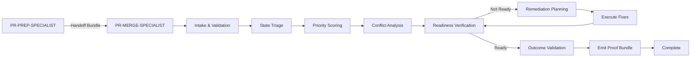

# PR-MERGE-SPECIALIST Documentation

## Overview

The PR-MERGE-SPECIALIST is responsible for the final stage of pull request processing, focusing on merge readiness verification, conflict resolution, and safe merging. This documentation defines the canonical contracts, workflows, and governance requirements for all PR-MERGE-SPECIALIST implementations.

## Documentation Structure

```
docs/pr_merge/
├── README.md                      # This file
├── OPERATOR_CONTRACT.md           # Behavioral contract
├── WORKFLOW_SEQUENCE.md           # Step-by-step workflow
├── ESCALATION_RULES.md           # Error handling protocol
├── HANDOFF_FROM_PRPS_CONTRACT.md  # Handoff contract from PR-PREP
└── adapters/                      # Platform-specific adapters (future)
```

## Core Contracts

### 1. Operator Contract
**[OPERATOR_CONTRACT.md](operator-contract.md)**

Defines the canonical behavior contract for PR-MERGE-SPECIALIST:
- Workflow sequence (10 mandatory steps)
- Decision logic requirements
- Artifact emission contracts
- Compliance and governance integration

### 2. Workflow Sequence
**[WORKFLOW_SEQUENCE.md](workflow-sequence.md)**

Detailed specification of the 10-step workflow:
1. INTAKE_HANDOFF
2. TRIAGE_STATE
3. SCORE_PRIORITY
4. CONFLICT_ANALYSIS
5. VERIFY_READINESS
6. PLAN_REMEDIATION
7. EXECUTE_FIXES
8. VALIDATE_OUTCOME
9. EMIT_PROOF
10. HANDOFF_COMPLETE

### 3. Escalation Rules
**[ESCALATION_RULES.md](escalation-rules.md)**

Canonical escalation protocol:
- Level 1 (WARNING): Non-blocking issues
- Level 2 (BLOCK): Requires intervention
- Level 3 (GOVERNANCE_REVIEW): Contract breaches
- Recovery procedures for each level

### 4. Handoff Contract
**[HANDOFF_FROM_PRPS_CONTRACT.md](handoff-from-prps-contract.md)**

Defines how PR-MERGE-SPECIALIST receives handoffs from PR-PREP-SPECIALIST:
- Expected handoff bundle structure
- Validation rules and procedures
- Error handling and recovery
- Governance continuity requirements

### 5. Flight Deck Operations
**[flight_deck/README.md](flight_deck/readme-2.md)**

Advanced operational control system:
- Closed-loop automation
- Fusion engine for conflict resolution
- Ops monitoring and metrics
- CLI commands and workflows

## Implementation Status

### Current Implementation
- **Source Code**: `src/dopemux_pr_merge_specialist/`
- **CLI Entry Point**: `dopemux-pr-merge`
- **Proof Storage**: `proof/pr_merge/`
- **Tests**: `tests/pr_merge_specialist/`

### Documentation Status
- ✅ Operator Contract: Complete
- ✅ Workflow Sequence: Complete
- ✅ Escalation Rules: Complete
- ✅ Handoff Contract: Complete
- ⏳ Platform Adapters: Planned
- ⏳ Validation Artifacts: Planned

## Workflow Overview



## Key Features

### Governance Integration
- Complete chain of custody tracking
- Proof bundles for every execution
- Governance posture enforcement
- Compliance monitoring and reporting

### Conflict Resolution
- Automatic conflict classification
- Resolution strategy planning
- Auto-resolvable conflict handling
- Manual escalation for complex conflicts

### Readiness Verification
- Uniform readiness gates
- CI status integration
- Thread resolution tracking
- Blocking criteria enforcement

### Remediation Workflow
- Structured remediation planning
- Prioritized execution
- Verification requirements
- Rollback procedures

## Execution Contexts

### CLI Context
```bash
# Scan PR queue
dopemux-pr-merge queue-scan

# Process specific PR
dopemux-pr-merge pr-fix --id 194

# Interactive mode
dopemux-pr-merge interactive

# Flight Deck operations
dopemux-pr-merge flight-deck --pr-id 194 --auto-pilot

# Fusion engine for conflict resolution
dopemux-pr-merge fusion --pr-id 194 --strategy STAGED

# Ops metrics and monitoring
dopemux-pr-merge ops --window 10
```

### API Context
- REST API endpoints
- Webhook integrations
- Status reporting
- Async processing

### Interactive Context
- Rich terminal UI
- Guided workflow
- Real-time feedback
- Manual override capabilities

## Governance Requirements

### Compliance Monitoring
- Automated validation gates
- Decision consistency checking
- Artifact completeness verification
- Chain of custody auditing

### Proof Artifacts
All executions must emit:
- `HANDOFF_VALIDATION.json`
- `TRIAGE_REPORT.json`
- `PRIORITY_SCORE.json`
- `CONFLICT_ANALYSIS.json`
- `READINESS_DECISION.json`
- `REMEDIATION_PLAN.json` (if applicable)
- `FIX_EXECUTION_REPORT.json` (if applicable)
- `VALIDATION_REPORT.json`
- `PROOF_BUNDLE.json`
- `HANDOFF_COMPLETE.json`

### Reporting
- Execution metrics and timings
- Escalation trends and patterns
- Compliance audit trails
- Performance benchmarks

## Integration Points

### With PR-PREP-SPECIALIST
- **Input**: Handoff bundle via `proof/pr_prep/`
- **Validation**: Structure and content verification
- **Feedback**: Validation results and error reporting

### With GitHub API
- **Read**: PR state, CI status, comments
- **Write**: PR updates, comment replies, metadata
- **Webhooks**: Real-time event processing

### With Governance Systems
- **Compliance**: Policy enforcement
- **Audit**: Chain of custody tracking
- **Reporting**: Metrics and validation results

## Development Guidelines

### Adding New Features
1. Update operator contract with new requirements
2. Extend workflow sequence (append only)
3. Add validation gates
4. Update escalation rules
5. Document governance implications

### Modifying Existing Features
1. Maintain backward compatibility
2. Update version according to semantic versioning
3. Provide migration path
4. Document breaking changes clearly
5. Update all platform adapters

### Testing Requirements
1. Cross-context consistency verification
2. Decision consistency testing
3. Artifact completeness validation
4. Chain of custody verification
5. Performance benchmarking

## Quick Start

### Validate Handoff Bundle
```bash
# Check handoff structure
dopemux-pr-merge validate-handoff --path proof/pr_prep/TP-PRPS-008-HANDOFF-001.json
```

### Process PR Queue
```bash
# Scan and prioritize
dopemux-pr-merge queue-scan

# Process top PR
dopemux-pr-merge pr-fix --id <pr_number>
```

### Interactive Mode
```bash
# Launch interactive wizard
dopemux-pr-merge interactive
```

## Troubleshooting

### Common Issues

**Validation Failure**: Handoff bundle structure invalid
- Check all required fields present
- Verify artifact count (must be 7)
- Validate chain of custody

**CI Detection Failure**: Unable to determine CI status
- Check GitHub API connectivity
- Verify repository permissions
- Retry with exponential backoff

**Conflict Analysis Failure**: Unable to classify conflicts
- Continue with conservative strategy
- Flag for manual review
- Document unknown conflict type

### Escalation Path
```
Level 1 (WARNING) → Log and continue
Level 2 (BLOCK) → Pause and await resolution
Level 3 (GOVERNANCE_REVIEW) → Full audit and governance intervention
```

## Future Roadmap

### Phase 1: Core Documentation ✅
- Operator contract
- Workflow sequence
- Escalation rules
- Handoff contract

### Phase 2: Platform Adapters
- CLI adapter documentation
- API adapter specification
- Interactive adapter guidelines
- Webhook integration guides

### Phase 3: Validation Artifacts
- Cross-context compliance reports
- Decision consistency matrices
- Performance benchmarking
- Coverage gap analysis

### Phase 4: Advanced Features
- Autonomous merge capabilities
- Machine learning integration
- Predictive conflict resolution
- Adaptive governance postures

## Compliance Checklist

- [ ] Operator contract implemented
- [ ] Workflow sequence followed exactly
- [ ] Escalation protocol operational
- [ ] Handoff contract validated
- [ ] All validation gates passing
- [ ] Proof bundles emitted correctly
- [ ] Chain of custody documented
- [ ] Cross-context consistency verified
- [ ] Governance integration complete
- [ ] Compliance monitoring operational

## Support

### Documentation Issues
Report documentation issues in the repository issue tracker with label `docs-pr-merge`.

### Implementation Questions
Consult the operator contract and workflow sequence for canonical behavior definitions.

### Governance Questions
Contact the governance team for compliance and policy interpretations.

## License

This documentation is governed by the repository's main license agreement.

**Last Updated**: 2026-03-15
**Status**: Core documentation complete, platform adapters planned
