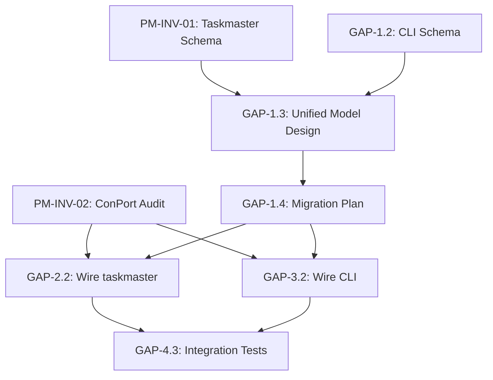

# PM Phase 0 Action Items

**Source**: PM_PLANE_INVENTORY.md critical gaps analysis
**Status**: 📋 READY FOR PRIORITIZATION
**Created**: 2026-02-11

---

## 🔴 HIGH PRIORITY (Blocking Progress)

### GAP-1: No Unified Task Model
**Problem**: 3 separate task systems with incompatible schemas
**Impact**: Task state fragmentation, no single source of truth
**Blockers**: Cannot design PM plane architecture until resolved

**Action Items**:
- [ ] **GAP-1.1**: Document taskmaster implicit task schema
  - File: `services/taskmaster/server.py`, `bridge_adapter.py`
  - Output: Schema specification in PM-INV-01 evidence bundle
  - Effort: 2-4 hours

- [ ] **GAP-1.2**: Document CLI TaskRecord schema
  - File: `src/dopemux/adhd/task_decomposer.py:40-81`
  - Output: Schema comparison table (TaskRecord vs OrchestrationTask)
  - Effort: 1-2 hours

- [ ] **GAP-1.3**: Design unified task model
  - Input: OrchestrationTask + TaskRecord + taskmaster schema
  - Output: Unified schema design doc (PM-INV-03)
  - Constraints: Must be backwards-compatible with ConPort progress_entry
  - Effort: 4-8 hours

- [ ] **GAP-1.4**: Create migration plan
  - Input: Unified schema design
  - Output: Step-by-step migration strategy
  - Considerations: Zero-downtime, data preservation
  - Effort: 2-4 hours

**Acceptance Criteria**:
- ✅ Single canonical task schema documented
- ✅ Migration plan approved
- ✅ Backwards compatibility verified

---

### GAP-2: Taskmaster Missing ConPort Integration
**Problem**: Taskmaster tasks not synced to ConPort (orphaned)
**Impact**: CLI-created tasks invisible to task-orchestrator
**Evidence**: `server.py:52` mentions ConPort but no imports/calls found

**Action Items**:
- [ ] **GAP-2.1**: Audit taskmaster ConPort references
  - Files: `services/taskmaster/server.py`, `bridge_adapter.py`
  - Search: ConPort import statements, API calls
  - Output: Integration status report (PM-INV-02)
  - Effort: 1 hour

- [ ] **GAP-2.2**: Wire ConPort adapter to taskmaster
  - Pattern: Follow `task-orchestrator/app/adapters/conport_adapter.py`
  - Actions: Create progress_entry on task create/update
  - Testing: Verify tasks appear in ConPort
  - Effort: 4-6 hours

- [ ] **GAP-2.3**: Add EventBus → ConPort bridge
  - Pattern: taskmaster publishes events → working-memory-assistant → ConPort
  - Alternative: Direct ConPort API calls from taskmaster
  - Decision: Choose based on PM-INV-02 findings
  - Effort: 3-5 hours

**Acceptance Criteria**:
- ✅ Taskmaster tasks visible in ConPort
- ✅ ConPort progress_entry created on task lifecycle events
- ✅ Integration tests pass

---

### GAP-3: CLI Tasks Missing ConPort Sync
**Problem**: CLI tasks use filesystem-only storage (.taskmaster/)
**Impact**: CLI tasks not tracked in canonical PM system
**Evidence**: `task_decomposer.py` has no ConPort imports

**Action Items**:
- [ ] **GAP-3.1**: Add ConPort client to CLI
  - File: `src/dopemux/adhd/task_decomposer.py`
  - Pattern: Use ConPort MCP client (similar to task-orchestrator)
  - Effort: 2-3 hours

- [ ] **GAP-3.2**: Sync TaskRecord to ConPort on create/update
  - Events: Task create, status change, completion
  - API: `log_progress()`, `update_progress()`
  - Effort: 3-4 hours

- [ ] **GAP-3.3**: Handle offline mode gracefully
  - Scenario: ConPort unavailable
  - Behavior: Queue events, sync when available
  - Effort: 2-3 hours

**Acceptance Criteria**:
- ✅ CLI tasks appear in ConPort
- ✅ Offline mode degrades gracefully
- ✅ Sync queue processes on reconnect

---

### GAP-4: PM Test Layout and CI Wiring Gap
**Problem**: No standard `services/*/tests/` layout for PM components; task-orchestrator tests currently exist as root-level `test_*.py` files and may not be consistently discovered/executed in CI
**Impact**: Test presence is real, but discovery/execution drift can still block safe refactoring
**Evidence**: Root-level PM tests are present in task-orchestrator (`docs/planes/pm/_evidence/PM-INV-00.outputs/11_task_orchestrator_files.txt.nl.txt:L129-L134`; `docs/planes/pm/_evidence/PM-INV-00.outputs/12_services_task-orchestrator_test_conport_sync.py.nl.txt:L1-L10`)

**Action Items**:
- [ ] **GAP-4.1**: Standardize task-orchestrator test layout and discovery
  - Directory: `services/task-orchestrator/tests/`
  - Coverage: OrchestrationTask lifecycle, ConPort sync, status transitions
  - Framework: pytest
  - Effort: 6-8 hours

- [ ] **GAP-4.2**: Create taskmaster test suite (currently no scoped root-level `test_*.py` files evidenced)
  - Directory: `services/taskmaster/tests/`
  - Coverage: EventBus integration, task CRUD
  - Effort: 4-6 hours

- [ ] **GAP-4.3**: Add ConPort sync integration tests
  - Scope: task-orchestrator ↔ ConPort ↔ Leantime
  - Scenarios: Create task, update status, sync to Leantime
  - Effort: 4-6 hours

- [ ] **GAP-4.4**: Add TaskStatus enum transition tests
  - Coverage: All valid state transitions
  - Edge cases: Invalid transitions, idempotency
  - Effort: 2-3 hours

**Acceptance Criteria**:
- ✅ 70%+ code coverage for PM components
- ✅ All critical paths tested
- ✅ CI/CD integration

---

### GAP-5: ConPort Unavailability Handling Unknown
**Problem**: No documented resilience strategy
**Impact**: Service failure if ConPort down
**Risk**: Single point of failure

**Action Items**:
- [ ] **GAP-5.1**: Audit ConPort error handling
  - Files: `conport_adapter.py`, `enhanced_orchestrator.py`
  - Search: try/except blocks, fallback logic
  - Output: Resilience analysis (PM-INV-02)
  - Effort: 1-2 hours

- [ ] **GAP-5.2**: Implement circuit breaker pattern
  - Library: `circuitbreaker` or manual implementation
  - Behavior: Fail fast after N errors, auto-recover
  - Effort: 3-4 hours

- [ ] **GAP-5.3**: Add degraded mode
  - Behavior: Continue without ConPort, queue events
  - Recovery: Sync queue when ConPort returns
  - Effort: 4-5 hours

- [ ] **GAP-5.4**: Document resilience strategy
  - Output: ADR or runbook
  - Content: Failure modes, recovery procedures
  - Effort: 1 hour

**Acceptance Criteria**:
- ✅ Service continues in degraded mode when ConPort down
- ✅ Events queued and synced on recovery
- ✅ Monitoring/alerting configured

---

## 🟡 MEDIUM PRIORITY (Quality Improvements)

### GAP-6: Leantime Sync Logic Not Fully Audited
**Problem**: Conflict resolution strategy unclear
**Impact**: Potential state corruption from race conditions

**Action Items**:
- [ ] **GAP-6.1**: Audit Leantime sync implementation
  - File: `services/task-orchestrator/app/core/sync.py`
  - Focus: `_map_status_*` functions (lines 833-845)
  - Questions: Last-write-wins? Merge? Timestamp-based?
  - Effort: 2-3 hours

- [ ] **GAP-6.2**: Document sync frequency and triggers
  - Config: Polling interval vs webhook
  - Triggers: Manual sync, auto-sync rules
  - Effort: 1 hour

- [ ] **GAP-6.3**: Add conflict resolution tests
  - Scenarios: Concurrent updates, clock skew
  - Verification: State consistency maintained
  - Effort: 3-4 hours

**Acceptance Criteria**:
- ✅ Conflict resolution strategy documented
- ✅ Edge cases tested
- ✅ Sync behavior predictable

---

### GAP-7: EventBus Replay Strategy Unknown
**Problem**: Recovery after service restarts not documented
**Impact**: Potential event loss

**Action Items**:
- [ ] **GAP-7.1**: Audit Redis Streams persistence config
  - File: `eventbus_consumer.py:267`
  - Config: Consumer group persistence, AOF/RDB settings
  - Effort: 1 hour

- [ ] **GAP-7.2**: Document recovery behavior
  - Scenarios: Restart, crash, network partition
  - Replay: From last ACK'd message
  - Effort: 1-2 hours

- [ ] **GAP-7.3**: Add replay tests
  - Scenario: Kill consumer, restart, verify replay
  - Effort: 2-3 hours

**Acceptance Criteria**:
- ✅ Events replayed on restart
- ✅ No message loss
- ✅ Recovery time < 30 seconds

---

### GAP-8: Working-Memory-Assistant Has No PM Feedback Loop
**Problem**: One-way EventBus → Chronicle, no task updates
**Impact**: PM systems don't benefit from Chronicle insights

**Action Items**:
- [ ] **GAP-8.1**: Design feedback mechanism
  - Pattern: Chronicle → EventBus → task-orchestrator
  - Use case: Promote high-importance Chronicle entries to ConPort tasks
  - Effort: 2-3 hours

- [ ] **GAP-8.2**: Implement Chronicle → ConPort bridge
  - Trigger: High-importance work_log_entry
  - Action: Create ConPort progress_entry
  - Effort: 4-5 hours

**Acceptance Criteria**:
- ✅ Chronicle insights surface as ConPort tasks
- ✅ Feedback loop prevents duplicate tracking

---

## 🟢 LOW PRIORITY (Nice-to-Have)

### GAP-9: Attention State Changes Ephemeral
**Problem**: ADHD engine state not persisted beyond Redis
**Impact**: State lost on restart

**Action Items**:
- [ ] **GAP-9.1**: Persist attention state to ConPort
  - Pattern: Log state changes as custom_data
  - Category: `adhd_attention_state`
  - Effort: 2-3 hours

**Acceptance Criteria**:
- ✅ Attention state history retrievable from ConPort

---

## PHASE 1 INVESTIGATIONS (Next Steps)

### PM-INV-01: Taskmaster Task Model Deep-Dive
**Goal**: Document implicit task schema
**Files**: `services/taskmaster/server.py`, `bridge_adapter.py`
**Deliverable**: Schema specification in evidence bundle
**Effort**: 4-6 hours

### PM-INV-02: ConPort Integration Audit
**Goal**: Map ConPort integration patterns across all PM components
**Scope**: task-orchestrator, taskmaster, CLI, working-memory-assistant
**Deliverable**: Integration matrix with gaps highlighted
**Effort**: 3-4 hours

### PM-INV-03: Unified Task Model Design
**Goal**: Design schema compatible with all 3 systems
**Input**: PM-INV-01, PM-INV-02 findings
**Deliverable**: Design doc with migration plan
**Effort**: 6-8 hours

### PM-FRIC-01: Friction Point Mapping
**Goal**: Map friction points in multi-system architecture
**Method**: User journey analysis, pain point documentation
**Deliverable**: Friction map with prioritized improvements
**Effort**: 4-6 hours

---

## EFFORT SUMMARY

| Priority | Total Items | Estimated Hours |
|----------|-------------|----------------|
| 🔴 High | 20 action items | 50-75 hours |
| 🟡 Medium | 8 action items | 15-22 hours |
| 🟢 Low | 1 action item | 2-3 hours |
| **TOTAL** | **29 action items** | **67-100 hours** |

**Phase 1 Investigations**: 17-24 hours

---

## PRIORITIZATION RECOMMENDATIONS

**Week 1 (Critical Path)**:
1. GAP-1.1, GAP-1.2 (Document schemas) - 3-6 hours
2. GAP-2.1, GAP-3.1 (Audit ConPort integration) - 3-4 hours
3. GAP-5.1 (Audit resilience) - 1-2 hours
4. PM-INV-02 (ConPort audit) - 3-4 hours

**Week 2 (Foundation)**:
5. GAP-1.3, GAP-1.4 (Design unified model + migration) - 6-12 hours
6. GAP-4.1, GAP-4.2 (Create test suites) - 10-14 hours

**Week 3 (Integration)**:
7. GAP-2.2, GAP-2.3 (Wire taskmaster ConPort) - 7-11 hours
8. GAP-3.2, GAP-3.3 (Wire CLI ConPort) - 5-7 hours

**Week 4 (Resilience & Quality)**:
9. GAP-5.2, GAP-5.3 (Circuit breaker + degraded mode) - 7-9 hours
10. GAP-4.3, GAP-4.4 (Integration tests) - 6-9 hours

---

## DEPENDENCIES

**Blocking Path**: PM-INV-01/02 → GAP-1.3/1.4 → GAP-2.2/3.2 → GAP-4.3

---

## SUCCESS METRICS

**Phase 0 Complete When**:
- ✅ All 🔴 HIGH priority items resolved
- ✅ 70%+ test coverage for PM components
- ✅ Unified task model documented and approved
- ✅ ConPort integration gaps closed
- ✅ Resilience strategy implemented and tested

**Phase 1 Ready When**:
- ✅ PM-INV-01, PM-INV-02, PM-INV-03 evidence bundles complete
- ✅ Friction map (PM-FRIC-01) published
- ✅ Design phase can proceed with confidence
