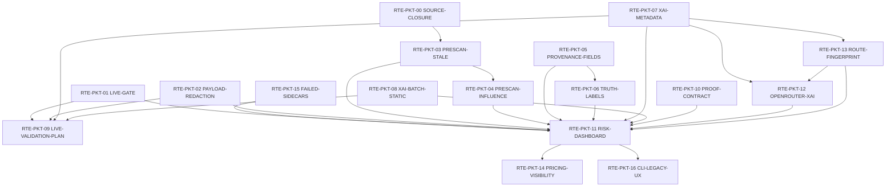

# Dependency Graph

## Dependency Table

| Packet | Direct dependencies | Execution posture |
| --- | --- | --- |
| `RTE-PKT-03` | accepted baseline | serialized implementation |
| `RTE-PKT-05` | accepted baseline | serialized implementation |
| `RTE-PKT-07` | accepted baseline | serialized implementation |
| `RTE-PKT-08` | accepted baseline | Subwave 1A with `RTE-PKT-10` |
| `RTE-PKT-10` | accepted baseline | Subwave 1A with `RTE-PKT-08` |
| `RTE-PKT-04` | `RTE-PKT-03` | wait |
| `RTE-PKT-06` | `RTE-PKT-05` | wait |
| `RTE-PKT-13` | `RTE-PKT-07` | wait |
| `RTE-PKT-12` | `RTE-PKT-07`, `RTE-PKT-13` | wait |
| `RTE-PKT-09` | `RTE-PKT-01`, `RTE-PKT-02`, `RTE-PKT-07`, `RTE-PKT-08` | plan-only |
| `RTE-PKT-11` | `RTE-PKT-01/02/03/04/05/06/07/08/10/12/13/15` | aggregation after dependencies |
| `RTE-PKT-14` | `RTE-PKT-11` | polish after dashboard |
| `RTE-PKT-16` | `RTE-PKT-11` | plan-only until source resolved |
