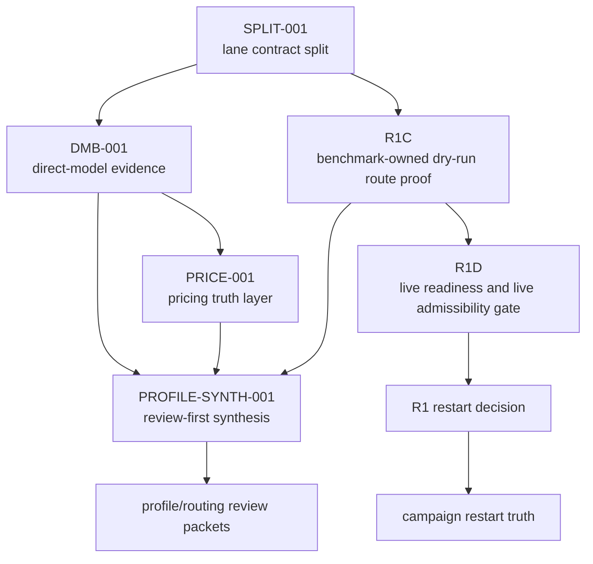
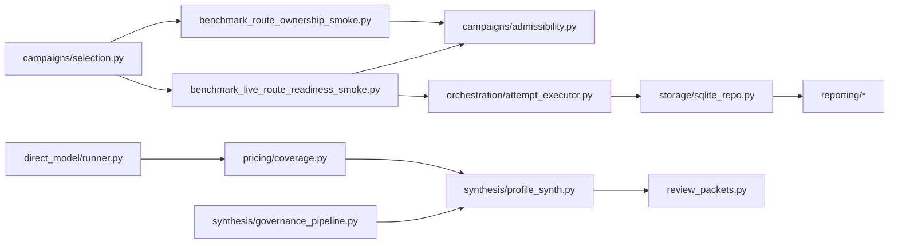

# Benchmark Dependency Graph

## Decision Flow

## Authority Surfaces

## Practical Dependency Notes

- `SPLIT-001` is the contract prerequisite. Without lane separation, later proofs would collapse evidence classes.
- `DMB-001` is upstream admission evidence only. It does not prove runtime-route truth.
- `PRICE-001` upgrades cost truth enough to block unsafe cost claims and enable partial advisory synthesis.
- `R1C` is the structural proof that owned dry-run route distinctness exists.
- `R1D` is the operational gate for restarting R1. It can block restart even when `R1C` passes.
- `PROFILE-SYNTH-001` depends on direct-model, pricing, and runtime-route/governance evidence, but remains advisory-only by design.

## Current Critical Path

1. `SPLIT-001` established lane separation.
2. `R1C` proved dry-run owned-lane distinctness.
3. `R1D` failed live readiness in this environment.
4. Therefore the current blocker is operational provider readiness, not benchmark architecture.

## Current Non-Critical But Important Path

1. `DMB-001` established direct-model evidence.
2. `PRICE-001` improved pricing truth and blocker propagation.
3. `PROFILE-SYNTH-001` created reviewable profile/routing proposals.
4. Dynamic profile updates remain intentionally blocked because runtime-route truth and pricing truth are still incomplete across the full active universe.
