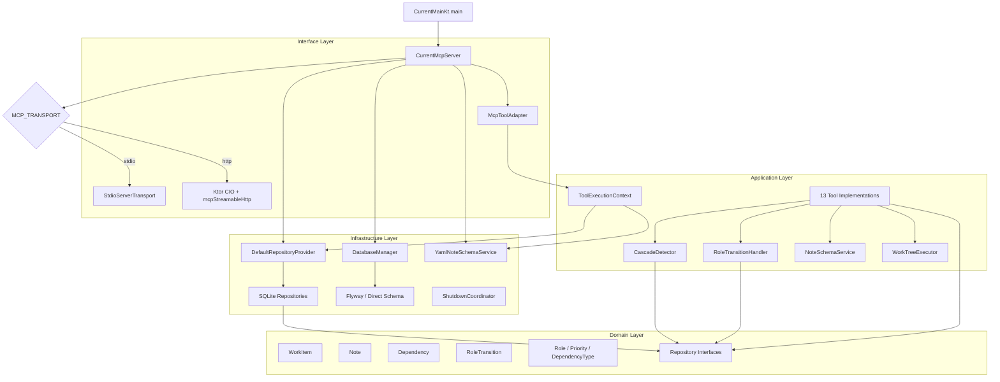

# Architecture and Intended Uses

> Architecture recovered from code (import analysis, construction wiring, entrypoint tracing).
> Not from documentation diagrams.

## Layer Architecture



## Dependency Direction (verified from imports)

```
interfaces/mcp/ ──imports──▶ application/tools/
                              │
                              ├──imports──▶ application/service/
                              │              │
                              │              └──imports──▶ domain/model/
                              │              └──imports──▶ domain/repository/
                              │
                              └──imports──▶ domain/model/
                              └──imports──▶ domain/repository/

infrastructure/repository/ ──imports──▶ domain/repository/
infrastructure/repository/ ──imports──▶ domain/model/
infrastructure/database/   ──imports──▶ (Exposed, SQLite — no domain imports)
infrastructure/config/     ──imports──▶ application/service/ (NoteSchemaService interface)
infrastructure/config/     ──imports──▶ domain/model/ (NoteSchemaEntry)
```

**Domain layer has zero outward dependencies** — confirmed Clean Architecture.

## Package Structure

```
io.github.jpicklyk.mcptask.current/
├── CurrentMain.kt                          # Entrypoint
├── interfaces/mcp/
│   ├── CurrentMcpServer.kt                 # MCP server, transport dispatch
│   └── McpToolAdapter.kt                   # Tool registration bridge
├── application/
│   ├── tools/
│   │   ├── ToolDefinition.kt               # Tool interface
│   │   ├── BaseToolDefinition.kt           # Base class
│   │   ├── ToolExecutionContext.kt         # DI context
│   │   ├── items/                          # ManageItemsTool, QueryItemsTool
│   │   ├── notes/                          # ManageNotesTool, QueryNotesTool
│   │   ├── dependency/                     # ManageDependenciesTool, QueryDependenciesTool
│   │   ├── workflow/                       # Advance, NextStatus, NextItem, Blocked, Context
│   │   └── compound/                       # CompleteTree, CreateWorkTree
│   └── service/
│       ├── RoleTransitionHandler.kt        # 3-phase transitions
│       ├── CascadeDetector.kt              # Cascade + unblock
│       ├── NoteSchemaService.kt            # Gate interface
│       └── WorkTreeExecutor.kt             # Atomic tree interface
├── domain/
│   ├── model/                              # WorkItem, Note, Dependency, RoleTransition, enums
│   ├── repository/                         # Repository interfaces, Result<T>
│   └── validation/                         # ValidationException
└── infrastructure/
    ├── database/
    │   ├── DatabaseConfig.kt               # Env var config
    │   ├── DatabaseManager.kt              # SQLite connection
    │   └── schema/                         # Exposed tables + schema managers
    ├── repository/                         # SQLite implementations
    ├── config/
    │   └── YamlNoteSchemaService.kt        # YAML config loader
    ├── service/
    │   └── SQLiteWorkTreeService.kt        # Atomic tree creation
    └── shutdown/
        ├── ShutdownCoordinator.kt          # Graceful shutdown
        └── SignalHandler.kt                # OS signal handling
```

## Intended Use Cases (from code + README)

### Primary: AI Agent Task Management
- **Target users**: AI coding assistants (Claude, GPT, etc.) via MCP protocol
- **Core value**: Persistent work-item graph that survives session boundaries
- **Key insight**: Agents read 200-token notes instead of replaying 5k+ token conversations

### Workflow Enforcement
- Server-side gate enforcement (not prompt-dependent)
- Deterministic state machine guarantees progression
- Dependency ordering prevents premature work

### Sub-Agent Orchestration
- Parent/child hierarchy enables task delegation
- Cascade detection auto-advances parents when children complete
- `create_work_tree` enables atomic project decomposition

### Session Resume
- `get_context(mode="session")` provides instant state recovery
- Notes serve as structured handoff between sessions
- No conversation replay needed

## Design Principles (from code patterns)

1. **Roles over statuses**: Fixed 5-role enum, no custom statuses. `statusLabel` is display-only.
2. **Triggers over direct assignment**: Named triggers map to transitions; no raw role mutation.
3. **Server-enforced gates**: Note schema + dependency checks happen in tool execution, not prompt.
4. **Batch-friendly**: All CRUD tools accept arrays. Compound tools are atomic.
5. **Token-efficient**: `includeBody=false`, `overview`, minimal JSON modes for search results.
6. **Audit trail**: Every transition recorded in `role_transitions` table.
7. **Schema-free by default**: No config needed; all features work without YAML schemas.
