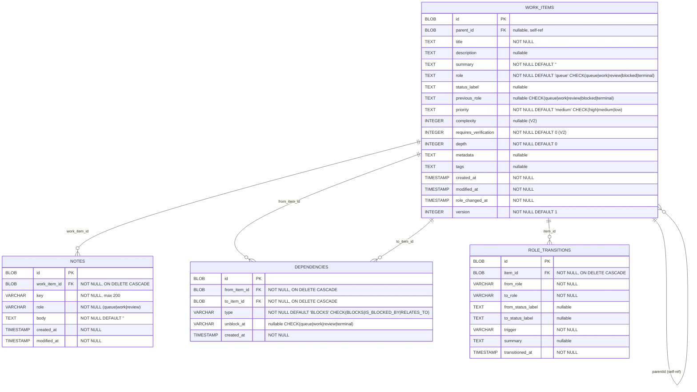

# Data Model

> All schemas derived from Flyway migrations (`V1__Current_Initial_Schema.sql`,
> `V2__Work_Item_Field_Updates.sql`) and Exposed ORM table definitions.
> Code-authoritative — no documentation claims used.

## Entity-Relationship Diagram

## Tables

### `work_items`
| Column                  | Type      | Constraints                     | Notes                                           |
| ----------------------- | --------- | ------------------------------- | ----------------------------------------------- |
| `id`                    | BLOB      | PK, default `randomblob(16)`    | UUID                                            |
| `parent_id`             | BLOB      | FK → `work_items(id)`, nullable | Self-referencing hierarchy                      |
| `title`                 | TEXT      | NOT NULL                        | Max 500 chars (domain validation)               |
| `description`           | TEXT      | nullable                        | Must not be blank if provided                   |
| `summary`               | TEXT      | NOT NULL, DEFAULT `''`          | Max 2000 chars                                  |
| `role`                  | TEXT      | NOT NULL, DEFAULT `'queue'`     | CHECK: queue, work, review, blocked, terminal   |
| `status_label`          | TEXT      | nullable                        | Display-only annotation (e.g., "cancelled")     |
| `previous_role`         | TEXT      | nullable                        | Saved when entering BLOCKED for resume          |
| `priority`              | TEXT      | NOT NULL, DEFAULT `'medium'`    | CHECK: high, medium, low                        |
| `complexity`            | INTEGER   | nullable                        | Range 1–10 if provided (V2: nullable)           |
| `requires_verification` | INTEGER   | NOT NULL, DEFAULT 0             | Boolean (V2: added)                             |
| `depth`                 | INTEGER   | NOT NULL, DEFAULT 0             | 0=root, max 3                                   |
| `metadata`              | TEXT      | nullable                        | Free-form                                       |
| `tags`                  | TEXT      | nullable                        | Comma-separated, lowercase alphanumeric+hyphens |
| `created_at`            | TIMESTAMP | NOT NULL                        |                                                 |
| `modified_at`           | TIMESTAMP | NOT NULL                        | Monotonic via `WorkItem.update()`               |
| `role_changed_at`       | TIMESTAMP | NOT NULL                        | Updated on role transitions                     |
| `version`               | INTEGER   | NOT NULL, DEFAULT 1             | Optimistic concurrency                          |

**Indexes**: `parent_id`, `role`, `depth`, `priority`, `(role, role_changed_at)`

### `notes`
| Column         | Type         | Constraints                                       | Notes               |
| -------------- | ------------ | ------------------------------------------------- | ------------------- |
| `id`           | BLOB         | PK                                                | UUID                |
| `work_item_id` | BLOB         | NOT NULL, FK → `work_items(id)` ON DELETE CASCADE |                     |
| `key`          | VARCHAR(200) | NOT NULL                                          | Max 200 chars       |
| `role`         | VARCHAR(20)  | NOT NULL                                          | queue, work, review |
| `body`         | TEXT         | NOT NULL, DEFAULT `''`                            |                     |
| `created_at`   | TIMESTAMP    | NOT NULL                                          |                     |
| `modified_at`  | TIMESTAMP    | NOT NULL                                          |                     |

**Unique**: `(work_item_id, key)`
**Indexes**: `work_item_id`, `role`

### `dependencies`
| Column         | Type        | Constraints                                       | Notes                                    |
| -------------- | ----------- | ------------------------------------------------- | ---------------------------------------- |
| `id`           | BLOB        | PK                                                | UUID                                     |
| `from_item_id` | BLOB        | NOT NULL, FK → `work_items(id)` ON DELETE CASCADE |                                          |
| `to_item_id`   | BLOB        | NOT NULL, FK → `work_items(id)` ON DELETE CASCADE |                                          |
| `type`         | VARCHAR(20) | NOT NULL, DEFAULT `'BLOCKS'`                      | CHECK: BLOCKS, IS_BLOCKED_BY, RELATES_TO |
| `unblock_at`   | VARCHAR(20) | nullable                                          | CHECK: queue, work, review, terminal     |
| `created_at`   | TIMESTAMP   | NOT NULL                                          |                                          |

**Unique**: `(from_item_id, to_item_id, type)`
**Indexes**: `from_item_id`, `to_item_id`

### `role_transitions`
| Column              | Type        | Constraints                                       | Notes                                        |
| ------------------- | ----------- | ------------------------------------------------- | -------------------------------------------- |
| `id`                | BLOB        | PK                                                | UUID                                         |
| `item_id`           | BLOB        | NOT NULL, FK → `work_items(id)` ON DELETE CASCADE |                                              |
| `from_role`         | VARCHAR(20) | NOT NULL                                          |                                              |
| `to_role`           | VARCHAR(20) | NOT NULL                                          |                                              |
| `from_status_label` | TEXT        | nullable                                          |                                              |
| `to_status_label`   | TEXT        | nullable                                          |                                              |
| `trigger`           | VARCHAR(50) | NOT NULL                                          | start, complete, block, hold, resume, cancel |
| `summary`           | TEXT        | nullable                                          |                                              |
| `transitioned_at`   | TIMESTAMP   | NOT NULL                                          |                                              |

**Indexes**: `item_id`, `transitioned_at`

## Flyway Migrations

| Version | File                              | Changes                                              |
| ------- | --------------------------------- | ---------------------------------------------------- |
| V1      | `V1__Current_Initial_Schema.sql`  | Initial 4 tables, all indexes                        |
| V2      | `V2__Work_Item_Field_Updates.sql` | `complexity` → nullable, add `requires_verification` |

## Domain Validation Rules (from `WorkItem.validate()`)

| Rule                     | Constraint                                                            |
| ------------------------ | --------------------------------------------------------------------- |
| Title                    | Not blank, ≤500 chars                                                 |
| Complexity               | 1–10 if provided                                                      |
| Summary                  | ≤2000 chars                                                           |
| Depth                    | ≥0; root must be 0; child must be ≥1                                  |
| Parent/Depth consistency | `parentId=null` → depth=0; `parentId!=null` → depth≥1                 |
| Tags                     | Lowercase alphanumeric + hyphens only (regex: `^[a-z0-9][a-z0-9-]*$`) |
| Description              | Must not be blank if provided                                         |
| Max depth                | 3 (enforced in `ManageItemsTool.MAX_DEPTH`)                           |
| Self-parent              | `parentId != id` (enforced in tool)                                   |
| Ancestor cycles          | Walk-up check in `ManageItemsTool`                                    |
